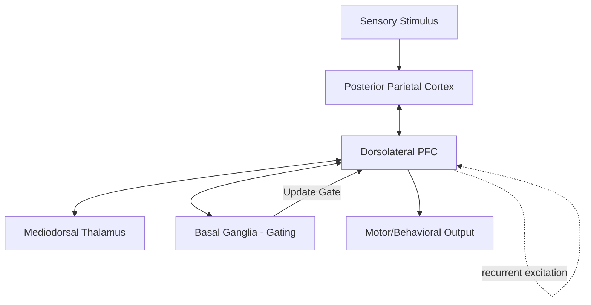

## Working Memory and Prefrontal Circuits

### Overview

Working memory (WM) is the capacity to actively hold and manipulate a limited amount of information over a short period in the service of ongoing cognition — distinct from long-term memory in both its dependence on active neural maintenance rather than stored synaptic weight changes, and from passive short-term memory storage in its inclusion of executive manipulation. The prefrontal cortex (PFC), particularly the dorsolateral prefrontal cortex (DLPFC), is the most consistently implicated substrate for the active maintenance component of working memory, operating within a broader fronto-parietal network.

### Baddeley and Hitch's Multicomponent Model (Cognitive-Level Framework)

- **Central executive**: attentional control system responsible for allocating resources, inhibiting irrelevant information, and coordinating the two subordinate "slave" systems; most closely associated with the DLPFC and broader prefrontal-parietal networks.
- **Phonological loop**: maintains verbal/acoustic information via subvocal rehearsal; associated with left-hemisphere perisylvian language areas (e.g., Broca's area for rehearsal) interacting with prefrontal maintenance circuits.
- **Visuospatial sketchpad**: maintains visual and spatial information; associated with right-hemisphere posterior parietal and occipital regions interacting with prefrontal maintenance circuits.
- **Episodic buffer**: a later addition, proposed to integrate information across the loop, sketchpad, and long-term memory into unified multimodal representations, linking working memory to episodic LTM.

### Neurophysiological Basis: Persistent/Sustained Neural Activity

The classical, and still foundational, physiological signature of working memory maintenance is **sustained delay-period activity**:

- In delayed-response tasks (e.g., delayed match-to-sample, oculomotor delayed response), single-neuron recordings in monkey DLPFC (foundational work by Goldman-Rakic and colleagues) show that specific neurons fire persistently throughout the delay period between stimulus offset and response, even though the stimulus itself is no longer physically present.
- This persistent firing is interpreted as the active, ongoing neural representation of the to-be-remembered information — i.e., the "bridge" between a past stimulus and a future action.
- Neurons often show **spatial or feature tuning**: in the classic oculomotor delayed-response paradigm, particular DLPFC neurons fire maximally when the remembered target location is in a specific region of space, forming a distributed population code across the delay.

### Circuit-Level Mechanism: Recurrent Excitation

A widely used computational/circuit account of persistent activity proposes that WM maintenance arises from **recurrent excitatory connections** among pyramidal neurons with similar feature tuning, stabilized by lateral/feedback inhibition from local interneurons:

1. A stimulus transiently activates a specific population of feature-tuned pyramidal neurons.
2. Strong recurrent excitatory synapses among these co-tuned neurons allow the population to sustain its own activity after the stimulus is removed (an attractor state).
3. GABAergic interneurons provide surround/lateral inhibition, sharpening the tuning of the active population and preventing runaway excitation or interference from competing representations.
4. NMDA receptors, with their comparatively slow decay kinetics relative to AMPA receptors, are thought to be particularly important for stabilizing this recurrent activity over the many hundreds of milliseconds to seconds required for a working memory delay period.

[Inference] This "attractor network" framework, formalized computationally by Wang and colleagues, is the dominant theoretical account in computational neuroscience, though it remains an idealized model rather than a fully confirmed mechanistic description of biological circuits, and alternative accounts exist (see below).

### Alternative/Complementary Mechanism: Activity-Silent Working Memory

- More recent evidence, particularly from human EEG/MEG decoding and computational modeling, suggests that at least some working memory content can be maintained in a manner that is **not** reflected in sustained spiking activity, but instead in transient, activity-silent changes to synaptic weights (e.g., short-term synaptic facilitation).
- Under this view, information can be "reactivated" from a latent, synaptically-encoded state by a subsequent non-specific impulse (e.g., a TMS pulse or an attentional cue), even after neural firing appears to have returned to baseline.
- [Inference] The relationship between classic persistent-activity accounts and activity-silent accounts is an active area of debate; current thinking increasingly frames them as complementary mechanisms operating at different timescales or under different attentional/task demands, rather than strictly competing alternatives.

### Prefrontal Subregions and Functional Specialization

- **Dorsolateral prefrontal cortex (DLPFC, Brodmann areas 9/46)**: most associated with the manipulation and monitoring of information held in WM, and with spatial working memory in particular.
- **Ventrolateral prefrontal cortex (VLPFC, Brodmann areas 44/45/47)**: more associated with maintenance and retrieval of object/non-spatial information, and with active selection among competing representations.
- **Frontopolar cortex (Brodmann area 10)**: implicated in higher-order integration, such as maintaining multiple sub-goals or relational/analogical reasoning over working memory contents.
- **Anterior cingulate cortex (ACC)**: contributes performance-monitoring and conflict-detection signals that interact with WM control (e.g., increased ACC activity when WM demands produce response conflict).

### The Fronto-Parietal Working Memory Network

Working memory is not exclusively a prefrontal phenomenon; it is best characterized as an emergent property of a distributed fronto-parietal network:

- **Posterior parietal cortex (particularly intraparietal sulcus)**: co-activates with DLPFC during WM delay periods and is implicated in maintaining spatial/priority maps of currently relevant information.
- **Thalamus (particularly mediodorsal nucleus)**: provides reciprocal excitatory input to PFC that some models propose helps sustain and stabilize cortical persistent activity, functioning as a "second loop" supporting recurrent maintenance.
- **Basal ganglia (striatum)**: implicated in a proposed "gating" mechanism, selectively permitting new information to enter WM representations while protecting currently maintained information from interference (prominent in the PBWM — prefrontal cortex, basal ganglia working memory — computational framework).

### Capacity Limitations

- Behavioral capacity estimates: classically 7 ± 2 items (Miller); refined to approximately 3–4 discrete items when chunking is controlled for (Cowan).
- **Neural capacity limitation accounts**:
  - *Mutual inhibition/interference account*: as more items are held simultaneously, competing feature-tuned neural populations increasingly inhibit one another via shared inhibitory interneurons, degrading the fidelity of each individual representation.
  - *Resource-sharing account*: WM is supported by a limited, continuously divisible neural resource (e.g., total available spiking activity or synaptic capacity) that is allocated flexibly across items, predicting a graded trade-off between the number of items held and the precision of each.
- These accounts are not mutually exclusive and are supported by different converging lines of evidence (single-unit recordings, EEG/MEG decoding, and psychophysical precision measurements, respectively).

### Neuromodulation of Prefrontal Working Memory

- **Dopamine**: D1 receptor stimulation in DLPFC has an inverted-U relationship with working memory performance — both insufficient and excessive D1 stimulation impair delay-period activity and behavioral performance, while an optimal, intermediate level of D1 signaling stabilizes persistent firing and sharpens neural tuning.
- [Inference] This inverted-U dopamine account, developed substantially through the work of Arnsten and colleagues, is well supported in animal electrophysiology and pharmacology but the precise translation of optimal dopamine "levels" to specific clinical dosing in humans remains an area requiring caution and further research.
- **Norepinephrine**: alpha-2A adrenergic receptor stimulation in PFC similarly enhances delay-period firing and network connectivity, contributing to the rationale for certain pharmacological interventions targeting attentional/WM deficits.

### Clinical and Translational Relevance

- Schizophrenia is associated with well-documented working memory deficits, often linked to DLPFC hypofunction and dysregulated dopaminergic/GABAergic signaling within prefrontal microcircuits.
- ADHD is associated with altered fronto-striatal/fronto-parietal network function and working memory impairment, providing part of the rationale for stimulant medications that modulate catecholamine signaling in PFC.
- [Inference] Behavior may vary considerably across individuals and disease subtypes; the specific circuit-level abnormality (e.g., excessive vs. insufficient recurrent excitation, altered inhibitory tone) likely differs across clinical populations and is not fully characterized as a single unified mechanism.

### Key Points

- Working memory maintenance is classically indexed by sustained, feature-tuned delay-period firing in DLPFC neurons, first characterized in monkey electrophysiology by Goldman-Rakic and colleagues.
- The dominant circuit-level account attributes this persistent activity to recurrent excitatory connections among co-tuned pyramidal neurons, stabilized by lateral inhibition and slow NMDA-receptor kinetics.
- Working memory is supported by a distributed fronto-parietal network, with the basal ganglia proposed to implement a gating mechanism that controls updating versus protection of maintained information.
- Dopaminergic (D1) and noradrenergic (alpha-2A) neuromodulation of PFC circuits follow an inverted-U function relative to working memory performance.
- Activity-silent, synaptically-based maintenance is a more recently proposed complementary mechanism to classic persistent-activity accounts.

### Related Topics

- Attractor network models and computational neuroscience of persistent activity
- The PBWM (prefrontal cortex, basal ganglia working memory) computational framework
- Dopamine D1 receptor pharmacology and the inverted-U hypothesis
- Fronto-parietal control network and its role in attention and cognitive control
- Working memory training and transfer effects
- Working memory deficits in schizophrenia and ADHD
- Activity-silent working memory and short-term synaptic plasticity