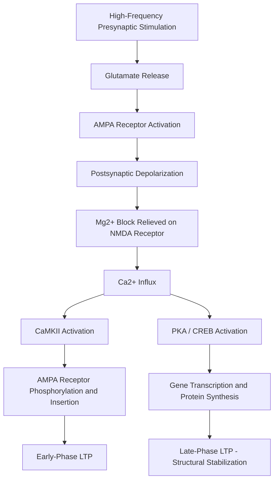

## Synaptic Basis of Memory Formation

### The Hebbian Foundation

The theoretical starting point for the synaptic basis of memory is Donald Hebb's postulate (1949): when a presynaptic neuron repeatedly and persistently contributes to firing a postsynaptic neuron, some growth process or metabolic change occurs in one or both cells that increases the efficiency of that specific synapse. This is often summarized as "cells that fire together, wire together," though the more precise and mechanistically important formulation is that of a **coincidence detector** — the synapse strengthens specifically when pre- and postsynaptic activity are correlated in time, not merely when either occurs independently.

$$\Delta w_{ij} = \eta \cdot x_i \cdot y_j$$

where $w_{ij}$ is synaptic weight, $x_i$ is presynaptic activity, $y_j$ is postsynaptic activity, and $\eta$ is a learning rate constant. This simple multiplicative rule captures the essential associative property later confirmed at the molecular level by NMDA receptor physiology.

### Long-Term Potentiation (LTP): The Principal Cellular Model

LTP, first described by Bliss and Lømo at the perforant path–dentate gyrus synapse in the rabbit hippocampus, is a persistent increase in synaptic strength following brief, high-frequency stimulation. It remains the most extensively studied and best-characterized candidate mechanism for memory encoding at the synaptic level.

**Induction Phase (NMDA-receptor-dependent LTP, Schaffer collateral–CA1 synapse)**

1. At resting membrane potential, the NMDA receptor channel pore is occluded by a magnesium ion ($Mg^{2+}$) in a voltage-dependent manner, even when glutamate is bound.
2. Sufficiently strong or repetitive presynaptic glutamate release, combined with sufficient postsynaptic depolarization (driven initially by AMPA receptor activation), relieves the $Mg^{2+}$ block.
3. This permits calcium ion ($Ca^{2+}$) influx through the now-unblocked NMDA receptor into the postsynaptic spine.
4. Because NMDA receptor opening requires both presynaptic glutamate release AND postsynaptic depolarization simultaneously, the receptor functions as a molecular coincidence detector — the direct physical implementation of Hebb's postulate.

**Expression Phase**

1. The rise in postsynaptic $[Ca^{2+}]$ activates **CaMKII** (calcium/calmodulin-dependent protein kinase II), among other kinases (e.g., PKC, PKA).
2. Activated CaMKII phosphorylates existing AMPA receptors, increasing their single-channel conductance.
3. CaMKII also promotes the trafficking and insertion of additional AMPA receptors into the postsynaptic density from intracellular vesicle pools, increasing the number of functional receptors at the synapse.
4. These two processes together produce **early-phase LTP** (E-LTP), lasting on the order of one to a few hours, which does not require new gene transcription or protein synthesis and instead relies on modification/relocation of existing proteins.

**Late-Phase LTP and the Requirement for Protein Synthesis**

- **Late-phase LTP** (L-LTP), lasting many hours to days or longer, additionally requires:
  - Activation of **PKA** and downstream **CREB** (cAMP response element-binding protein) transcription factor phosphorylation.
  - CREB-dependent transcription of plasticity-related genes.
  - Local translation of new proteins at stimulated synapses, contributing to structural changes such as spine enlargement or the formation of new dendritic spines.
- This transcription/translation-dependent requirement is the molecular basis of **synaptic consolidation**: a newly potentiated synapse remains vulnerable to disruption (e.g., by protein synthesis inhibitors) for a finite window before being stabilized into a lasting structural change.

### Synaptic Tagging and Capture Hypothesis

- Proposed by Frey and Morris, this hypothesis explains how brief, weak synaptic stimulation (insufficient on its own to trigger L-LTP) can nonetheless result in a durable potentiation if it occurs close in time to strong stimulation at a different synapse on the same neuron.
- Mechanism: weak stimulation sets a transient, local molecular "synaptic tag" at the stimulated synapse, without producing the plasticity-related proteins needed for stabilization.
- Strong stimulation elsewhere on the neuron triggers cell-wide production of plasticity-related proteins (via the CREB/transcription pathway described above).
- These plasticity-related proteins are then "captured" by any tagged synapse, including the weakly stimulated one, converting its otherwise transient potentiation into a lasting, protein-synthesis-dependent form.
- [Inference] This model is widely used to explain behavioral phenomena such as how a mildly significant event can become better remembered if it occurs close in time to an emotionally or biologically salient event, though direct causal evidence linking the molecular tagging mechanism to specific complex human memory phenomena remains primarily inferential rather than directly demonstrated.

### Long-Term Depression (LTD): The Complementary Weakening Process

- LTD is a persistent decrease in synaptic strength, typically induced by prolonged low-frequency stimulation, producing smaller and more prolonged $Ca^{2+}$ elevations than those that trigger LTP.
- Mechanistically, lower-magnitude $Ca^{2+}$ influx preferentially activates protein phosphatases (e.g., calcineurin, PP1) rather than kinases, leading to AMPA receptor dephosphorylation and internalization (removal from the postsynaptic membrane) rather than insertion.
- LTD is proposed to be computationally important not merely as an "opposite" of LTP, but as an active mechanism for forgetting, refining memory precision, and preventing synaptic saturation (a ceiling effect that would otherwise limit the capacity for further learning).

### Structural Plasticity: Beyond Synaptic Efficacy

- Sustained LTP is associated not just with functional changes (receptor number/conductance) but with structural remodeling of dendritic spines, including spine head enlargement and, over longer timescales, the formation of entirely new spines and synaptic contacts.
- **Actin cytoskeleton remodeling**, regulated by small GTPases such as Rac1 and RhoA, underlies these morphological changes and is necessary for the stabilization of L-LTP.
- [Inference] The precise causal relationship between spine structural changes and behavioral memory persistence is well supported correlationally (e.g., spine formation/elimination tracked via longitudinal two-photon imaging correlates with learning), though the field continues to refine causal claims using optogenetic and chemogenetic manipulation of specific spine populations.

### Non-Hippocampal Synaptic Plasticity Models

- **Amygdala (fear conditioning)**: LTP-like plasticity at synapses conveying auditory/sensory conditioned-stimulus information onto the lateral amygdala is necessary for fear memory acquisition, using largely analogous NMDA-receptor-dependent mechanisms.
- **Cerebellum (motor learning, eyeblink conditioning)**: relies primarily on **LTD** at parallel fiber–Purkinje cell synapses as the principal plasticity mechanism, illustrating that different brain regions can use opposite directions of synaptic change (LTD rather than LTP) as their dominant learning mechanism depending on circuit architecture.
- **Invertebrate models (Aplysia californica)**: Eric Kandel's Nobel Prize-winning work established that even simple, non-associative forms of learning (habituation, sensitization) in Aplysia's gill-withdrawal reflex are mediated by presynaptic facilitation of neurotransmitter release via cAMP/PKA signaling at the sensory-to-motor neuron synapse, and that long-term sensitization similarly requires CREB-mediated transcription and new protein synthesis — establishing a striking degree of molecular conservation with mammalian hippocampal L-LTP.

### Key Points

- Hebbian plasticity provides the theoretical foundation for synaptic memory: strengthening occurs specifically when pre- and postsynaptic activity are temporally correlated.
- NMDA-receptor-dependent LTP at the Schaffer collateral–CA1 synapse is the best-characterized cellular candidate mechanism for memory encoding, with the NMDA receptor functioning as a molecular coincidence detector.
- Early-phase LTP relies on modification and trafficking of existing AMPA receptors; late-phase LTP additionally requires CREB-mediated transcription and new protein synthesis, forming the molecular basis of synaptic consolidation.
- Synaptic tagging and capture explains how weak, transient stimulation can be stabilized into lasting potentiation when temporally paired with strong stimulation elsewhere on the same neuron.
- LTD, structural spine remodeling, and region-specific plasticity mechanisms (e.g., cerebellar LTD, Aplysia presynaptic facilitation) demonstrate that synaptic memory storage is implemented via multiple, partly conserved molecular strategies across brain regions and species.

### Related Topics

- Hippocampal formation and the trisynaptic circuit as the anatomical context for LTP
- CREB and immediate early genes (e.g., Arc, c-Fos) in memory consolidation
- Metaplasticity: how prior synaptic activity alters the threshold for future LTP/LTD
- Engram cell theory and memory trace localization
- Optogenetic and chemogenetic approaches to testing causal roles of specific synapses
- Aplysia californica as a model system for cellular/molecular learning
- Synaptic pruning and its role in memory refinement during development