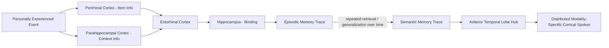

## Episodic and Semantic Memory Distinctions

### Historical Origin of the Distinction

The episodic/semantic distinction was introduced by Endel Tulving (1972) as a subdivision within declarative (explicit) long-term memory. Tulving proposed that these are functionally and neurally dissociable systems, not merely different content categories within a single memory store, based on differences in the type of information represented, the phenomenological experience of retrieval, and (later) the neural systems supporting each.

### Defining Features

**Episodic Memory**

- Memory for specific, personally experienced events, bound to a particular spatiotemporal context.
- Captures the "what," "where," and "when" of an event as an integrated, contextually specific unit.
- Retrieval is associated with **autonoetic consciousness**: a subjective sense of mentally re-experiencing or "traveling back" to the original event, including its perceptual and emotional qualities.
- Example: remembering the specific moment you received an important phone call, including where you were standing, what time of day it was, and how you felt.

**Semantic Memory**

- Memory for general, decontextualized facts and conceptual knowledge about the world.
- Detached from the specific spatiotemporal episode in which it was originally learned; the "source" of the knowledge is typically not retained.
- Retrieval is associated with **noetic consciousness**: a sense of simply "knowing" a fact, without any accompanying re-experiencing of a specific learning event.
- Example: knowing that Tokyo is the capital of Japan, without any memory of the specific occasion on which you learned this.

| Feature | Episodic Memory | Semantic Memory |
| --- | --- | --- |
| Content | Specific events | General facts/concepts |
| Temporal/spatial context | Bound to a specific "when/where" | Context-free |
| Subjective experience | Autonoetic (re-experiencing) | Noetic (simply knowing) |
| Retrieval cue dependency | Highly context-dependent | Relatively context-independent |
| Interference/forgetting rate | More rapid | More resistant |
| Primary structure | Hippocampus | Anterior temporal lobe, distributed neocortex |

### Neural Dissociation: The Classic Double Dissociation

The strongest evidence that episodic and semantic memory are separable systems, rather than points on a single continuum, comes from a double dissociation observed across different patient populations:

**Hippocampal Amnesia (e.g., patient H.M., developmental amnesia cases)**

- Severe impairment of new episodic memory formation (anterograde amnesic for personal events).
- Relatively preserved capacity to acquire new semantic/factual knowledge, albeit often more slowly and effortfully than in healthy individuals — most clearly documented in cases of selective, early-onset hippocampal damage (e.g., patient "Jon," studied by Vargha-Khadem and colleagues), who acquired substantial semantic/academic knowledge despite severe episodic memory impairment.
- Retention of remote general knowledge acquired before the onset of amnesia is typically well preserved.

**Semantic Dementia (anterior/inferior temporal lobe atrophy, a variant of frontotemporal dementia)**

- Progressive, often profound degradation of semantic knowledge: loss of conceptual understanding of objects, words, and facts, frequently beginning with more specific/detailed concepts and progressing to superordinate categories.
- Relatively preserved capacity for new episodic learning, particularly for recent day-to-day events, at least in earlier disease stages — the opposite pattern from hippocampal amnesia.
- [Inference] "Relatively preserved" is an important qualifier here: some degree of episodic impairment is often present in semantic dementia as the disease progresses and atrophy extends toward medial temporal structures, so the dissociation is cleanest in earlier or more circumscribed cases rather than representing an absolute, disease-stage-independent separation.

This double dissociation (impaired episodic/spared semantic in one patient group; impaired semantic/spared episodic in the other) is considered strong converging evidence for separable underlying systems, since a single unitary memory system could not easily explain opposite patterns of impairment across two different lesion locations.

### Neuroanatomical Substrates

**Episodic Memory**

- **Hippocampus**: necessary for binding the distinct elements of an event (item, spatial context, temporal context) into a single, retrievable episodic trace, via pattern separation (dentate gyrus) and pattern completion (CA3).
- **Perirhinal cortex**: contributes item/object familiarity information.
- **Parahippocampal cortex**: contributes contextual/spatial scene information.
- Together, perirhinal and parahippocampal cortex converge onto the hippocampus via the entorhinal cortex, consistent with the hippocampus's binding role.

**Semantic Memory**

- **Anterior temporal lobe (ATL)**, particularly the temporal pole, is proposed as a transmodal "semantic hub" that integrates modality-specific conceptual features (visual, auditory, motor, etc.) into unified, abstract concept representations — a view formalized in the **hub-and-spoke model** of semantic cognition.
- Modality-specific "spokes" are distributed across relevant sensory/motor cortices (e.g., visual form features in occipitotemporal cortex, action/motor features in premotor cortex).
- With systems consolidation, semantic knowledge becomes progressively less hippocampus-dependent and more reliant on this distributed neocortical/ATL network, consistent with standard consolidation theory.

### Developmental and Evolutionary Considerations

- Semantic memory develops earlier in childhood and is acquired more readily than fully detailed episodic memory, consistent with cases of developmental amnesia (early hippocampal damage) in which children go on to acquire substantial semantic/academic knowledge despite persistent episodic memory deficits.
- [Speculation] Tulving proposed that autonoetic, fully episodic memory (as opposed to simpler forms of event memory) may be a relatively late-evolving and possibly human-specific (or near human-specific) capacity, though this remains a philosophically and empirically contested claim, given the difficulty of behaviorally verifying subjective autonoetic experience in non-human animals; some researchers argue that certain "episodic-like" memory capacities (integrating what/where/when information) are demonstrable in other species (e.g., scrub jays), without necessarily implying human-like autonoetic consciousness.

### The Semanticization of Episodic Memory Over Time

- A well-documented phenomenon is that episodic memories, with the passage of time and repeated retrieval, tend to lose perceptual/contextual detail and become progressively more schematic, gist-like, and semantic in character — consistent with the general pattern predicted by Multiple Trace Theory/Trace Transformation Theory in systems consolidation.
- This provides one candidate explanation for why very remote "episodic" memories tested in amnesic patients often appear relatively preserved: they may have already been substantially transformed into semantic-like representations before the onset of hippocampal damage, rather than reflecting true intact hippocampal-dependent episodic retrieval.

### Behavioral/Experimental Dissociation Methods

- **Remember/Know paradigm**: participants judge whether a recognized item is accompanied by specific contextual re-experiencing ("Remember," indexing episodic retrieval) or merely a sense of familiarity without contextual detail ("Know," indexing more semantic-like/familiarity-based retrieval).
- **Source memory tasks**: assess whether a participant can recall the specific context (source) in which information was learned, isolating the more distinctly episodic component of a memory from the semantic content itself.
- **Category fluency and naming tasks**: used to probe the integrity of semantic memory specifically, commonly employed in clinical assessment of semantic dementia.

### Key Points

- Episodic memory (specific, contextually bound events, autonoetic re-experiencing) and semantic memory (general facts, noetic knowing) are dissociable declarative memory subsystems, first formally distinguished by Tulving.
- A double dissociation between hippocampal amnesia (impaired episodic, relatively spared semantic) and semantic dementia (impaired semantic, relatively spared episodic) provides strong evidence for separable neural systems.
- The hippocampus is central to episodic memory via binding of item and context information; the anterior temporal lobe functions as a transmodal semantic hub integrating distributed modality-specific conceptual features.
- Episodic memories tend to become progressively more semanticized (schematic, decontextualized) over time, a process directly relevant to debates in systems consolidation theory.

### Related Topics

- Systems consolidation theory and Multiple Trace Theory
- The hub-and-spoke model of semantic cognition
- Autonoetic consciousness and mental time travel
- Developmental amnesia and early hippocampal damage
- Remember/Know paradigm and recollection vs. familiarity
- Semantic dementia as a clinical/lesion model
- Source monitoring and context memory