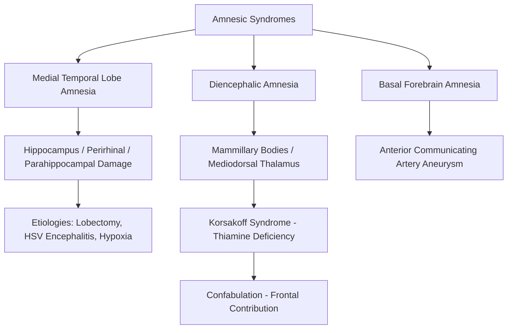

## Amnesia and Memory Disorders

### Overview and Basic Terminology

Amnesia refers to a significant impairment of memory that is disproportionate to other cognitive deficits, typically arising from damage to the medial temporal lobe (MTL) memory system, diencephalic structures, or their interconnecting white matter tracts. Amnesia is classically divided along a temporal axis relative to the onset of brain injury or disease:

- **Anterograde amnesia**: impaired ability to form *new* declarative memories for events occurring after the onset of the amnesic condition.
- **Retrograde amnesia**: impaired ability to recall memories formed *before* the onset of the amnesic condition, often exhibiting a temporal gradient (see below).

Most amnesic syndromes involve anterograde amnesia as the predominant and most disabling feature, frequently accompanied by some degree of retrograde amnesia.

### Temporally Graded Retrograde Amnesia

- A common and theoretically important pattern is that retrograde amnesia is not uniform across the pre-injury lifespan: memories formed shortly before the injury are more severely affected than memories formed long before it (a temporal gradient, sometimes called Ribot's Law after the 19th-century psychologist who first described it).
- This gradient is a central piece of evidence for systems consolidation theory: it suggests that recently formed memories remain hippocampus-dependent and thus vulnerable, while older, more fully consolidated memories have become at least partially independent of the damaged structure.
- [Inference] The steepness and even the presence of a graded pattern (as opposed to a flat, ungraded retrograde deficit extending across the whole lifespan) varies across patients and etiologies, and is one of the key empirical points of contention between the standard consolidation model and Multiple Trace Theory.

### Anatomical Basis of Amnesia

**Medial Temporal Lobe (MTL) Amnesia**

- Caused by damage to the hippocampus and/or surrounding perirhinal, parahippocampal, and entorhinal cortices.
- Etiologies: temporal lobectomy (e.g., patient H.M.), herpes simplex encephalitis (which has a particular predilection for MTL and inferior frontal structures), hypoxic/ischemic injury (the hippocampus, particularly the CA1 field, is highly vulnerable to oxygen deprivation), and MTL-predominant neurodegenerative disease.
- Produces a profile of severe anterograde amnesia for declarative memory, typically with graded retrograde amnesia, and relative preservation of short-term memory, general intelligence, and non-declarative (procedural) learning.

**Diencephalic Amnesia**

- Caused by damage to structures in the Papez circuit outside the temporal lobe proper, particularly the **mediodorsal thalamic nucleus**, **anterior thalamic nuclei**, and **mammillary bodies**.
- Classic etiology: **Korsakoff's syndrome**, resulting from chronic thiamine (vitamin B1) deficiency, most commonly associated with chronic alcohol use disorder, which damages the mammillary bodies and thalamic structures.
- Often accompanied by **confabulation** — the production of fabricated or distorted memories, typically without conscious intent to deceive — thought to reflect additional frontal-lobe dysfunction impairing the monitoring and source-verification of retrieved (or generated) information, rather than being a core feature of diencephalic damage per se.
- Korsakoff's syndrome frequently follows an acute episode of **Wernicke's encephalopathy** (characterized by the triad of confusion, ataxia, and ophthalmoplegia), representing acute and chronic phases of the same underlying thiamine-deficiency pathology (together sometimes termed Wernicke-Korsakoff syndrome).

**Basal Forebrain Amnesia**

- Damage to the basal forebrain (e.g., following anterior communicating artery aneurysm rupture) can produce amnesia along with confabulation, related to disruption of cholinergic projections to the hippocampus and frontal-executive contributions to memory retrieval.

### Classic Case Studies

**Patient H.M. (Henry Molaison)**

- Underwent bilateral medial temporal lobectomy (hippocampus, amygdala, and surrounding cortex) in 1953 for intractable epilepsy.
- Resulted in profound anterograde amnesia for declarative memory, with graded retrograde amnesia extending back approximately one to several years before surgery, while more remote memories were relatively preserved.
- Intelligence, language, perception, and short-term/working memory span were essentially intact.
- Non-declarative learning (e.g., mirror-tracing motor skill) showed normal day-to-day improvement despite no explicit recollection of having practiced the task, providing foundational evidence for the declarative/non-declarative memory system dissociation.

**Patient Clive Wearing**

- Developed severe amnesia following herpes simplex encephalitis, which caused extensive bilateral damage to the hippocampus and surrounding MTL structures.
- Exhibits an unusually dense and pervasive combination of anterograde and retrograde amnesia, with subjective reports of perpetually "just waking up" or regaining consciousness.
- Retains highly practiced procedural/skill-based abilities (e.g., musical performance), again dissociating from severely impaired episodic/declarative memory.

**Patient Jon (Developmental Amnesia)**

- Sustained hippocampal damage from early childhood hypoxic episodes.
- Despite dense episodic memory impairment, was able to attend mainstream school and acquire substantial semantic/factual knowledge, providing key evidence that semantic and episodic memory can be dissociated even when the hippocampal damage occurs during development.

### Types of Amnesia by Cause (Overview)

| Category | Examples | Typical Features |
| --- | --- | --- |
| Surgical | Bilateral temporal lobectomy | Severe anterograde, graded retrograde |
| Infectious | Herpes simplex encephalitis | Dense, often bilateral MTL damage |
| Vascular/hypoxic | Cardiac arrest, CA1-selective ischemic injury | Variable severity depending on extent of hippocampal damage |
| Nutritional | Korsakoff's syndrome (thiamine deficiency) | Diencephalic pattern, confabulation |
| Traumatic | Traumatic brain injury | Often with post-traumatic amnesia of variable duration |
| Psychogenic/Dissociative | Dissociative amnesia | Typically autobiographical/identity-related, without clear structural lesion; distinct mechanism from organic amnesia |
| Transient | Transient global amnesia (TGA) | Sudden-onset, self-limited episode of dense anterograde amnesia, typically resolving within 24 hours, of debated but likely vascular/migrainous etiology |

[Inference] Dissociative (psychogenic) amnesia is included here for taxonomic completeness but reflects a fundamentally different proposed mechanism (psychological/stress-related, without a clearly identified focal structural lesion) compared to the organic amnesic syndromes that form the primary focus of cognitive neuroscience models of memory.

### What Is Spared in Amnesia: Convergent Evidence for Multiple Memory Systems

A consistent finding across amnesic syndromes, regardless of specific etiology, is that certain memory capacities remain largely intact:

- **Short-term/working memory**: patients can typically hold and repeat back information over a normal digit span, failing only once a delay or distraction is introduced.
- **Procedural memory**: motor and cognitive skill learning proceeds at a normal or near-normal rate.
- **Priming**: performance on implicit tests (e.g., word-stem completion) benefits from prior exposure even without explicit recollection of that exposure.
- **Classical conditioning**: simple associative conditioning (e.g., eyeblink conditioning) remains largely intact, consistent with its cerebellar rather than hippocampal basis.
- This pattern of selective sparing, replicated across many patients and etiologies, is one of the strongest lines of evidence supporting the broader taxonomy of dissociable memory systems (declarative vs. non-declarative).

### Assessment Approaches

- **Anterograde memory testing**: word-list learning and delayed recall (e.g., California Verbal Learning Test), paired-associate learning, story recall.
- **Retrograde memory testing**: autobiographical memory interviews, famous faces/events recognition tests calibrated to specific time periods.
- **Dissociation probes**: comparing explicit recall/recognition performance to implicit priming or procedural learning performance on matched materials, to formally establish a double dissociation pattern in an individual patient.

### Key Points

- Amnesia is classified along a temporal axis into anterograde (impaired new learning) and retrograde (impaired recall of prior memories) components, which frequently co-occur but can be dissociated.
- MTL amnesia (hippocampus and surrounding cortex) and diencephalic amnesia (mammillary bodies, mediodorsal thalamus, classically from thiamine deficiency in Korsakoff's syndrome) are the two principal anatomical categories of organic amnesia.
- Temporally graded retrograde amnesia is a key piece of evidence for systems consolidation theory, though the presence and steepness of the gradient varies across cases.
- Confabulation is particularly associated with diencephalic/frontal involvement rather than being a universal feature of amnesia.
- Sparing of short-term memory, procedural learning, priming, and simple conditioning across virtually all organic amnesic syndromes provides strong converging support for a multiple-memory-systems taxonomy.

### Related Topics

- Systems consolidation theory and temporally graded retrograde amnesia
- Wernicke-Korsakoff syndrome and thiamine metabolism
- The Papez circuit and its role in memory
- Confabulation and source monitoring deficits
- Declarative vs. non-declarative memory taxonomy
- Transient global amnesia and its proposed vascular/migrainous mechanisms
- Neuropsychological assessment batteries for memory function