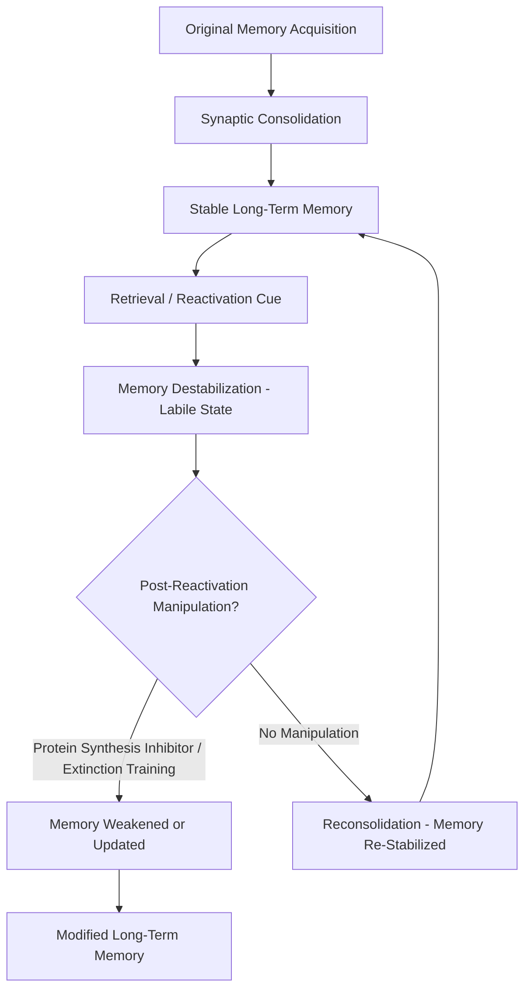

## Memory Reconsolidation and Updating

### Overview

Reconsolidation theory challenges the classical view that memory consolidation is a one-time, unidirectional process that renders a memory permanently stable once completed. Instead, the reconsolidation framework proposes that upon **retrieval**, an already-consolidated memory can re-enter a transient, labile state, during which it becomes susceptible to disruption, strengthening, or modification, before being re-stabilized ("reconsolidated") back into long-term storage. This reopens a window for updating memories long after their initial formation.

### Historical Background

- Early evidence for a labile post-retrieval state came from work by Misanin, Miller, and Lewis (1968), who showed that a consolidated fear memory in rats could be disrupted by protein synthesis inhibition or electroconvulsive shock if administered shortly after memory reactivation (retrieval), but not if administered without reactivation.
- This line of work was largely set aside for several decades before being revived and substantially extended by Nader, Schafe, and LeDoux (2000), whose demonstration that reactivated fear memories in the amygdala require protein synthesis to persist reignited systematic study of reconsolidation and established it as a major research area in memory neuroscience.

### The Basic Reconsolidation Paradigm

1. An animal or human acquires and consolidates a memory (e.g., fear conditioning to a tone).
2. After consolidation is complete, the memory is **reactivated** via presentation of a retrieval cue (e.g., the conditioned tone alone).
3. Reactivation is proposed to return the memory trace to a transiently labile state.
4. If a disrupting manipulation (e.g., a protein synthesis inhibitor, an NMDA receptor antagonist, or in some human studies, beta-adrenergic blockade) is administered within a limited post-reactivation window, the memory's later expression is impaired or weakened.
5. If no reactivation occurs, or if the disrupting manipulation is given outside this window, the memory remains unaffected — establishing that the vulnerability is specifically tied to retrieval-induced destabilization, not merely to the passage of time or to the pharmacological agent itself.

### Molecular Mechanisms

- Reconsolidation, like the initial late-phase consolidation process, is widely reported to depend on **new protein synthesis** and **gene transcription**, though the specific molecular cascade shows both overlaps with and differences from initial consolidation.
- In the amygdala fear-conditioning model, reconsolidation has been shown to depend on **NMDA receptor activation** (for triggering destabilization upon retrieval) and subsequent **protein kinase and CREB-dependent transcriptional signaling** (for re-stabilization), broadly analogous to mechanisms described for late-phase LTP.
- The ubiquitin-proteasome system has also been implicated in the destabilization phase specifically, with evidence suggesting that active protein degradation of existing synaptic components is required to render the memory trace labile in the first place, distinguishing destabilization from a purely passive "unlocking."
- [Inference] Not all molecular details of consolidation and reconsolidation are identical; for instance, some studies report distinct or only partially overlapping gene expression profiles between initial consolidation and post-retrieval reconsolidation, suggesting reconsolidation is not simply a literal re-run of the original consolidation cascade, though the degree of mechanistic overlap versus divergence remains an active research question.

### Boundary Conditions on Reconsolidation

Reconsolidation does not occur under all circumstances; several factors are recognized as **boundary conditions** that determine whether a reactivated memory actually destabilizes:

- **Memory age**: older, more strongly consolidated (or "systems-consolidated") memories may become progressively more resistant to destabilization upon retrieval.
- **Memory strength**: very strongly encoded memories may likewise be less susceptible to post-retrieval disruption than weaker ones.
- **Prediction error at retrieval**: reactivation appears to require an element of surprise or mismatch between what is expected and what actually occurs during the reminder presentation; if the reminder cue is presented in a manner that is fully expected (no new information, no prediction error), destabilization may fail to occur. This finding has direct practical implications for designing reconsolidation-based interventions.
- **Reminder duration**: presenting the reactivation cue for too long can shift the process from reconsolidation toward **extinction** instead (see distinction below), since prolonged unreinforced cue exposure is the basis of extinction learning.

### Reconsolidation vs. Extinction: An Important Distinction

- **Extinction** refers to the formation of a *new*, inhibitory memory trace (e.g., "the tone no longer predicts shock") that competes with and suppresses, but does not erase, the original memory trace. Because the original trace remains intact, extinguished fear responses are known to show spontaneous recovery, renewal (context-dependent return of fear), and reinstatement (re-emergence following an unsignaled aversive event).
- **Reconsolidation blockade**, by contrast, is proposed to directly modify or erase the original memory trace itself, rather than merely adding a competing inhibitory trace — a mechanistically distinct and, if achievable, potentially more durable outcome.
- Distinguishing these two processes experimentally, and identifying the precise reactivation parameters (brief reminder vs. prolonged exposure) that push a given intervention toward one process or the other, has been a major methodological challenge and source of some inconsistency across the reconsolidation literature.

### Human and Translational Research

- **Propranolol (beta-adrenergic antagonist) studies**: administering propranolol shortly after memory reactivation has been reported to reduce the physiological expression of reactivated fear memories in some human studies, motivated by the proposal that noradrenergic signaling contributes to reconsolidation of emotionally significant memories.
- **Behavioral (non-pharmacological) reconsolidation interventions**: some studies have reported that brief memory reactivation followed by extinction training within the reconsolidation window can produce more durable reductions in fear responding (with reduced spontaneous recovery/renewal) compared to extinction training alone — though [Inference] the replicability and robustness of this specific "reconsolidation update" behavioral procedure across independent labs has been mixed, and it remains a topic of active debate and follow-up research rather than a fully settled finding.
- Clinical interest centers on potential applications to conditions involving maladaptive, persistently reactivated memories, such as post-traumatic stress disorder and substance-use-related conditioned associations, though translating laboratory reconsolidation-blockade procedures into robust, reliable clinical treatments remains an ongoing challenge with mixed results to date.

### Reconsolidation Beyond Fear Memory

- While the amygdala fear-conditioning paradigm has been the dominant experimental model (owing to its tractability and clear behavioral readout), reconsolidation-like phenomena have also been reported for hippocampus-dependent declarative/episodic memories and for appetitive/drug-associated memories (implicating mesolimbic dopaminergic circuits), suggesting the labile-upon-retrieval property may be a relatively general feature of memory storage rather than one specific to fear circuitry.
- [Inference] The generality of reconsolidation across memory systems is broadly accepted in principle, but the specific molecular machinery and behavioral boundary conditions have been most rigorously characterized in the amygdala fear system, with comparatively less complete characterization in hippocampal-declarative and other systems.

### Theoretical and Adaptive Significance

- Reconsolidation is often interpreted as reflecting an adaptive design feature rather than a mere vulnerability or "flaw" in memory storage: allowing memories to be updated with new, relevant information upon retrieval enables an organism to keep stored memories current and behaviorally relevant in a changing environment, rather than leaving them as permanently fixed records.
- This reframes memory not as a static archival process but as a dynamic, reconstructive one, in which each act of retrieval is also an opportunity for revision.

### Key Points

- Reconsolidation theory proposes that retrieval of a consolidated memory can return it to a transient, labile state requiring new protein synthesis to be re-stabilized, reopening a window for updating or disrupting the memory.
- The phenomenon was originally identified in the 1960s but was substantially revived and systematized by Nader and colleagues' work on amygdala-dependent fear memory reconsolidation.
- Reconsolidation is governed by boundary conditions, notably prediction error at reactivation and memory age/strength, which determine whether destabilization actually occurs.
- Reconsolidation blockade (modifying the original trace) is mechanistically distinct from extinction (forming a new, competing inhibitory trace), with extinction alone being more prone to spontaneous recovery, renewal, and reinstatement of the original response.
- Translational applications (e.g., propranolol-assisted reconsolidation interventions, reactivation-plus-extinction procedures) show clinical promise for conditions such as PTSD, but replication and robustness across studies remain an active and unresolved area of research.

### Related Topics

- Fear conditioning and amygdala-dependent associative learning
- Extinction learning and its clinical application in exposure therapy
- Synaptic consolidation and the CREB/protein-synthesis-dependent late-LTP pathway
- Prediction error signaling in associative learning (Rescorla-Wagner model)
- PTSD and pharmacological approaches to traumatic memory modification
- Ubiquitin-proteasome system in synaptic plasticity
- Drug-associated memory reconsolidation and addiction relapse mechanisms