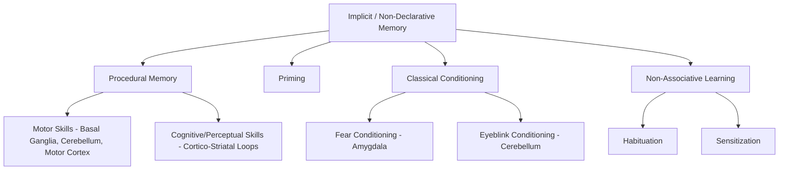

## Implicit and Procedural Memory

### Overview and Position in the Memory Taxonomy

Implicit memory refers to memory that influences behavior or performance without requiring conscious, intentional recollection of the learning episode itself. It is the broader category under the non-declarative memory umbrella, encompassing several dissociable subtypes: procedural memory (skills and habits), priming, classical conditioning, and non-associative learning (habituation/sensitization). This entry focuses primarily on procedural memory as the most extensively characterized implicit memory system, while situating it relative to the other implicit subtypes.

### Defining Feature: Dissociation from Explicit Recollection

The hallmark experimental signature of implicit/procedural memory is a **dissociation** between improved task performance and the absence of explicit awareness or verbal recollection of having performed or practiced the task before. This dissociation is most dramatically illustrated in amnesic patients, who show normal or near-normal skill acquisition despite having no conscious memory of the practice sessions themselves — direct evidence that procedural learning does not depend on the hippocampal/MTL declarative memory system.

### Procedural Memory: Core Characteristics

- Supports the gradual, incremental acquisition of **motor skills** (e.g., riding a bicycle, playing a musical instrument), **perceptual skills** (e.g., mirror reading), and **cognitive/procedural skills** (e.g., solving the Tower of Hanoi puzzle, learning a sequence of rules).
- Acquisition is typically **gradual and incremental**, improving across many trials or repetitions, in contrast to the often rapid, one-trial nature of episodic encoding.
- Once acquired, procedural skills tend to be **highly durable** and resistant to forgetting, and are often difficult to verbally articulate even by the person who has expertly mastered them (the "difficult to teach" quality of expert motor skill).
- Retrieval of procedural memory does not require conscious, deliberate recollection — it is expressed automatically through performance itself.

### Classic Evidence: Patient H.M. and Mirror Tracing

- Patient H.M., despite severe anterograde amnesia for declarative memory following bilateral medial temporal lobectomy, showed steady, normal day-to-day improvement on a **mirror-tracing task** (tracing a shape while viewing only its mirror-reversed image) across repeated testing sessions.
- Critically, each day H.M. had no explicit memory of ever having performed the task before, yet his motor performance continued to improve as though normal practice effects were accumulating — providing foundational evidence that procedural memory formation does not depend on the hippocampus/MTL structures damaged in his surgery.
- This single dissociation (impaired declarative memory, spared procedural learning) was later complemented by studies of patients with the opposite pattern (e.g., basal ganglia disease with relatively preserved declarative memory but impaired procedural/skill learning), together forming a double dissociation supporting separable neural systems.

### Neural Substrates of Procedural Memory

**Basal Ganglia (Striatum)**

- The dorsal striatum (caudate nucleus and putamen) is central to the acquisition of motor sequences and stimulus-response habits.
- The striatum receives convergent input from cortex (particularly motor and premotor areas) and dopaminergic input from the substantia nigra pars compacta, with dopamine serving as a key teaching signal for reinforcement-based procedural learning.
- Classic sequence-learning paradigms (e.g., the **Serial Reaction Time (SRT) task**, in which participants respond progressively faster to a repeating, unannounced sequence of stimulus locations without necessarily becoming aware of the sequence) show striatal activation that tracks the amount of sequence learning, dissociable from hippocampal activity associated with any explicit awareness of the sequence that may co-occur.
- Patients with basal ganglia pathology (e.g., **Parkinson's disease**, **Huntington's disease**) show impaired procedural/motor sequence learning on tasks such as the SRT task, while often showing relatively preserved declarative memory (particularly in early-stage Parkinson's disease), providing the complementary half of the double dissociation with hippocampal amnesia.

**Cerebellum**

- Central to the acquisition and precise timing of motor skills, particularly those requiring fine temporal calibration, such as **classical eyeblink conditioning** and **adaptation tasks** (e.g., prism adaptation, adaptation of reaching movements to a rotated visual display).
- The cerebellar cortex, via **Purkinje cell** plasticity (predominantly long-term depression at parallel fiber–Purkinje cell synapses, driven by climbing fiber "error" signals from the inferior olive), is thought to encode an internal predictive model that refines motor output based on sensory prediction error.
- Patients with cerebellar damage show impaired motor adaptation and impaired delay eyeblink conditioning, while typically showing intact declarative memory, again supporting a dissociable procedural learning system distinct from basal ganglia-dependent habit learning.

**Motor and Premotor Cortex**

- Contributes to the representation and refinement of learned motor sequences, particularly as skills become more automatized and less dependent on effortful, attention-demanding cortical control.
- Some evidence suggests a shift in the relative contribution of prefrontal/associative cortico-striatal loops (more engaged early in learning, when performance is effortful and attention-demanding) toward sensorimotor cortico-striatal loops (more engaged once a skill becomes automatized), reflecting a broader principle of a shift from controlled to automatic processing with practice.

### Priming as a Related Implicit Memory Form

- Priming refers to facilitated processing of a stimulus due to prior exposure, without conscious recollection of the exposure episode.
- **Perceptual priming** (dependent on the physical form of the stimulus) is associated with modality-specific sensory neocortex (e.g., visual word-form facilitation in occipitotemporal cortex).
- **Conceptual priming** (dependent on stimulus meaning) is associated with more anterior, semantically-oriented association cortex.
- Priming is dissociable from procedural memory: it does not require repeated practice to accumulate gradually and does not involve motor skill acquisition, but shares with procedural memory the key property of hippocampal independence and lack of conscious recollection requirement.

### Stages of Motor Skill Acquisition (Fitts and Posner's Three-Stage Model)

A classical cognitive framework for describing procedural/motor learning over time:

1. **Cognitive stage**: performance is slow, effortful, and highly dependent on explicit, declarative strategies and verbal instruction; heavily reliant on attentional and working memory resources (prefrontal cortex).
2. **Associative stage**: performance becomes smoother and more consistent as errors are gradually eliminated through practice; a gradual shift toward more automatic, less consciously monitored execution.
3. **Autonomous stage**: performance becomes highly automatized, fast, and largely immune to interference from concurrent cognitive tasks; minimal conscious attention or declarative involvement is required.

[Inference] This three-stage framework is a well-established, historically influential cognitive-level description of skill acquisition, though contemporary computational and neuroscientific models generally describe the underlying neural transition (e.g., prefrontal-to-striatal or associative-to-sensorimotor loop shifts) in somewhat more continuous and multi-system terms rather than as three sharply discrete stages.

### Awareness and the Explicit/Implicit Boundary

- Procedural and other implicit learning can occur, and often does occur, without any accompanying explicit awareness of what has been learned (as in the SRT task, where many participants show clear behavioral evidence of sequence learning without being able to explicitly report the sequence).
- However, explicit awareness is not strictly excluded from procedural learning; declarative knowledge about a skill (e.g., verbal instructions, explicit strategy use) often interacts with and can accelerate procedural learning, particularly during the early cognitive stage of skill acquisition described above.
- [Inference] The precise degree of independence versus interaction between explicit/declarative and implicit/procedural learning systems during real-world skill acquisition remains an active empirical question, with some tasks and stages showing clearer separability than others.

### Key Points

- Implicit memory is characterized by a dissociation between improved performance and the absence of conscious recollection of the learning episode, most clearly demonstrated in amnesic patients with normal procedural learning despite severe declarative memory impairment.
- Procedural memory for motor and cognitive skills is supported primarily by the basal ganglia (striatum, for sequence/habit learning) and cerebellum (for precisely timed motor adaptation and eyeblink conditioning), which are dissociable from each other and from the hippocampal declarative system.
- A double dissociation exists between hippocampal amnesia (impaired declarative, spared procedural) and basal ganglia disease such as Parkinson's and Huntington's disease (impaired procedural, relatively spared declarative in earlier stages).
- The Fitts and Posner three-stage model (cognitive, associative, autonomous) describes the classical cognitive-level progression of motor skill acquisition, broadly paralleling a shift from prefrontal/associative to sensorimotor cortico-striatal circuit engagement.

### Related Topics

- Basal ganglia circuitry and reinforcement-based habit learning
- Cerebellar long-term depression and motor adaptation models
- The Serial Reaction Time task and implicit sequence learning
- Parkinson's disease and Huntington's disease as procedural learning lesion models
- Dopaminergic reward prediction error signaling in striatal learning
- Priming paradigms and the perceptual/conceptual priming distinction
- Automaticity and the transition from controlled to automatic cognitive processing