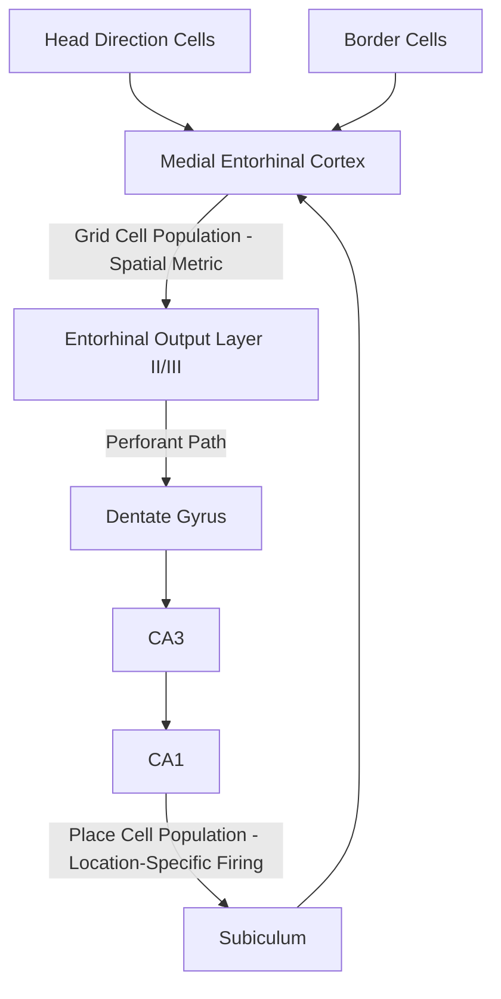

## Place Cells and Grid Cells

### Overview

Place cells and grid cells are two of the most extensively characterized classes of spatially tuned neurons in the mammalian brain, forming the empirical core of the neuroscience of spatial cognition and navigation. Place cells, discovered in the hippocampus, and grid cells, discovered in the entorhinal cortex, together provide a proposed neural coordinate system for representing an animal's location in space, and have become central evidence for the broader **cognitive map theory** of hippocampal-entorhinal function.

### Place Cells

**Discovery and Basic Properties**

- First described by John O'Keefe and Jonathan Dostrovsky (1971) via single-unit recordings in the rat hippocampus (predominantly CA1 and CA3 fields).
- A place cell fires selectively and robustly when an animal occupies a specific, circumscribed region of its environment, termed the cell's **place field**, while remaining largely silent when the animal is elsewhere.
- Different place cells have place fields in different locations; collectively, the population of place cells across the hippocampus provides a distributed representation covering the entire explored environment.
- Place fields are typically stable across repeated visits to the same environment over time, but can substantially **remap** — i.e., a given place cell may fire in an entirely different location, or become silent, or become newly active — when the animal is moved to a different environment or when significant contextual features of the same environment are altered.

**Remapping**

- **Global remapping**: a largely uncorrelated reorganization of firing locations across the population, typically triggered by movement to a distinctly different environment (e.g., different room, different shape of enclosure).
- **Rate remapping**: place fields remain in the same spatial locations, but individual cells change their firing rate within those fields, typically triggered by non-spatial contextual changes within the same environment (e.g., changing the color of the enclosure walls without changing its shape or the animal's location within it).
- [Inference] The functional interpretation of remapping — that global remapping reflects orthogonalized ("pattern separated") representations of genuinely distinct places/contexts, while rate remapping reflects modulation of a shared spatial map by non-spatial content — is well supported but remains an active area of refinement as more nuanced experimental manipulations are developed.

**Determinants of Place Field Firing**

- Place fields are influenced by both **allocentric** cues (fixed external landmarks, e.g., distal visual cues on the walls of a room) and **idiothetic** (self-motion) cues, including vestibular, proprioceptive, and motor efference copy signals used for path integration.
- Removing or rotating salient landmark cues can predictably shift or rotate the location of place fields, demonstrating their dependence on external sensory anchoring, while place fields can still be maintained to some degree in darkness via path integration alone, though with accumulating positional drift/error over time.

### Grid Cells

**Discovery and Basic Properties**

- First described by Edvard and May-Britt Moser and colleagues (2005) in the rat **medial entorhinal cortex (MEC)**, the principal cortical input structure to the hippocampus.
- A grid cell fires at multiple discrete locations arranged in a strikingly regular, periodic, hexagonally tessellating pattern across the entire explored environment — resembling a triangular lattice overlaid on physical space.
- Grid patterns are characterized by three key parameters: **spacing** (distance between adjacent firing fields), **orientation** (rotational alignment of the grid relative to environmental boundaries), and **phase** (spatial offset of the grid pattern relative to other grid cells).
- Grid cell spacing and field size increase systematically along the dorsoventral axis of the MEC, with dorsal MEC neurons showing the smallest, most finely spaced grids and more ventral neurons showing progressively larger spacing — providing a graded, multi-scale spatial metric.

**Functional Interpretation: A Metric for Space**

- Because grid firing fields are evenly and predictably spaced regardless of specific environmental landmarks, grid cells are proposed to provide a context-independent, internally generated **spatial metric** — analogous to a coordinate grid or ruler — supporting **path integration**: the ability to track one's position by continuously integrating self-motion cues (speed and heading direction) over time, independent of external landmarks.
- This proposed role is supported by the persistence of grid-like firing patterns in darkness (in the absence of visual landmarks), and by computational (attractor network) models demonstrating how grid patterns could in principle be generated and updated via integration of velocity signals.

**Relationship to Head Direction Cells and Border Cells**

- Grid cells in MEC coexist with other functionally specialized spatial cell types that together are thought to jointly support navigation:
  - **Head direction cells** (found in MEC and several other regions, e.g., postsubiculum, anterior thalamus): fire selectively when the animal's head is oriented in a specific compass direction, independent of location.
  - **Border cells** (found in MEC and parasubiculum): fire selectively when the animal is near a boundary or edge of the environment (e.g., a wall), in a given orientation.
  - **Conjunctive grid × head-direction cells**: found in deeper MEC layers, combine spatial periodicity with directional tuning.

### From Grid Cells to Place Cells: A Proposed Circuit-Level Relationship

- One influential model proposes that place cell firing in the hippocampus is constructed, at least in part, by summing input from multiple grid cells of differing spacing, phase, and orientation converging via the perforant path — analogous to a Fourier-like combination of periodic signals producing a single, spatially localized firing field.
- [Inference] While anatomically and computationally plausible, and consistent with the entorhinal-to-hippocampal projection pattern, this precise "grid-to-place" summation model remains one of several competing computational proposals; other models emphasize a more bidirectional or co-dependent relationship (e.g., some evidence suggests that grid cell periodicity itself may partly depend on intact hippocampal place cell input, based on studies showing that grid cell patterns degrade or become less regular following hippocampal inactivation).

### Neurophysiological Recording Methods

- Both cell types are typically studied using chronically implanted **tetrode** or, more recently, **silicon probe** electrode arrays in freely moving rodents, allowing simultaneous recording of firing activity from many individual neurons as the animal explores an open-field or maze environment.
- **Calcium imaging** (e.g., via miniature head-mounted microscopes, "miniscopes," in genetically modified mice expressing calcium indicators) has more recently enabled longitudinal tracking of the same identified place and grid cells across many days to weeks, providing insight into the long-term stability and plasticity of these spatial representations.

### Cognitive Map Theory

- O'Keefe and Nadel's cognitive map theory (1978) proposed that the hippocampal-entorhinal system constructs an internal, allocentric (viewpoint-independent) representation of the spatial environment, functioning not merely as a navigational aid but as a broader scaffold for organizing episodic memory — binding "what happened" to "where it happened."
- This theory directly motivated much of the subsequent search for, and interpretation of, place and grid cells, and remains the dominant conceptual framework linking spatial cognition research to the broader declarative/episodic memory literature.
- The discovery of place cells (O'Keefe) and grid cells (the Mosers) was jointly recognized with the **2014 Nobel Prize in Physiology or Medicine**, reflecting the field's assessment of their foundational importance.

### Evidence in Humans

- Analogous spatially tuned neural signals have been reported in humans using intracranial electrode recordings in epilepsy patients undergoing pre-surgical monitoring, as well as indirectly via fMRI (e.g., grid-cell-like hexagonally symmetric BOLD signal modulation in entorhinal cortex during virtual navigation tasks).
- [Inference] Human grid-cell-like signals measured via fMRI are an indirect, population-level proxy (based on characteristic hexagonal symmetry in the BOLD signal as a function of movement direction) rather than direct single-unit confirmation of individual grid cell firing, and this measurement approach, while widely used and replicated across some studies, carries its own methodological assumptions and limitations distinct from rodent single-unit electrophysiology.
- Similar hexagonally symmetric signals have also been reported during certain non-spatial, conceptual/abstract "cognitive map" tasks (e.g., navigating a two-dimensional space of abstract stimulus features), motivating broader theoretical proposals that grid-like coding principles may generalize beyond literal physical space to abstract relational knowledge more broadly — a more speculative but increasingly influential extension of the original spatial findings.

### Key Points

- Place cells (hippocampus) fire selectively at specific locations in an environment; grid cells (medial entorhinal cortex) fire in a periodic, hexagonally tessellating spatial pattern, providing a proposed internally generated spatial metric.
- Place cells can globally remap (largely uncorrelated reorganization) in response to a genuinely different environment, or rate remap (same locations, altered firing rates) in response to non-spatial contextual changes within the same environment.
- Grid cell spacing increases systematically along the dorsoventral axis of MEC, and grid firing is thought to support path integration via continuous updating from self-motion cues.
- Grid cells coexist with head direction cells and border cells in MEC, together forming a broader spatial coding system that feeds into hippocampal place cell representations via the entorhinal-hippocampal circuit.
- The discovery of these cell types provided the principal empirical foundation for O'Keefe and Nadel's cognitive map theory and was recognized with the 2014 Nobel Prize in Physiology or Medicine.

### Related Topics

- Hippocampal formation and the trisynaptic circuit
- Path integration and self-motion-based navigation
- Head direction cells and border cells in entorhinal/parasubicular circuits
- Cognitive map theory and its extension to episodic memory
- Human intracranial and fMRI evidence for grid-like coding
- Attractor network models of grid cell pattern formation
- Grid-like coding in abstract, non-spatial cognitive domains