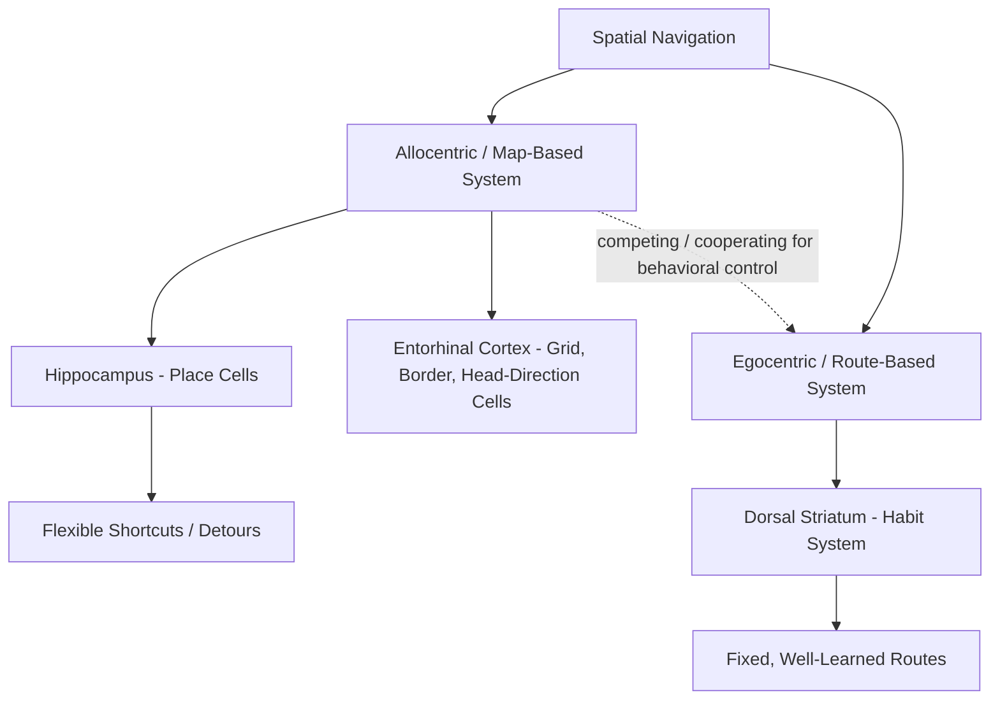

## Cognitive Maps and Spatial Representation

### Overview and Historical Origins

The cognitive map concept refers to an internal, mentally represented model of spatial relationships in the environment that supports flexible navigation, independent of any single learned route or sequence of movements. The term was coined by Edward Tolman (1948), based on behavioral experiments in rats demonstrating **latent learning** and **novel shortcut-taking**, which he argued could not be explained by simple stimulus-response (S-R) habit learning alone and instead implied an internal, map-like representation of the maze layout. This behavioral proposal was later given a strong neurobiological foundation by O'Keefe and Nadel's (1978) hippocampal cognitive map theory, built on the discovery of place cells.

### Tolman's Behavioral Evidence

- **Latent learning experiments**: rats allowed to freely explore a maze without reward showed markedly faster learning once reward was subsequently introduced, compared to rats trained from the start with reward — suggesting that spatial knowledge had been acquired ("latently") during unrewarded exploration, prior to and independent of any reinforcement.
- **Shortcut and detour studies**: rats trained to run a specific rewarded path through a maze, when later presented with a blocked path and multiple alternative routes, preferentially selected a novel route that most directly approximated the straight-line path to the goal — behavior interpreted as reflecting a flexible, map-like representation of spatial relationships rather than rigid memorization of a single learned motor sequence.
- These findings directly challenged the dominant behaviorist S-R associative learning framework of the time, which struggled to explain flexible, novel-route behavior without invoking some form of internal representation.

### Two Complementary Systems of Spatial Navigation

Contemporary spatial cognition research generally distinguishes (at least) two dissociable navigational strategies, thought to be supported by distinct, though interacting, neural systems:

**Allocentric (Map-Based) Navigation**

- Represents spatial locations in terms of their relationships to each other and to fixed external landmarks, independent of the observer's own current position or orientation (a "bird's-eye," viewpoint-independent frame of reference).
- Supports flexible behaviors such as taking novel shortcuts or detours, since the relevant spatial relationships are represented independently of any specific traveled route.
- Primarily associated with the **hippocampus** (place cells) and **entorhinal cortex** (grid cells, head direction cells, border cells).

**Egocentric (Route-Based) Navigation**

- Represents spatial locations relative to the observer's own body or current viewpoint (e.g., "turn left at the second landmark"), supporting well-learned, fixed route-following (stimulus-response habit navigation).
- Less flexible: disruption of a single familiar landmark or step in the sequence can substantially impair performance, since the representation does not include the broader relational map needed to generate an alternative route.
- Primarily associated with the **dorsal striatum (caudate nucleus)**, consistent with its broader role in habit and procedural learning.

[Inference] These two systems are frequently described as operating somewhat competitively for behavioral control, with a substantial body of evidence (particularly dual-solution maze paradigms and pharmacological/lesion dissociation studies) supporting this framing, though the degree and conditions under which the two systems cooperate versus compete rather than one dominating outright is an area of continued refinement.

### Neural Components of the Cognitive Map

- **Place cells** (hippocampus): fire selectively at specific locations, forming a distributed, population-level representation of "where" the animal currently is within a given environment.
- **Grid cells** (medial entorhinal cortex): fire in a periodic, hexagonal spatial pattern, proposed to provide an internally generated spatial metric supporting path integration.
- **Head direction cells** (found across several regions including postsubiculum, anterior thalamus, and entorhinal cortex): encode the animal's current facing direction relative to the environment, independent of location, functioning as an internal "compass."
- **Border cells** (entorhinal/parasubicular regions): fire selectively near environmental boundaries, providing geometric anchor information that helps stabilize and calibrate the broader spatial map.
- Together, this constellation of functionally specialized cell types is often described as jointly constituting the neurobiological substrate for Tolman's originally behaviorally inferred cognitive map.

### Path Integration (Dead Reckoning)

- Path integration refers to the capacity to continuously update one's estimated position and orientation by integrating self-motion cues (vestibular signals, proprioceptive feedback, and motor efference copy reflecting intended movement) over time, without reliance on external landmarks.
- Grid cells are the most prominent proposed neural substrate for this computation, given their persistence in darkness and their systematic, landmark-independent periodicity.
- Path integration is inherently prone to cumulative error/drift over time and distance traveled, which is why animals (and humans) periodically recalibrate their internal spatial estimate using external landmark information when available — illustrating that allocentric mapping in practice typically combines both self-motion-based (path integration) and landmark-based (visual/sensory) information sources.

### Landmarks, Boundaries, and Geometric Cues

- Experimental work (e.g., using rectangular arenas and geometric reorientation tasks) has shown that navigating animals, including young children in some paradigms, can preferentially use the overall geometric shape of an enclosed space (e.g., the relative lengths of walls) to reorient themselves, sometimes even at the expense of ignoring other available non-geometric featural cues (such as wall color) — motivating proposals for a partially dissociable "geometric module" in spatial reorientation.
- [Inference] The strict modularity of a dedicated geometric-only reorientation system, as originally proposed, has been substantially qualified by subsequent research showing that featural cues are readily used and integrated with geometric information under many conditions; the current consensus leans toward flexible integration of multiple cue types rather than a strictly encapsulated geometric module operating in isolation.

### Beyond Physical Space: Cognitive Maps for Abstract Relations

- An increasingly influential line of research proposes that the same hippocampal-entorhinal computational principles used for physical spatial mapping (place-cell-like and grid-cell-like coding) may generalize to representing non-spatial, abstract relational structures — for example, representing relationships among sounds varying continuously along two acoustic dimensions, or representing abstract social hierarchies or conceptual spaces.
- Under this view, the hippocampal-entorhinal system is reframed not merely as a dedicated "GPS," but as a more general-purpose relational mapping system, with physical spatial navigation being one especially well-studied instantiation of a broader computational principle.
- [Speculation] While grid-like hexagonal coding signatures have been reported in some human neuroimaging studies of abstract conceptual spaces, the extent to which this reflects the same underlying neural mechanism as physical spatial grid cells, versus a more superficial computational analogy, remains a genuinely open and actively debated question in the field.

### Clinical and Developmental Relevance

- Spatial navigation and cognitive mapping abilities are frequently among the earliest cognitive domains to show measurable decline in **Alzheimer's disease**, consistent with the disease's characteristic early involvement of the entorhinal cortex and hippocampus; some research has explored virtual reality-based spatial navigation tasks as a potential early behavioral marker for preclinical Alzheimer's pathology.
- Normal aging is also associated with a general decline in allocentric, map-based navigation performance, with some evidence for a relative shift toward greater reliance on egocentric/route-based strategies, consistent with the differential vulnerability of hippocampal versus striatal systems across the aging process.

### Key Points

- The cognitive map concept originated from Tolman's behavioral demonstrations of latent learning and flexible shortcut-taking in rats, challenging simple stimulus-response accounts of spatial learning.
- Navigation is supported by (at least) two dissociable systems: an allocentric, hippocampal-entorhinal map-based system supporting flexible route generation, and an egocentric, striatal habit-based system supporting fixed, well-learned route-following.
- Place cells, grid cells, head direction cells, and border cells jointly constitute the proposed neurobiological substrate for Tolman's originally behaviorally inferred cognitive map.
- Path integration (self-motion-based updating) and landmark/geometric cue use are complementary, jointly operating mechanisms underlying allocentric spatial representation.
- The hippocampal-entorhinal system's computational principles may generalize beyond physical space to abstract relational cognition, an actively developing extension of classical cognitive map theory.

### Related Topics

- Place cells and grid cells (cellular basis of the cognitive map)
- Tolman's latent learning experiments and behaviorist critique
- Dorsal striatum and habit-based (egocentric) learning systems
- Alzheimer's disease and early entorhinal/hippocampal spatial deficits
- Geometric reorientation and the "geometric module" debate
- Grid-like coding in abstract, non-spatial conceptual domains
- Aging and shifts between allocentric and egocentric navigation strategies