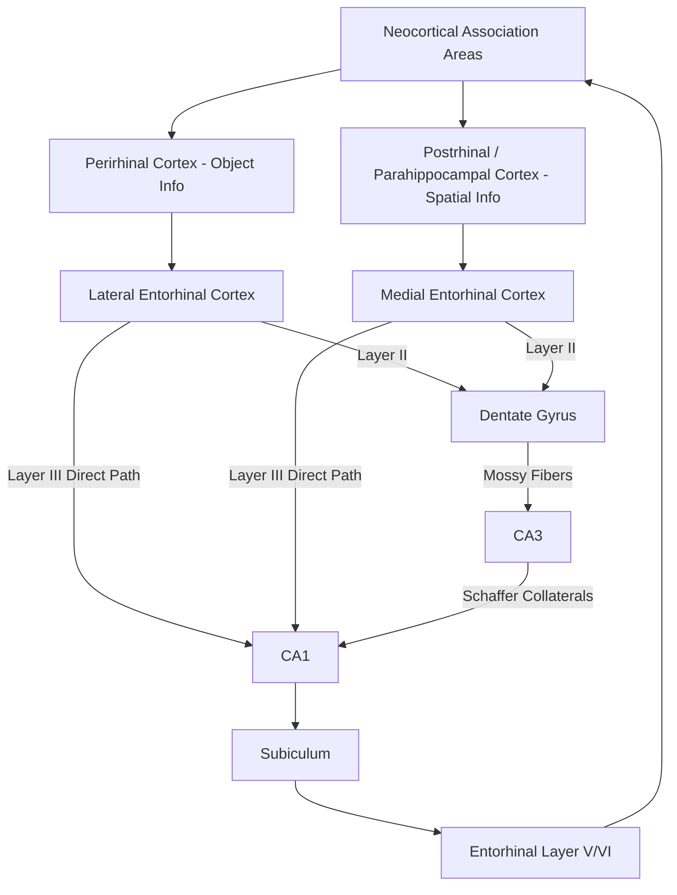

## Entorhinal Hippocampal Circuitry

### Overview

The entorhinal-hippocampal circuit is the principal anatomical and functional interface between the neocortex and the hippocampal formation, serving as both the main input gateway (conveying highly processed multimodal sensory and spatial information into the hippocampus) and the main output pathway (relaying processed hippocampal representations back out to the rest of the brain). This circuit is the substrate for the spatial coding systems described in the taxonomy of place cells, grid cells, head direction cells, and border cells, and is central to both spatial navigation and declarative memory encoding.

### Entorhinal Cortex: Structure and Subdivisions

The entorhinal cortex (EC) is a six-layered cortical region situated in the parahippocampal gyrus, structurally intermediate between neocortex and the more primitive allocortex of the hippocampus proper. It is divided into two major subdivisions with distinct connectivity and functional profiles:

**Medial Entorhinal Cortex (MEC)**

- Receives predominant input from the postrhinal (in primates, parahippocampal) cortex, conveying primarily spatial/contextual scene information.
- Contains the highest concentration of **grid cells**, along with **head direction cells** and **border cells**, making it the primary substrate for the spatial metric and path integration functions described in spatial cognition research.
- Grid cell spacing increases systematically along the dorsoventral axis of MEC.

**Lateral Entorhinal Cortex (LEC)**

- Receives predominant input from the perirhinal cortex, conveying primarily item/object identity information.
- Contains neurons with less spatially regular firing patterns than MEC, and is more associated with representing object identity, item novelty, and (in some proposed models) a form of temporal context signal ("time cells" have also been reported here) relevant to episodic sequence encoding.
- [Inference] The clean MEC-spatial versus LEC-object dichotomy is a useful organizing simplification well supported by anatomical connectivity and lesion/recording studies, though some degree of information mixing and functional overlap between the two subdivisions has also been reported, and the precise division of labor remains an area of ongoing refinement.

### Laminar Organization and the Entorhinal-Hippocampal Loop

The entorhinal cortex's laminar structure is central to its role as a two-way gateway:

- **Layer II** neurons (stellate and pyramidal cells) give rise to the **perforant path**, projecting to the dentate gyrus and CA3.
- **Layer III** neurons give rise to a separate, parallel projection (the **direct/temporoammonic perforant path**) targeting CA1 directly, bypassing the dentate gyrus/CA3 stages.
- **Layer V/VI** neurons receive the primary hippocampal output (via the subiculum and CA1) and relay this processed information back out to neocortical association areas, completing the cortical-hippocampal-cortical loop.

### Functional Significance of the Dual Input Pathways

- The convergence of the indirect trisynaptic pathway (EC layer II → DG → CA3 → CA1) and the direct pathway (EC layer III → CA1) onto CA1 allows CA1 to function as a **comparator**, matching a prediction generated via CA3 pattern completion against current sensory/spatial input arriving directly from entorhinal cortex.
- This comparator architecture is proposed to underlie **novelty and mismatch detection**: when the direct EC input diverges substantially from the CA3-derived prediction, CA1 activity signals this mismatch, which can in turn modulate attention, dopaminergic signaling, and further encoding.
- [Inference] While the comparator function of CA1 is a long-standing and influential theoretical proposal (associated particularly with work by Lisman and colleagues), it remains one of several complementary functional accounts of CA1's role rather than a fully settled, singular description of its computational function.

### Integration of Spatial and Item Information in the Hippocampus

- A central proposed function of the hippocampus is to **bind** the two convergent information streams from LEC (item/object identity) and MEC (spatial/contextual location) into a single, unified episodic representation — directly instantiating the "what happened where" structure characteristic of episodic memory.
- This binding function provides a mechanistic link between the spatial cognition literature (place cells, grid cells) and the broader declarative/episodic memory literature: the same entorhinal-hippocampal circuit that supports physical navigation is proposed to provide the architecture for binding non-spatial content (what) to spatial and temporal context (where, when) in episodic memory more generally.

### Reciprocal Influences: Does the Hippocampus Shape Entorhinal Grid Coding?

- While the classical view treats information flow as proceeding from entorhinal grid/border/head-direction cells "upstream" into hippocampal place cells (via summation or combination of multiple grid inputs), evidence from hippocampal inactivation studies shows that grid cell periodicity and regularity can degrade when hippocampal output is disrupted, suggesting the relationship is not purely feedforward.
- [Inference] This reciprocal dependency indicates the entorhinal-hippocampal system likely functions as an interactive, bidirectionally coupled circuit rather than a strictly serial, one-way processing pipeline, though the precise computational nature of this feedback influence remains under active investigation.

### Vulnerability in Disease: Entorhinal Cortex as an Early Site of Pathology

- The entorhinal cortex, particularly its layer II neurons, is one of the earliest and most consistently affected regions in **Alzheimer's disease**, showing significant neurofibrillary tangle pathology and neuronal loss even at preclinical/prodromal stages, often preceding more widespread hippocampal and neocortical involvement.
- This early entorhinal vulnerability is consistent with, and may help explain, the characteristic early spatial disorientation and navigational difficulty frequently observed in early Alzheimer's disease, and has motivated research interest in spatial navigation tasks (including virtual reality-based paradigms) as potential early behavioral markers of preclinical pathology.
- **Herpes simplex encephalitis** also shows a strong predilection for medial temporal lobe structures including entorhinal cortex, contributing to the severe amnesic profile seen in affected patients (e.g., Clive Wearing).

### Experimental and Recording Considerations

- Because MEC and hippocampus are anatomically adjacent and densely interconnected, dissociating their independent contributions experimentally typically requires a combination of approaches: simultaneous multi-site electrophysiological recording (to compare temporal dynamics and information content across regions), selective lesion or optogenetic/chemogenetic inactivation of one region while recording from the other, and computational modeling to test specific proposed information-flow architectures (e.g., grid-to-place summation models) against observed firing patterns.

### Key Points

- The entorhinal cortex is the principal gateway between neocortex and hippocampus, structurally divided into MEC (predominantly spatial: grid, head-direction, and border cells) and LEC (predominantly object/item-related information).
- Two parallel projection pathways exist: the indirect trisynaptic pathway (EC layer II → DG → CA3 → CA1) and the direct pathway (EC layer III → CA1), allowing CA1 to function as a comparator between predicted and actual input.
- The hippocampus is proposed to bind convergent "what" (LEC-derived item) and "where" (MEC-derived spatial) information streams into unified episodic representations, linking spatial cognition circuitry directly to declarative memory function.
- Entorhinal-hippocampal information flow is likely bidirectional rather than strictly feedforward, based on evidence that hippocampal inactivation can degrade grid cell periodicity.
- The entorhinal cortex, particularly layer II, is one of the earliest sites of neurofibrillary tangle pathology in Alzheimer's disease, plausibly contributing to characteristic early spatial disorientation symptoms.

### Related Topics

- Place cells and grid cells: cellular basis of spatial coding
- Hippocampal formation and the trisynaptic circuit
- Pattern separation (dentate gyrus) and pattern completion (CA3)
- Alzheimer's disease pathology and early entorhinal vulnerability
- Cognitive map theory and allocentric spatial representation
- CA1 as a novelty/mismatch comparator
- Herpes simplex encephalitis and medial temporal lobe amnesia