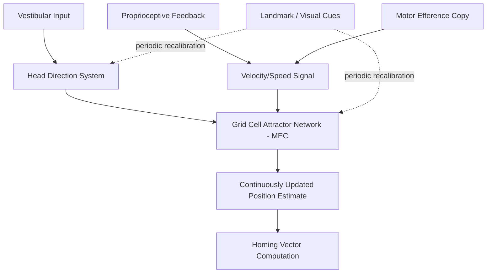

## Path Integration and Dead Reckoning

### Definition and Terminology

Path integration (also termed dead reckoning, a term borrowed from maritime and aviation navigation) is the process by which a navigating animal continuously updates an internal estimate of its current position and heading relative to a starting point, based solely on self-motion information (speed and direction of movement), without relying on external landmarks. This allows an animal to compute a direct return vector (a "beeline" home) even after traversing a long, circuitous outbound path, without needing to retrace its steps or use any visible cues.

### Behavioral Evidence

- **Desert ants (*Cataglyphis*)** are the classic invertebrate model system: foraging ants take highly circuitous, meandering outbound paths across featureless desert terrain in search of food, but upon finding it, return to the nest via a direct, straight-line path — a feat that cannot be explained by landmark-based navigation alone, given the visually homogeneous desert environment, and that has been experimentally confirmed by manipulations such as artificially altering an ant's leg length after outbound foraging (which produces a predictable, proportional overshoot or undershoot of the return distance, demonstrating reliance on a stride-based step-counting mechanism as one component of their path integration system).
- **Rodents** tested in darkness, deprived of visual landmark information, can still perform reasonably accurate homing behavior based on self-motion cues alone, though with progressively accumulating positional error as travel distance and duration increase.
- **Human path integration** has been demonstrated in blindfolded walking studies, in which participants can approximate (with systematic, quantifiable error) a return path to a starting location after being led along an unfamiliar, multi-legged outbound route.

### Sensory Inputs to Path Integration

Path integration relies on multiple converging sources of self-motion information (idiothetic cues):

- **Vestibular signals**: from the semicircular canals (angular acceleration/rotation) and otolith organs (linear acceleration), providing information about changes in heading direction and translational movement.
- **Proprioceptive feedback**: from muscles and joints, providing information about limb movement and stride.
- **Motor efference copy**: an internal corollary discharge signal generated alongside a motor command, providing a predictive estimate of the resulting movement independent of sensory feedback.
- **Optic flow**: visual motion cues generated by self-movement through the environment, which can supplement (though are not strictly necessary for) path integration, as demonstrated by preserved path integration performance in darkness.

### Computational Model: Vector Summation

A simplified mathematical description of path integration treats the process as continuous vector summation (integration) of instantaneous velocity over time to yield an updated position estimate:

$$\vec{P}(t) = \vec{P}(0) + \int_0^t \vec{v}(\tau)\, d\tau$$

where $\vec{P}(t)$ is the estimated position at time $t$, $\vec{P}(0)$ is the starting position, and $\vec{v}(\tau)$ is the instantaneous self-motion velocity vector (incorporating both speed and heading) at each moment $\tau$ during the outbound journey. The return (homing) vector is then simply computed as the negative of the accumulated displacement vector, $-\vec{P}(t)$, pointing directly back to the origin.

### Neural Substrate: The Entorhinal-Hippocampal Grid and Head Direction System

- **Grid cells** (medial entorhinal cortex) are the most prominent proposed neural substrate for the spatial metric component of path integration, given their persistence in darkness (indicating landmark-independence) and their periodic, regularly spaced firing fields, which could in principle serve as a distance/displacement-tracking mechanism.
- **Head direction cells** (postsubiculum, anterior thalamic nuclei, entorhinal cortex) provide the directional/heading component, functioning as an internal compass that is updated based on vestibular and motor signals, and can be recalibrated by visual landmarks when available.
- **Attractor network models** propose that grid cell firing patterns are generated and continuously updated by a network architecture in which recurrent connectivity, combined with velocity-modulated input (conjunctive grid × velocity/head-direction cells), shifts the pattern of active neurons across the network in a manner that tracks the animal's ongoing movement — providing a mechanistic, circuit-level account of how continuous vector integration could be implemented neurally.
- [Inference] While attractor network models successfully reproduce many observed properties of grid cell firing (e.g., persistence in darkness, systematic drift accumulation over time), they remain computational proposals whose precise correspondence to the underlying biological implementation (e.g., specific cell types and connectivity patterns) continues to be refined through ongoing intracellular and connectomic research.

### Error Accumulation and the Necessity of Landmark Recalibration

- Because path integration relies on the cumulative, iterative integration of noisy sensory signals, small errors in each individual movement estimate compound over time and distance traveled, producing progressively increasing positional uncertainty (a form of "random walk" drift error).
- This inherent property explains why animals (including humans) that rely heavily on path integration during a journey (e.g., in darkness or featureless terrain) will periodically use external landmark information, when it becomes available, to "reset" or recalibrate their accumulated position estimate and correct drift error — illustrating that robust real-world navigation typically involves an integration of both self-motion-based (path integration) and landmark-based (allocentric map) information sources rather than exclusive reliance on either alone.
- Desert ants exhibit a particularly elegant behavioral solution to this problem: upon reaching the general vicinity of the nest via path integration, they switch to a landmark-based visual search strategy to pinpoint the nest's exact location, since path integration alone accumulates too much error over very long foraging trips to provide sufficiently precise homing.

### Distinction from Allocentric Landmark-Based Navigation

| Feature | Path Integration | Landmark-Based (Allocentric) Navigation |
| --- | --- | --- |
| Information source | Self-motion (vestibular, proprioceptive, efference copy) | External sensory cues (visual, olfactory landmarks) |
| Error characteristics | Cumulative drift, increasing with distance/time | Generally stable, not distance-dependent, but dependent on landmark visibility/availability |
| Availability | Available even in darkness/featureless terrain | Requires visible/perceivable external cues |
| Primary neural substrate | Grid cells, head direction cells (entorhinal-hippocampal-subicular system) | Place cells, broader hippocampal and neocortical landmark/scene processing regions |

Both systems are understood to operate in a complementary, integrated fashion under normal conditions, with the relative weighting between them shifting dynamically depending on cue availability and reliability.

### Clinical and Developmental Relevance

- Deficits in path integration have been reported in early **Alzheimer's disease**, consistent with the disease's characteristic early involvement of the entorhinal cortex (site of grid cells); some research has explored virtual reality-based path integration tasks (e.g., triangle-completion tasks, in which participants must judge the direct return path after walking two legs of a triangular outbound route) as a potential early behavioral marker for preclinical pathology.
- [Inference] While these findings are consistent with, and motivated by, the known early entorhinal vulnerability in Alzheimer's disease, the specificity and diagnostic utility of path integration deficits as a standalone early biomarker (as opposed to a general marker of broader spatial/cognitive decline) remains an active area of clinical research rather than an established diagnostic tool.

### Key Points

- Path integration (dead reckoning) is the continuous updating of a positional estimate based purely on self-motion cues, allowing direct homing without reliance on external landmarks, classically demonstrated in desert ant foraging behavior.
- The process relies on integration of vestibular, proprioceptive, and motor efference copy signals, and can be formally described as continuous vector summation of velocity over time.
- Grid cells and head direction cells in the entorhinal-hippocampal-subicular system are the principal proposed neural substrates, with attractor network models offering a mechanistic account of how continuous position updating could be implemented.
- Path integration is inherently subject to cumulative drift error, necessitating periodic recalibration via external landmark cues in most real-world navigation, illustrating the complementary, integrated nature of self-motion-based and landmark-based navigation systems.
- Path integration deficits have been explored as an early behavioral marker in Alzheimer's disease, consistent with early entorhinal cortex vulnerability in that condition.

### Related Topics

- Grid cells and the spatial metric hypothesis
- Head direction cells and the internal compass system
- Cognitive map theory and allocentric spatial representation
- Attractor network models of spatial coding
- Alzheimer's disease and early entorhinal cortex pathology
- Desert ant navigation as a comparative/invertebrate model system
- Vestibular system anatomy and its role in spatial orientation