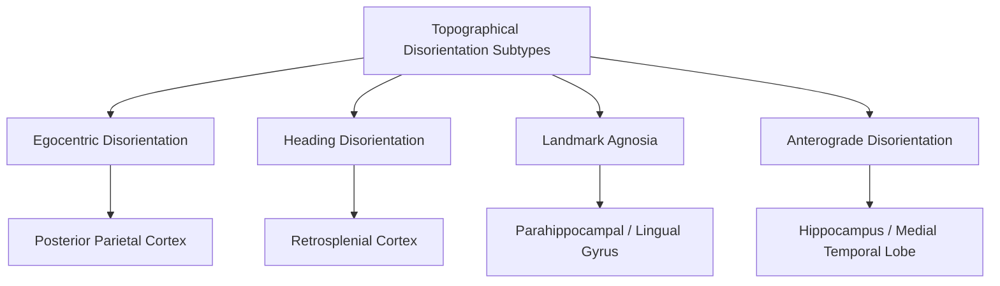

## Spatial Memory and Navigation Disorders

### Overview

Navigation disorders encompass a range of acquired and developmental impairments in the ability to represent, remember, and use spatial information for orienting and wayfinding. Because spatial cognition depends on a distributed network spanning the hippocampus, entorhinal cortex, parietal cortex, retrosplenial cortex, and their interconnections, damage at different points in this network produces qualitatively distinct navigational deficits, offering a valuable dissociative approach for understanding the functional architecture of spatial cognition.

### Topographical Disorientation: A Functional Taxonomy

Clinical neuropsychology has identified several dissociable subtypes of topographical disorientation, each linked to damage in a relatively distinct neural locus:

**Egocentric Disorientation**

- Impaired ability to represent the position of objects or locations relative to one's own body/viewpoint, despite intact ability to recognize landmarks and describe routes verbally.
- Associated with damage to the **posterior parietal cortex**, particularly the right hemisphere, consistent with parietal cortex's broader role in egocentric spatial coding and visuospatial attention.
- Patients may become lost even in highly familiar environments due to an inability to compute their own position and movement relative to surrounding objects.

**Heading Disorientation**

- Impaired ability to determine directional heading relative to salient environmental landmarks, despite intact landmark recognition itself; patients can identify a familiar landmark but cannot use it to determine which way to go.
- Associated with damage to the **retrosplenial cortex** (posterior cingulate region), consistent with its proposed role in translating between egocentric and allocentric spatial reference frames.

**Landmark Agnosia**

- Impaired ability to recognize or use landmarks for orientation, despite otherwise intact perception, memory, and general navigational strategy.
- Associated with damage to the **lingual and parahippocampal gyri**, particularly the region often termed the **parahippocampal place area (PPA)** in functional imaging literature, consistent with this region's specialization for scene/landmark processing.

**Anterograde Disorientation**

- Impaired ability to learn new environments and routes, despite generally preserved navigation in previously familiar, well-learned environments.
- Associated with damage to the **hippocampus** and broader medial temporal lobe, consistent with the hippocampus's general role in forming new declarative/spatial memories (paralleling anterograde amnesia for non-spatial declarative content).

[Inference] This four-way taxonomy, developed substantially through case-study neuropsychology (notably by Aguirre and D'Esposito), provides a useful and influential organizing framework, though individual patients frequently present with mixed or overlapping deficits rather than a single "pure" subtype, since naturally occurring brain lesions rarely respect these precise functional-anatomical boundaries.

### Developmental Topographical Disorientation (DTD)

- A relatively recently characterized condition in which individuals report severe, lifelong difficulty forming and using cognitive maps for navigation, in the absence of any identifiable brain damage, neurological disease, or broader cognitive impairment.
- Affected individuals typically report an inability to form an allocentric mental map of their surroundings, relying instead heavily on effortful, landmark-by-landmark route memorization, which is fragile and fails when routes are altered or familiar landmarks are absent.
- [Inference] The underlying neural basis of DTD is not yet firmly established; some functional imaging studies suggest atypical functional connectivity within hippocampal-entorhinal-parietal navigation networks, but definitive structural or mechanistic causes remain an active area of investigation rather than a settled finding.

### Alzheimer's Disease and Spatial Disorientation

- Spatial disorientation and getting lost, even in previously familiar environments, are among the earliest and most characteristic behavioral symptoms of Alzheimer's disease, consistent with the disease's well-documented early pathological involvement of the entorhinal cortex (site of grid cells) and hippocampus.
- Research using virtual reality navigation paradigms has reported that individuals with preclinical or prodromal Alzheimer's pathology (e.g., identified via biomarkers or genetic risk factors such as APOE ε4 carrier status) can show measurable path integration and allocentric navigation deficits even before standard clinical memory tests detect impairment.
- [Inference] While these findings are promising and biologically well-motivated given known entorhinal vulnerability, the translation of virtual-reality-based spatial navigation testing into a standardized, clinically validated early diagnostic tool remains an active area of ongoing research rather than established clinical practice.

### Vascular and Traumatic Causes

- **Stroke**, particularly affecting the posterior cerebral artery territory (which supplies medial temporal and occipital structures) or the middle cerebral artery territory affecting parietal cortex, can produce navigation deficits corresponding to the specific topographical disorientation subtype associated with the affected region.
- **Traumatic brain injury**, especially with diffuse axonal injury disrupting long-range white matter connections between navigation-relevant regions, can produce more heterogeneous, mixed navigational impairments that do not cleanly map onto a single subtype in the classical taxonomy.

### Assessment Approaches

- **Real-world navigation tasks**: route learning and recall in the clinic environment or hospital ward, testing both egocentric and allocentric components.
- **Virtual reality navigation batteries**: increasingly used to standardize testing of specific component processes (e.g., path integration via triangle-completion tasks, allocentric map learning, landmark recognition) under controlled, reproducible conditions.
- **Perspective-taking and mental rotation tasks**: used to probe the ability to translate between egocentric and allocentric spatial reference frames, relevant to heading disorientation specifically.
- **Standardized clinical scales**: such as topographical memory subtests within broader neuropsychological batteries, though [Inference] there is comparatively less standardization and consensus around dedicated navigation-specific clinical assessment tools relative to more established domains like verbal memory testing.

### Rehabilitation and Compensatory Strategies

- Given the differential neural substrates involved, rehabilitation approaches are most effective when tailored to the specific type of deficit: for example, patients with landmark agnosia may benefit from strategies emphasizing verbal route description and procedural sequence learning (leveraging relatively preserved procedural memory systems), while patients with anterograde disorientation (hippocampal damage) may benefit more from external memory aids (e.g., GPS navigation devices, structured environmental labeling) rather than attempts to retrain new cognitive map formation directly.
- [Inference] Systematic, well-controlled clinical trial evidence for specific navigation rehabilitation protocols remains relatively limited compared to rehabilitation research in domains such as aphasia or motor recovery, and current recommendations are often extrapolated from the broader cognitive rehabilitation and compensatory-strategy literature rather than from navigation-specific randomized trials.

### Key Points

- Topographical disorientation subdivides into at least four dissociable clinical subtypes — egocentric disorientation (parietal), heading disorientation (retrosplenial), landmark agnosia (parahippocampal/lingual), and anterograde disorientation (hippocampal) — each reflecting damage to a distinct node in the broader spatial cognition network.
- Developmental topographical disorientation describes lifelong navigational impairment without identifiable brain damage, with its precise neural basis still under active investigation.
- Alzheimer's disease produces characteristic early spatial disorientation, plausibly linked to its well-established early pathological involvement of entorhinal cortex and hippocampus, motivating research into navigation-based early diagnostic markers.
- Effective rehabilitation and compensatory strategies are most successful when tailored to the specific underlying deficit subtype, given the differential neural substrates and preserved capacities involved.

### Related Topics

- Entorhinal-hippocampal circuitry and its role in spatial coding
- Retrosplenial cortex and egocentric-to-allocentric reference frame transformation
- Parahippocampal place area and scene/landmark processing
- Alzheimer's disease biomarkers and preclinical detection
- Virtual reality applications in cognitive neuroscience assessment
- Cognitive map theory and allocentric spatial representation
- Cognitive rehabilitation strategies for acquired brain injury