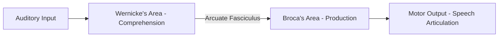
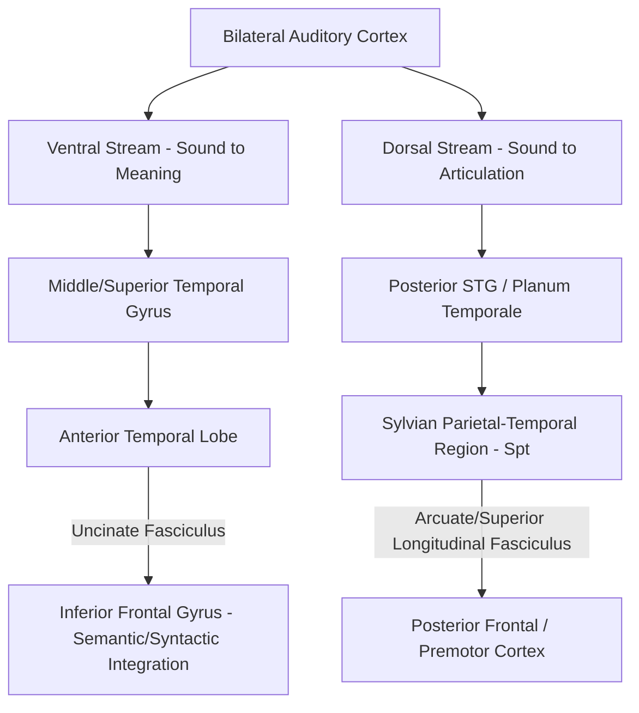

## Classical Language Areas and the Dual Stream Model

### Overview

The neuroscience of language has evolved from the classical, localizationist model built around two named cortical areas (Broca's and Wernicke's) connected by a single major pathway, toward a contemporary dual stream model that distributes language processing across two parallel, functionally distinct pathways analogous to the dorsal/ventral visual streams. Understanding both frameworks, and how the latter refines and supersedes aspects of the former, is essential for interpreting the modern neurolinguistics literature.

### The Classical Model

**Broca's Area**

- Located in the posterior portion of the left inferior frontal gyrus (Brodmann areas 44 and 45), first described by Paul Broca (1861) based on the case of patient "Tan," who suffered from severe non-fluent, effortful speech production despite relatively preserved language comprehension, following damage to this region.
- Classically associated with **speech production**, particularly the motor planning and articulatory sequencing of speech, as well as (in later refinements) aspects of syntactic processing.
- **Broca's aphasia** (non-fluent aphasia): characterized by effortful, halting, agrammatic speech (reduced use of grammatical function words and morphological inflections), with relatively preserved auditory comprehension, though comprehension of syntactically complex sentences (particularly those requiring reliance on grammatical structure rather than semantic plausibility, e.g., certain passive constructions) is often also impaired.

**Wernicke's Area**

- Located in the posterior portion of the left superior temporal gyrus, first described by Carl Wernicke (1874) based on patients with severe comprehension deficits despite fluent, grammatically well-formed speech production.
- Classically associated with **language comprehension**, particularly auditory word recognition and semantic processing.
- **Wernicke's aphasia** (fluent aphasia): characterized by fluent, grammatically structured but often semantically empty or nonsensical speech (sometimes including **paraphasias** — word or sound substitutions — and **neologisms** — invented non-words), accompanied by severely impaired auditory comprehension; patients are often unaware of their own comprehension deficit and the resulting incoherence of their own speech (anosognosia for language deficit).

**Arcuate Fasciculus and Conduction Aphasia**

- The **arcuate fasciculus** is a white matter tract classically described as directly connecting Wernicke's area to Broca's area, proposed to carry auditory language information for use in speech production and repetition.
- **Conduction aphasia**, associated with damage to this connecting pathway (or, in some accounts, more specifically to the underlying supramarginal gyrus/temporo-parietal region rather than the tract itself), is characterized by a disproportionate impairment in verbatim **repetition** of spoken language, despite relatively preserved comprehension and relatively fluent spontaneous speech — a classic dissociation used as key evidence for the classical connectionist (Wernicke-Lichtheim-Geschwind) model of language architecture.

### Limitations of the Classical Model

- Modern lesion-mapping studies using MRI (rather than the relatively coarse post-mortem or early CT-based localization available to Broca, Wernicke, and their contemporaries) have shown that damage confined strictly to Broca's area alone often does *not* produce the full, persistent classical Broca's aphasia syndrome, and that many of the most severe, chronic cases involve more extensive damage including surrounding frontal, insular, and subcortical white matter regions.
- Similarly, "pure" Wernicke's aphasia is more reliably associated with damage extending beyond the posterior superior temporal gyrus into surrounding middle temporal gyrus and inferior parietal regions, rather than being strictly confined to the classically defined area alone.
- [Inference] These refinements do not invalidate the classical eponymous regions as clinically and pedagogically useful reference points, but they do indicate that the simple, discrete "two boxes and one connecting wire" architecture is an oversimplification of a more distributed and interconnected underlying network — a central motivation for the development of the dual stream model.

### The Dual Stream Model (Hickok and Poeppel)

Developed substantially by Gregory Hickok and David Poeppel, the dual stream model proposes that speech and language processing is organized into two anatomically and functionally distinct processing streams, extending from bilateral auditory cortex, drawing an explicit analogy to the dorsal ("where/how") and ventral ("what") streams of the visual system.

**Ventral Stream: Sound-to-Meaning Mapping**

- Function: maps acoustic-phonological speech input onto lexical-conceptual/semantic representations, supporting speech comprehension.
- Proposed to be **relatively bilaterally organized** (involving both left and right temporal lobes), though with some degree of left-hemisphere weighting for certain sublexical/phonological processing stages.
- Key anatomical components: superior and middle temporal gyri (auditory and phonological processing), extending anteriorly and inferiorly toward anterior temporal lobe and connecting via the extreme capsule/uncinate fasciculus toward inferior frontal regions for combinatorial semantic/syntactic integration.

**Dorsal Stream: Sound-to-Articulation Mapping**

- Function: maps acoustic-phonological speech input onto articulatory-motor representations, supporting speech production, particularly the process of translating a heard or internally generated phonological sequence into the corresponding motor plan for articulation (relevant, for example, to repeating novel words or non-words, and to auditory feedback-based online monitoring of one's own speech).
- Proposed to be **strongly left-hemisphere dominant**.
- Key anatomical components: posterior superior temporal gyrus/planum temporale extending into the **Sylvian parietal-temporal (Spt) region** at the temporo-parietal junction (proposed as a key sensorimotor interface), connecting via the **arcuate fasciculus/superior longitudinal fasciculus** to posterior frontal regions including Broca's area and adjacent premotor cortex.

### Reinterpreting Conduction Aphasia Under the Dual Stream Model

- Under the dual stream framework, conduction aphasia's characteristic repetition deficit is reinterpreted not simply as damage to a single "Wernicke-to-Broca wire" carrying auditory information for output, but more specifically as disruption of the **dorsal stream's sensorimotor integration function**, particularly implicating the Spt region and its connections, which are proposed to be necessary for translating auditory-phonological input into the corresponding articulatory motor sequence required for accurate repetition.
- [Inference] This reinterpretation is well supported by lesion-mapping and functional connectivity studies associated with the Hickok and Poeppel framework, though it should be noted this remains one influential model among ongoing refinements in the field, rather than a fully final, universally uncontested account of conduction aphasia's precise mechanism.

### Left Hemisphere Lateralization

- Language function, particularly the dorsal stream/production-oriented component and core grammatical/syntactic processing, is strongly left-hemisphere lateralized in the substantial majority of individuals (approximately 95–99% of right-handed individuals and a somewhat lower but still clear majority of left-handed individuals, based on classical Wada test and modern fMRI lateralization studies).
- The right hemisphere is proposed to contribute more to certain complementary aspects of language processing, including prosody (the rhythm, stress, and intonation of speech, relevant to conveying emotional tone and some pragmatic/discourse-level meaning), some aspects of figurative/non-literal language comprehension, and broader discourse-level coherence monitoring, though [Inference] the degree and specificity of right-hemisphere language contributions remains less precisely characterized and more debated than the well-established left-hemisphere dominance for core grammatical and phonological processing.

### Key Points

- The classical model localizes speech production to Broca's area (posterior inferior frontal gyrus) and comprehension to Wernicke's area (posterior superior temporal gyrus), connected by the arcuate fasciculus, with conduction aphasia (impaired repetition, spared comprehension/fluency) as classic supporting evidence.
- Modern MRI-based lesion mapping shows the classical model oversimplifies the true extent of damage associated with each aphasia syndrome, motivating more distributed network models.
- The dual stream model (Hickok and Poeppel) proposes a bilaterally organized ventral stream mapping sound to meaning (supporting comprehension) and a strongly left-lateralized dorsal stream mapping sound to articulation (supporting production and repetition), explicitly analogous to visual system dorsal/ventral stream organization.
- Conduction aphasia is reinterpreted under the dual stream model as a disruption of dorsal stream sensorimotor integration (implicating the Sylvian parietal-temporal region), rather than simple damage to a single direct connecting pathway.
- Core language functions are strongly left-hemisphere lateralized in most individuals, with the right hemisphere contributing more to prosody and certain discourse-level/figurative language functions.

### Related Topics

- Aphasia syndromes and their detailed clinical/lesion profiles
- The Wernicke-Lichtheim-Geschwind classical connectionist model
- Sylvian parietal-temporal (Spt) region and sensorimotor integration
- Hemispheric lateralization and the Wada test
- Prosody and right-hemisphere contributions to language
- Semantic versus syntactic processing streams in sentence comprehension
- Modern diffusion tensor imaging (DTI) tractography of language white matter pathways