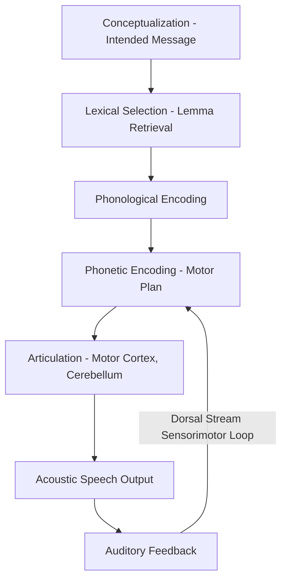

## Speech Perception and Production

### Overview

Speech perception and production together constitute the sensorimotor foundation of spoken language, requiring the rapid transformation of continuous acoustic signals into discrete linguistic units (perception) and the reverse transformation of intended linguistic messages into precisely coordinated articulatory movements (production). Both processes must operate at remarkable speed (natural speech proceeds at roughly 10–15 phonemes per second) and are supported by distinct but interacting neural systems, most comprehensively described by the dual stream model of language processing.

### Speech Perception

**The Acoustic Signal and the Segmentation Problem**

- Unlike written text, the continuous acoustic speech signal does not contain reliable, discrete physical boundaries corresponding to individual phonemes or even words — a fundamental challenge termed the **lack of invariance problem** and the **segmentation problem**.
- Acoustic realization of a given phoneme varies substantially depending on surrounding phonetic context (**coarticulation**), speaker identity, speaking rate, and prosody, yet listeners perceive phonemic categories as stable and discrete — a phenomenon requiring substantial perceptual normalization and categorization processes.

**Categorical Perception**

- A foundational phenomenon in speech perception research: despite acoustic cues (such as **voice onset time**, the interval between the release of a stop consonant and the onset of vocal fold vibration) varying continuously, listeners perceive speech sounds categorically — reliably classifying a given stimulus as one phoneme or another (e.g., /ba/ versus /pa/) with a sharp perceptual boundary, rather than experiencing a smooth, graded perceptual continuum.
- Classic evidence: discrimination of two acoustically equidistant stimulus pairs is much better when the pair straddles a category boundary than when both fall within the same category, despite equal physical acoustic difference — indicating that perception is organized around linguistically relevant categories rather than raw acoustic distance alone.

**Cue Integration and Context Effects**

- Speech perception integrates multiple acoustic cues (e.g., formant transitions, voice onset time, spectral characteristics) that individually may be ambiguous but jointly specify a phoneme category with high reliability.
- **Categorical restoration** and related phenomena demonstrate that listeners use surrounding lexical and semantic context to "fill in" or reinterpret acoustically ambiguous or degraded speech segments, indicating substantial top-down, knowledge-driven influence on ostensibly bottom-up perceptual processing.
- The **McGurk effect** — in which visual articulatory information (lip movements) can alter the perceived auditory phoneme (e.g., an auditory /ba/ dubbed onto a visual /ga/ mouth movement is commonly perceived as /da/) — demonstrates that speech perception is fundamentally **multimodal**, integrating auditory and visual (audiovisual) information rather than operating on auditory input in isolation.

**Neural Substrates of Perception: The Ventral Stream**

- Bilateral **superior temporal gyrus (STG)** and **superior temporal sulcus (STS)** are central to processing the acoustic-phonetic structure of speech, with more posterior regions implicated in finer phonemic analysis and more anterior temporal regions implicated in progressively more abstract lexical-semantic processing, consistent with the ventral stream's proposed "sound-to-meaning" mapping function described in the dual stream model.
- Processing is substantially, though not exclusively, bilaterally organized, with some evidence for relative left-hemisphere specialization for rapid temporal/phonemic processing and right-hemisphere contributions weighted more toward spectral/prosodic processing — though [Inference] the precise division of temporal-versus-spectral processing across hemispheres remains a topic of ongoing refinement rather than an absolute, uncontested division.

### Speech Production

**Levels of Processing (Levelt's Model)**

A widely used cognitive framework for speech production, developed by Willem Levelt, describes production as proceeding through several sequential (though interactive) processing stages:

1. **Conceptualization**: formulating the pre-verbal intended message.
2. **Lexical selection (lemma retrieval)**: selecting the appropriate word (lemma) representing the intended concept, including its syntactic properties (e.g., grammatical category, argument structure).
3. **Phonological encoding**: retrieving and assembling the word's phonological form (its sequence of phonemes and syllabic structure) — the specific sound-form representation (lexeme).
4. **Phonetic encoding and articulation**: translating the phonological representation into a detailed articulatory-motor plan and executing the corresponding sequence of muscle movements of the lips, tongue, jaw, vocal folds, and respiratory system.

**Speech Errors as Evidence for Processing Stages**

- Naturally occurring speech errors (**slips of the tongue**) provide valuable evidence for the discrete processing stages proposed above:
  - **Semantic substitution errors** (e.g., saying "hot" instead of "cold") suggest errors occurring at the lexical selection stage, where semantically related competitor words are activated and occasionally selected in error.
  - **Phonological/spoonerism errors** (e.g., "tips of the slung" for "slip of the tongue") suggest errors occurring at the phonological encoding stage, where sound-level units are prematurely or erroneously exchanged during assembly.
- [Inference] The clean separability of these error types into distinct processing stages is a well-supported and influential organizing framework in psycholinguistics, though contemporary interactive-activation models of production generally emphasize substantial cascading and feedback between stages rather than strictly discrete, non-interacting sequential processing.

**Neural Substrates of Production: The Dorsal Stream**

- **Broca's area** (posterior inferior frontal gyrus) and adjacent premotor cortex are implicated in the higher-level motor planning and sequencing of articulatory gestures, as well as (per some models) aspects of morphosyntactic assembly during production.
- The **dorsal stream**, per the Hickok and Poeppel model, provides the sensorimotor integration pathway mapping auditory-phonological targets onto the corresponding articulatory motor plan, implicating the posterior superior temporal gyrus/planum temporale, the Sylvian parietal-temporal (Spt) region, and their connections via the arcuate/superior longitudinal fasciculus to frontal motor-planning regions.
- **Primary motor cortex** (ventral portion, representing the face, lips, tongue, jaw, and larynx) executes the final, detailed sequence of muscle contractions required for articulation.
- **Cerebellum** contributes to the precise timing and coordination of the rapid, sequential articulatory movements required for fluent speech.

### The Motor Theory of Speech Perception (Historical Context)

- An influential, though now substantially qualified, historical proposal (Liberman and colleagues) held that speech perception is fundamentally mediated by covert reference to the listener's own articulatory motor knowledge — i.e., that perceiving a speech sound involves implicitly simulating the corresponding articulatory gesture that would produce it.
- Contemporary evidence (e.g., that individuals with severe speech production impairments can nonetheless retain largely intact speech perception abilities) has substantially weakened the strong version of this theory, though a weaker, more moderate claim — that motor/premotor systems can provide a complementary, top-down contribution to speech perception under certain conditions, particularly degraded or ambiguous listening conditions — retains some empirical support and continues to be investigated, for example, via studies of motor cortex involvement during passive speech listening.
- [Inference] This represents a case where an originally strong theoretical claim has been substantially revised in light of accumulating dissociation evidence, and current consensus favors a more moderate, auxiliary role for motor systems in perception rather than the strict, mandatory dependence proposed in the theory's original strong form.

### Auditory Feedback and Online Speech Monitoring

- Speakers continuously monitor their own speech output via auditory feedback, allowing real-time detection and correction of articulatory or lexical errors.
- **Altered auditory feedback paradigms** (e.g., artificially delaying or pitch-shifting a speaker's own voice as they hear it played back through headphones) reliably disrupt fluent speech production, demonstrating the functional importance of this feedback loop; delayed auditory feedback in particular can induce a pattern of dysfluency resembling stuttering in typically fluent speakers.
- This feedback-monitoring function is closely tied to the dorsal stream's sensorimotor integration role, providing a mechanistic link between the perception and production systems described above.

### Key Points

- Speech perception must resolve the lack of invariance and segmentation problems inherent in the continuous acoustic signal, achieved partly through categorical perception, multi-cue integration, and substantial top-down lexical/semantic influence (e.g., the McGurk effect demonstrating audiovisual integration).
- Speech production, per Levelt's influential model, proceeds through conceptualization, lexical selection, phonological encoding, and phonetic/articulatory encoding stages, with naturally occurring speech errors (semantic vs. phonological slips) providing key evidence for these distinct processing levels.
- The ventral stream (bilateral superior temporal regions) supports sound-to-meaning mapping for perception, while the left-lateralized dorsal stream (posterior STG/Spt to frontal motor regions) supports sound-to-articulation mapping for production and online self-monitoring via auditory feedback.
- The strong motor theory of speech perception has been substantially qualified by dissociation evidence, though a moderate, complementary role for motor system contributions to perception under degraded listening conditions remains an active area of research.

### Related Topics

- The dual stream model of language processing
- Categorical perception and phonetic boundary effects
- Levelt's model of lexical access in speech production
- Delayed auditory feedback and its relationship to stuttering
- The McGurk effect and audiovisual speech integration
- Broca's area and premotor contributions to articulatory planning
- Cerebellar contributions to speech timing and coordination