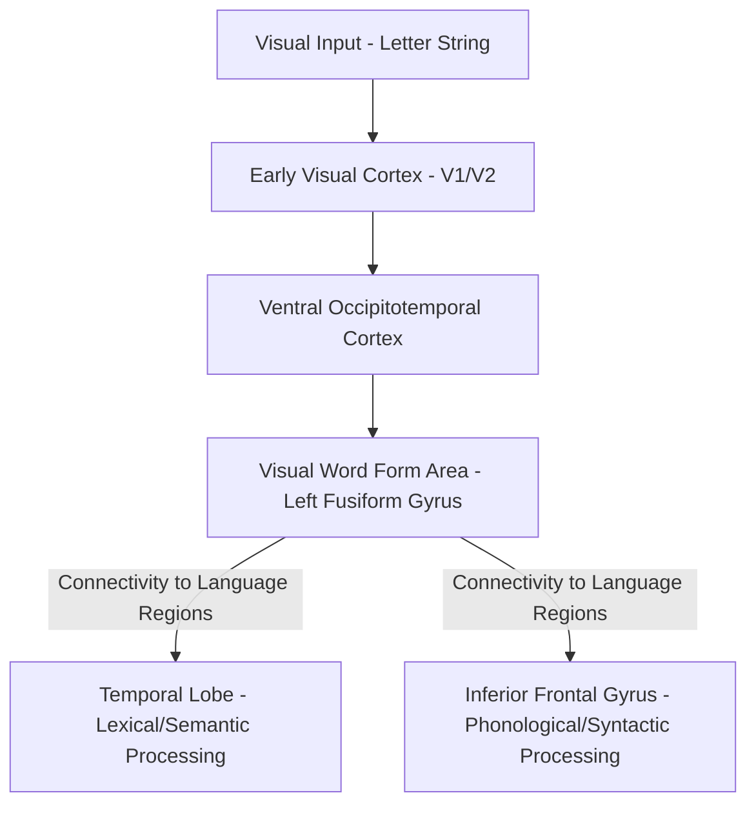

## Reading and the Visual Word Form Area

### Overview

Reading is a uniquely recent cultural invention (dating back only a few thousand years) relative to the evolutionary timescale of spoken language, meaning the brain cannot have evolved dedicated, innate neural circuitry specifically for reading. Instead, the acquisition of literacy is understood to depend on the cultural "recycling" of pre-existing visual and language-processing neural circuitry — most notably a specific region of the left ventral occipitotemporal cortex termed the **visual word form area (VWFA)** — to support the novel task of mapping visual letter strings onto linguistic representations.

### The Visual Word Form Area: Location and Basic Properties

- Located in the left **fusiform gyrus**, within the ventral occipitotemporal cortex, at a highly reproducible anatomical location across individuals and across different writing systems (alphabetic, syllabic, and logographic), typically situated just lateral to and partly overlapping regions involved in general object and face recognition.
- Functionally defined (via fMRI) by its selective, reliably greater activation to visually presented written words and letter strings compared to other categories of visual stimuli (e.g., faces, objects, textures, or scrambled/false-font control stimuli of matched visual complexity).
- Exhibits a degree of **abstraction and invariance**: VWFA activation generalizes across changes in letter case (e.g., responding similarly to "WORD" and "word"), font, and retinal location, consistent with its proposed role in extracting an abstract, position- and format-invariant orthographic representation rather than merely responding to low-level visual features.
- [Inference] The degree of true position and format invariance, and the precise computational nature of the "abstract" representation the VWFA computes, remains a topic of ongoing refinement; some researchers emphasize a more graded, hierarchically organized selectivity (increasing abstraction moving posterior to anterior within the region) rather than a single, uniformly invariant response.

### The Neuronal Recycling Hypothesis

- Proposed most prominently by Stanislas Dehaene and colleagues, the neuronal recycling hypothesis holds that literacy acquisition does not create an entirely novel brain region, but rather partially repurposes cortical territory that, in illiterate or pre-literate individuals, is engaged in high-resolution visual shape discrimination — particularly discrimination of complex, high-spatial-frequency visual forms relevant to naturally occurring visual categories.
- This hypothesis is supported by comparative studies showing that individuals who become literate later in life (or who never learn to read) show reduced or absent VWFA-like selectivity in this cortical region, and that the degree of literacy (e.g., years of reading experience) correlates with the strength and specificity of the region's word-selective response.
- Because the VWFA emerges through a process of learned specialization competing with other visual functions for the same cortical territory, some studies have reported subtle changes in the response properties of adjacent face- or object-selective regions as a function of literacy acquisition, consistent with a genuine competitive "recycling" process rather than the VWFA simply developing in an entirely separate, unused cortical location.

### Connectivity: Linking Vision to Language

- The functional specialization of the VWFA for written word recognition is proposed to arise substantially from its anatomical connectivity with downstream language-processing regions, particularly spoken language areas in the temporal and inferior frontal cortex, rather than being an intrinsic property of the region's local visual processing capacity alone.
- [Inference] Some researchers propose that the VWFA's location is partly predetermined even prior to literacy acquisition by pre-existing anatomical connectivity biases (connections to language-relevant regions already present in pre-literate individuals), which would help explain the region's highly consistent anatomical location across individuals and writing systems; this connectivity-based predisposition account is an influential but not yet fully settled explanation, with some studies presenting competing or more nuanced evidence regarding the degree to which pre-literate connectivity fully predicts the eventual location of VWFA specialization.

### The Dual-Route Model of Reading

A well-established cognitive model of the reading process proposes two complementary routes for converting written text into spoken/phonological output:

**Lexical (Direct) Route**

- Whole-word visual forms are matched directly against a stored mental lexicon of known word forms, retrieving pronunciation and meaning without needing to sound out individual letter-sound correspondences.
- Necessary for correctly reading **irregular/exception words** (e.g., "yacht," "colonel") whose pronunciation cannot be derived from standard letter-sound correspondence rules.

**Sublexical (Indirect/Phonological) Route**

- Applies learned grapheme-to-phoneme conversion rules to sound out unfamiliar letter strings, piece by piece.
- Necessary for correctly reading **novel words or pseudowords** (e.g., "blicket") that have no existing entry in the mental lexicon and thus cannot be retrieved via the lexical route.

This dual-route architecture is supported by dissociable patterns of acquired reading impairment (acquired dyslexia) following brain damage:

- **Surface dyslexia**: selective impairment of the lexical route, producing difficulty reading irregular words (which are often regularized, e.g., "yacht" read as "yatched") with relatively preserved ability to read regular words and pronounceable pseudowords via the sublexical route.
- **Phonological dyslexia**: selective impairment of the sublexical route, producing particular difficulty reading unfamiliar words and pseudowords, with relatively preserved ability to read familiar real words (regular or irregular) via the lexical route.

### Developmental Dyslexia

- Developmental dyslexia is a specific, heritable learning difficulty characterized by significant difficulty in acquiring accurate and/or fluent word reading skills, occurring despite adequate intelligence, educational opportunity, and sensory function.
- The dominant neurocognitive account, the **phonological deficit hypothesis**, proposes that the core underlying impairment is in phonological processing — specifically, difficulty representing, storing, and manipulating the sound structure of spoken language (e.g., impaired phonological awareness, such as identifying or manipulating individual phonemes within spoken words) — which in turn impairs the ability to learn and apply grapheme-to-phoneme correspondence rules central to the sublexical reading route.
- Neuroimaging studies of developmental dyslexia commonly report reduced activation in left temporo-parietal and occipitotemporal (VWFA) regions during reading tasks, along with some evidence of compensatory over-recruitment of right-hemisphere and frontal regions.
- [Inference] While the phonological deficit hypothesis remains the most widely supported and evidenced account of developmental dyslexia, it is not universally regarded as a complete explanation for all cases; alternative or complementary theories (e.g., accounts emphasizing more general auditory/temporal processing deficits, or visual attention/magnocellular pathway differences) have also been proposed and continue to be investigated, and there is likely meaningful heterogeneity in underlying mechanisms across individuals diagnosed with dyslexia.

### Reading Across Writing Systems

- Comparative studies across alphabetic (e.g., English, Italian), syllabic, and logographic (e.g., Chinese) writing systems reveal both a highly consistent VWFA location and some degree of system-dependent variation in the relative engagement of additional processing routes — for example, logographic reading (in which written characters map more directly onto whole-word meaning, with less systematic sublexical grapheme-phoneme correspondence) is associated with somewhat greater relative reliance on additional visual-spatial and motor (character production/writing-related) processing regions in some studies.
- [Inference] The degree to which reading in logographic systems fundamentally differs in its cognitive/neural architecture from alphabetic reading, versus reflecting variations on the same underlying dual-route-like architecture, remains a topic of ongoing comparative cross-linguistic research rather than a fully settled matter.

### Key Points

- The visual word form area, located in the left fusiform gyrus, is a functionally consistent, literacy-dependent region showing selective, format-invariant responses to written words, best explained by the neuronal recycling hypothesis (cultural repurposing of pre-existing visual shape-discrimination circuitry).
- VWFA specialization depends substantially on connectivity with downstream spoken-language processing regions in temporal and frontal cortex, linking visual orthographic processing to the broader language network.
- The dual-route model of reading (lexical route for familiar/irregular words, sublexical route for novel words/pseudowords) is supported by the double dissociation between surface dyslexia and phonological dyslexia following acquired brain damage.
- Developmental dyslexia is most commonly attributed to a core phonological processing deficit impairing sublexical grapheme-to-phoneme learning, though some heterogeneity in underlying mechanisms across individuals is likely.

### Related Topics

- The dual stream model of spoken language processing
- Phonological awareness and its role in reading acquisition
- Acquired dyslexia subtypes (surface, phonological, deep dyslexia)
- Neuronal recycling and cultural learning more broadly (e.g., numerical cognition)
- Cross-linguistic and cross-orthographic comparative reading research
- Educational interventions for developmental dyslexia
- Ventral visual stream object and face recognition circuitry