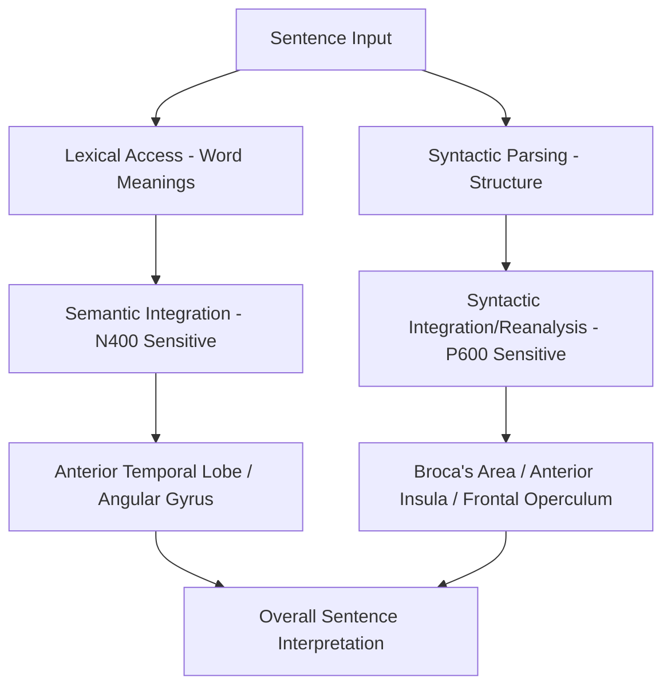

## Syntax and Semantic Processing

### Overview

Sentence comprehension requires the integration of two partially dissociable computational processes: **syntactic processing** (parsing the grammatical structure relating words to one another) and **semantic processing** (composing individual word meanings into a coherent overall interpretation). While these processes operate in close temporal and functional coordination during normal comprehension, neuropsychological, electrophysiological, and neuroimaging evidence together support their partial neural and computational dissociability.

### Syntactic Processing

**Core Function**

- Syntax specifies the grammatical relationships among words in a sentence — word order, agreement (e.g., subject-verb number agreement), hierarchical phrase structure, and dependency relationships (e.g., between a moved element and its original grammatical position, as in questions or relative clauses) — which together determine "who did what to whom" independent of word meaning alone.
- Syntactic processing is required even when semantic/plausibility cues are absent or misleading, as demonstrated by grammatically well-formed but semantically nonsensical sentences (e.g., Chomsky's famous example "colorless green ideas sleep furiously"), which are recognized as syntactically valid despite conveying no coherent meaning.

**Neural Substrates**

- **Broca's area (left inferior frontal gyrus, particularly pars opercularis, Brodmann area 44)** and adjacent **anterior insula** and **deep frontal operculum** are among the most consistently implicated regions for syntactic/combinatorial processing, particularly for sentences involving greater syntactic complexity (e.g., center-embedded relative clauses, long-distance dependencies).
- The **anterior temporal lobe** has also been implicated in aspects of basic combinatorial (phrase-structure-building) processing, based on evidence that even minimal two-word phrases (e.g., "red boat" versus an unrelated word list "cup boat") elicit greater activation in this region.
- Some evidence associates specific white matter tracts, notably a dorsal pathway connecting posterior temporal and inferior frontal regions, with syntactic processing specifically, complementing the ventral pathway more associated with semantic composition (see below).

**Evidence from Agrammatism**

- **Agrammatism**, a hallmark feature of Broca's aphasia, involves reduced and often omitted use of grammatical function words (e.g., articles, prepositions, auxiliary verbs) and bound grammatical morphemes (e.g., verb tense/agreement inflections), alongside simplified sentence structure.
- Comprehension studies in agrammatic patients reveal a related but dissociable deficit: difficulty comprehending sentences that require reliance on syntactic structure alone to determine meaning (e.g., certain passive or object-relative constructions, where word order/case alone does not reliably signal thematic roles), while comprehension of sentences where semantic plausibility alone can determine the correct interpretation (e.g., "the apple that the boy ate" — only the boy can plausibly eat) remains relatively preserved, since such patients can rely on semantic/pragmatic cues to compensate for reduced syntactic parsing ability.

### Semantic Processing

**Core Function**

- Semantic processing involves accessing and integrating the meanings of individual words (lexical semantics) and combining them according to syntactic structure into a coherent overall sentence-level interpretation (compositional semantics), while also drawing on real-world/pragmatic knowledge to resolve ambiguity and establish plausibility.

**Neural Substrates**

- The **anterior temporal lobe (ATL)**, particularly the temporal pole, is proposed as a transmodal semantic "hub" integrating distributed conceptual features into unified concept representations, consistent with the broader hub-and-spoke model of semantic cognition and with evidence from semantic dementia (progressive ATL atrophy producing progressive semantic knowledge degradation).
- The **angular gyrus** (inferior parietal lobule) has also been implicated in semantic integration, particularly in binding individual concepts into larger event/thematic representations and in retrieving semantic associations, though [Inference] its precise computational contribution relative to the ATL semantic hub remains a topic of active theoretical debate, with some models emphasizing complementary rather than redundant roles for the two regions.
- The **ventral stream** more broadly (as described in the dual stream model), extending from posterior/middle temporal regions anteriorly toward the temporal pole, is implicated in the overall "sound-to-meaning" mapping process supporting semantic access during comprehension.

### Electrophysiological Dissociation: N400 and P600

Event-related potential (ERP) studies provide some of the clearest temporal evidence for the dissociability of semantic and syntactic processing during real-time sentence comprehension:

- **N400**: a negative-going ERP component peaking approximately 400 ms after a word's onset, whose amplitude is modulated by the degree of **semantic unexpectedness or implausibility** of that word within its preceding context (e.g., "I take my coffee with cream and *socks*" elicits a larger N400 than "...with cream and *sugar*"). The N400 is interpreted as reflecting the ease or difficulty of semantic integration/retrieval.
- **P600**: a positive-going ERP component peaking approximately 600 ms after onset, whose amplitude is modulated by **syntactic anomalies or violations** (e.g., subject-verb agreement errors, garden-path sentence reanalysis) as well as syntactic complexity/reanalysis demands more generally. The P600 is interpreted as reflecting syntactic reanalysis, repair, or integration difficulty.
- The differential sensitivity of these two components — N400 to semantic/lexical factors, P600 to syntactic/structural factors — provides a well-replicated, temporally precise electrophysiological dissociation supporting the broader claim that semantic and syntactic processing, while normally tightly coupled, are computationally and at least partially neurally distinguishable processes.

### Interaction Between Syntax and Semantics

- Although dissociable in the ways described above, syntax and semantics interact extensively and continuously during real-time comprehension: semantic/plausibility information can be used to guide syntactic parsing decisions in ambiguous sentences (as in classic **garden-path sentences**, e.g., "The horse raced past the barn fell," where an initially preferred but ultimately incorrect syntactic parse must be revised, producing a P600-associated reanalysis cost), and syntactic structure in turn constrains which semantic composition is computed.
- [Inference] The precise architecture of this interaction — whether syntax and semantics are processed by fully independent, later-integrated systems (a modular, "syntax-first" account) versus a single, highly interactive system in which both information types are used continuously and jointly from the earliest moments of processing (an interactive/constraint-based account) — remains a long-standing and not fully resolved debate in psycholinguistics, with substantial evidence supporting extensive interactivity, though some evidence (e.g., certain patterns of very early syntactic-violation-related ERP components, such as the ELAN) has been cited in support of at least some initial syntax-first processing stages, a claim that itself remains debated regarding its replicability and interpretation.

### Neuropsychological and Clinical Correlates

- **Semantic dementia** (anterior temporal lobe atrophy) produces progressive semantic knowledge loss with relatively preserved syntactic processing and sentence structure production, consistent with the proposed ATL semantic hub role.
- **Agrammatic Broca's aphasia** produces disproportionate syntactic/grammatical impairment with relatively preserved single-word semantic knowledge, consistent with the proposed frontal/inferior-frontal role in syntactic combinatorial processing.
- This double dissociation between semantic dementia and agrammatic aphasia provides converging neuropsychological support for the partial separability of these two processing systems, complementing the electrophysiological (N400/P600) dissociation evidence.

### Key Points

- Syntactic processing (grammatical structure, word order, dependency relations) and semantic processing (word meaning integration) are partially dissociable computational and neural systems, despite their close functional interaction during normal comprehension.
- Broca's area and adjacent frontal/insular regions are most consistently implicated in syntactic/combinatorial processing, while the anterior temporal lobe (semantic hub) and angular gyrus are most associated with semantic integration.
- The N400 ERP component indexes semantic integration difficulty, while the P600 component indexes syntactic reanalysis/integration difficulty, providing a well-replicated temporal dissociation between the two processes.
- A double dissociation between semantic dementia (impaired semantics, preserved syntax) and agrammatic Broca's aphasia (impaired syntax, preserved single-word semantics) provides converging clinical evidence for partial system separability.
- The degree to which syntax and semantics are processed via modular, sequential stages versus a single, highly interactive system remains an active and not fully resolved debate in psycholinguistics.

### Related Topics

- The dual stream model of language processing
- The hub-and-spoke model of semantic cognition
- Agrammatism and Broca's aphasia
- Semantic dementia and anterior temporal lobe function
- Garden-path sentences and syntactic reanalysis
- Event-related potentials (N400, P600, ELAN) in psycholinguistic research
- Sentence comprehension models (modular vs. interactive/constraint-based accounts)