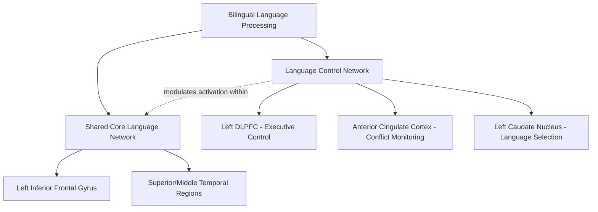

## Bilingualism and Multilingual Brain Organization

### Overview

Bilingual and multilingual language processing raises a set of questions distinct from monolingual neurolinguistics: whether multiple languages share a common neural substrate or are represented in at least partially separate systems, how the brain manages selection and control between competing languages, and whether the sustained cognitive demands of managing multiple languages produce measurable structural or functional brain changes. Research spans classical lesion-based case studies, contemporary neuroimaging, and a substantial and actively debated literature on bilingualism's broader cognitive effects.

### Key Variables Shaping Multilingual Brain Organization

Multilingual language representation is not uniform across individuals; several factors are consistently identified as influencing the degree of shared versus separate neural representation across languages:

- **Age of acquisition (AoA)**: languages acquired early in life (particularly during an early developmental window) tend to show greater overlap in neural representation with each other, while languages acquired later in life (late/sequential bilinguals) tend to show more spatially distinct, though still overlapping, patterns of activation, particularly within frontal language-control regions.
- **Proficiency level**: higher proficiency in a second language is associated with greater similarity in neural activation patterns to those observed for a highly proficient first language, with lower-proficiency second-language processing showing more extended, effortful recruitment of executive control regions.
- **Language exposure and usage patterns**: the frequency, context, and balance of use across languages (e.g., simultaneous bilinguals raised with both languages from birth versus sequential bilinguals who acquired a second language after establishing the first) further modulate the degree of shared representation.

[Inference] These three factors (age of acquisition, proficiency, and usage patterns) are the most consistently replicated and influential variables in the literature, though they are also substantially correlated with one another in naturally occurring bilingual populations (e.g., early acquisition often co-occurs with higher eventual proficiency), which complicates fully isolating each variable's independent contribution in observational neuroimaging studies.

### Shared vs. Separate Language Representation

- Classical lesion-based case studies (dating back to 19th- and early 20th-century neurology) reported cases of **differential aphasic recovery** across languages following brain damage in polyglot patients — for example, a patient recovering their native language before a later-acquired second language, or vice versa — which was historically interpreted as evidence for at least partially separable neural substrates for different languages.
- Contemporary neuroimaging generally supports a model of **substantial overlap with some degree of language-specific modulation**, rather than either fully shared or fully separate systems: the same core classical language network (left inferior frontal gyrus, superior/middle temporal regions) is engaged across a bilingual's languages, but the precise degree, laterality, and extent of activation can differ measurably as a function of the AoA/proficiency/exposure factors described above.
- [Inference] The historical "separate systems" interpretation of differential aphasic recovery patterns has been substantially reframed in light of modern neuroimaging evidence toward a more nuanced account emphasizing a largely shared network with graded, experience-dependent modulation, though isolated case reports of markedly differential aphasic language recovery continue to be documented and remain a genuinely useful, if now more cautiously interpreted, source of evidence.

### Language Control and Executive Function

A central additional component of the multilingual brain, not present in monolingual language processing, is the need for ongoing **language selection and control**: the ability to activate the currently intended language while suppressing interference from the non-target language(s), and to switch between languages as communicative context demands.

**Neural Substrates of Language Control**

- **Left dorsolateral prefrontal cortex (DLPFC)**: implicated in general executive control processes recruited during language selection and switching, consistent with its broader domain-general role in cognitive control.
- **Anterior cingulate cortex (ACC)**: implicated in conflict monitoring, particularly during language-switching tasks where competing lexical representations from the non-target language must be suppressed.
- **Left caudate nucleus (basal ganglia)**: implicated specifically in language selection based on case-study and neuroimaging evidence; some case reports describe transient pathological language switching or mixing (involuntary intrusion of a non-intended language) following caudate damage in bilingual patients, suggesting a role in selecting the currently appropriate language for output.
- **Supramarginal gyrus and pre-supplementary motor area**: implicated in some studies of language switching, though [Inference] the precise functional contribution of these regions relative to the more consistently replicated DLPFC/ACC/caudate network is less firmly established and continues to be refined across studies.

### The Bilingual Advantage Hypothesis and Its Contested Status

- An influential line of research proposed that the sustained, lifelong practice of managing two competing language systems produces domain-general enhancements in executive function, particularly in tasks requiring inhibitory control and cognitive flexibility/task-switching (the **bilingual advantage hypothesis**), based on studies reporting bilingual performance advantages on non-linguistic executive function tasks (e.g., the Simon task, flanker task) relative to matched monolingual controls.
- This hypothesis has become substantially **contested** in more recent years: several large-scale studies and meta-analyses have failed to replicate a robust or consistent bilingual advantage effect, and methodological critiques have raised concerns about publication bias (a tendency for positive findings to be more readily published), inadequate control of socioeconomic and demographic confounds between bilingual and monolingual samples in some earlier studies, and considerable heterogeneity in tasks and populations studied across the literature.
- [Inference] The current state of this literature is genuinely unsettled and actively debated rather than resolved in either direction; a reasonable summary is that if a bilingual executive function advantage exists, it is likely smaller, more context-dependent (e.g., possibly more evident under specific task demands or in specific populations), and less universally robust than earlier, highly publicized findings suggested, though this remains a matter of ongoing empirical and methodological dispute rather than settled scientific consensus.

### Bilingualism and Cognitive Reserve in Aging

- A separate, partially related line of research has examined whether lifelong bilingualism is associated with a later age of onset of clinical dementia symptoms, framed within the broader concept of **cognitive reserve** (the proposed capacity of some brains to sustain a greater degree of underlying neuropathology before manifesting clinical cognitive impairment, potentially through more efficient or flexible use of existing neural networks).
- Some retrospective clinical studies have reported that bilingual dementia patients show symptom onset several years later, on average, than comparable monolingual patients with similar levels of underlying neuropathology at autopsy or via biomarker assessment.
- [Inference] As with the bilingual advantage hypothesis in younger populations, this literature also faces significant methodological challenges (e.g., difficulty fully controlling for confounding variables such as immigration status, socioeconomic factors, and differential healthcare access across the bilingual and monolingual comparison groups in many retrospective clinical samples), and while the cognitive reserve hypothesis for bilingualism remains an active and plausible area of research, it should not be regarded as a definitively established causal protective effect based on current evidence.

### Structural Brain Differences Associated with Bilingualism

- Some neuroimaging studies report structural differences associated with bilingual experience, including increased gray matter density in the left inferior parietal cortex and increased white matter integrity in tracts connecting frontal and temporal language-relevant regions, proposed to reflect experience-dependent neuroplasticity from sustained dual-language use and control demands.
- [Inference] As with the functional/behavioral bilingual advantage literature, these structural findings, while biologically plausible and consistent with general principles of experience-dependent neuroplasticity demonstrated in other domains (e.g., structural changes associated with musical training), have not been uniformly replicated across all studies and samples, and effect sizes and specific regions implicated vary across the literature.

### Key Points

- Multilingual language representation involves substantial overlap with the classical monolingual language network, modulated in degree and extent by age of acquisition, proficiency, and language exposure/usage patterns.
- A dedicated language control network — including left DLPFC, anterior cingulate cortex, and left caudate nucleus — supports language selection and switching, a demand not present in monolingual processing.
- The bilingual advantage hypothesis for domain-general executive function has become substantially contested in recent years, with mixed replication and significant methodological critique of the earlier supporting literature.
- Bilingualism has been proposed to confer a degree of cognitive reserve delaying dementia symptom onset, though this literature likewise faces meaningful methodological challenges and remains an active rather than settled research area.

### Related Topics

- The classical language areas and dual stream model
- Executive function and cognitive control networks (DLPFC, ACC)
- Basal ganglia contributions to language selection
- Cognitive reserve theory and its application to other risk/protective factors in dementia
- Critical periods and age of acquisition effects in language learning
- Aphasia recovery patterns in polyglot patients
- Experience-dependent neuroplasticity (comparative examples: musical training, spatial navigation expertise)