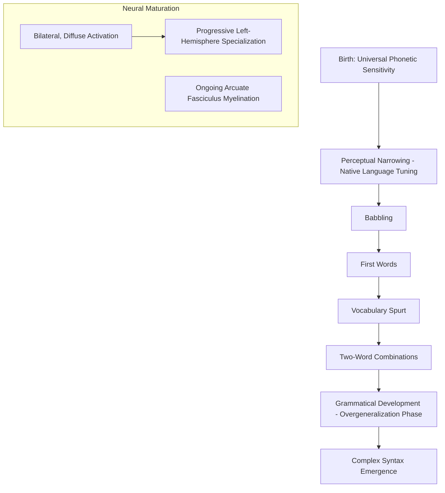

## Language Acquisition and Development

### Overview

Language acquisition refers to the process by which children (and, to a more limited and debated degree, adults) develop the capacity to comprehend and produce language, proceeding through a remarkably consistent developmental sequence across typologically diverse languages and cultures despite considerable variation in the quantity and quality of linguistic input children receive. This consistency has motivated long-standing theoretical debate regarding the relative contributions of innate biological predispositions versus general-purpose statistical learning mechanisms, alongside a substantial body of research characterizing the neural maturation underlying this developmental trajectory.

### Theoretical Frameworks

**Nativist Accounts**

- Associated principally with Noam Chomsky, nativist theory proposes that children are born with an innate, domain-specific **language acquisition device (LAD)** or **universal grammar (UG)** — an innate set of grammatical principles and parameters shared across all human languages, which substantially constrains and accelerates the language-learning process.
- Central motivating evidence is the **poverty of the stimulus** argument: children acquire complex grammatical knowledge (e.g., correctly forming structure-dependent syntactic rules) that, nativist theorists argue, could not be reliably induced from the finite, often noisy and imperfect linguistic input children actually receive, without some innate grammatical scaffolding constraining the space of possible grammatical hypotheses a child would otherwise need to consider.

**Usage-Based / Statistical Learning Accounts**

- Associated with researchers such as Michael Tomasello and connectionist/statistical learning theorists, this framework proposes that language acquisition can be substantially explained by powerful, domain-general statistical learning and pattern-extraction mechanisms operating over the child's actual linguistic input, without requiring a dedicated, language-specific innate grammatical module.
- Supported by evidence that infants show remarkable sensitivity to statistical regularities in linguistic input from a very young age (e.g., classic **statistical word segmentation** studies showing that infants can use transitional probabilities between syllables to identify word boundaries in a continuous, unsegmented artificial speech stream after only brief exposure), suggesting powerful general-purpose learning mechanisms are available and plausibly sufficient for substantial aspects of language learning.

[Inference] This nativist-versus-usage-based debate remains genuinely unresolved as a strict either/or dichotomy in the field; most contemporary researchers adopt some form of intermediate or hybrid position, acknowledging both the remarkable power of statistical/associative learning mechanisms demonstrated in infant studies and the continued theoretical appeal of some degree of innate structural biases or constraints, though the precise balance and nature of any such innate contribution remains actively debated rather than settled.

### Developmental Milestones and Sequence

| Approximate Age | Milestone |
| --- | --- |
| Birth–6 months | Perception of full range of phonetic contrasts across world's languages; gradual perceptual narrowing toward native-language phonetic categories begins |
| ~6–12 months | Babbling (canonical, reduplicated syllable production, e.g., "bababa"); further perceptual narrowing to native phonology |
| ~12 months | First words emerge |
| ~18 months | Vocabulary spurt; substantial acceleration in rate of new word learning |
| ~18–24 months | Two-word combinations begin ("telegraphic speech") |
| ~2–4 years | Rapid grammatical development; overgeneralization errors common (e.g., "goed" instead of "went," reflecting overapplication of a learned regular past-tense rule) |
| ~4–6 years | Increasingly complex syntax (e.g., relative clauses, passive constructions) refined; core grammatical competence largely established |
| School age onward | Continued vocabulary growth, refinement of pragmatic/discourse-level language use, and literacy-related language skills |

[Inference] These age ranges represent commonly cited approximate averages drawn from typical developmental research; considerable normal individual variation exists in the precise timing of each milestone, and these figures should not be interpreted as rigid diagnostic cutoffs for any individual child.

### Perceptual Narrowing: A Key Early Phenomenon

- Young infants (younger than approximately 6–8 months) show a remarkable, cross-linguistically general capacity to perceptually discriminate phonetic contrasts from any of the world's languages, including contrasts not present in the language(s) spoken in their own environment.
- Through the latter half of the first year, infants undergo **perceptual narrowing**: discrimination sensitivity for non-native phonetic contrasts declines, while sensitivity to native-language phonetic contrasts is maintained or enhanced — a process interpreted as reflecting experience-driven tuning of the perceptual system specifically to the statistical distribution of speech sounds present in the infant's native-language input.
- This phenomenon is frequently cited as an early example of experience-dependent neural specialization occurring well before the onset of productive speech, and is thought to be substantially, though not necessarily entirely, based on the accumulation of native-language-specific statistical distributional learning.

### Neural Maturation Underlying Language Development

- Early language processing in infancy is associated with more bilaterally distributed and less strongly left-lateralized cortical activation compared to the strongly left-lateralized pattern typical of the mature adult language network, with progressive left-hemisphere specialization/lateralization emerging over the course of early childhood development.
- Structural maturation of key white matter language pathways, including the **arcuate fasciculus** and other components of the dorsal and ventral language streams, continues substantially throughout childhood, with increasing myelination and structural connectivity correlating with improving language processing speed and grammatical complexity over this developmental period.
- [Inference] The precise causal relationship between this ongoing structural white matter maturation and specific behavioral/grammatical developmental milestones is supported by correlational longitudinal neuroimaging evidence, though establishing definitive causal directionality (versus, for example, language experience itself partly driving the observed structural maturation) remains methodologically challenging in human developmental research.

### The Critical/Sensitive Period Hypothesis

- The critical period hypothesis, most prominently associated with Eric Lenneberg, proposes that there exists a biologically constrained developmental window (often proposed to extend from early childhood through puberty) during which language acquisition proceeds with characteristic speed and native-like ultimate proficiency, and beyond which language acquisition becomes measurably more effortful and less likely to reach fully native-like competence, particularly for phonological/accent-related and certain fine-grained grammatical aspects of language.
- Supporting evidence includes case studies of severely linguistically deprived children (e.g., cases of extreme social isolation resulting in absent early language exposure), who, when finally exposed to language after the proposed critical period, typically show substantially impaired ultimate grammatical attainment despite otherwise showing meaningful vocabulary and communicative development — though [Inference] such extremely rare deprivation cases inevitably confound linguistic deprivation with severe co-occurring social, emotional, and general cognitive deprivation, substantially complicating any strong causal inference specifically about a linguistic critical period from these particular cases alone.
- More systematic evidence comes from studies of second-language acquisition age effects, generally showing a continuous, graded decline in ultimate second-language grammatical and phonological attainment as age of first exposure increases, rather than a single sharp cutoff — leading many contemporary researchers to prefer the term **sensitive period** (implying a gradually declining, rather than an abruptly closing, window of heightened plasticity) over the stronger, more discrete "critical period" terminology.
- [Inference] Whether there is a single unified sensitive period for language as a whole, versus multiple distinct sensitive periods for different specific components of language (e.g., phonology showing earlier closing sensitivity than syntax, which in turn may show earlier closing sensitivity than vocabulary), remains an actively investigated question, with some evidence favoring the latter, more differentiated view.

### Language Acquisition in Atypical Development

- **Specific language impairment (SLI)**, also increasingly termed **developmental language disorder (DLD)** in more recent clinical/research terminology, describes children showing significant, persistent difficulty acquiring language despite otherwise typical nonverbal intelligence, hearing, and absence of other identified neurological or developmental conditions, providing a valuable population for studying the specificity of language-learning mechanisms relative to broader general cognitive development.
- Genetic studies, most notably of the extended "KE family" (a multigenerational family with a substantial proportion of members affected by a severe speech and language disorder), identified a mutation in the **FOXP2** gene as causally associated with their disorder, providing an influential, though [Inference] importantly not fully generalizable, single-gene example of a genetic contribution to speech/language development; FOXP2 is now understood to be one contributing factor among a broader, more polygenic and heterogeneous genetic architecture underlying the wider population of children with developmental language disorder, rather than "the" single gene responsible for language in general.
- **Autism spectrum disorder** is frequently associated with heterogeneous patterns of language development, ranging from significant early language delay to relatively typical structural language development accompanied by more specific pragmatic/social-communicative language difficulties, reflecting the broader heterogeneity of autism spectrum presentations.

### Key Points

- Language acquisition proceeds through a remarkably consistent developmental sequence (babbling, first words, vocabulary spurt, two-word combinations, grammatical development) across diverse languages and cultures, motivating long-standing nativist-versus-usage-based theoretical debate that remains only partially resolved.
- Perceptual narrowing in infancy reflects early, experience-driven tuning of speech perception toward native-language phonetic categories, well before productive language onset.
- Progressive left-hemisphere specialization and ongoing structural white matter maturation (e.g., arcuate fasciculus development) parallel the behavioral developmental trajectory of language acquisition.
- The critical/sensitive period hypothesis proposes a biologically constrained window of heightened language-learning capacity; contemporary evidence favors a gradual, graded "sensitive period" framing over a single, sharply closing "critical period."
- Developmental language disorder (specific language impairment) and genetic findings such as FOXP2 mutations in the KE family illustrate both the biological/genetic contributions to language development and the broader heterogeneity of atypical language development across different clinical populations.

### Related Topics

- Universal grammar and the poverty of the stimulus argument
- Statistical learning and infant speech segmentation
- The classical language areas and dual stream model
- Bilingualism and age-of-acquisition effects
- FOXP2 and the genetics of speech and language disorders
- Autism spectrum disorder and language/communication heterogeneity
- Second-language acquisition and adult language learning research