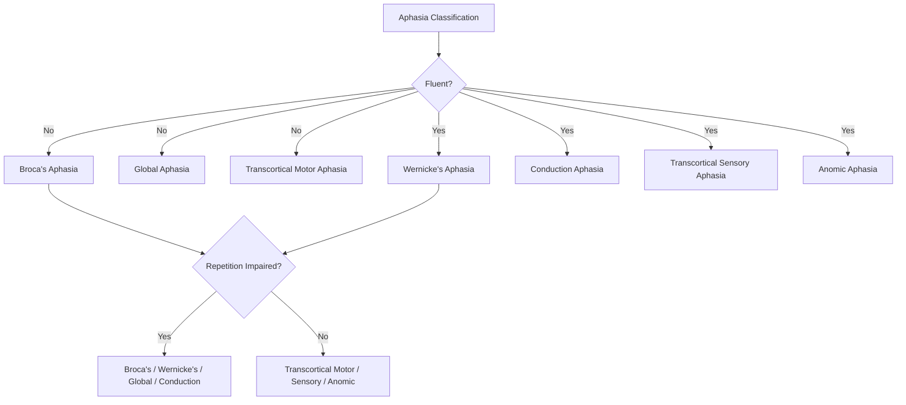

## Aphasia and Language Disorders

### Definition and Scope

Aphasia is an acquired language impairment resulting from brain damage, affecting the production and/or comprehension of spoken and/or written language, occurring in the absence of a more general disorder of intellect, sensory perception, or motor speech execution (which are separately classified conditions, discussed below in the differential diagnosis section). Aphasia is most commonly caused by stroke affecting the left cerebral hemisphere (the hemisphere dominant for language in the substantial majority of individuals), but can also result from traumatic brain injury, tumors, infections (e.g., herpes simplex encephalitis), and neurodegenerative disease.

### Classical Aphasia Syndrome Classification

The classical (Boston) taxonomy of aphasia syndromes, building on the Wernicke-Lichtheim-Geschwind connectionist model, organizes syndromes along dimensions of fluency, comprehension, and repetition ability:

| Syndrome | Fluency | Comprehension | Repetition | Classic Lesion Site |
| --- | --- | --- | --- | --- |
| Broca's aphasia | Non-fluent | Relatively preserved | Impaired | Posterior inferior frontal gyrus |
| Wernicke's aphasia | Fluent | Impaired | Impaired | Posterior superior temporal gyrus |
| Conduction aphasia | Fluent | Relatively preserved | Disproportionately impaired | Arcuate fasciculus / Spt region |
| Global aphasia | Non-fluent | Impaired | Impaired | Extensive perisylvian damage |
| Transcortical motor aphasia | Non-fluent | Relatively preserved | Relatively preserved | Anterior/superior to Broca's area |
| Transcortical sensory aphasia | Fluent | Impaired | Relatively preserved | Posterior/inferior to Wernicke's area |
| Anomic aphasia | Fluent | Relatively preserved | Relatively preserved | Variable; often angular gyrus/temporal-parietal |

**Broca's Aphasia (Non-Fluent)**

- Effortful, halting, agrammatic speech production with reduced use of grammatical function words and inflectional morphology; relatively preserved single-word comprehension, though comprehension of syntactically complex sentences reliant on grammatical structure alone is often also impaired.
- Frequently accompanied by right-sided weakness (hemiparesis), consistent with the proximity of Broca's area to primary motor cortex representing the face and arm.

**Wernicke's Aphasia (Fluent)**

- Fluent, grammatically well-formed but often semantically empty, circumlocutory, or nonsensical speech, sometimes including paraphasias (word/sound substitutions) and neologisms (invented non-words); severely impaired auditory comprehension.
- Patients frequently show limited awareness of their own comprehension deficit and the resulting incoherence of their speech (anosognosia for language deficit).

**Conduction Aphasia**

- Disproportionately impaired verbatim repetition of spoken language, despite relatively preserved comprehension and relatively fluent (though often paraphasic) spontaneous speech; reinterpreted under the dual stream model as reflecting disruption of dorsal stream sensorimotor integration (implicating the Sylvian parietal-temporal region) rather than simple damage to a single connecting "wire."

**Global Aphasia**

- Severe impairment across all major language domains (production, comprehension, repetition), typically resulting from extensive damage to the perisylvian language network, often following large middle cerebral artery territory strokes.

**Transcortical Aphasias**

- Distinguished from Broca's, Wernicke's, and conduction aphasia by relatively preserved repetition ability despite significant production (transcortical motor) or comprehension (transcortical sensory) impairment, attributed to damage occurring outside the core perisylvian language zone (and its direct arcuate fasciculus connection) while sparing this core circuit itself — an important dissociation supporting the classical model's proposed architecture.

**Anomic Aphasia**

- Characterized primarily by word-finding difficulty (anomia) — difficulty retrieving specific words, particularly nouns, despite otherwise relatively fluent and grammatically well-formed speech, relatively preserved comprehension, and relatively preserved repetition; often regarded as a comparatively mild aphasia syndrome or as a common residual/recovering stage following a more severe initial aphasia.

[Inference] While this classical taxonomy remains widely used clinically and pedagogically for its descriptive and communicative value, modern MRI-based lesion-symptom mapping studies have shown that individual patients frequently present with mixed or atypical profiles not cleanly matching a single "textbook" syndrome, and that lesion locations producing the most severe, chronic forms of each syndrome are often more extensive than the single named classical eponymous region alone.

### Primary Progressive Aphasia (PPA)

Distinct from the acute-onset, typically vascular aphasias described above, primary progressive aphasia describes a group of neurodegenerative conditions in which progressive language impairment is the initial and, for a period, predominant clinical feature, generally associated with underlying frontotemporal lobar degeneration or, in some subtypes, Alzheimer's disease pathology.

- **Semantic variant PPA (svPPA)**: progressive loss of semantic/conceptual knowledge (word meaning, object knowledge), associated with anterior temporal lobe atrophy; corresponds closely to what is more traditionally termed semantic dementia.
- **Nonfluent/agrammatic variant PPA (nfvPPA)**: progressive effortful, agrammatic speech production and/or apraxia of speech, associated with left inferior frontal/insular atrophy.
- **Logopenic variant PPA (lvPPA)**: progressive word-finding difficulty and impaired sentence repetition, with relatively preserved grammar and single-word comprehension, associated with left temporo-parietal atrophy and, notably, more frequently linked to underlying Alzheimer's disease pathology than the other two PPA variants.

[Inference] The three-variant PPA classification system is well-established in the current clinical/research literature, though it should be noted that some individual patients present with mixed features not perfectly matching a single variant, and ongoing research continues to refine the correspondence between clinical variant, underlying neuropathology, and genetic risk factors.

### Differential Diagnosis: Distinguishing Aphasia from Related Disorders

- **Dysarthria**: an impairment of the motor execution of speech (articulation, respiration, phonation, resonance) resulting from weakness, incoordination, or paralysis of the speech musculature, without any underlying impairment of language knowledge or formulation itself; distinct from aphasia, which involves impaired linguistic representation/processing rather than impaired motor execution of otherwise correctly formulated language.
- **Apraxia of speech**: an impairment in the motor planning and programming of the sequences of movements required for speech articulation, in the absence of muscle weakness, distinguishing it from dysarthria; may co-occur with aphasia (particularly Broca's aphasia and nfvPPA) but is conceptually and often anatomically distinguishable from the core linguistic impairment of aphasia itself.
- **Cognitive-communication disorder**: language-related difficulties (e.g., in discourse organization, pragmatic language use) arising secondary to a broader underlying cognitive impairment (e.g., attention, memory) rather than from a primary, focal impairment of core language processing itself, as seen for example following diffuse traumatic brain injury or in some dementia syndromes.

### Recovery and Rehabilitation

- Aphasia recovery following acute injury (e.g., stroke) typically follows a pattern of most rapid improvement within the first several weeks to months post-onset (attributed partly to resolution of acute processes such as edema and diaschisis — the temporary functional disruption of regions distant from but connected to the primary lesion site), followed by more gradual, longer-term improvement that can continue, to varying degrees, for years in many patients.
- **Speech-language therapy** approaches include impairment-based approaches targeting specific linguistic deficits (e.g., naming therapy for anomia, sentence-production treatments for agrammatism) and more functional/communicative approaches emphasizing compensatory strategies and overall communicative effectiveness in daily life.
- **Melodic Intonation Therapy**, which leverages relatively preserved right-hemisphere melodic/prosodic processing capacities to facilitate speech production in some patients with severe non-fluent aphasia (typically requiring at least some degree of preserved right-hemisphere and residual left-hemisphere structural integrity), is a well-known example of a therapy approach explicitly informed by neuroscientific models of hemispheric specialization.
- [Inference] While there is reasonably good evidence supporting the general effectiveness of speech-language therapy for aphasia recovery, the relative efficacy of specific competing treatment approaches for specific aphasia subtypes and lesion profiles remains an active area of clinical research, and individual patient recovery trajectories can vary considerably based on lesion size/location, age, time since onset, and other factors.

### Key Points

- Aphasia is an acquired language impairment from brain damage, classically categorized via a fluency/comprehension/repetition framework into syndromes including Broca's, Wernicke's, conduction, global, transcortical, and anomic aphasia.
- Modern lesion-mapping evidence shows that classical syndrome-to-lesion correspondences are useful clinical approximations rather than strict, universally reliable localizations, with considerable individual variability in presentation.
- Primary progressive aphasia is a distinct, neurodegenerative category (semantic, nonfluent/agrammatic, and logopenic variants) distinguished from acute vascular aphasia by its gradual, progressive onset and characteristic underlying neuropathological associations.
- Aphasia must be differentially distinguished from dysarthria (motor execution impairment), apraxia of speech (motor planning impairment), and broader cognitive-communication disorders, each reflecting distinct underlying mechanisms despite sometimes overlapping clinical presentations.
- Aphasia recovery is most rapid in the initial post-onset period, with speech-language therapy approaches tailored to specific linguistic deficits and, in some cases, informed directly by neuroscientific models of hemispheric specialization (e.g., Melodic Intonation Therapy).

### Related Topics

- Classical language areas and the dual stream model
- Syntax and semantic processing in the brain
- Semantic dementia and the anterior temporal lobe semantic hub
- Frontotemporal lobar degeneration and its clinical variants
- Stroke pathophysiology and middle cerebral artery territory syndromes
- Melodic Intonation Therapy and right-hemisphere prosodic processing
- Diaschisis and functional recovery mechanisms after focal brain injury