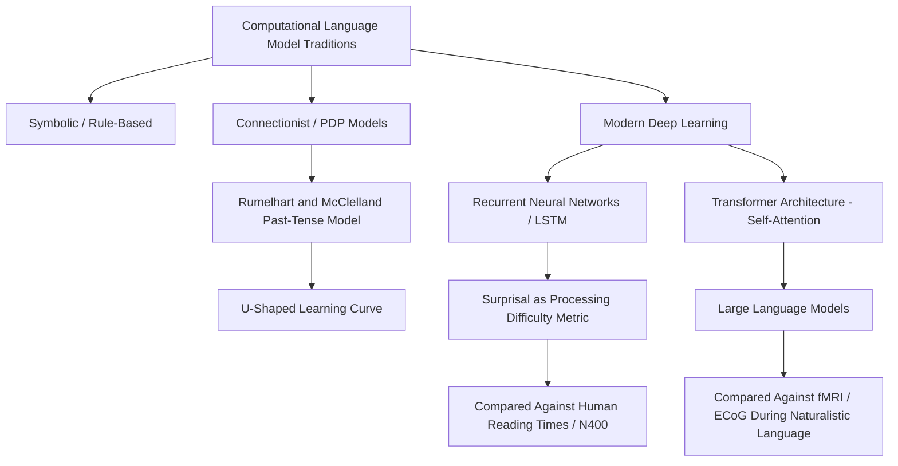

## Computational and Neural Network Models of Language

### Overview

Computational modeling of language occupies a distinctive position within cognitive neuroscience: rather than directly recording or imaging neural tissue, computational models implement explicit, testable hypotheses about the representations and processes that could underlie language behavior, which can then be compared against human behavioral and neural data. This approach spans several major traditions, from early symbolic/rule-based systems through connectionist neural networks to contemporary deep learning architectures, each carrying different implications for long-standing debates about the nature of linguistic representation and learning.

### Symbolic/Rule-Based Models

- Early computational approaches to language, closely aligned with generative linguistic theory (e.g., Chomskyan syntax), implemented language processing as the explicit application of discrete symbolic rules operating over structured representations (e.g., phrase-structure rules, transformational rules).
- These models directly instantiate a strongly rule-governed, compositional view of grammar, in which sentence structure is built via the systematic combination of discrete syntactic categories according to explicit, hand-specified rules.
- [Inference] While influential in shaping linguistic theory and providing precise, testable formal characterizations of grammatical structure, purely symbolic models have generally been regarded as less successful at directly explaining the graded, frequency-sensitive, and error-prone characteristics of actual human language processing and acquisition, motivating the development of alternative connectionist approaches.

### Connectionist (Parallel Distributed Processing) Models

- Connectionist models represent linguistic knowledge not as explicit symbolic rules, but as patterns of activation and weighted connections across networks of simple, neuron-like processing units, with linguistic behavior emerging from the network's learned statistical structure rather than from hand-coded rules.
- The most historically influential and widely discussed example is the **past-tense debate**, sparked by Rumelhart and McClelland's (1986) connectionist model of English past-tense formation, which demonstrated that a simple neural network, trained purely on examples of present-tense/past-tense word pairs (without any explicit rule for regular "-ed" suffixation), could learn to generalize the regular past-tense pattern to novel words while also correctly producing many irregular forms, and — notably — could reproduce the characteristic developmental **U-shaped learning curve** observed in children (initial correct production of irregular forms learned by rote, followed by a period of overgeneralization errors such as "goed," followed by eventual correct mastery of both regular and irregular forms).
- This model directly challenged the necessity of a dedicated symbolic "rule module" for even a canonical example of rule-governed linguistic behavior, sparking a long-running and influential theoretical debate (the "past-tense debate," involving prominent psycholinguists including Steven Pinker on the dual-mechanism side) regarding whether human grammatical processing fundamentally requires distinct symbolic rule and associative memory mechanisms (the **dual-mechanism/dual-route model**, proposing separate systems for regular rule-application and irregular memorized-form retrieval) versus a single, unified associative/statistical learning mechanism sufficient to explain both regular and irregular patterns.
- [Inference] This debate has continued for several decades and remains, in a substantially updated and more nuanced form incorporating modern computational advances, an active area of theoretical disagreement rather than a fully settled question, though considerable empirical evidence (e.g., some differential neural and behavioral signatures for regular versus irregular morphology in certain patient populations and neuroimaging studies) has been marshaled on both sides.

### Modern Deep Learning and Language Models

**Recurrent Neural Networks and Sequence Modeling**

- Recurrent neural network (RNN) architectures, including **Long Short-Term Memory (LSTM)** networks, extended connectionist approaches to explicitly handle sequential/temporal structure by maintaining an internal hidden-state representation updated at each successive time step (word or character), providing an architecture with some functional analogy to the sequential nature of sentence processing during real-time human comprehension and production.
- These architectures have been influentially used within cognitive neuroscience not merely as engineering tools but as explicit computational models of human sentence processing, whose internal representations and processing dynamics (e.g., "surprisal," a measure of how unexpected a given word is given the preceding context, computed directly from a trained language model's predicted probability distribution) have been directly compared against human reading-time and neural (e.g., N400 amplitude) measures, generally showing meaningful correspondence between model-derived surprisal and human processing difficulty.

**Transformer Architectures and Large Language Models**

- The **transformer architecture**, introduced by Vaswani and colleagues (2017), replaced the sequential, step-by-step processing of RNNs with a parallel **self-attention mechanism**, allowing the model to directly and flexibly weigh the relevance of all other words in a context when processing any given word, without needing to pass information through a sequential chain of intermediate hidden states.
- This architecture underlies contemporary large language models (LLMs), trained on vast text corpora to predict upcoming words (or masked words) given context, which have achieved striking performance on a wide range of language tasks and have become an increasingly prominent point of comparison and debate within cognitive neuroscience and psycholinguistics regarding the computational principles underlying human language processing.
- A growing body of research directly compares the internal representations of trained language models (extracted, for example, from specific transformer layers) against human brain activity recorded via fMRI or intracranial electrocorticography during naturalistic language comprehension (e.g., listening to stories), reporting that language model-derived representations can predict a meaningful proportion of variance in brain activity within classical language-processing regions, particularly in some studies within regions along the ventral "meaning" stream.
- [Inference] The interpretation of this brain-model correspondence evidence is a matter of active and substantial debate: some researchers interpret it as suggesting that transformer-based language models, despite their considerable architectural differences from biological neural circuits, may be discovering computational principles that meaningfully converge with those used by the human brain for language processing; other researchers urge caution, noting that predictive correspondence at the level of aggregate representational similarity does not necessarily establish that the underlying computational mechanisms are truly analogous, given the many well-documented differences between how these models are trained (e.g., data scale, absence of embodied sensorimotor experience, non-biological learning algorithms such as backpropagation) and how humans acquire language.

### Using Computational Models to Generate Testable Predictions

- A key methodological value of computational language models within cognitive neuroscience is their capacity to generate precise, quantitative, and falsifiable predictions about human processing difficulty or neural response amplitude, in contrast to more qualitative verbal theorizing.
- **Surprisal theory**, formalized computationally, predicts that processing difficulty for a given word (indexed behaviorally by reading time, or neurally by N400 amplitude) should scale with that word's contextual unpredictability, quantified as the negative log-probability the model assigns to that word given preceding context: $\text{Surprisal}(w_i) = -\log P(w_i \mid w_1, \ldots, w_{i-1})$. This provides a precise, continuously graded, quantitatively testable prediction rather than a purely qualitative claim about expected versus unexpected words.
- [Inference] While surprisal-based predictions from modern language models show meaningful and replicated correspondence with human reading time and some neural measures across numerous studies, the degree to which surprisal alone (as opposed to additional factors such as structural/syntactic complexity measured independently of simple word predictability) fully accounts for human processing difficulty remains an active area of refinement within psycholinguistic modeling research.

### Interpretability and "Artificial Neuropsychology"

- A growing methodological approach involves applying techniques analogous to human neuropsychological lesion studies directly to trained artificial neural network language models — for example, systematically "ablating" (removing or disabling) specific components, layers, or attention heads of a trained model and observing the resulting impact on the model's linguistic behavior, drawing an explicit methodological parallel to studying human lesion-deficit correspondences.
- This approach has been used to investigate whether specific, functionally specialized components emerge within trained language models (e.g., components disproportionately important for subject-verb agreement processing, or for maintaining information across long-distance syntactic dependencies), offering a potential source of hypotheses about functional specialization that can, in principle, be compared against corresponding functional specialization patterns observed in human neuroimaging studies.
- [Inference] This "artificial neuropsychology" approach is a relatively recent and rapidly developing methodological direction; while it offers a potentially valuable new source of testable hypotheses, the degree to which functional dissociations discovered within artificial network architectures meaningfully generalize to, or inform understanding of, the specific biological mechanisms of human brain language processing remains an open question requiring continued careful comparative validation rather than a fully established methodological bridge.

### Key Points

- Computational models of language have progressed from early symbolic/rule-based systems through connectionist neural network models to contemporary deep learning architectures, each carrying distinct implications for debates about the nature of linguistic representation.
- The Rumelhart and McClelland past-tense model sparked an influential and still partially unresolved theoretical debate regarding whether human grammatical processing requires distinct symbolic-rule and associative-memory mechanisms (dual-mechanism model) versus a single unified statistical learning system.
- Transformer-based large language models, using self-attention mechanisms, have become an increasingly prominent point of comparison in cognitive neuroscience, with surprisal-based predictions from these models showing meaningful correspondence with human reading times and neural measures such as the N400.
- The interpretation of brain-model representational correspondence findings remains actively debated, given substantial differences between artificial model training procedures and human language acquisition.
- "Artificial neuropsychology" approaches, applying lesion-study-like ablation methods to trained language models, represent a developing methodological bridge between computational modeling and human neuropsychological research, though the generalizability of such findings to biological mechanisms remains an open question.

### Related Topics

- Syntax and semantic processing in the brain (N400/P600 as human comparison measures)
- The past-tense debate and dual-mechanism versus single-mechanism accounts of morphology
- Language acquisition and statistical learning mechanisms
- Reading and predictive processing in sentence comprehension
- Interpretability research in artificial neural networks
- The dual stream model as a biological comparison point for computational architectures
- Naturalistic neuroimaging paradigms (story listening) in language neuroscience research