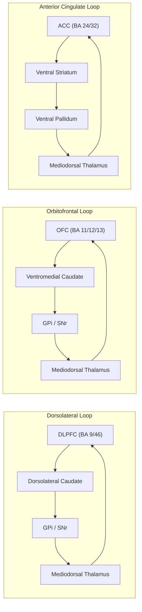

## Prefrontal Cortex Organization and Subdivisions

### Overview

The prefrontal cortex (PFC) is the rostral-most region of the frontal lobe, positioned anterior to the primary and premotor motor cortices. It is defined cytoarchitectonically by the presence of a granular layer IV, distinguishing it from the agranular motor cortices posterior to it. The PFC is the principal cortical substrate for executive function, integrating sensory, mnemonic, and motivational/affective information to guide goal-directed behavior, working memory, decision-making, and inhibitory control.

### Cytoarchitectonic Basis of Subdivision

PFC subregions are traditionally mapped using Brodmann's cytoarchitectonic scheme, which classifies cortex by cell density, layer thickness, and neuronal morphology across the six-layered isocortex.

- **Granular (eulaminate) prefrontal cortex**: Possesses a well-developed, densely packed layer IV (internal granular layer), characteristic of most lateral and dorsal PFC.
- **Dysgranular/agranular transitional cortex**: Found in medial and orbital regions closer to limbic cortex, with a thinner or less distinct layer IV.
- **Agranular cortex**: Layer IV is absent; found in orbitofrontal and anterior cingulate regions closest to allocortex.

This granularity gradient roughly parallels a functional gradient: lateral, granular regions are more associated with "cold," abstract cognitive control, while medial/orbital, agranular-to-dysgranular regions are more associated with affective and reward-related processing.

### Major Anatomical Subdivisions

#### Dorsolateral Prefrontal Cortex (DLPFC)

- **Location**: Brodmann areas 9 and 46 (and portions of area 8), on the lateral surface of the superior and middle frontal gyri.
- **Key Points**:
  - Considered the principal node for working memory maintenance and manipulation, particularly spatial working memory.
  - Involved in cognitive control operations: task-set maintenance, rule switching, planning, and relational/abstract reasoning.
  - Reciprocally connected with the posterior parietal cortex, premotor cortex, and dorsal striatum (caudate nucleus), forming a dorsal frontostriatal loop.
  - Contains neurons exhibiting persistent, delay-period firing during working memory tasks, first characterized extensively by Goldman-Rakic and colleagues in nonhuman primates.

#### Ventrolateral Prefrontal Cortex (VLPFC)

- **Location**: Brodmann areas 44, 45, and 47, on the inferior frontal gyrus.
- **Key Points**:
  - Implicated in response inhibition (particularly the right VLPFC, in tasks such as stop-signal and go/no-go paradigms).
  - Involved in retrieval and selection processes in semantic and episodic memory.
  - Area 44/45 on the left overlaps with Broca's area, linking VLPFC to language production and syntactic processing.

#### Orbitofrontal Cortex (OFC)

- **Location**: Brodmann areas 11, 12, 13, and 14, on the ventral surface of the frontal lobe above the orbits.
- **Key Points**:
  - Central to stimulus-reward association learning, subjective value representation, and outcome expectancy.
  - Supports reversal learning: updating behavior when previously rewarded stimuli become unrewarded or punished.
  - Medial OFC tends to encode reward value; lateral OFC is more engaged by non-reward/punishment signals and behavioral change.
  - Densely connected with the amygdala, hypothalamus, and other limbic structures, consistent with its agranular/dysgranular cytoarchitecture.

#### Medial Prefrontal Cortex (MPFC)

- **Location**: Includes the anterior cingulate cortex (ACC, Brodmann areas 24, 32), and medial areas 9, 10, and 25 (subgenual cortex).
- **Key Points**:
  - **Anterior cingulate cortex**: Implicated in conflict monitoring (e.g., Stroop interference), error detection, effort-based decision-making, and autonomic/affective regulation. The dorsal ACC is often described as interfacing cognitive control with motor and motivational systems.
  - **Area 25 (subgenual ACC)**: Strongly implicated in mood regulation; a key target for deep brain stimulation in treatment-resistant depression research. [Inference: the precise causal role remains an active area of investigation, though its correlation with depressive symptomatology is well replicated].
  - MPFC broadly is also implicated in self-referential processing and social cognition (mentalizing/theory of mind), overlapping with the default mode network.

#### Frontopolar Cortex (Rostral PFC)

- **Location**: Brodmann area 10, at the anterior-most pole of the frontal lobe.
- **Key Points**:
  - The largest cytoarchitectonic area in the human brain relative to body size compared to other primates, and disproportionately expanded in humans.
  - Associated with multitasking, prospective memory, metacognition, and relational integration — holding one cognitive operation in abeyance while executing another ("branching").
  - Has one of the lowest neuronal densities in the cortex, consistent with extensive dendritic arborization supporting high connectivity.

### Anatomical Organization Table

| Subdivision | Brodmann Areas | Cytoarchitecture | Primary Functional Association |
| --- | --- | --- | --- |
| DLPFC | 9, 46 | Granular (eulaminate) | Working memory, cognitive control |
| VLPFC | 44, 45, 47 | Granular | Response inhibition, retrieval selection |
| OFC | 11, 12, 13, 14 | Agranular/dysgranular | Reward valuation, reversal learning |
| MPFC/ACC | 24, 32, 9m, 10m, 25 | Dysgranular/agranular | Conflict monitoring, affect regulation |
| Frontopolar | 10 | Granular, low density | Metacognition, multitasking |

### Connectivity Architecture

The PFC's function derives substantially from its connectional profile rather than intrinsic processing alone.

- **Corticocortical afferents**: Each PFC subregion receives topographically organized input from a distinct set of unimodal and polymodal association areas. DLPFC receives heavy parietal (visuospatial) input; OFC receives olfactory, gustatory, and visceral input via the insula and piriform cortex.
- **Frontostriatal loops**: Alexander, DeLong, and Strick's model of parallel, largely segregated corticostriatal-thalamocortical circuits describes a **dorsolateral loop** (DLPFC–dorsolateral caudate), an **orbitofrontal loop** (OFC–ventromedial caudate), and an **anterior cingulate loop** (ACC–ventral striatum), each looping through specific globus pallidus/substantia nigra and thalamic (mediodorsal nucleus) territories before returning to cortex.
- **Thalamic input**: The mediodorsal (MD) thalamic nucleus is the principal thalamic relay to PFC, with topographically organized reciprocal projections.
- **Limbic connectivity**: OFC and MPFC have dense, reciprocal connections with the amygdala and hippocampus, positioning them to integrate affective/mnemonic content into decision-making, distinct from the more dorsolateral, parietal-linked circuits.

Below is a diagram of the major frontostriatal-thalamic loop architecture.

### Lateral and Medial Surface Schematic

`Prefrontal Cortex Subdivisions — Lateral and Medial Views (svg_diagram)`

<svg xmlns="http://www.w3.org/2000/svg" viewBox="0 0 900 420">
<rect x="0" y="0" width="900" height="420" fill="#ffffff" />
<text x="220" y="25" font-size="16" font-weight="bold" text-anchor="middle" fill="#111">Lateral Surface (svg_diagram)</text>
<path d="M60,220 C60,120 160,60 260,70 C340,78 400,110 420,160 C440,210 430,260 400,300 C370,340 300,360 220,350 C130,338 60,300 60,220 Z" fill="#f2ede6" stroke="#333" stroke-width="2" />
<path d="M60,220 C60,150 110,100 170,80 C150,110 140,150 145,190 C150,230 175,265 210,285 C170,290 120,270 90,240 C72,225 62,222 60,220 Z" fill="#cfe3f7" stroke="#333" stroke-width="1.5" />
<text x="115" y="150" font-size="12" fill="#123">DLPFC</text>
<text x="105" y="165" font-size="10" fill="#123">BA 9/46</text>
<path d="M170,80 C220,72 300,90 340,140 C310,150 260,150 220,140 C195,132 178,110 170,80 Z" fill="#f7dfc0" stroke="#333" stroke-width="1.5" />
<text x="230" y="115" font-size="11" fill="#432">Frontopolar</text>
<text x="250" y="128" font-size="10" fill="#432">BA 10</text>
<path d="M210,285 C240,300 290,300 330,275 C350,300 350,320 330,335 C300,350 250,345 215,320 C200,308 200,295 210,285 Z" fill="#d9f0d3" stroke="#333" stroke-width="1.5" />
<text x="240" y="315" font-size="11" fill="#141">VLPFC</text>
<text x="230" y="328" font-size="10" fill="#141">BA 44/45/47</text>
<text x="580" y="25" font-size="16" font-weight="bold" text-anchor="middle" fill="#111">Medial Surface (svg_diagram)</text>
<path d="M480,300 C480,200 550,90 660,75 C760,62 840,110 850,190 C858,260 820,330 750,360 C670,392 560,380 500,340 C480,325 480,315 480,300 Z" fill="#f2ede6" stroke="#333" stroke-width="2" />
<path d="M560,120 C600,110 660,115 690,140 C660,160 610,165 580,155 C565,148 558,135 560,120 Z" fill="#f7dfc0" stroke="#333" stroke-width="1.5" />
<text x="590" y="140" font-size="10" fill="#432">BA 10m</text>
<path d="M540,170 C590,155 660,160 700,190 C670,215 610,220 570,205 C550,195 540,182 540,170 Z" fill="#e6d6f5" stroke="#333" stroke-width="1.5" />
<text x="580" y="192" font-size="11" fill="#312">ACC (dorsal)</text>
<text x="590" y="205" font-size="10" fill="#312">BA 24/32</text>
<path d="M560,220 C600,215 650,225 670,250 C640,270 590,270 565,255 C555,247 555,232 560,220 Z" fill="#d6cff5" stroke="#333" stroke-width="1.5" />
<text x="580" y="245" font-size="10" fill="#312">Subgenual BA 25</text>
<path d="M500,300 C540,280 610,275 660,295 C690,308 700,325 690,345 C650,365 570,362 520,340 C505,332 498,315 500,300 Z" fill="#fcd8d8" stroke="#333" stroke-width="1.5" />
<text x="550" y="325" font-size="11" fill="#511">OFC (medial)</text>
<text x="555" y="338" font-size="10" fill="#511">BA 11/12/14</text>
</svg>

### Working Memory and DLPFC Circuitry

DLPFC delay-period activity is the canonical electrophysiological signature of working memory. In macaque studies, neurons in area 46 show sustained, direction-tuned firing during the delay period of oculomotor delayed-response tasks, thought to reflect an attractor-network mechanism sustained by recurrent excitation among pyramidal neurons with reciprocal NMDA-receptor-mediated connections, balanced by GABAergic interneuron inhibition.

$$\text{Persistent activity} \propto \int_{t_0}^{t_{delay}} \left( w_{rec} \cdot r(t) - g_{inh} \cdot i(t) \right) dt$$

where $w_{rec}$ represents recurrent excitatory weight, $r(t)$ the recurrent firing rate, $g_{inh}$ inhibitory gain, and $i(t)$ interneuron activity. [Inference: this is a simplified conceptual formalization of attractor-network dynamics rather than a specific validated equation from a single primary source.]

**Example**: In a spatial delayed-response task, a monkey is shown a cue at one of eight peripheral locations, the cue disappears, and after a delay of several seconds the monkey must saccade to the remembered location. DLPFC neurons tuned to that specific spatial location maintain elevated firing throughout the delay, and disruption of this activity (e.g., via local cooling or pharmacological blockade) produces memory-guided pointing/saccade errors specific to that spatial location.

### Reward Valuation and OFC Circuitry

OFC neurons encode economic value on a common scale, enabling comparison across qualitatively different reward types (a property termed "menu invariance" or common currency coding in some primate electrophysiology literature). Lesion and inactivation studies show that:

- OFC damage impairs **reversal learning** more than initial acquisition of stimulus-reward associations, indicating a specific role in updating value representations rather than learning per se.
- OFC is necessary for using a "cognitive map" of task structure to infer unobservable states and outcomes, distinguishing it from the amygdala's role in the affective/associative component of value learning. [Inference: this state-space/cognitive-map framing, associated with Wilson, Schoenbaum, and colleagues, is an influential but still-debated theoretical model rather than settled consensus.]

### Conflict Monitoring and ACC Circuitry

The conflict monitoring theory (Botvinick, Cohen, Carter) proposes that dorsal ACC detects response conflict — e.g., competing motor programs activated by incongruent stimulus dimensions in a Stroop task — and signals the need for increased cognitive control, which is then implemented by lateral PFC (DLPFC).

**Example**: In the classic Stroop task, when the word "RED" is printed in blue ink and the participant must name the ink color, competing lexical (reading) and perceptual (color-naming) response pathways activate simultaneously. This response conflict elevates dorsal ACC activity on incongruent trials, and this signal is associated with subsequent adjustment (e.g., slowed but more accurate responding on the following trial — the Gratton effect).

### Developmental and Comparative Notes

- The PFC, and DLPFC in particular, shows a protracted developmental trajectory, with synaptic pruning and myelination continuing into the mid-to-late twenties in humans, consistent with the late maturation of executive function capacities.
- Comparative neuroanatomy indicates that granular PFC, in the strict cytoarchitectonic sense, is present in primates but is a matter of ongoing debate regarding homology in rodents; rodent medial PFC (prelimbic/infralimbic cortex) is often used as a functional analog to primate DLPFC/ACC in translational research, though direct cytoarchitectonic homology is contested. [Unverified: the degree of homology between rodent and primate PFC subregions remains an active area of comparative neuroanatomical debate without full consensus.]

### Clinical Correlates

| Subdivision Damaged | Classic Syndrome/Deficit |
| --- | --- |
| DLPFC (bilateral) | "Dysexecutive syndrome" — impaired planning, working memory, set-shifting |
| OFC | Disinhibition, poor impulse control, impaired reversal learning (e.g., Phineas Gage-type presentation) |
| MPFC/ACC | Apathy, akinetic mutism (with more extensive/bilateral damage), blunted conflict/error signals |
| Frontopolar | Impaired multitasking and prospective memory, deficits in strategic/metacognitive planning |

**Related Topics**

- Working memory models and the central executive (Baddeley's model)
- Frontostriatal circuitry and basal ganglia loops
- Goal-directed vs. habitual behavior and the dorsal/ventral striatal divide
- Reversal learning paradigms and behavioral flexibility assays
- Default mode network and its overlap with medial PFC
- Neurodevelopmental trajectory of the PFC and adolescent risk-taking
- Lesion studies: Phineas Gage and orbitofrontal syndrome
- Cognitive control theories: conflict monitoring vs. expected value of control