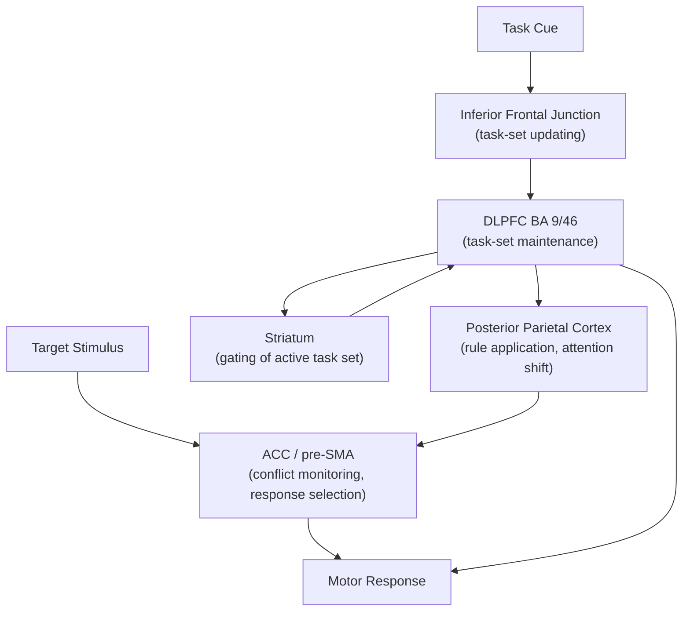

## Cognitive Control and Task Switching

### Overview

Cognitive control refers to the set of top-down processes that configure perception, memory, and action systems to serve current goals, particularly when habitual or prepotent responses must be overridden. Task switching is a principal experimental paradigm used to isolate and quantify cognitive control processes, measuring the behavioral and neural cost of reconfiguring mental task sets when an individual alternates between two or more distinct tasks.

### Core Constructs of Cognitive Control

- **Key Points**:
  - **Goal maintenance**: Sustaining an internal representation of the current task objective in the face of distraction, typically attributed to DLPFC-mediated persistent activity.
  - **Interference control**: Suppressing task-irrelevant or prepotent responses (e.g., Stroop, flanker tasks).
  - **Task-set reconfiguration**: Updating the stimulus-response mapping rules that define the currently active task, the process most directly probed by task-switching paradigms.
  - **Monitoring**: Detecting the need for control adjustment, commonly attributed to the anterior cingulate cortex (ACC), which signals conflict or error to recruit additional control resources.
  - Miyake and colleagues' influential unity/diversity model decomposes executive function into three correlated but separable components: **inhibition**, **updating** (working memory), and **shifting** (task switching), each showing partially distinct but overlapping neural substrates.

### The Task-Switching Paradigm

In a typical task-switching experiment, participants alternate between two (or more) simple classification tasks applied to bivalent stimuli (stimuli relevant to both tasks). A canonical example is switching between judging whether a number is odd/even and judging whether it is high/low (relative to 5).

- **Example**: In an alternating-runs paradigm (Rogers & Monsell), task sequence follows a predictable AABB pattern (e.g., magnitude, magnitude, parity, parity, magnitude, magnitude...). Trials are classified as:
  - **Switch trials**: The task changes from the previous trial.
  - **Repeat trials**: The task is the same as the previous trial.

Two principal cost measures are derived:

$$\text{Switch cost} = RT_{switch} - RT_{repeat}$$

$$\text{Mixing cost} = RT_{repeat\ (mixed\ block)} - RT_{single\ task\ (pure\ block)}$$

Switch cost isolates the transient reconfiguration process specific to changing tasks; mixing cost isolates the sustained demand of maintaining multiple task sets available concurrently, even on trials that do not require switching.

### Task-Set Reconfiguration vs. Task-Set Inertia

Two influential, non-mutually-exclusive theoretical accounts explain switch costs:

1. **Active reconfiguration account** (Rogers & Monsell): Switch costs reflect the time required for an endogenous control process to reconfigure the cognitive system for the upcoming task — reweighting attention to relevant stimulus dimensions and activating new stimulus-response mappings.
2. **Task-set inertia account** (Allport, Styles, & Hsieh): Switch costs partly reflect passive, proactive interference from the previously active task set, which persists and must be overcome rather than being purely a preparatory reconfiguration cost.

A key empirical dissociation used to adjudicate between these accounts is the **residual switch cost**: even with extended preparation time (a long response-stimulus interval, or RSI, allowing advance reconfiguration), a portion of the switch cost typically remains, which is interpreted as either an unresolvable component of task-set inertia or an "exogenous," stimulus-triggered component of reconfiguration that cannot be completed until the target stimulus appears.

### Key Experimental Manipulations

| Manipulation | Description | Typical Finding |
| --- | --- | --- |
| Preparation interval (CSI) | Time between a task cue and the target stimulus | Longer CSI reduces (but does not eliminate) switch cost |
| Task-cue predictability | Explicit cue vs. predictable sequence (e.g., AABB) | Explicit cuing paradigms isolate reconfiguration more cleanly from working-memory retrieval |
| N−2 task repetition | Returning to a task last performed two trials prior (ABA vs. CBA) | ABA sequences show slower RTs than CBA, indicating "backward inhibition" of the just-abandoned task set |
| Bivalent vs. univalent stimuli | Stimuli relevant to one task only vs. both tasks | Bivalent stimuli increase switch costs and general interference |
| Cue-target interval vs. response-cue interval | Manipulating preparation time independent of inter-trial interval | Dissociates active preparation from passive decay of the prior task set |

### Neural Substrates

Cognitive control during task switching engages a broadly distributed frontoparietal network, commonly referred to in the neuroimaging literature as the **multiple-demand (MD) system** or **cognitive control network**.

- **DLPFC (BA 9/46)**: Implicated in maintaining and updating the currently relevant task set representation; shows increased activity on switch relative to repeat trials in many but not all neuroimaging studies.
- **Anterior cingulate cortex / pre-supplementary motor area (pre-SMA)**: Associated with conflict detection between competing task sets and with motor-level response selection/suppression during switches.
- **Inferior frontal junction (IFJ)**: A region at the intersection of the inferior frontal sulcus and precentral sulcus, proposed by Brass and colleagues as a specific hub for updating task representations.
- **Posterior parietal cortex (intraparietal sulcus)**: Implicated in attentional shifting between stimulus dimensions/task rules and in maintaining and applying rule-based stimulus-response mappings.
- **Basal ganglia (striatum)**: Implicated in gating which task set has access to prefrontal working memory representations, consistent with computational "gating" models of PFC-basal ganglia interaction (e.g., the PBWM framework of O'Reilly and Frank).

Below is a schematic of the frontoparietal control network implicated in task-set reconfiguration.

### Computational Accounts

Gating models (e.g., PBWM: Prefrontal cortex, Basal ganglia Working Memory) propose that the basal ganglia function as an adaptive gate controlling which information updates PFC working memory representations, implemented via dopaminergic reinforcement learning signals that train the striatum to open the gate selectively for task-relevant information and close it otherwise, protecting the currently maintained task set from interference except when an update is warranted (e.g., at a task switch).

$$\Delta w_{gate} = \alpha \cdot \delta \cdot e_{gate}$$

where $\Delta w_{gate}$ is the change in gating weight, $\alpha$ is a learning rate, $\delta$ is a dopaminergic reward-prediction-error signal, and $e_{gate}$ is an eligibility trace marking which gating units were recently active. [Inference: this is a conceptual summary of the general reinforcement-learning gating mechanism described in the PBWM literature, not a verbatim equation from a single canonical source.]

### Individual Differences and Clinical Relevance

- Switch costs and mixing costs are commonly used as behavioral indices of executive/cognitive flexibility in developmental, aging, and clinical neuropsychology research.
- **Development**: Task-switching ability, particularly the capacity to use advance preparation to reduce switch cost, shows a protracted developmental trajectory paralleling PFC maturation, with switch costs decreasing from childhood through adolescence.
- **Aging**: Older adults typically show larger switch and mixing costs, consistent with reduced efficiency of frontoparietal control network function, though this finding interacts with task demands and general processing-speed decline. [Inference: whether aging-related increases in switch cost reflect a control-specific deficit versus a generalized slowing confound remains debated in the aging literature.]
- **Clinical populations**: Elevated switch costs relative to matched controls have been reported in conditions including schizophrenia, ADHD, and following frontal lobe lesions, though switch-cost measures are not diagnostically specific and show substantial task-dependent variability across studies. [Unverified: effect sizes and specificity vary considerably across studies and clinical populations; findings should not be treated as diagnostic markers.]

### Relationship to Other Executive Function Constructs

Task switching is one of three commonly dissociated executive function components in the Miyake and Friedman unity/diversity framework, alongside inhibition and working-memory updating. Latent variable analyses indicate these components are correlated (reflecting a shared "common EF" factor, strongly associated with prefrontal and anterior cingulate function) but also show unique variance, with shifting-specific variance linked most closely to lateral PFC and parietal regions involved in rule representation and attentional reorientation, distinguishing it from inhibition-specific variance more associated with right VLPFC/subthalamic nucleus circuitry.

**Next Steps**

- Response inhibition and the stop-signal paradigm
- Working memory updating and the n-back task
- The Miyake and Friedman unity/diversity model of executive function
- Conflict monitoring theory and the anterior cingulate cortex
- Basal ganglia gating models of working memory (PBWM)
- Developmental trajectories of executive function
- Cognitive flexibility deficits in schizophrenia and ADHD
- Attentional set-shifting in animal models (Wisconsin Card Sorting Task analogs)