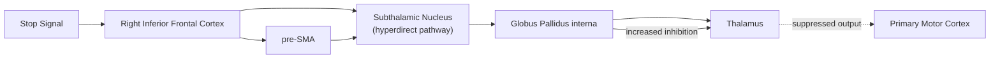

## Inhibitory Control Mechanisms

### Overview

Inhibitory control refers to the capacity to suppress prepotent, automatic, or task-irrelevant responses, thoughts, or attentional capture in the service of goal-directed behavior. It is one of the core components of executive function in the Miyake and Friedman unity/diversity framework and is fractionated into several dissociable subtypes with distinct behavioral paradigms and, to some degree, distinct neural substrates.

### Taxonomies of Inhibition

- **Key Points**:
  - **Response inhibition (action stopping)**: Suppressing an already-initiated or about-to-be-initiated motor response, indexed by stop-signal and go/no-go tasks.
  - **Interference control (selective attention/cognitive inhibition)**: Resolving competition between task-relevant and task-irrelevant stimulus or response representations, indexed by Stroop, flanker, and Simon tasks.
  - **Proactive interference control**: Suppressing irrelevant information from long-term or working memory that competes with currently relevant content (e.g., in recent-probes and directed-forgetting paradigms).
  - Nigg's influential taxonomy further distinguishes **executive (effortful, top-down) inhibition** from **automatic (motivational/reactive) inhibition**, such as withdrawal responses to aversive stimuli, which are not necessarily under volitional control.
  - A further distinction separates **proactive inhibition** (preparatory adjustment of control settings in anticipation of a stop requirement) from **reactive inhibition** (rapid, stimulus-triggered stopping after a stop cue appears).

### Response Inhibition: The Stop-Signal Paradigm

The stop-signal task (Logan & Cowan) is the principal paradigm for quantifying the speed of reactive response inhibition. Participants perform a simple choice-reaction-time "go" task; on a minority of trials, a stop signal appears after a variable delay (the stop-signal delay, SSD), instructing withholding of the response.

The task is modeled using the **horse-race model**: an independent go process and stop process race toward completion, and stopping succeeds only if the stop process finishes before the go process.

$$SSRT = RT_{go} - SSD$$

where $SSRT$ (stop-signal reaction time) is the latency of the covert stopping process, $RT_{go}$ is typically estimated as a specific percentile of the go RT distribution (integration method) rather than the mean, and $SSD$ is the stop-signal delay at which stopping succeeds approximately 50% of the time (often set adaptively via a staircase procedure).

**Example**: If the nth percentile go RT is 550 ms (matched to the overall probability of successful stopping) and the average SSD is 250 ms, the estimated SSRT is 300 ms, representing the covert time required to cancel the already-initiated go response.

- **Go/no-go task**: A related but distinct paradigm in which no explicit stop cue race is modeled; participants simply withhold a response to designated "no-go" stimuli. This paradigm confounds response inhibition with decision/discrimination processes and does not yield a direct SSRT estimate, making the stop-signal task the preferred tool for isolating stopping latency specifically.

### Neural Substrates of Response Inhibition

- **Right inferior frontal cortex (rIFC, including right VLPFC/BA 44)**: Consistently implicated across lesion, TMS, and neuroimaging studies as a critical node for successful stopping; damage or disruption here lengthens SSRT.
- **Pre-supplementary motor area (pre-SMA)**: Co-activated with rIFC during successful stopping; proposed to implement the direct inhibitory command to motor structures.
- **Subthalamic nucleus (STN)**: A key basal ganglia node in the "hyperdirect pathway," receiving direct cortical input from rIFC/pre-SMA and providing fast, broad inhibition of thalamocortical output via the globus pallidus interna, bypassing the slower cortico-striato-pallidal indirect pathway.
- **Basal ganglia direct/indirect/hyperdirect pathway model**: The hyperdirect pathway (cortex → STN → GPi) is the fastest route and is proposed as the primary substrate for rapid, global motor suppression triggered by a stop signal, consistent with the very short latencies (often under 200-300 ms) of behavioral stopping.

Below is a schematic of the hyperdirect stopping pathway.

### Interference Control: The Stroop and Flanker Tasks

- **Stroop task**: Participants name the ink color of color words; on incongruent trials (e.g., the word "RED" printed in blue), the automatic, highly practiced lexical reading response competes with the intended color-naming response, producing slowed and less accurate responses (the Stroop effect).
- **Flanker task (Eriksen flanker)**: Participants respond to a central target (e.g., an arrow direction) flanked by distractor stimuli that are either congruent (pointing the same direction) or incongruent (pointing the opposite direction), with incongruent flankers slowing responses due to competing response activation.
- **Simon task**: Response conflict arises between the spatial location of a stimulus and the spatial location of the required response, even when stimulus location is task-irrelevant, isolating stimulus-response spatial compatibility interference distinct from Stroop-like semantic interference.

These paradigms are typically explained by dual-pathway or activation-competition models in which a fast, automatic pathway and a slower, controlled pathway both feed into a shared response selection stage, with dorsal ACC/pre-SMA monitoring the resulting conflict and lateral PFC biasing attention toward the task-relevant dimension to resolve it.

### Proactive vs. Reactive Control Framework

Braver's Dual Mechanisms of Control (DMC) framework distinguishes two temporally distinct modes of engaging cognitive/inhibitory control:

| Mode | Timing | Neural Signature | Description |
| --- | --- | --- | --- |
| Proactive control | Sustained, anticipatory | Sustained lateral PFC activity prior to stimulus onset | Goal representations actively maintained in advance to bias attention/response preparation before interference occurs |
| Reactive control | Transient, stimulus-triggered | Transient ACC/lateral PFC activity time-locked to conflict detection | Control is recruited "just in time" after interference or conflict is detected |

[Inference: individual and group differences (e.g., aging, working memory capacity, certain clinical populations) in the relative reliance on proactive versus reactive control are an active area of research, and the precise boundary conditions determining which mode predominates are not fully resolved.]

### Backward Inhibition and N−2 Task Repetition Costs

In task-switching designs, returning to a task performed two trials earlier (an ABA sequence) is typically slower than switching to a task not recently performed (a CBA sequence). This "n−2 repetition cost" or backward inhibition effect is interpreted as evidence that switching away from a task actively suppresses that task's representation, and this residual inhibition must be overcome to reactivate it, linking task-switching mechanisms directly to inhibitory control processes rather than treating them as fully independent constructs.

### Clinical and Developmental Relevance

- **ADHD**: Meta-analyses report reliably longer SSRTs in individuals with ADHD relative to controls, consistent with the response-inhibition deficit models central to several influential theoretical accounts of the disorder (e.g., Barkley's model), though effect sizes are moderate and inhibition deficits are not universal or diagnostically sufficient alone. [Inference: the specificity of SSRT deficits to ADHD versus a broader marker of general processing-speed or arousal differences remains debated.]
- **Substance use disorders and impulsivity research**: Reduced rIFC/STN circuit efficiency and longer SSRTs are frequently reported correlates of substance use and are used as candidate endophenotypic markers in addiction research, though causal directionality (pre-existing trait vs. consequence of use) is difficult to establish from cross-sectional designs. [Unverified: causal direction between inhibitory control deficits and substance use is not established by correlational findings alone.]
- **Development**: SSRT decreases (stopping speed improves) across childhood and adolescence, paralleling maturation of the rIFC-pre-SMA-STN circuit, and shows further subtle refinement into early adulthood.

**Related Topics**

- Horse-race model formalization and SSRT estimation methods
- Basal ganglia direct, indirect, and hyperdirect pathways
- Conflict monitoring theory and the anterior cingulate cortex
- Dual Mechanisms of Control (proactive/reactive) framework
- Task switching and n−2 backward inhibition
- ADHD models of executive dysfunction
- TMS and lesion studies of right inferior frontal cortex
- Computational models of response inhibition (e.g., interactive race model extensions)