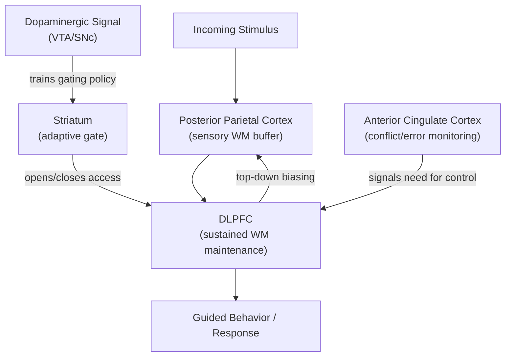

## Working Memory and Executive Interactions

### Overview

Working memory (WM) is the capacity-limited system for actively maintaining and manipulating task-relevant information over brief periods in the service of ongoing cognition. Its relationship to executive function is bidirectional and deeply interdependent: WM provides the representational substrate that executive control processes operate over (goals, rules, intermediate results), while executive processes (updating, gating, inhibition of interference) determine what enters, persists in, and is removed from WM. In contemporary frameworks, WM and executive function are frequently treated less as separate systems and more as overlapping constructs sharing common prefrontal-parietal-striatal circuitry.

### Componential Models of Working Memory

- **Key Points**:
  - **Baddeley and Hitch's multicomponent model**: Proposes a **central executive** (attentional control system) supervising two modality-specific "slave systems" — the **phonological loop** (verbal/acoustic information, maintained via subvocal rehearsal) and the **visuospatial sketchpad** (visual/spatial information). A later addition, the **episodic buffer**, provides a multimodal interface integrating WM contents with long-term memory.
  - The central executive itself is not a unitary homunculus but is operationally decomposed into functions overlapping directly with executive function taxonomies: attentional focusing, dividing attention between tasks, switching retrieval strategies, and inhibiting interference.
  - **Cowan's embedded-processes model**: Frames WM not as a separate storage structure but as the subset of long-term memory representations currently within the **focus of attention**, with capacity limited to roughly 3-4 discrete chunks under conditions that prevent rehearsal-based strategies.
  - **Miyake and Friedman's updating construct**: In the unity/diversity executive function framework, "updating" (a core EF component alongside inhibition and shifting) is operationally very close to WM manipulation — the ability to monitor incoming information and appropriately add/remove content from active maintenance (e.g., as measured by n-back and complex span tasks).

### Working Memory Capacity and Complex Span Tasks

WM capacity is typically measured using **complex span tasks**, which interleave a memory-maintenance requirement with a concurrent secondary processing task, distinguishing WM capacity from simple short-term storage span.

- **Example**: In the **operation span (OSPAN)** task, participants alternate between verifying simple arithmetic equations (e.g., "(4 × 2) − 3 = 5?") and encoding a to-be-remembered letter, across trials of increasing set size, then recall the letters in serial order at the end of the sequence. Performance reflects the capacity to maintain information while executive attention is simultaneously diverted to a processing demand — directly indexing the interaction between storage and control.
- Individual differences in complex span performance ("WM capacity" or WMC) correlate strongly with fluid intelligence (Gf), attentional control measures (e.g., antisaccade performance), and multiple executive function tasks, supporting the view that WMC substantially reflects domain-general executive attention rather than purely modality-specific storage capacity.

### The Gating Problem: Updating as Selective Input Control

A central computational challenge for WM is the **stability-plasticity dilemma**: representations must be stable enough to resist interference from irrelevant input, yet plastic enough to be rapidly updated when task-relevant information changes. This is formalized in the PFC-basal ganglia working memory framework (PBWM; O'Reilly & Frank) as an adaptive **gating** mechanism.

$$P(\text{update}) = f(\delta_{DA}, S_{relevance})$$

where $P(\text{update})$ is the probability that the basal ganglia gate opens to permit new information into PFC WM representations, $\delta_{DA}$ is a phasic dopaminergic reinforcement-learning signal shaping which gating actions are reinforced, and $S_{relevance}$ is a learned relevance signal for the current input. [Inference: this is a conceptual summary of the PBWM gating mechanism rather than a literal equation reproduced from a specific primary source.]

This gating framework directly operationalizes the executive/WM interaction: the basal ganglia (an executive control structure) determines access to PFC's WM buffer, while PFC (the WM structure) provides the sustained representations that guide ongoing behavior between update events.

### Neural Circuitry Supporting WM-Executive Interaction

- **DLPFC (BA 9/46)**: Sustains persistent, delay-period activity representing actively maintained WM content; also implicated in top-down biasing of posterior sensory representations toward task-relevant features.
- **Posterior parietal cortex (intraparietal sulcus)**: Contributes to WM maintenance, particularly for spatial and object information, and interacts with DLPFC in a distributed frontoparietal WM network; some models propose parietal cortex maintains "lower-resolution" or capacity-limited storage while PFC provides top-down control and protection from interference.
- **Anterior cingulate cortex**: Monitors for conflict or errors during WM tasks (e.g., interference from no-longer-relevant items), signaling the need for control adjustments implemented by DLPFC.
- **Basal ganglia (striatum) and dopaminergic midbrain (VTA/SNc)**: Implements the gating signal described above, with phasic dopamine release acting as a training signal shaping which striatal "stripes" open the gate to specific PFC WM channels.

Below is a schematic of the interaction between WM maintenance and executive gating/control circuitry.

### Interference Control Within Working Memory

A distinct but related executive-WM interaction concerns **proactive interference (PI)**: the intrusion of no-longer-relevant, previously encoded information into current WM processing.

- **Recent-probes task**: Participants judge whether a probe item was present in the current memory set; on "recent negative" trials, the probe was part of a *previous* trial's memory set (but not the current one), producing slowed, more error-prone rejections due to PI, relative to novel negative probes never seen before. This dissociates interference resolution from simple recognition memory.
- **Directed forgetting paradigms**: Participants are cued to forget specific previously encoded items; successful directed forgetting reduces subsequent PI from those items, implicating active, effortful suppression mechanisms overlapping with response-inhibition circuitry (right VLPFC).
- Resolution of PI in WM tasks is associated with left VLPFC (BA 45) activity, distinguishable from the DLPFC activity associated with WM maintenance itself, suggesting partially separable "maintenance" and "interference resolution" subsystems within the broader WM-executive network.

### Working Memory Training and Transfer

A substantial empirical literature has examined whether WM training (e.g., adaptive n-back training) produces transfer to untrained executive function measures or fluid intelligence.

- Near-transfer effects (to structurally similar untrained WM tasks) are relatively consistently observed.
- Far-transfer effects (to fluid intelligence, academic achievement, or unrelated EF tasks) are inconsistently reported and are a matter of ongoing empirical and methodological debate, with meta-analyses reaching divergent conclusions depending on inclusion criteria and control-group design. [Unverified: the existence and magnitude of far-transfer effects from WM training remains actively contested in the literature, with substantial heterogeneity across studies.]

### Clinical and Developmental Relevance

- **Development**: WM capacity increases substantially across childhood and adolescence, tracking maturation of frontoparietal white matter connectivity and synaptic refinement in DLPFC, and is a strong predictor of academic outcomes, particularly in mathematics.
- **ADHD**: WM deficits, particularly in central-executive-demanding tasks, are among the most consistently replicated cognitive findings in ADHD, though they coexist with and are difficult to fully dissociate from inhibitory control deficits.
- **Schizophrenia**: WM impairment is considered a core, trait-like cognitive deficit associated with reduced DLPFC activation and altered dopaminergic gating signals, and is a target of some cognitive remediation interventions. [Inference: the precise causal contribution of dopaminergic dysfunction versus structural/connectivity abnormalities to WM deficits in schizophrenia remains an active research question.]

**Related Topics**

- Baddeley's multicomponent working memory model in depth
- PFC-basal ganglia gating models (PBWM) and dopaminergic reinforcement learning
- Fluid intelligence and its relationship to working memory capacity
- Proactive interference and directed forgetting paradigms
- N-back task design and neural correlates
- Working memory training and transfer effects controversy
- Frontoparietal network connectivity across development
- Working memory deficits in ADHD and schizophrenia