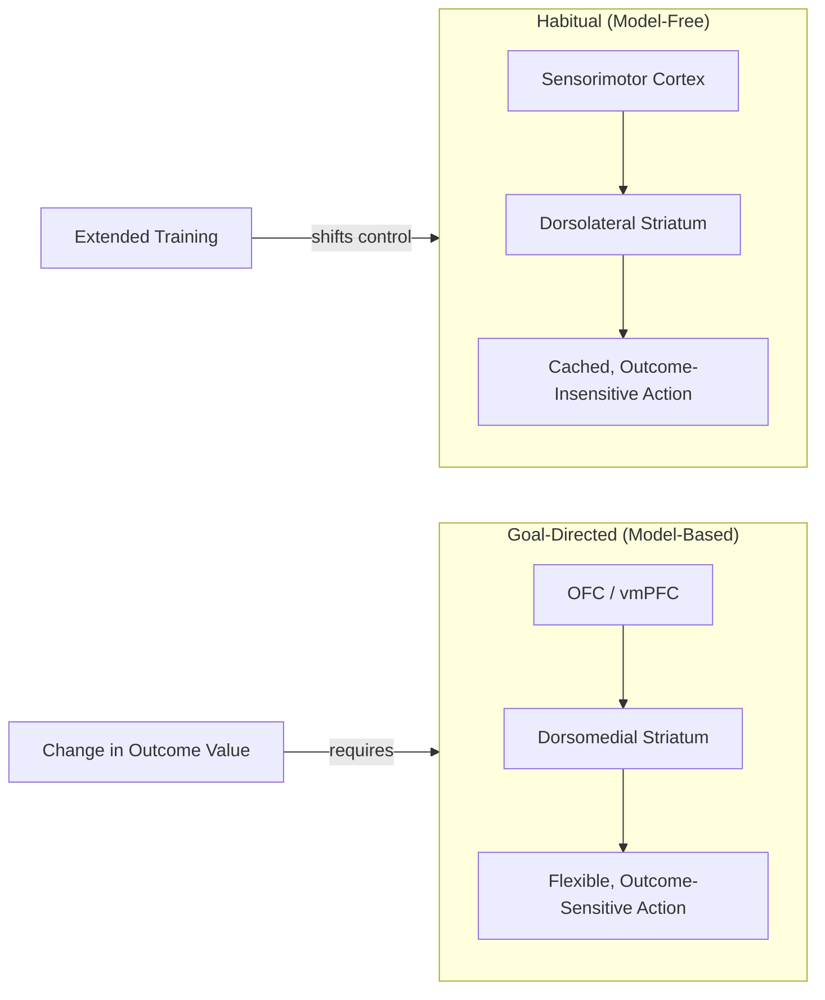

## Goal-Directed Behavior and Planning

### Overview

Goal-directed behavior refers to action selection guided by an internal representation of desired outcomes and the causal relationship between actions and those outcomes, in contrast to habitual behavior driven by stimulus-response associations reinforced through repetition. Planning is the prospective, hierarchical organization of a sequence of actions to achieve a goal, requiring the ability to represent future states, evaluate alternative action sequences, and maintain subgoals across delays. Both constructs are central to executive function and depend on interaction between prefrontal cortex and corticostriatal circuitry.

### Goal-Directed vs. Habitual Control: The Dual-Process Framework

- **Key Points**:
  - **Goal-directed (model-based) control**: Action selection based on an internal model of action-outcome contingencies and current outcome value; flexible and rapidly updatable but computationally costly and slow.
  - **Habitual (model-free) control**: Action selection based on cached stimulus-response values built up through repeated reinforcement; fast and computationally cheap but inflexible to changes in outcome value.
  - The classic behavioral dissociation tool is the **outcome devaluation paradigm**: an animal is trained to perform an action for a specific reward, the reward is then devalued (e.g., through specific satiety or pairing with illness), and behavior is tested in extinction. Persistent responding despite devaluation indicates habitual control; rapid reduction in responding indicates goal-directed control sensitive to current outcome value.
  - **Contingency degradation** is a complementary test: if the action-outcome contingency is removed (outcomes now occur independently of the action), goal-directed responding should decline, while habitual responding persists.
  - Training parameters causally shift the balance: extended/overtrained responding shifts control from goal-directed to habitual, formalized in the associative-cybernetic and, later, reinforcement-learning-based dual-process models (Dickinson; Daw, Niv, & Dayan).

### Computational Framework: Model-Based vs. Model-Free Reinforcement Learning

The goal-directed/habitual distinction maps onto the model-based/model-free distinction in reinforcement learning theory (Daw, Niv, & Dayan).

$$Q_{MF}(s,a) \leftarrow Q_{MF}(s,a) + \alpha \left[ r + \gamma \max_{a'} Q_{MF}(s',a') - Q_{MF}(s,a) \right]$$

Model-free values are learned incrementally through cached prediction-error updates (as above, a standard temporal-difference/Q-learning update), independent of any explicit representation of task structure.

$$Q_{MB}(s,a) = \sum_{s'} P(s'|s,a) \left[ R(s,a,s') + \gamma \max_{a'} Q_{MB}(s',a') \right]$$

Model-based values are computed by forward simulation through a learned transition model $P(s'|s,a)$ and reward function, allowing immediate updating when either the transition structure or reward value changes, without requiring repeated direct experience of the new contingency.

**Example**: In the two-step Markov decision task (Daw et al., 2011), participants make a first-stage choice leading probabilistically (common vs. rare transition) to one of two second-stage states, each associated with its own reward probability. Model-based behavior is identified by a first-stage choice pattern that depends on the interaction between the previous trial's reward *and* whether the transition was common or rare; model-free behavior produces first-stage choice patterns driven by reward alone, irrespective of transition type. Human behavior is typically explained by a weighted mixture of both systems.

### Neural Substrates of Goal-Directed vs. Habitual Control

| System | Key Structures | Associated Control Mode |
| --- | --- | --- |
| Goal-directed | Dorsomedial striatum (DMS; caudate in primates), OFC, prelimbic PFC (rodent) / ventromedial PFC (primate) | Model-based, outcome-sensitive |
| Habitual | Dorsolateral striatum (DLS; putamen in primates), infralimbic PFC (rodent) | Model-free, outcome-insensitive |

- Lesion and pharmacological inactivation studies in rodents demonstrate a double dissociation: DMS lesions abolish sensitivity to outcome devaluation (behavior becomes habitual prematurely), while DLS lesions preserve goal-directed sensitivity even after overtraining that would normally produce habits.
- In humans, individual differences in model-based control (estimated computationally from two-step task behavior) correlate with functional connectivity and gray matter measures in ventromedial PFC and dorsolateral PFC, and are reduced in conditions associated with compulsivity (e.g., some studies of substance use disorder and obsessive-compulsive disorder), though associations are heterogeneous across specific diagnoses and samples. [Inference: the precise transdiagnostic specificity of reduced model-based control across compulsive disorders is an active and debated area of computational psychiatry research.]

Below is a schematic contrasting the goal-directed and habitual control pathways.

### Hierarchical Planning and Prospective Cognition

Planning requires representing goals hierarchically, decomposing a superordinate goal into subgoals and ordered action sequences, and maintaining this structure across delays and intervening actions.

- **Means-end analysis**: A classical problem-solving strategy in which the difference between the current state and goal state is repeatedly identified and reduced through selection of an operator expected to reduce that difference, iterated until the goal is reached.
- **Tower tasks (Tower of London / Tower of Hanoi)**: Canonical neuropsychological planning paradigms requiring participants to rearrange disks/beads across pegs to match a goal configuration in a minimum number of moves, often under a rule prohibiting intermediate "look-ahead" moves that violate the disk-size ordering constraint. Performance indices include the number of moves relative to the minimum required, initial "thinking time" before the first move (reflecting pre-planning), and subsequent execution time.
- **Subgoal decomposition**: Successful planners in tower tasks typically decompose the problem hierarchically (achieving nested subgoals) rather than attempting a single flat search over the full move sequence, a strategy that reduces working memory load at the cost of occasional locally suboptimal moves.

### Neural Substrates of Planning

- **Rostral/dorsolateral PFC (BA 9/46, BA 10)**: Frontopolar cortex (BA 10) is specifically implicated in maintaining a pending subgoal while executing a different intermediate step ("branching"), a signature computational demand of hierarchical planning.
- **DLPFC**: Engaged in maintaining the overall goal state and evaluating candidate move sequences against it, consistent with its general role in working-memory-guided rule application.
- **Caudate nucleus**: Neuroimaging and lesion studies (e.g., in Huntington's disease, which prominently affects caudate) implicate the caudate in planning performance, consistent with its role in the dorsomedial goal-directed corticostriatal loop described above.
- **Parietal cortex**: Contributes to maintaining and updating the spatial representation of the current problem state during tower-task performance.

### Prefrontal Hierarchical Organization: The Rostro-Caudal Gradient

A prominent theoretical framework (Koechlin, Badre) proposes that lateral PFC is organized along a rostro-caudal gradient of increasingly abstract control, directly relevant to hierarchical planning: caudal premotor regions control concrete sensorimotor mappings, progressively more rostral regions (from posterior DLPFC to anterior/frontopolar PFC) integrate control over increasingly abstract, temporally extended contextual and episodic contingencies. [Inference: while influential and supported by converging neuroimaging evidence, this strict hierarchical/rostro-caudal organizational model remains one of several competing theoretical accounts of PFC functional organization, and the degree to which it holds as a strict anatomical gradient versus a graded, overlapping tendency is debated.]

### Clinical and Developmental Relevance

- **Frontal lobe lesions**: Patients with dorsolateral/frontopolar damage characteristically show disproportionate impairment on tower-task planning relative to preserved performance on simpler executive measures, consistent with a specific contribution of rostral PFC to hierarchical, multi-step planning.
- **Obsessive-compulsive disorder and addiction**: Reduced goal-directed (model-based) control with a compensatory shift toward habitual responding has been proposed as a computational marker of compulsivity, potentially explaining persistence of maladaptive behaviors despite negative outcomes, though this remains an active area of computational psychiatry research rather than an established diagnostic biomarker. [Unverified: the causal role and diagnostic specificity of reduced model-based control in these conditions is not yet firmly established.]
- **Development**: Planning ability, as measured by tower-task performance, improves substantially across childhood and continues refining through adolescence, paralleling frontopolar and DLPFC structural and functional maturation.

**Next Steps**

- Model-based vs. model-free reinforcement learning in depth
- Outcome devaluation and contingency degradation paradigms
- The two-step task and computational psychiatry applications
- Rostro-caudal organization of prefrontal cortex (Koechlin/Badre model)
- Tower of London/Hanoi neuropsychological assessment
- Corticostriatal loops and the dorsomedial/dorsolateral striatal dissociation
- Habit formation and overtraining effects
- Compulsivity as a transdiagnostic computational construct