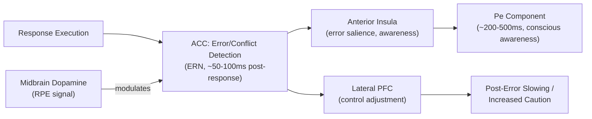

## Performance Monitoring and Error Detection

### Overview

Performance monitoring refers to the set of processes by which the cognitive system tracks the outcomes of its own actions, detects errors and response conflict, and evaluates whether current behavior is achieving intended goals. It is a core input to cognitive control: monitoring signals indicate *when* and *how much* additional control is needed, which is then implemented by lateral prefrontal cortex. The anterior cingulate cortex (ACC) is the central neural structure implicated in this function, though performance monitoring recruits a broader medial frontal network.

### Core Constructs

- **Key Points**:
  - **Error detection**: The rapid, often pre-conscious recognition that an executed response was incorrect relative to the intended or correct response.
  - **Conflict monitoring**: Detection of competition between simultaneously active, incompatible response representations, which can occur even on correct trials (e.g., incongruent Stroop trials).
  - **Reward prediction error (RPE)**: The discrepancy between expected and obtained outcome value, a signal central to reinforcement learning and to evaluative feedback monitoring.
  - **Post-error adjustments**: Behavioral changes following error commission, most classically **post-error slowing** (PES), interpreted as a strategic adjustment increasing response caution, though its exact cognitive origin (adaptive control vs. orienting/attentional disruption) is debated.

### Electrophysiological Signatures: ERN and Pe

Performance monitoring has been studied extensively using scalp EEG event-related potentials (ERPs), which provide millisecond-scale resolution of error-related neural activity.

- **Error-related negativity (ERN/Ne)**: A sharp, negative-going deflection at fronto-central electrode sites (maximal near FCz), peaking approximately 50–100 ms *after* an incorrect response, before conscious error awareness typically registers. The ERN is observed even on unaware errors, indicating it reflects an early, largely automatic error-detection process.
- **Error positivity (Pe)**: A later, more posterior-distributed positive deflection occurring approximately 200–500 ms post-response, more closely associated with conscious error awareness and the motivational/affective significance of the error, and more strongly modulated by error salience than the ERN.
- **Correct-related negativity (CRN)**: A smaller-amplitude negativity also observed following correct responses, at the same fronto-central sites as the ERN, used as a baseline comparator; the ERN is typically operationalized as larger in amplitude than the CRN rather than as an absolute deflection.
- **N2**: A related fronto-central negativity elicited by response conflict *prior* to response execution (e.g., on incongruent flanker trials), reflecting pre-response conflict detection rather than post-response error detection.

**Example**: In a speeded flanker task, a participant occasionally responds with the flanker-congruent (incorrect) hand due to fast, partially activated incorrect motor preparation. EEG recorded time-locked to the erroneous button press shows a pronounced ERN at FCz within roughly 100 ms of the response, considerably larger than the CRN observed on correct trials, even though the participant may not yet consciously realize an error occurred.

### Theoretical Models of the ERN

Two influential, partially complementary computational accounts explain the ERN:

1. **Mismatch/comparator model** (Falkenstein; Coles): The ERN reflects a comparison process between a representation of the actual, executed response and a representation of the correct response (derived from continued stimulus processing), with the ERN amplitude scaling with the magnitude of this mismatch.
2. **Conflict monitoring theory** (Botvinick, Carter, Cohen): The ERN reflects post-response conflict between the (incorrect) executed response representation and the (still partially active, correct) alternative response representation, generalizing the same conflict-detection mechanism proposed to explain the N2 and other pre-response conflict signals, unifying error and conflict detection under a single ACC-mediated process.
3. **Reinforcement-learning theory of the ERN** (Holroyd & Coles): Proposes the ERN reflects a negative reward-prediction-error signal, conveyed to ACC via a phasic dip in midbrain dopaminergic activity when an outcome is worse than expected, linking the ERN mechanistically to the broader dopaminergic RPE system implicated in reinforcement learning.

[Inference: these models are not fully mutually exclusive and the degree to which a single unified account versus multiple convergent generators best explains the full pattern of ERN findings remains an active area of research and debate.]

### Neural Substrates

- **Anterior cingulate cortex (dorsal ACC / pre-SMA region)**: The primary proposed intracranial generator of the ERN, supported by convergent evidence from EEG source localization, intracranial recordings, fMRI studies showing error/conflict-related BOLD increases in dorsal ACC, and lesion studies showing attenuated ERN following ACC damage.
- **Midbrain dopaminergic nuclei (VTA/SNc)**: Proposed as the source of the RPE signal that modulates ACC activity according to the reinforcement-learning account, consistent with dopaminergic phasic burst/dip signaling of positive/negative prediction errors described in broader reward-learning literature.
- **Anterior insula**: Co-activated with ACC in many performance-monitoring paradigms, particularly implicated in the affective/interoceptive salience of errors and in conscious error awareness, complementing ACC's more domain-general conflict/error detection role.
- **Lateral PFC (DLPFC/VLPFC)**: Recruited downstream of ACC monitoring signals to implement the specific control adjustment required (e.g., increased attentional focus, response caution, or strategy change), consistent with the general conflict-monitoring-to-control-implementation pipeline.

Below is a schematic of the performance-monitoring-to-control-adjustment pipeline.

### Behavioral Consequences: Post-Error Slowing and Adaptive Control

Following error commission, participants typically slow their responses on the subsequent trial (post-error slowing, PES), classically interpreted within conflict-monitoring/adaptive-control frameworks as a strategic shift toward more cautious, accuracy-favoring responding.

- **Adaptive control account**: PES reflects deliberate recruitment of additional top-down control (e.g., raising a response threshold in sequential-sampling decision models) to reduce the likelihood of a subsequent error.
- **Orienting/attentional account** (Notebaert et al.): PES instead (or additionally) reflects a transient attentional or arousal disruption caused by the infrequent, salient error event itself, diverting resources away from the task momentarily, rather than being a purposive strategic adjustment.
- Empirically, PES that is followed by *improved* accuracy on the post-error trial is more consistent with the adaptive account, while PES accompanied by *no improvement or further impairment* in accuracy is more consistent with the orienting/distraction account; findings across studies are mixed, suggesting both mechanisms likely contribute under different conditions. [Inference: the relative contribution of adaptive versus orienting mechanisms to PES likely varies with task parameters and individual differences, and a single unified account is not firmly established.]

### Reward Positivity and Feedback-Related Negativity

In tasks providing external feedback (rather than requiring internally generated error detection), a related ERP component — variably termed the **feedback-related negativity (FRN)** or, in its positive-going reinterpretation, the **reward positivity (RewP)** — is elicited by feedback stimuli and scales with the sign and magnitude of reward prediction error, providing a parallel index of outcome monitoring driven by external feedback rather than internally detected response errors. This component is similarly attributed to ACC generators modulated by dopaminergic RPE signaling, linking internally-generated (ERN) and externally-cued (FRN/RewP) performance monitoring within a common reinforcement-learning-based framework.

### Clinical and Individual-Differences Relevance

- **Anxiety disorders and obsessive-compulsive disorder (OCD)**: Enhanced ERN amplitude is one of the most robust and widely replicated electrophysiological findings in anxiety and OCD research, proposed as a marker of hyperactive error/threat monitoring; ERN amplitude has been investigated as a candidate endophenotype and biomarker for risk, though it is not diagnostically specific to any single disorder. [Inference: while the enhanced-ERN finding itself is well-replicated, its use as a clinically actionable biomarker for individual diagnosis or treatment selection remains under investigation rather than established practice.]
- **ADHD and externalizing disorders**: Reduced ERN amplitude is frequently reported, consistent with proposed hypoactive performance-monitoring/error-processing accounts of these conditions, in a pattern broadly opposite to the anxiety/OCD literature.
- **Development**: ERN amplitude increases across childhood and adolescence, paralleling ACC structural and functional maturation, and shows further refinement linked to individual differences in trait anxiety and behavioral inhibition during this period.

**Related Topics**

- Conflict monitoring theory and the anterior cingulate cortex
- Reinforcement learning and reward prediction error signaling
- Dual Mechanisms of Control (proactive/reactive) framework
- Sequential sampling models of decision-making (drift diffusion model)
- ERN as a transdiagnostic biomarker in anxiety and OCD
- Anterior insula and interoceptive awareness
- Feedback-related negativity and reward positivity
- Post-error slowing: adaptive control vs. orienting accounts