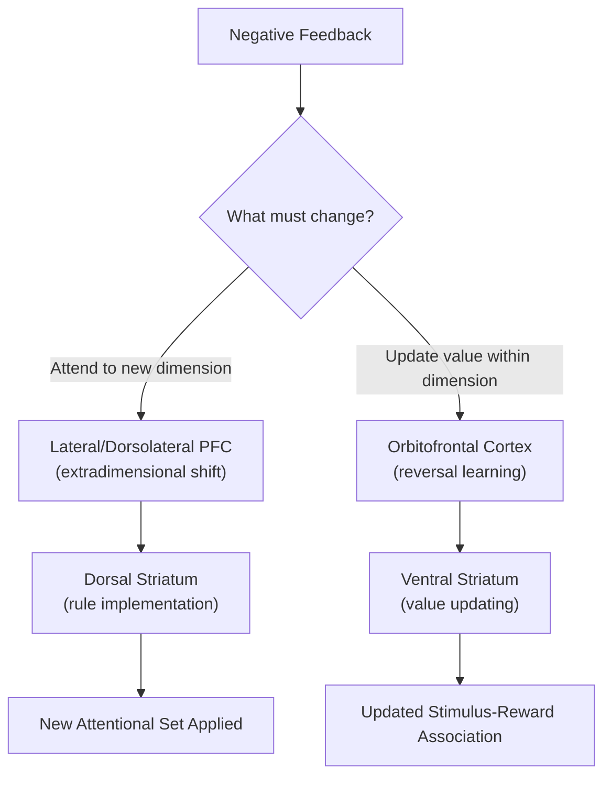

## Cognitive Flexibility

### Overview

Cognitive flexibility refers to the capacity to adaptively adjust behavior, thought, or attention in response to changing goals, rules, or environmental demands. It is closely related to, but conceptually broader than, task switching: while task switching specifically indexes the cost of reconfiguring task sets between trials, cognitive flexibility encompasses a wider range of adaptive processes including rule learning, set shifting, perspective taking, and creative/divergent problem reformulation. It is frequently treated as a higher-order or umbrella executive function construct that draws on shifting, inhibition, and working memory updating in combination.

### Core Constructs and Distinctions

- **Key Points**:
  - **Set shifting**: The ability to disengage from a currently active cognitive set (a rule, perspective, or response strategy) and engage an alternative set, most directly measured by task-switching paradigms and card-sorting tasks.
  - **Perseveration**: The pathological or exaggerated tendency to continue applying a previously relevant rule or response despite explicit feedback that it is no longer correct; the primary behavioral marker of impaired cognitive flexibility.
  - **Reversal learning**: A specific form of flexibility involving updating stimulus-outcome or response-outcome associations when previously rewarded contingencies are reversed, distinguishing flexibility driven by explicit rule change (set shifting) from flexibility driven by implicit value updating (reversal learning), which are dissociable both behaviorally and neurally.
  - **Attentional set formation and shifting**: A further distinction, drawn from the CANTAB Intra-/Extradimensional Set Shift task tradition, separates **intradimensional shifts** (a new rule within the same previously relevant stimulus dimension) from **extradimensional shifts** (a new rule requiring attention to shift to a previously irrelevant stimulus dimension), which are more difficult and depend on different neural substrates.

### The Wisconsin Card Sorting Task (WCST)

The WCST is the most widely used clinical and research measure of set-shifting flexibility. Participants sort cards varying along three dimensions (color, shape, number) according to a sorting rule inferred from feedback ("correct"/"incorrect"), and the correct sorting rule is changed periodically without warning.

- **Key dependent measures**:
  - **Perseverative errors**: Continuing to sort according to the previously correct (now incorrect) rule after negative feedback signals a rule change — the classic marker of impaired flexibility.
  - **Non-perseverative errors**: Errors not attributable to perseveration, often reflecting other sources of inefficient exploration or inattention.
  - **Categories achieved**: The number of consecutive correct sorts (typically 10) completed before the rule changes, an overall index of successful rule learning and adaptation.
  - **Failure to maintain set**: Errors occurring after a run of correct responses, suggesting lapses in sustained rule maintenance rather than failure to shift.

**Example**: A participant correctly learns to sort by color across several trials, receiving positive feedback. The examiner then covertly switches the correct rule to shape. A participant with impaired flexibility (e.g., following prefrontal damage) will continue sorting by color for many subsequent trials despite repeated "incorrect" feedback — a perseverative error pattern classically associated with frontal lobe dysfunction, historically observed in patients with dorsolateral prefrontal lesions.

### Neural Substrates: Dissociating Set Shifting from Reversal Learning

A substantial body of lesion and neuroimaging work, particularly from marmoset and macaque studies using the CANTAB ID/ED paradigm, demonstrates a double dissociation between the neural substrates of extradimensional set shifting and reversal learning, refining earlier, less differentiated views of "frontal" flexibility deficits.

| Process | Primary Substrate | Deficit Pattern When Damaged |
| --- | --- | --- |
| Extradimensional set shifting | Lateral/dorsolateral PFC | Selective impairment shifting attention to a new stimulus dimension; intradimensional shifts and reversal learning relatively spared |
| Reversal learning | Orbitofrontal cortex | Selective impairment updating stimulus-reward associations within an already-attended dimension; extradimensional shifting relatively spared |
| Intradimensional shift/discrimination learning | Less PFC-dependent; more reliant on posterior/temporal association cortex | Generally preserved with focal PFC lesions |

This dissociation indicates that "cognitive flexibility" is not subserved by a single unitary mechanism or brain region but fractionates into at least two distinguishable component processes with different computational demands: attentional re-orienting to previously irrelevant dimensions (lateral PFC) versus value updating within an attended dimension (OFC).

### Corticostriatal and Neurochemical Contributions

- **Dorsal striatum**: Implicated in aspects of rule learning and shifting, working in concert with PFC via frontostriatal loops; disruption impairs efficient rule acquisition.
- **Dopaminergic modulation**: Cognitive flexibility, particularly reversal learning, is sensitive to dopaminergic tone in PFC and striatum; both excessive and insufficient dopamine can impair flexible updating, consistent with an inverted-U dose-response relationship frequently reported in PFC dopamine pharmacology research. [Inference: the precise shape and individual-variability of this inverted-U relationship for flexibility specifically, as opposed to working memory more broadly, is less thoroughly characterized and remains an area of ongoing investigation.]
- **Serotonergic modulation**: Reversal learning specifically (more than extradimensional shifting) shows sensitivity to OFC serotonin depletion in primate studies, while dopamine depletion in the same region has a comparatively smaller effect, suggesting a degree of neurochemical specificity distinguishing serotonergic contributions to value-reversal from dopaminergic contributions to reward prediction and learning more broadly.

Below is a schematic contrasting the two dissociable flexibility circuits.

### Relationship to the Broader Executive Function Framework

Within the Miyake and Friedman unity/diversity model, "shifting" (cognitive flexibility, primarily operationalized via task-switching costs) is one of three correlated but separable core EF components alongside inhibition and updating. Flexibility tasks like the WCST load on the shared "common EF" latent factor as well as showing shifting-specific variance, and WCST perseverative errors specifically have also been linked in some analyses to inhibitory control demands (suppressing the now-incorrect, previously reinforced rule), illustrating the overlap between flexibility and inhibition constructs rather than a fully clean separation. [Inference: the degree to which WCST performance indexes a "pure" shifting construct versus a composite of shifting and inhibitory demands is debated in the individual-differences literature.]

### Clinical and Developmental Relevance

- **Frontal lobe lesions**: Classically associated with perseverative WCST performance, historically among the most cited neuropsychological findings linking dorsolateral PFC damage to inflexible, stimulus-bound behavior.
- **Schizophrenia**: Reliably shows increased WCST perseverative errors and reduced categories achieved, associated with reduced DLPFC activation during set-shifting demands; a frequently studied cognitive endophenotype in the disorder.
- **Autism spectrum conditions**: Associated in some studies with reduced flexibility on set-shifting and related tasks, proposed as a contributing mechanism to restricted, repetitive behavior patterns, though findings across studies and specific flexibility measures are heterogeneous. [Unverified: the consistency and specificity of set-shifting deficits across the full autism spectrum and across different flexibility paradigms is not fully resolved in the literature.]
- **Development**: Set-shifting flexibility, as measured by simplified card-sorting and dimensional change tasks (e.g., the Dimensional Change Card Sort for young children), shows marked improvement across the preschool and childhood years, with continued refinement into adolescence paralleling PFC maturation.
- **Aging**: Older adults typically show increased WCST perseverative errors and reduced categories achieved relative to younger adults, consistent with age-related decline in frontostriatal circuit efficiency, though the degree to which this reflects flexibility-specific decline versus generalized processing-speed reduction is debated. [Inference: as with other EF aging findings, dissociating flexibility-specific decline from broader age-related slowing remains methodologically challenging.]

**Next Steps**

- Task switching paradigms and switch-cost measurement (see related item)
- Reversal learning tasks and orbitofrontal cortex function (see related item)
- Wisconsin Card Sorting Task administration and scoring in neuropsychological assessment
- Dopaminergic and serotonergic modulation of prefrontal flexibility
- Miyake and Friedman's unity/diversity model of executive function
- Set-shifting deficits in schizophrenia and autism spectrum conditions
- Developmental trajectories of cognitive flexibility (Dimensional Change Card Sort)
- Corticostriatal loop models of rule learning and adaptation