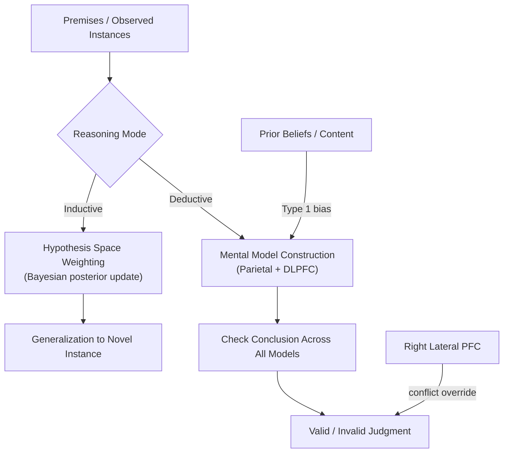

## Deductive and Inductive Reasoning

### Overview

Reasoning is the cognitive process of drawing conclusions from premises, evidence, or existing knowledge. **Deductive reasoning** draws conclusions that follow with logical necessity from given premises, such that if the premises are true, the conclusion must be true. **Inductive reasoning** draws probabilistic, generalizable conclusions that extend beyond the information given, such that even true premises support but do not guarantee the conclusion. These two modes of inference are studied both as distinct logical/normative systems and as dissociable cognitive processes with partially distinct neural substrates.

### Deductive Reasoning: Structure and Paradigms

- **Key Points**:
  - **Validity vs. truth**: A deductive argument is *valid* if the conclusion necessarily follows from the premises regardless of their actual real-world truth; validity is a property of argument structure, not content.
  - **Categorical syllogisms**: Arguments with two premises and a conclusion involving quantified categorical statements (All/No/Some/Some-not), e.g., "All A are B; All B are C; therefore All A are C" (valid) versus invalid forms that superficially resemble valid ones.
  - **Conditional reasoning**: Arguments involving "if-then" (material conditional) statements, with four canonical inference forms:
    - **Modus ponens** (valid): If P then Q; P; therefore Q.
    - **Modus tollens** (valid): If P then Q; not-Q; therefore not-P.
    - **Affirming the consequent** (invalid): If P then Q; Q; therefore P.
    - **Denying the antecedent** (invalid): If P then Q; not-P; therefore not-Q.
  - Modus tollens is reliably more difficult and error-prone for human reasoners than modus ponens, despite both being logically valid, a finding central to theories of reasoning difficulty discussed below.

### The Wason Selection Task

The Wason selection task is the canonical paradigm for studying conditional reasoning and rule-testing behavior. Participants are shown four cards (e.g., displaying "D," "K," "3," "7") representing a letter on one side and a number on the other, given a conditional rule (e.g., "If a card has a D on one side, it has a 3 on the other side"), and asked which cards must be turned over to test whether the rule is true.

- **Example**: The logically correct selection is the "D" card (testing for a violation via modus tollens-relevant logic: does it lack a 3?) and the "7" card (testing whether it has a D, which would violate the rule). Most participants correctly select "D" but incorrectly select "3" (seeking confirmation) rather than "7" (seeking a potential falsifying instance), reflecting a **confirmation bias** rather than a falsification/refutation strategy, contrary to the normatively correct Popperian falsificationist approach.
- **Content effects**: Performance improves dramatically when the abstract rule is replaced with a thematically familiar, deontic (permission/obligation) rule, such as "If a person is drinking alcohol, they must be over 18" tested with cards showing drink type and age. This **facilitation effect** is a central finding motivating theories that reasoning is supported by domain-specific rather than purely domain-general logical mechanisms.

### Theoretical Accounts of Deductive Reasoning

1. **Mental logic theory** (Rips; Braine): Proposes reasoners possess an internal set of abstract, content-independent formal inference rules (similar to natural deduction systems in formal logic) applied to mentally represented premises; errors arise from missing rules or misapplication, not from the absence of a logical faculty.
2. **Mental models theory** (Johnson-Laird): Proposes reasoners construct concrete mental models representing possible states of affairs consistent with the premises, and a conclusion is endorsed if it holds across all constructed models; errors arise primarily from failing to consider all relevant alternative models (a resource/working-memory-limited process), correctly predicting that problems requiring more alternative models produce more errors.
3. **Dual-process theories** (Evans; Stanovich): Distinguish a fast, intuitive, heuristic **Type 1** process (belief-based, pragmatic, content-sensitive) from a slower, effortful, working-memory-demanding **Type 2** process (abstract, rule-based, capable of overriding Type 1 output). The **belief-bias effect** — the tendency to judge conclusions as valid based on their real-world believability rather than logical structure — is a signature phenomenon explained by Type 1 output dominating unless Type 2 processing is engaged and successfully overrides it.

**Example of belief bias**: The syllogism "All flowers need water; roses need water; therefore roses are flowers" has a believable conclusion but is logically invalid (affirming a shared property does not establish category membership). Many participants incorrectly endorse it as valid due to the believability of the conclusion, illustrating Type 1 belief-based processing overriding correct Type 2 logical evaluation.

### Inductive Reasoning: Structure and Paradigms

- **Key Points**:
  - **Category-based induction**: Generalizing a property from one or more known category members (premises) to a novel target, e.g., "Robins have property X; therefore sparrows likely have property X," with strength judged by similarity and typicality relations between premise and conclusion categories.
  - **Premise diversity effect**: Inductive arguments with more diverse premise categories (e.g., "Lions and giraffes have property X" versus "Lions and tigers have property X") are judged stronger, because diverse premises more strongly suggest the property generalizes across the broader superordinate category, a finding well-predicted by similarity-coverage models of induction (Osherson et al.).
  - **Typicality effect**: Premises drawn from more typical category members support stronger inductive generalization to the superordinate category than premises drawn from atypical members.
  - **Hypothesis testing and generalization under uncertainty**: A broader inductive process involving inferring underlying rules, categories, or causal structures from limited observed instances, studied extensively in concept-learning and Bayesian models of cognition.

### Bayesian and Probabilistic Models of Induction

Contemporary computational accounts frame inductive reasoning as approximate Bayesian inference, in which prior beliefs about hypothesis plausibility are updated in light of observed evidence.

$$P(h|d) = \frac{P(d|h) \cdot P(h)}{\sum_{h' \in H} P(d|h') \cdot P(h')}$$

where $P(h|d)$ is the posterior probability of hypothesis $h$ given observed data $d$, $P(d|h)$ is the likelihood of the data under that hypothesis, $P(h)$ is the prior probability of the hypothesis, and the denominator normalizes across the full hypothesis space $H$.

**Example**: In Tenenbaum's "number game" paradigm, participants are shown example numbers (e.g., 16, 8, 2, 64) and asked to judge which other numbers likely belong to the same underlying rule-generated set. Human generalization judgments (e.g., strongly favoring "powers of 2" over a broader "even numbers" hypothesis after seeing these specific examples) are well-predicted by Bayesian models weighting hypothesis likelihood (how well a hypothesis explains the specific observed sample, penalizing overly broad hypotheses via a size-principle/Occam's-razor-like mechanism) against prior plausibility of candidate rules.

### Neural Substrates

- **Left ventrolateral and dorsolateral PFC**: Broadly implicated across both deductive and inductive reasoning tasks, consistent with the domain-general working-memory and relational-integration demands common to most reasoning tasks.
- **Rostrolateral/frontopolar PFC (BA 10)**: Specifically implicated in **relational integration** — combining multiple independent premises or relations into a single coherent conclusion — a demand common to complex multi-premise syllogisms and analogical reasoning, consistent with frontopolar cortex's broader role in integrating multiple cognitive operations.
- **Parietal cortex (bilateral, often more prominent for well-formed, spatially/visually represented arguments)**: Engaged particularly when reasoning can be supported by visuospatial mental model construction, consistent with mental models theory's emphasis on spatial/model-based representation.
- **Left inferior frontal gyrus and temporal cortex**: More engaged during belief-based and content-rich (as opposed to abstract, content-free) reasoning, consistent with dual-process accounts implicating semantic/pragmatic knowledge retrieval in Type 1 processing.
- **Right lateral PFC**: Implicated in detecting and resolving belief-logic conflict, particularly in overriding a believable but invalid conclusion, consistent with dual-process theories' emphasis on effortful Type 2 override of default heuristic responses.

Below is a schematic contrasting deductive validity-checking and inductive generalization processes.

### Clinical and Developmental Relevance

- **Development**: Both deductive and inductive reasoning show protracted developmental trajectories; abstract, content-independent deductive reasoning (e.g., resisting belief bias on unbelievable-but-valid syllogisms) continues improving into adolescence, paralleling PFC maturation and increasing Type 2 processing capacity.
- **Frontal lobe damage**: Patients with PFC lesions, particularly involving rostral/frontopolar regions, show selective impairment on multi-premise reasoning requiring relational integration, while simpler single-premise or highly familiar reasoning may remain relatively preserved.
- **Aging**: Older adults show increased reliance on belief-based (Type 1) responding and greater susceptibility to belief bias in syllogistic reasoning, consistent with reduced Type 2/working-memory-dependent override capacity, though findings interact with content familiarity and education level. [Inference: the degree to which this reflects a specific reasoning deficit versus a general age-related shift toward heuristic processing strategies across cognitive domains is debated.]

**Related Topics**

- Dual-process theories of cognition (Kahneman's System 1/System 2)
- Bayesian models of cognition and concept learning
- Analogical reasoning and relational integration
- Belief bias and motivated reasoning
- Decision-making under uncertainty and heuristics/biases
- Rostrolateral prefrontal cortex and relational complexity
- Wason selection task variants and deontic reasoning
- Similarity-coverage models of category-based induction