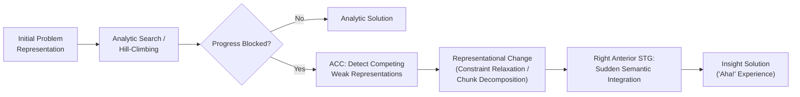

## Problem Solving and Insight

### Overview

Problem solving is the cognitive process of identifying and applying a sequence of operations to move from an initial state to a goal state when the solution path is not immediately obvious. It is traditionally divided into **analytic (incremental) problem solving**, characterized by stepwise, consciously monitored progress, and **insight problem solving**, characterized by a sudden, often unexpected restructuring of the problem representation that yields the solution abruptly — the classic "Aha!" or "Eureka" experience. Both are studied through well-defined problem-space frameworks and, for insight specifically, through distinctive phenomenological and neural signatures.

### The Problem-Space Framework

- **Key Points**:
  - **Newell and Simon's problem-space theory**: Formalizes problem solving as search through a **problem space** consisting of an initial state, a goal state, a set of intermediate states, and a set of legal operators that transform one state into another; solving a problem amounts to finding a path (sequence of operator applications) from the initial state to the goal state.
  - **Well-defined vs. ill-defined problems**: Well-defined problems have a clearly specified initial state, goal state, and operator set (e.g., Tower of Hanoi); ill-defined problems lack full specification of one or more of these components (e.g., "improve public transportation"), requiring the solver to first impose structure on the problem itself.
  - **Search heuristics**: Because exhaustive search of large problem spaces is computationally intractable, human problem solvers rely on heuristics such as **means-end analysis** (iteratively reducing the difference between current and goal states) and **hill-climbing** (selecting the operator producing the greatest immediate improvement, which can fail in problems requiring temporary movement away from the goal).

### Insight Problem Solving: Phenomenology and Classic Paradigms

Insight problems are characterized by an initial period of impasse — a state in which the solver feels stuck and existing strategies fail to make progress — followed by a sudden restructuring that reveals the solution, often accompanied by high solver confidence and surprise at the abruptness of the realization.

- **Candle problem (Duncker)**: Participants must attach a lit candle to a wall using only a box of tacks, a candle, and matches, such that wax does not drip on the floor below. The solution requires recognizing that the tack box itself can serve as a platform (emptying it and tacking it to the wall) — a function not suggested by its typical use as a container, illustrating **functional fixedness**: fixation on an object's conventional function that blocks recognition of alternative uses.
- **Nine-dot problem**: Participants must connect nine dots arranged in a 3×3 grid using four straight lines without lifting the pen. The solution requires extending lines beyond the imagined boundary of the grid, illustrating how self-imposed, unstated constraints (assuming lines must stay within the grid) can block solution discovery until the constraint is recognized and relaxed.
- **Remote Associates Test (RAT; Mednick)**: Participants are given three words (e.g., "cottage," "swiss," "cake") and must find a single word that forms a compound or associate with all three (here, "cheese"). Widely used as a quantifiable, easily-scored proxy for insight-based problem solving in laboratory and neuroimaging research, since solutions are frequently reported as arriving via sudden realization.
- **Mutilated checkerboard problem**: A checkerboard with two opposite-corner squares removed cannot be tiled by dominoes (each covering two adjacent squares); recognizing this requires an insight-based restructuring (realizing the removed corners are the same color, so the remaining squares are numerically imbalanced across colors) rather than exhaustive attempted tiling.

### Theoretical Accounts of Insight

1. **Representational change theory** (Ohlsson; Knoblich): Impasse occurs because the solver has constructed an inappropriate or overly constrained initial problem representation; insight occurs when this representation is restructured, through mechanisms including **constraint relaxation** (abandoning an unstated, self-imposed constraint) and **chunk decomposition** (breaking apart a perceptually or conceptually fused unit into its functional components, as in recognizing the tack box as separable from "container").
2. **Progress monitoring theory** (MacGregor, Ormerod, Chronicle): Proposes solvers use a criterion-based heuristic (e.g., hill-climbing toward apparent proximity to the goal) and reach impasse when this heuristic signals no further progress is possible using the current approach, prompting a shift to alternative strategies.
3. **Opportunistic assimilation / unconscious processing accounts**: Propose that during impasse, relevant associative or weakly activated knowledge continues to be processed outside conscious awareness (sometimes invoked to explain benefits of incubation periods away from a problem), eventually surfacing as the sudden "Aha!" experience once a relevant weak association crosses an activation threshold. [Inference: the degree to which insight specifically requires unconscious processing distinct from conscious analytic search, versus reflecting the same search mechanisms simply becoming consciously accessible at a discrete threshold, remains debated in the cognitive literature.]

### Neural Substrates of Insight

- **Right anterior superior temporal gyrus (aSTG)**: Shows a burst of gamma-band EEG activity and increased fMRI BOLD signal specifically time-locked to insight-based (relative to analytic) solutions in RAT-type paradigms, proposed as reflecting the sudden integration of remotely associated semantic information characteristic of restructuring.
- **Anterior cingulate cortex**: Shows increased activity preceding insight solutions, proposed to reflect detection of weak, competing problem representations and the need to shift attention away from a dominant but unproductive solution approach, consistent with ACC's broader conflict-monitoring role.
- **Alpha-band activity over right occipital cortex**: A transient increase in right-hemisphere alpha power (associated with reduced visual input processing) has been reported immediately preceding insight solutions, interpreted as reflecting a brief "gating" of external visual input that may facilitate internally-directed, associative processing supporting restructuring. [Inference: the functional necessity versus incidental correlation of this alpha-gating effect for insight specifically is not fully established.]
- **Prefrontal cortex (broadly)**: Implicated in impasse detection, strategy monitoring, and maintaining the problem goal during the search process, consistent with its domain-general executive control role, though insight-specific PFC contributions (as distinct from general problem-solving PFC engagement) remain an active area of investigation.

Below is a schematic of the classic impasse-restructuring-insight sequence.

### Facilitating and Hindering Factors

- **Incubation effects**: A period away from active work on a problem, particularly following impasse, has been reported to improve subsequent insight problem-solving success in some studies, though effect sizes and the underlying mechanism (unconscious processing vs. simple forgetting of misleading constraints/fixation) remain debated. [Unverified: incubation effects on insight are not consistently replicated across all study designs and problem types, and their mechanistic basis is contested.]
- **Positive affect**: Some studies report that mild positive mood increases insight problem-solving success (e.g., on RAT-type tasks), proposed to operate via broadened attentional scope facilitating remote associative activation, consistent with broaden-and-build theories of positive emotion, though this finding shows variable replication across labs. [Inference: the reliability and boundary conditions of mood effects on insight remain an area of mixed empirical support.]
- **Functional fixedness reduction**: Prior exposure to an object being used in a non-standard way (e.g., seeing a box used as something other than a container) reduces functional fixedness and improves subsequent insight problem performance, a well-replicated manipulation supporting the representational change account.
- **Expertise and analogical transfer**: Prior exposure to a structurally analogous problem can facilitate insight on a target problem, but only if the solver recognizes the deep structural correspondence rather than superficial surface features — a notoriously difficult transfer that typically requires explicit hinting in laboratory studies (e.g., in Gick and Holyoak's classic radiation/fortress problem-analogy paradigm).

### Clinical and Individual-Differences Relevance

- **Frontal lobe damage**: Patients with prefrontal lesions, particularly involving regions implicated in cognitive flexibility and inhibitory control, often show impaired ability to abandon an unproductive problem-solving strategy, consistent with a specific difficulty disengaging from an initial (incorrect) representation rather than a general inability to solve problems.
- **Individual differences in working memory capacity**: Show mixed relationships with insight problem-solving success; some studies suggest higher working memory capacity aids constraint relaxation and strategy monitoring, while others suggest very high analytic/WM engagement can promote fixation on an unproductive strategy, potentially impeding restructuring. [Inference: the relationship between working memory capacity and insight-specific (as opposed to general analytic) problem solving remains an unresolved and actively studied question.]
- **Creativity research overlap**: Insight problem solving is frequently studied as a laboratory proxy for broader creative cognition, though the degree to which laboratory insight-problem performance generalizes to real-world creative achievement is a matter of ongoing methodological debate.

**Next Steps**

- Analogical reasoning and structural mapping theory
- Functional fixedness and design fixation in applied problem solving
- Divergent thinking and creativity assessment paradigms
- Gamma-band and alpha-band EEG correlates of cognitive restructuring
- Anterior cingulate cortex and conflict/impasse detection
- Incubation and unconscious thought theory
- Expertise effects on problem representation and chunking
- Deductive and inductive reasoning (see related item)