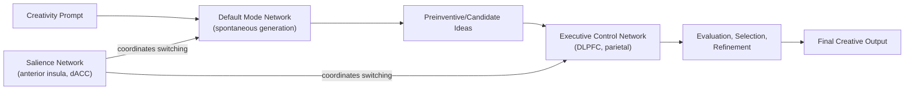

## Creativity and Divergent Thinking

### Overview

Creativity is the cognitive capacity to generate ideas, solutions, or products that are both **novel** (original, statistically infrequent) and **useful/appropriate** (valuable, task-relevant, or meaningful within a given context) — a dual-criterion definition widely adopted across creativity research. **Divergent thinking** is the specific cognitive process of generating multiple, varied possible solutions or ideas from a single starting point, contrasted with **convergent thinking**, which narrows multiple possibilities toward a single correct or best solution. While divergent thinking is one of the most studied laboratory proxies for creative potential, creativity as a broader construct also depends substantially on convergent, evaluative, and domain-specific knowledge processes.

### Guilford's Structure of Intellect and the Divergent/Convergent Distinction

- **Key Points**:
  - J.P. Guilford introduced the divergent/convergent distinction within his Structure of Intellect model, proposing that traditional intelligence tests overwhelmingly measure convergent thinking (single correct-answer problems), systematically neglecting divergent production abilities relevant to creative achievement.
  - **Divergent thinking** is typically assessed via open-ended generation tasks (e.g., "list unusual uses for a brick"), scored along multiple dimensions rather than a single accuracy score.
  - **Convergent thinking** is assessed via tasks with a single correct or best answer (e.g., the Remote Associates Test), and remains important for creativity insofar as idea generation must ultimately be evaluated, selected, and refined into a workable, useful output.

### Scoring Dimensions of Divergent Thinking

Divergent thinking tasks, most classically the **Alternative Uses Task (AUT)** and **Torrance Tests of Creative Thinking (TTCT)**, are scored along four canonical dimensions originally proposed by Guilford and Torrance:

| Dimension | Definition |
| --- | --- |
| Fluency | Total number of distinct, valid ideas generated |
| Flexibility | Number of distinct conceptual categories represented across generated ideas |
| Originality | Statistical infrequency of an idea relative to a normative sample (or, in newer methods, semantic distance from the prompt) |
| Elaboration | Amount of detail and development added to a given idea |

**Example**: Given the prompt "list unusual uses for a paperclip," a response set of {"hold papers," "hold a stack of napkins," "clean under fingernails," "make a small sculpture," "use as a lock pick"} would score moderately high on fluency (5 ideas), reasonably high on flexibility (spanning fastening, hygiene, art, and security categories), and variable originality depending on how commonly each specific response appears in normative scoring databases — "hold papers" would score low in originality (highly typical), while "use as a lock pick" would likely score higher.

### Computational and Semantic-Distance Scoring Methods

Contemporary divergent-thinking research increasingly supplements or replaces manual, rater-based originality scoring with automated **semantic distance** measures derived from distributional semantic models (e.g., latent semantic analysis or word-embedding models such as word2vec/GloVe), operationalizing originality as the cosine distance between the vector representation of the prompt word and the vector representation of the generated response.

$$\text{Semantic distance}(prompt, response) = 1 - \cos(\vec{v}_{prompt}, \vec{v}_{response}) = 1 - \frac{\vec{v}_{prompt} \cdot \vec{v}_{response}}{\lVert \vec{v}_{prompt} \rVert \, \lVert \vec{v}_{response} \rVert}$$

Higher semantic distance scores correlate with human originality ratings and with other established creativity measures, offering a more scalable and reproducible scoring approach than traditional normative frequency counting, though it captures semantic remoteness rather than directly capturing usefulness/appropriateness, which still typically requires separate evaluation. [Inference: while semantic-distance scoring shows good convergent validity with traditional human-rated originality in multiple studies, the degree to which it fully captures the "usefulness" component of the dual creativity criterion, as opposed to novelty alone, is an acknowledged limitation actively discussed in the methodological literature.]

### Theoretical Models of the Creative Process

1. **Associative theory of creativity** (Mednick): Proposes creative ideation reflects the activation and combination of remote, weakly associated concepts within a hierarchically organized associative memory network; individuals with "flatter" associative hierarchies (more evenly distributed associative strength across many associates, rather than a few dominant, highly typical associates) are hypothesized to generate more original responses. This theory directly motivated the Remote Associates Test as a creativity proxy.
2. **Geneplore model** (Finke, Ward, Smith): Proposes a two-phase process alternating between a **generative phase**, producing preliminary "preinventive structures" (loosely formed candidate ideas or mental structures) through processes like mental synthesis, transformation, and analogical transfer, and an **exploratory phase**, in which these structures are evaluated, interpreted, and elaborated into a final creative product, explicitly integrating divergent (generative) and convergent (exploratory/evaluative) processes into a single iterative cycle.
3. **Dual-process/dynamic models** (Beaty and colleagues): Propose creative cognition involves a dynamic interplay between processes associated with the default mode network (spontaneous, associative idea generation) and the executive control network (goal-directed evaluation, selection, and refinement of generated ideas), with the salience network proposed to help coordinate switching between these typically anti-correlated networks according to task demands.

### Neural Substrates

- **Default mode network (DMN; medial PFC, posterior cingulate/precuneus, angular gyrus, lateral temporal cortex)**: Consistently implicated in divergent thinking and spontaneous idea generation, consistent with its broader role in internally-directed cognition, mind-wandering, and associative memory retrieval; DMN activity/connectivity during divergent thinking tasks has been linked to higher originality scores in several neuroimaging studies.
- **Executive control network (DLPFC, posterior parietal cortex)**: Implicated in the evaluative, goal-directed refinement and selection of generated ideas, and in maintaining task constraints during generation (e.g., staying on-topic while generating unusual uses).
- **Salience network (anterior insula, dorsal ACC)**: Proposed to mediate dynamic switching between DMN-dominant generative states and executive-control-dominant evaluative states, consistent with the broader triple-network model of large-scale brain organization applied to creative cognition.
- **Right anterior superior temporal gyrus**: As in insight problem solving, implicated in original, remote semantic integration during creative idea generation, consistent with overlap between insight and creativity research traditions.

Below is a schematic of the proposed dynamic DMN-executive network interplay during creative ideation.

### Relationship to Intelligence and Domain Knowledge

- **Threshold hypothesis**: Proposes that intelligence and creativity are positively correlated only up to a moderate IQ threshold (historically often cited around 120), beyond which the relationship weakens substantially, such that above-threshold variation in creative achievement is better predicted by other factors (personality, motivation, domain expertise) than by further IQ increases. Empirical support for a strict threshold is mixed, with some large-sample analyses instead supporting a continuous, non-thresholded positive correlation of modest magnitude. [Unverified: whether a genuine threshold effect exists, versus a continuous correlation, remains actively debated and appears sensitive to sample and measurement differences across studies.]
- **Domain-specific expertise**: Real-world creative achievement (as opposed to laboratory divergent-thinking scores) typically requires substantial domain-specific knowledge and skill, consistent with expertise-based accounts proposing that creative breakthroughs emerge from deep, well-organized domain knowledge combined with, rather than substituted by, generative/divergent thinking ability.

### Clinical and Individual-Differences Relevance

- **Openness to experience**: The personality trait most consistently and strongly correlated with divergent thinking performance and self-reported creative achievement across the Big Five personality literature.
- **Latent inhibition and schizotypy**: Reduced latent inhibition (a reduced tendency to filter out previously irrelevant stimuli from current processing) has been proposed as a shared mechanism potentially linking creativity to schizotypal traits, based on findings that both high creative achievement and schizotypal personality traits are sometimes associated with reduced latent inhibition, particularly among individuals with high cognitive capacity to manage the resulting broadened, less-filtered associative processing. [Inference: this proposed link is one influential but contested account, and the broader relationship between creativity and psychopathology risk is a heterogeneous, actively debated area rather than a settled finding.]
- **ADHD**: Some studies report elevated divergent-thinking fluency and originality scores in individuals with ADHD or ADHD traits, potentially related to reduced inhibitory filtering of associative processing, though findings are mixed and may depend on specific task and symptom-profile characteristics. [Unverified: the relationship between ADHD and creative cognition shows inconsistent findings across studies and is not established as a reliable, generalizable effect.]

**Related Topics**

- Problem solving and insight (see related item)
- Default mode network function and mind-wandering
- Associative memory models and semantic network structure
- Personality correlates of creativity (Openness, Big Five)
- Latent inhibition and its role in cognitive filtering
- Triple-network model of large-scale brain organization (DMN, ECN, salience)
- Expertise, domain knowledge, and real-world creative achievement
- Analogical reasoning and remote semantic integration