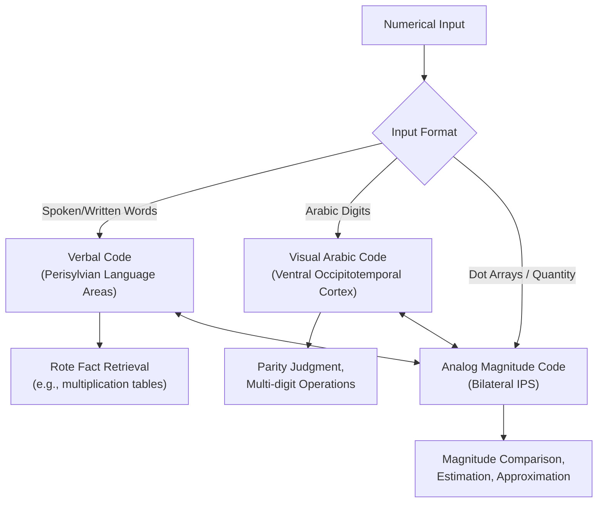

## Numerical Cognition and the Parietal Cortex

### Overview

Numerical cognition encompasses the mental representation and processing of number, magnitude, and quantity, spanning innate, evolutionarily conserved approximate magnitude systems shared with non-human animals and preverbal infants, through to culturally acquired symbolic and arithmetic competence. The parietal cortex, particularly the intraparietal sulcus (IPS), is the most consistently implicated neural substrate across this range of numerical processes, though numerical cognition also depends critically on interactions with prefrontal, temporal, and occipital regions.

### Core Constructs

- **Key Points**:
  - **Approximate number system (ANS)**: An evolutionarily ancient, non-symbolic system for estimating and comparing numerical magnitudes without exact counting, obeying Weber's law (discriminability depends on the ratio between two quantities rather than their absolute difference), present in human infants, adults, and numerous non-human species.
  - **Exact number representation**: The capacity for precise numerical processing, in humans supported by symbolic systems (number words, Arabic digits) and culturally transmitted counting procedures, largely absent or severely limited in non-human animals and pre-symbolic children.
  - **Subitizing**: The capacity to rapidly and accurately apprehend small quantities (typically up to 3-4 items) without deliberate counting, distinguished from counting by its characteristically flat reaction-time function across this small range, contrasted with the steeper, roughly linear RT increase per item observed once counting is required for larger sets.
  - **Number sense**: A broader term encompassing both the ANS and early-developing intuitions about numerical relationships (more/less, ordinality), foundational to subsequent symbolic mathematical development.

### The Triple-Code Model

Dehaene's influential **triple-code model** proposes that numbers are mentally represented in three partially independent formats, each associated with a distinct neural substrate and functionally specialized for different numerical tasks:

| Code | Representation | Primary Substrate | Associated Functions |
| --- | --- | --- | --- |
| Analog magnitude code | Approximate, spatially-organized representation of quantity | Bilateral intraparietal sulcus (IPS) | Magnitude comparison, estimation, approximation |
| Verbal code | Number words as auditory/phonological sequences | Perisylvian language areas (left-lateralized) | Rote arithmetic fact retrieval (e.g., memorized multiplication tables), counting |
| Visual Arabic code | Digit string representation (e.g., "42") | Bilateral ventral occipitotemporal cortex (including a proposed "number form area") | Parity judgment, multi-digit operations, reading/writing numerals |

This model predicts and explains dissociations observed in numerical cognition research: for example, patients with acalculia following left perisylvian damage may lose rote-memorized multiplication facts (verbal code) while retaining the ability to compare magnitudes or perform approximate calculation (analog magnitude code), while patients with parietal damage may show the reverse pattern.

### The Intraparietal Sulcus and the Mental Number Line

- The **horizontal segment of the intraparietal sulcus (hIPS)** shows the most consistent and specific activation across numerical magnitude tasks in neuroimaging studies, irrespective of input format (spoken number words, Arabic digits, or non-symbolic dot arrays), supporting its proposed role as a format-independent, abstract magnitude representation, though the degree of true format-independence versus partially format-specific subpopulations remains debated. [Inference: whether IPS magnitude coding is fully abstract/notation-independent or reflects a mixture of overlapping but partially format-specific neural populations is an actively investigated question, with some single-unit and adaptation studies suggesting partial format specificity.]
- **Mental number line**: A widely supported metaphor proposing that numerical magnitudes are represented along an implicit, spatially organized continuum, typically oriented left-to-right (smaller-to-larger) in cultures with left-to-right reading/writing systems, though orientation shows cross-cultural variation consistent with reading direction and other cultural factors.
- **Distance effect**: Reaction time and error rate in magnitude comparison tasks (e.g., "which is larger, 7 or 9?") decrease as the numerical distance between the two numbers increases, reflecting the overlapping, ratio-sensitive tuning curves of the underlying analog magnitude representation.
- **Size effect**: For a fixed numerical distance, comparison is slower and more error-prone for larger numbers than smaller numbers (e.g., discriminating 2 vs. 4 is easier than discriminating 52 vs. 54), consistent with Weber's law and the compressive, roughly logarithmic scaling proposed for the underlying magnitude representation.

**Example**: In a standard magnitude comparison task, participants judge which of two simultaneously presented digits is numerically larger. Comparing 2 vs. 9 (large distance) produces faster, more accurate responses than comparing 7 vs. 8 (small distance) — the distance effect — and this effect is more pronounced when comparing pairs like 82 vs. 83 than pairs like 2 vs. 3, despite equal absolute distance — the size effect — jointly consistent with a compressed, ratio-sensitive analog magnitude code centered on IPS.

### Numerical-Spatial Interactions: The SNARC Effect

The **Spatial-Numerical Association of Response Codes (SNARC) effect** demonstrates that even when spatial position is entirely task-irrelevant, numerical magnitude automatically activates spatial response codes: participants respond faster to relatively smaller numbers with a left-side response and faster to relatively larger numbers with a right-side response (in left-to-right reading cultures), providing behavioral evidence for the spatially organized mental number line and for close functional coupling between numerical and spatial processing within parietal cortex, consistent with the IPS's broader established role in visuospatial attention and spatial working memory.

Below is a schematic of the triple-code model and its associated substrates.

### Developmental Origins

- **Infant numerical competence**: Preverbal infants, using looking-time (violation-of-expectation) paradigms, show sensitivity to approximate numerical changes (e.g., dishabituating to a change from 8 to 16 dots but not from 8 to 12, respecting Weber-law ratio sensitivity), indicating the ANS is present prior to language acquisition and formal numerical instruction.
- **ANS acuity and later mathematical achievement**: Individual differences in ANS precision (typically indexed by the Weber fraction in non-symbolic magnitude comparison tasks) in early childhood correlate with later symbolic mathematics achievement in several longitudinal studies, motivating hypotheses that the ANS provides a foundational, non-symbolic scaffold for symbolic number learning, though the strength, causal direction, and practical/educational significance of this relationship remain actively debated. [Unverified: whether ANS training causally improves symbolic math ability, versus both simply sharing common underlying developmental or IPS-related factors, is not firmly established, and some studies report weak or null correlations.]
- **Symbolic mapping**: A developmentally critical process is the mapping of newly acquired symbolic number words and digits onto the pre-existing approximate magnitude representation, with increasing precision and speed of this mapping throughout early childhood, associated with maturation of parietal-frontal circuitry supporting numerical processing.

### Clinical Relevance: Dyscalculia and Acalculia

- **Developmental dyscalculia**: A specific learning disability characterized by persistent difficulty acquiring basic numerical and arithmetic competence despite otherwise typical intelligence and educational opportunity, associated in several structural and functional neuroimaging studies with reduced gray matter volume and atypical activation patterns in the IPS, consistent with a proposed core deficit in the ANS or in accessing/manipulating the analog magnitude representation. [Inference: while IPS involvement is well-replicated, whether developmental dyscalculia reflects a unitary core-deficit mechanism versus a heterogeneous set of distinct underlying causes converging on similar behavioral profiles remains an actively debated question in the field.]
- **Acquired acalculia**: Impairment in numerical processing following brain damage, most classically associated with left parietal lesions (particularly around the angular gyrus and IPS), often co-occurring with other features of Gerstmann syndrome (finger agnosia, left-right disorientation, agraphia) when damage involves the left angular gyrus region, though the syndrome's status as a coherent, unitary clinical entity versus a coincidental co-occurrence of separable deficits from adjacent lesions has been debated. [Inference: the coherence of Gerstmann syndrome as reflecting a single underlying functional-anatomical module, as opposed to co-occurring but mechanistically separable deficits from nearby but distinct cortical damage, remains a matter of ongoing debate in the clinical neuropsychology literature.]
- **Dissociations informing the triple-code model**: Documented cases of selective sparing/impairment of rote arithmetic fact retrieval versus magnitude comparison/estimation following different lesion locations provide key convergent clinical evidence for the triple-code model's proposed dissociation between verbal and analog magnitude representations.

**Next Steps**

- Weber's law and psychophysical magnitude scaling
- Mental number line and the SNARC effect in depth
- Developmental dyscalculia: diagnosis and intervention approaches
- Gerstmann syndrome and left angular gyrus function
- Cross-cultural and cross-linguistic studies of number cognition
- Arithmetic fact retrieval and rote memory systems
- Comparative cognition: numerical abilities in non-human animals
- Working memory and executive contributions to complex arithmetic