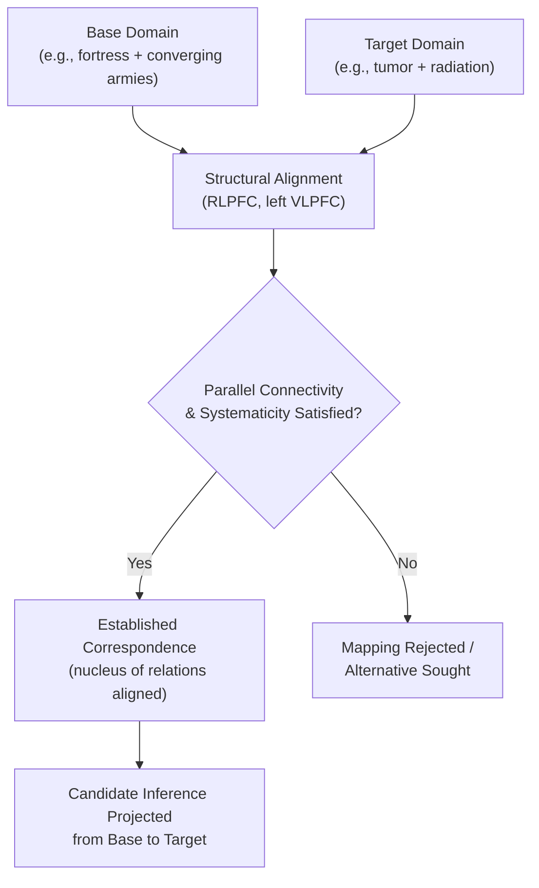

## Analogical Reasoning

### Overview

Analogical reasoning is the cognitive process of identifying and exploiting structural correspondences between a familiar **base (source) domain** and a less familiar **target domain**, enabling knowledge, inferences, or solutions from the base to transfer to the target despite differing surface content. It is considered a central mechanism of human higher-order cognition, underlying learning, problem solving, scientific discovery, and language comprehension (e.g., metaphor), and is distinguished from superficial similarity judgments by its emphasis on relational, rather than featural, correspondence.

### Core Constructs

- **Key Points**:
  - **Structural alignment**: The process of establishing a systematic correspondence (mapping) between elements of the base and target domains based on their relational roles rather than their surface features.
  - **Systematicity principle** (Gentner): Mappings that preserve higher-order, interconnected relational structure (a coherent system of relations, e.g., causal chains) are preferred over mappings based on isolated, unconnected relational or featural matches, even when the latter are more numerous.
  - **Surface vs. structural similarity**: Surface similarity refers to shared superficial features or objects between base and target (e.g., both stories involve a knight); structural similarity refers to shared underlying relational structure (e.g., both stories involve an agent overcoming an obstacle through indirect, distributed means), which is the component specifically responsible for productive analogical inference.
  - **Relational shift**: A developmental phenomenon in which younger children rely more heavily on surface/featural similarity in analogy tasks, while structural/relational similarity processing becomes increasingly dominant with age and increasing relational knowledge, rather than reflecting a fixed maturational ceiling on relational reasoning capacity per se.

### Structure-Mapping Theory

Gentner's structure-mapping theory (SMT) is the most influential and empirically supported account of analogical processing, proposing that analogy comprehension proceeds through a structured alignment process governed by specific mapping principles:

1. **One-to-one correspondence**: Each element in the base maps to at most one element in the target, and vice versa.
2. **Parallel connectivity**: If two relations are aligned, their arguments must also be aligned in a structurally consistent manner (e.g., if "cause(A,B)" in the base maps to "cause(C,D)" in the target, then A must map to C and B must map to D, not some other pairing).
3. **Systematicity**: Preference is given to mappings supported by a coherent, hierarchically connected system of relations (e.g., a causal chain of several linked relations) over mappings based on isolated matching relations, even if the isolated matches are individually plausible.

**Example**: The classic analogy "an atom is like the solar system" maps the nucleus to the sun and electrons to planets, not based on any surface similarity (a nucleus does not resemble a star), but based on shared relational structure: the nucleus/sun is a large central mass, electrons/planets orbit around it, and (in the classical Rutherford model) an attractive force (electromagnetic/gravitational) maintains the orbit. The systematicity principle predicts that this coherent, causally connected relational structure supports a much more compelling and inferentially productive analogy than an alternative mapping based merely on shared surface features (e.g., both containing round objects).

### Structural Alignment as a General Comparison Process

Structure-mapping principles are proposed to apply not only to cross-domain analogy but to comparison processing more generally, including literal similarity judgments (high surface and structural overlap) and metaphor (typically lower surface, higher structural overlap), positioning analogy as one point along a continuum of comparison types rather than a categorically distinct process, an idea formalized in the broader **structure-mapping engine (SME)** computational model, which implements structural alignment as a constraint-satisfaction process over relational graph representations of base and target.

| Comparison Type | Surface Similarity | Structural (Relational) Similarity | Example |
| --- | --- | --- | --- |
| Literal similarity | High | High | "This lecture is like last week's lecture" |
| Analogy | Low | High | "The atom is like the solar system" |
| Mere-appearance match | High | Low | "The clouds looked like a rabbit" (surface shape only) |
| Anomaly / unrelated | Low | Low | No meaningful comparison supported |

### Progressive Alignment and Relational Category Learning

**Progressive alignment** (Kotovsky & Gentner) describes a developmental/learning mechanism in which comparing pairs of highly similar (both surface- and structurally-similar) examples first facilitates the extraction of shared relational structure, which then supports subsequent recognition of that same structure in more surface-dissimilar (far) analogies — a stepwise bootstrapping process from easy, near comparisons to more difficult, far comparisons. This mechanism is proposed to explain how abstract relational categories and schemas are gradually extracted from concrete comparison experience over development and learning.

### Analogical Transfer and Problem Solving

A substantial applied literature examines whether solving one problem (the base) facilitates solving a structurally analogous but surface-dissimilar target problem, most notably in Gick and Holyoak's classic **radiation problem / fortress problem** paradigm.

**Example**: Participants first read a story about a general who captures a fortress by dividing his army into small groups that converge simultaneously from multiple directions (avoiding the need to send the full force down any single mined road). They are then given Duncker's radiation problem: how can a tumor be destroyed with radiation strong enough to kill it, without also destroying the healthy tissue the rays must pass through? Without hints, most participants fail to spontaneously notice the analogy and do not transfer the fortress solution (converging multiple weaker rays from different angles simultaneously) despite having just read the structurally relevant story. Providing an explicit hint to consider the earlier story dramatically increases successful transfer, demonstrating that structural correspondence, once explicitly cued, is readily recognized and applied, even though it is not spontaneously noticed based on structural similarity alone when surface features (armies vs. radiation) differ substantially.

This finding is central to research on **analogical access failure**: successful analogical transfer requires not only the capacity to map structure once two problems are juxtaposed, but also successfully retrieving a structurally relevant base example from memory in the first place, a retrieval process shown empirically to be strongly biased toward surface-feature similarity rather than the structural similarity that actually determines mapping success.

### Neural Substrates

- **Rostrolateral prefrontal cortex (RLPFC, BA 10)**: Consistently implicated in relational integration — the core computational demand of analogical mapping, requiring simultaneous consideration and comparison of multiple relations across base and target domains — consistent with RLPFC's broader proposed role (see reasoning and planning literature) in integrating the outputs of multiple cognitive operations.
- **Left inferior frontal gyrus / VLPFC (including areas overlapping Broca's region)**: Implicated in the selection and retrieval of relevant relational information from semantic memory during analogy comprehension, and in resolving competition between candidate but ultimately incorrect (surface-based) mappings.
- **Parietal cortex**: Contributes to representing and manipulating the relational structure itself, particularly for analogies involving spatial or visually presented relational content.
- **Hippocampus and medial temporal lobe**: Implicated in the relational binding and flexible retrieval of the specific episodic relational structures that may later serve as a base analog for a novel target problem, connecting analogical reasoning to broader relational memory literature.

Below is a schematic of the structural alignment process central to analogical mapping.

### Clinical and Developmental Relevance

- **Development**: The relational shift from surface-based to structure-based analogical processing across childhood is well-documented and closely tied to growth in relational knowledge and working memory/inhibitory control capacity needed to suppress salient but misleading surface similarities in favor of less salient structural correspondences.
- **Frontal lobe damage and aging**: Patients with prefrontal damage, and to a lesser degree healthy older adults, show disproportionate difficulty on analogical reasoning tasks requiring integration of multiple relations, consistent with RLPFC's specific role in relational integration and its general vulnerability to age-related structural and functional decline. [Inference: whether age-related analogical reasoning decline reflects a relational-integration-specific deficit versus a downstream consequence of generalized processing-speed and working-memory decline remains debated.]
- **Autism spectrum conditions**: Some studies report relatively preserved or even enhanced performance on certain visuospatial analogy tasks (e.g., Raven's Progressive Matrices-type problems) alongside difficulties with verbal or socially-embedded analogical reasoning, suggesting a domain-dependent rather than globally impaired analogical reasoning profile, though findings vary considerably across specific task types and samples. [Unverified: the specific pattern and consistency of analogical reasoning strengths/weaknesses across the autism spectrum is heterogeneous across the literature and not fully resolved.]

**Related Topics**

- Deductive and inductive reasoning (see related item)
- Rostrolateral prefrontal cortex and relational integration
- Structure-mapping engine and computational models of analogy
- Relational memory and the hippocampus
- Problem solving and insight (see related item)
- Metaphor comprehension and language processing
- Fluid intelligence and Raven's Progressive Matrices
- Developmental trajectories of relational reasoning