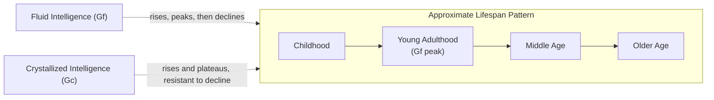

## Fluid and Crystallized Intelligence

### Overview

The fluid-crystallized (Gf-Gc) distinction, introduced by Raymond Cattell and elaborated by John Horn, divides general cognitive ability into two broad, empirically dissociable components. **Fluid intelligence (Gf)** is the capacity for novel problem solving, abstract relational reasoning, and adaptation to unfamiliar situations, relatively independent of specific acquired knowledge. **Crystallized intelligence (Gc)** is the accumulated store of acquired knowledge, vocabulary, and culturally transmitted skills, reflecting the products of past learning applied to familiar problems. This distinction remains foundational to contemporary psychometric models of intelligence, including the Cattell-Horn-Carroll (CHC) hierarchical model.

### Core Constructs

- **Key Points**:
  - **Fluid intelligence (Gf)**: Measured by tasks requiring reasoning about novel, abstract relationships with minimal dependence on prior specific knowledge — e.g., Raven's Progressive Matrices, figural analogies, novel rule induction tasks.
  - **Crystallized intelligence (Gc)**: Measured by tasks drawing on acquired verbal knowledge, vocabulary, general information, and culturally transmitted skills — e.g., vocabulary tests, verbal analogies drawing on known word meanings, general knowledge questions.
  - **Investment theory** (Cattell): Proposes that Gc develops through the "investment" of Gf in learning opportunities over the lifespan — fluid reasoning ability is applied to acquire and consolidate crystallized knowledge, such that Gc partly reflects the cumulative historical application of Gf, while remaining a distinguishable construct once established.
  - **Cattell-Horn-Carroll (CHC) model**: The contemporary consensus hierarchical psychometric model integrating Cattell and Horn's Gf-Gc theory with Carroll's three-stratum model, positioning Gf and Gc (along with additional broad abilities such as short-term memory, processing speed, and visual-spatial ability) as second-stratum broad abilities beneath a general (g) factor at the apex, each further decomposable into narrower first-stratum abilities.

### Developmental and Lifespan Trajectories

A central, well-replicated empirical finding is the **divergent lifespan trajectory** of Gf and Gc, a cornerstone piece of evidence supporting their status as dissociable constructs rather than a single unitary ability.

- **Gf**: Develops through childhood and adolescence, typically peaks in early adulthood (often cited around the 20s), and shows a gradual, progressive decline across the remainder of the lifespan, closely paralleling the developmental and aging trajectory of prefrontal cortex structure and function.
- **Gc**: Continues to increase well into middle age and often remains stable or shows only modest decline into old age, consistent with its basis in cumulative, well-consolidated knowledge that is more resistant to the neural changes associated with typical cognitive aging, though very advanced age and neurodegenerative processes can eventually affect Gc as well.

Below is a schematic of the characteristic divergent Gf/Gc lifespan trajectories.

### Measurement Paradigms

- **Raven's Progressive Matrices**: The most widely used and psychometrically influential Gf measure, requiring identification of an abstract pattern governing a matrix of visual figures and selection of the missing piece completing the pattern, deliberately minimizing reliance on verbal or acquired cultural knowledge to isolate novel abstract reasoning.
- **Vocabulary and general information subtests** (e.g., from the Wechsler Adult Intelligence Scale): Canonical Gc measures, directly assessing accumulated verbal and factual knowledge.
- **Verbal analogies with familiar content**: Can load on Gc when the relational structure is well-known and culturally transmitted (e.g., common proverb-based analogies), in contrast to novel figural analogies (Gf), illustrating that task format alone does not determine Gf/Gc classification — the degree of dependence on prior specific knowledge versus novel relational processing is the key differentiator.

**Example**: A test-taker completing a vocabulary subtest draws on years of accumulated verbal exposure to correctly define an uncommon word — a Gc-loaded process. The same test-taker completing Raven's Matrices must instead induce a previously unencountered abstract rule (e.g., a progressive rotation or addition pattern across matrix cells) purely from the presented figural information, with prior verbal or factual knowledge offering little direct assistance — a Gf-loaded process.

### Relationship to Working Memory and the Neural Basis of Gf

- Individual differences in Gf show strong, well-replicated correlations with working memory capacity (WMC), motivating theoretical positions (e.g., Engle and colleagues) proposing that Gf and WMC substantially reflect shared underlying executive attention capacity, though the two constructs remain empirically and statistically separable rather than fully redundant. [Inference: the degree of true conceptual and neural overlap versus dissociable contribution between Gf and WMC/executive attention remains an actively debated question in the individual-differences literature.]
- **Parieto-frontal integration theory (P-FIT)** (Jung & Haier): A prominent neurobiological model proposing that general intelligence, with Gf as a central component, depends on a distributed network spanning lateral prefrontal cortex (particularly DLPFC), parietal cortex (particularly around the intraparietal sulcus), and the white matter tracts connecting them, supporting the sequential stages of sensory information processing, higher-order reasoning/hypothesis testing (frontal), and integration/evaluation of results (parietal).
- **Rostrolateral PFC (BA 10)**: Frequently implicated specifically in complex, multi-relational Gf tasks (e.g., higher-difficulty matrix reasoning items requiring integration of multiple simultaneous rules), consistent with its broader established role in relational integration across the reasoning and analogy literature.

### The CHC Model in Broader Context

| Stratum | Level | Examples |
| --- | --- | --- |
| Stratum III | General (g) | Single general intelligence factor at the apex |
| Stratum II | Broad abilities | Gf (fluid reasoning), Gc (crystallized knowledge), Gwm (short-term/working memory), Gs (processing speed), Gv (visual-spatial ability), and others |
| Stratum I | Narrow abilities | Specific abilities within each broad domain (e.g., within Gc: lexical knowledge, general information, listening ability) |

The CHC model is the most widely adopted structural framework in contemporary psychometric intelligence research and underlies the design and interpretation of major individually administered intelligence test batteries (e.g., current editions of the Wechsler and Woodcock-Johnson scales), which typically report both an overall composite score and separate index/cluster scores mapping onto CHC broad abilities including Gf and Gc.

### Clinical and Applied Relevance

- **Traumatic brain injury and frontal lobe damage**: Characteristically produces disproportionate Gf impairment relative to relatively preserved Gc, consistent with Gf's dependence on intact prefrontal-parietal circuitry and Gc's basis in previously consolidated, more distributed knowledge representations relatively resistant to focal frontal damage; this dissociation is used clinically to estimate premorbid ability level (using relatively preserved Gc/vocabulary measures) against which current, potentially Gf-impaired performance can be compared.
- **Dementia**: Gc measures (e.g., vocabulary, reading recognition tests such as embedded within some premorbid-IQ estimation batteries) tend to remain relatively preserved into at least moderate stages of Alzheimer's disease, historically motivating their use as one component of premorbid intellectual ability estimation, though this application requires caution as Gc can eventually decline with disease progression. [Inference: the reliability of Gc-based premorbid estimation diminishes as dementia progresses, and its precision as an estimation method is an acknowledged limitation in the neuropsychological assessment literature.]
- **Educational and occupational prediction**: Both Gf and Gc show substantial predictive validity for academic and occupational outcomes, with Gc showing particularly strong direct prediction of outcomes closely tied to acquired knowledge (e.g., verbally-loaded academic subjects), while Gf shows broader predictive utility across novel learning and problem-solving demands, consistent with investment theory's proposed causal relationship between the two constructs over development.

**Next Steps**

- Cattell-Horn-Carroll (CHC) model in full detail
- Parieto-frontal integration theory (P-FIT) of intelligence
- Working memory capacity and its relationship to Gf
- Raven's Progressive Matrices and psychometric test construction
- Cognitive aging trajectories across intelligence domains
- Premorbid intellectual ability estimation in neuropsychological assessment
- Analogical reasoning and relational integration (see related item)
- Rostrolateral prefrontal cortex function across reasoning tasks