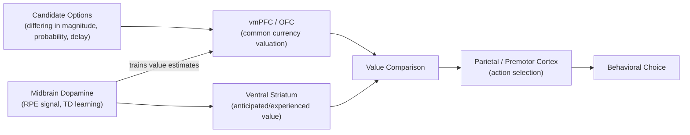

## Neuroeconomics Fundamentals

### Overview

Neuroeconomics is an interdisciplinary field integrating neuroscience, psychology, and economics to characterize the neural mechanisms underlying value-based decision-making, choice under risk and uncertainty, and the departures of observed human behavior from normative rational-choice predictions. It aims to move beyond behavioral economics' descriptive documentation of choice anomalies by identifying the specific neural computations and circuits that generate value signals, compare options, and select actions, thereby providing a mechanistic, process-level account of decision-making.

### Foundational Theoretical Frameworks

- **Key Points**:
  - **Expected utility theory (EUT)**: The classical normative economic model proposing that rational agents choose among risky options by maximizing expected utility, computed as the probability-weighted sum of the utility of each possible outcome; widely used as a normative benchmark against which observed human/animal choice behavior is compared, despite well-documented systematic violations.
  - **Prospect theory** (Kahneman & Tversky): The most influential descriptive (as opposed to normative) alternative, proposing that value is computed relative to a reference point (rather than absolute final wealth states), that the value function is concave for gains and convex for losses (diminishing sensitivity), and that losses loom larger than equivalent gains (**loss aversion**), with decision weights that nonlinearly overweight small probabilities and underweight moderate-to-large probabilities (probability weighting).
  - **Revealed preference**: The methodological principle, foundational to neuroeconomics' behavioral measurement approach, that an agent's preferences can be inferred from their observed choices, providing the behavioral currency against which neural value signals are validated and correlated.

### The Value Function and Loss Aversion

Prospect theory's value function is formalized as:

$$v(x) = \begin{cases} x^{\alpha} & \text{if } x \geq 0 \\ -\lambda(-x)^{\beta} & \text{if } x < 0 \end{cases}$$

where $x$ is the outcome relative to the reference point, $\alpha$ and $\beta$ are exponents (typically estimated less than 1) capturing diminishing sensitivity for both gains and losses, and $\lambda$ (typically estimated greater than 1, commonly cited around 2-2.5 in behavioral studies) is the loss aversion coefficient capturing the steeper subjective impact of losses relative to equivalent-magnitude gains.

**Example**: Given a coin-flip gamble offering an equal chance of gaining $100 or losing $100, an agent with $\lambda = 2$ would require the potential gain to substantially exceed the potential loss (e.g., a gain of roughly $200 against a loss of $100) before finding the gamble subjectively attractive, despite its zero expected monetary value in the unweighted $100/$100 version — illustrating why many individuals decline actuarially fair or even favorable gambles involving symmetric gain/loss magnitudes.

### Common Currency and Value Comparison

A central proposed function of neuroeconomic value circuits is converting qualitatively different reward types and attributes (monetary amounts, food rewards, social approval, delay, risk) into a **common currency** — a shared neural scale enabling direct comparison and choice between fundamentally dissimilar options.

- **Ventromedial prefrontal cortex (vmPFC) and orbitofrontal cortex (OFC)**: The most consistently implicated regions for encoding a common-currency subjective value signal, with activity correlating parametrically with subjective value across diverse reward types and choice contexts in numerous fMRI studies, supporting their proposed role as a value-comparison substrate.
- **Ventral striatum (nucleus accumbens)**: Implicated in encoding value signals related to anticipated and experienced reward, closely linked to dopaminergic input and reward prediction error signaling (see below), and frequently co-activated with vmPFC/OFC during value-based choice.

### Reinforcement Learning and Dopaminergic Prediction Error

Neuroeconomics draws heavily on the reinforcement learning (RL) framework, particularly the **temporal difference (TD) learning** model, to characterize how value estimates are learned and updated from experience.

$$\delta_t = r_t + \gamma V(s_{t+1}) - V(s_t)$$

$$V(s_t) \leftarrow V(s_t) + \alpha \delta_t$$

where $\delta_t$ is the reward prediction error (RPE) at time $t$, $r_t$ is the received reward, $\gamma$ is a discount factor for future value, $V(s_t)$ is the estimated value of the current state, and $\alpha$ is a learning rate governing how much the value estimate is updated based on the prediction error.

- **Phasic midbrain dopamine neurons** (VTA/SNc): Extensive primate electrophysiology (notably Schultz and colleagues) demonstrates that phasic dopaminergic firing closely tracks the RPE signal — bursting above baseline for better-than-expected outcomes, showing a dip below baseline for worse-than-expected outcomes, and showing no deviation from baseline for fully predicted outcomes — providing one of the most influential and well-validated bridges between a formal computational learning model and a specific neurophysiological signal in all of systems neuroscience.
- This dopaminergic RPE signal is proposed to train downstream valuation representations in striatum and OFC/vmPFC via dopamine-dependent synaptic plasticity, linking the learning mechanism directly to the value-representation substrates described above.

Below is a schematic of the core neuroeconomic value-computation and choice pipeline.

### Decision-Making Under Risk and Ambiguity

- **Risk**: Choice among outcomes with known, well-specified probabilities (e.g., a gamble with an explicitly stated 50% chance of winning).
- **Ambiguity**: Choice among outcomes with unknown or poorly specified probabilities, distinguished behaviorally by **ambiguity aversion** — a well-documented tendency (formalized in the classic Ellsberg paradox) for individuals to prefer known-probability (risky) options over equally-favorable but ambiguous options, violating standard subjective expected utility axioms that treat ambiguity as reducible to a single, coherent subjective probability estimate.
- Neuroimaging studies report partially dissociable neural signatures for risk versus ambiguity processing, with ambiguity more consistently engaging additional regions including lateral PFC and amygdala beyond the core valuation network engaged by risk alone, consistent with ambiguity imposing additional computational demands related to estimating unknown probability distributions. [Inference: the precise degree of neural dissociation between risk and ambiguity processing, as opposed to a shared but scalarly modulated underlying uncertainty-processing system, remains an area of ongoing investigation.]

### Intertemporal Choice and Delay Discounting

Intertemporal choice concerns preferences between smaller-sooner and larger-later rewards, a domain central to neuroeconomic research on self-control and impulsivity.

$$V = \frac{A}{1 + kD}$$

This **hyperbolic discounting** model (widely favored over simple exponential discounting for its superior fit to observed human and animal choice data) expresses the discounted subjective value $V$ of a reward with objective amount $A$ delayed by time $D$, where $k$ is an individual discount-rate parameter indexing impulsivity (higher $k$ reflects steeper discounting and greater preference for immediate reward).

- **Dual-systems accounts** (e.g., McClure et al.): Propose that intertemporal choice reflects competition between a limbic/paralimbic system (including ventral striatum and posterior cingulate) preferentially engaged by choices involving immediately available rewards, and a lateral PFC/parietal system engaged relatively uniformly across all delay conditions, with the balance of activity across these systems predicting the sooner-versus-later choice outcome. [Inference: this influential dual-systems account has faced empirical challenges from subsequent studies finding more continuous, single-system value-coding patterns across delay, and the degree to which intertemporal choice requires a genuinely dual-system explanation versus a unified discounted-value comparison process remains actively debated.]

### Social and Strategic Decision-Making

Neuroeconomics extends beyond individual risk/time preferences to strategic and social decision contexts, frequently studied using paradigms from experimental economics and game theory.

- **Ultimatum game**: A proposer offers a division of a fixed sum to a responder, who may accept (both receive the proposed split) or reject (both receive nothing); responders frequently reject offers perceived as unfairly low despite this being individually costly, a violation of pure self-interest maximization associated with anterior insula activity proposed to reflect an aversive emotional response to perceived unfairness, engaging in apparent competition with DLPFC-mediated self-interested motivation to accept any positive offer.
- **Trust game**: Used to study reciprocity and trust-based cooperation, with associated ventral striatal and vmPFC value signals tracking both monetary outcomes and the social/reciprocity value of a partner's trustworthy or untrustworthy behavior.

### Clinical and Applied Relevance

- **Addiction**: Steeper delay discounting (higher $k$) is a robust and widely replicated behavioral marker across multiple substance use disorders, consistent with a proposed imbalance favoring immediate reward valuation over longer-term self-control, though whether steep discounting is a pre-existing vulnerability factor, a consequence of substance use, or both, remains actively investigated. [Inference: the causal direction and specificity of the discounting-addiction relationship is not fully resolved by predominantly correlational and cross-sectional study designs.]
- **Depression**: Blunted ventral striatal response to reward anticipation and receipt is a frequently replicated finding, consistent with anhedonia as a core symptom, and has motivated the use of reward-related neural and behavioral measures as candidate objective markers in depression research. [Inference: the diagnostic and treatment-selection utility of these reward-circuit markers remains under active investigation rather than established clinical practice.]
- **Gambling disorder and OCD-spectrum conditions**: Studied using neuroeconomic paradigms probing risk sensitivity, loss aversion, and reward prediction error signaling, with altered patterns reported relative to healthy controls, contributing to broader efforts in computational psychiatry to characterize psychiatric conditions in terms of specific, quantifiable parameter alterations within formal decision-making models. [Unverified: findings across specific paradigms and clinical populations show considerable heterogeneity, and consensus computational profiles for these conditions are not yet firmly established.]

**Related Topics**

- Reward prediction error and dopaminergic reinforcement learning in depth
- Prospect theory and behavioral economics anomalies
- Delay discounting and impulsivity in addiction
- Ventromedial PFC and orbitofrontal cortex value coding
- Risk and ambiguity processing distinctions
- Computational psychiatry and formal decision-making models
- Ultimatum game, fairness, and anterior insula function
- Goal-directed vs. habitual behavior and model-based reinforcement learning (see related item)