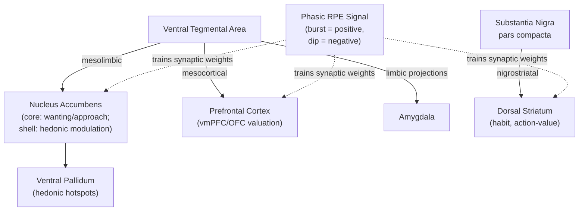

## Reward Circuitry and Dopaminergic Signaling

### Overview

Reward circuitry comprises the interconnected neural systems that mediate the detection, prediction, valuation, and pursuit of rewarding stimuli, and that drive learning from the consequences of behavior. Dopaminergic signaling, originating primarily from midbrain nuclei, is the most extensively characterized neuromodulatory system within this circuitry, serving as a central teaching signal for reinforcement learning while also contributing to motivation, incentive salience, and action selection through its projections across cortical and subcortical targets.

### Core Anatomical Circuitry: The Mesocorticolimbic Pathway

- **Key Points**:
  - **Ventral tegmental area (VTA)**: The principal midbrain dopaminergic nucleus of the mesocorticolimbic pathway, projecting to the nucleus accumbens (mesolimbic pathway), prefrontal cortex (mesocortical pathway), amygdala, and hippocampus, positioning it as the primary source of reward-related dopaminergic modulation across the limbic and cortical reward network.
  - **Substantia nigra pars compacta (SNc)**: The other major midbrain dopaminergic nucleus, primarily projecting to the dorsal striatum (nigrostriatal pathway), more classically associated with motor control (its degeneration underlies Parkinson's disease) but also contributing dopaminergic signaling relevant to habit formation and instrumental action-value learning in dorsal striatal circuits.
  - **Nucleus accumbens (NAc, ventral striatum)**: The principal terminal region of the mesolimbic pathway, subdivided into a **core** (more associated with motor/action-related reward processing and Pavlovian-to-instrumental transfer) and a **shell** (more associated with hedonic/affective reward processing and the generation of "liking" reactions), receiving convergent glutamatergic input from PFC, amygdala, and hippocampus alongside dopaminergic input from VTA.
  - **Ventral pallidum**: A key downstream target of NAc output, implicated in generating and relaying hedonic "liking" signals and in translating accumbens value/motivation signals into motor output via further basal ganglia and brainstem projections.

### The Wanting/Liking Distinction

A foundational conceptual distinction in reward neuroscience (Berridge & Robinson) separates two dissociable psychological components of reward that are often conflated in lay usage of the term "reward":

| Component | Definition | Primary Substrate | Behavioral Marker |
| --- | --- | --- | --- |
| "Wanting" (incentive salience) | The motivational pull toward a reward-predicting stimulus; drives approach and effort | Mesolimbic dopamine (VTA-NAc projection) | Approach behavior, cue-triggered craving, effort allocation |
| "Liking" (hedonic impact) | The subjective pleasure derived from actually consuming/experiencing a reward | Opioid and endocannabinoid "hedonic hotspots" within NAc shell and ventral pallidum | Species-typical hedonic reactions (e.g., orofacial "liking" reactions to palatable taste in rodents) |

This dissociation is supported by pharmacological double-dissociation evidence: dopamine depletion or blockade reduces "wanting" (reduced effortful approach/work for reward) without necessarily reducing "liking" reactions to a reward once obtained, while manipulation of opioid signaling within specific NAc "hedonic hotspots" alters "liking" reactions without proportionally affecting "wanting"/approach behavior. This distinction is central to contemporary theories of addiction, which propose that repeated drug use can sensitize "wanting"/incentive salience circuits (driving compulsive craving and relapse) even as hedonic "liking" responses to the drug diminish with continued use (tolerance).

### Reward Prediction Error and Temporal Difference Learning

Phasic dopaminergic neuron firing has been extensively characterized (notably by Wolfram Schultz and colleagues in non-human primate electrophysiology) as encoding a **reward prediction error (RPE)** signal closely matching the formal structure of temporal difference (TD) learning from reinforcement learning theory.

$$\delta_t = r_t + \gamma V(s_{t+1}) - V(s_t)$$

- **Unpredicted reward**: Produces a phasic burst of dopaminergic firing above baseline (positive RPE).
- **Fully predicted reward**: Produces no deviation from baseline firing once the predictive cue, rather than the reward itself, has come to elicit the phasic response (reflecting the classic transfer of the dopaminergic response from the unconditioned reward to the earliest reliable predictor of that reward, a hallmark finding of the RPE account).
- **Omitted, expected reward**: Produces a phasic dip below baseline firing at the expected time of reward delivery (negative RPE).

**Example**: In a classic Pavlovian conditioning paradigm, a previously neutral cue (e.g., a light) is repeatedly paired with juice delivery in a thirsty monkey. Early in training, dopamine neurons fire phasically in response to the unexpected juice delivery itself. After sufficient pairing, the phasic response transfers to the predictive light cue (now itself unexpected, driving a positive RPE at cue onset), while the now-fully-predicted juice delivery itself no longer elicits a dopaminergic response. If juice is subsequently withheld on a trial where the light cue was presented (violating the learned prediction), dopamine neurons show a pause in firing precisely at the expected time of juice delivery — the negative RPE signature.

Below is a schematic of the mesocorticolimbic dopaminergic circuit and its RPE signaling function.

### Dopamine Receptor Subtypes and Basal Ganglia Pathway Modulation

Dopamine exerts differential effects on striatal medium spiny neurons (MSNs) depending on receptor subtype expression, forming the neurochemical basis for the classic direct/indirect basal ganglia pathway model:

- **D1 receptors**: Predominantly expressed on MSNs of the **direct pathway** (striatum → GPi/SNr → thalamus), where dopamine binding is excitatory to this pathway, facilitating movement/action initiation and, within reward learning models, reinforcing recently selected actions associated with positive RPEs ("Go" pathway).
- **D2 receptors**: Predominantly expressed on MSNs of the **indirect pathway** (striatum → GPe → STN → GPi/SNr → thalamus), where dopamine binding is inhibitory to this pathway, and reduced dopamine (as occurs with negative RPE/dopamine dips) disinhibits this pathway, suppressing the recently selected action ("NoGo" pathway).
- This D1/D2, direct/indirect pathway asymmetry provides a proposed cellular mechanism for how a single phasic dopaminergic signal can simultaneously strengthen recently-active corticostriatal synapses onto D1-expressing "Go" neurons (following positive RPE) while weakening or failing to reinforce D2-expressing "NoGo" neurons, and vice versa for negative RPE, implementing action-value reinforcement learning at the level of basal ganglia circuitry. [Inference: while this framework is influential and supported by considerable pharmacological and genetic evidence, the degree to which real striatal learning cleanly maps onto this simplified dual-pathway model, as opposed to more complex and overlapping physiology, remains a subject of ongoing refinement in the literature.]

### Tonic vs. Phasic Dopamine

A further important distinction separates the fast, RPE-encoding **phasic** dopaminergic bursts/dips described above from slower **tonic** (background, sustained) dopaminergic tone, proposed by some models (e.g., Niv and colleagues) to separately regulate more sustained motivational and vigor-related aspects of behavior, such as the average rate of responding or willingness to exert effort for reward, rather than moment-to-moment prediction error signaling. [Inference: the precise computational and behavioral distinction between tonic and phasic dopaminergic functions, and how cleanly they can be dissociated experimentally, remains an active area of ongoing research.]

### Beyond Dopamine: Opioid, Endocannabinoid, and Serotonergic Contributions

- **Endogenous opioids (mu-opioid receptors)**: Central to hedonic "liking" reactions within NAc shell and ventral pallidum "hedonic hotspots," pharmacologically dissociable from dopamine's role in "wanting."
- **Endocannabinoids**: Also implicated in modulating hedonic hotspot function and appetitive motivation, interacting with both opioid and dopaminergic signaling within the broader reward circuit.
- **Serotonin**: Proposed to play a complementary or partially opposing role to dopamine in some computational models, particularly regarding patience/temporal discounting and aversive outcome processing, though its precise computational role within reward circuitry is less thoroughly characterized than dopaminergic RPE signaling. [Unverified: serotonin's specific computational contribution to reward processing remains considerably less well-established than the dopaminergic RPE account, with multiple competing theoretical proposals in the literature.]

### Clinical and Applied Relevance

- **Addiction**: Repeated drug exposure is proposed to produce persistent neuroadaptations within mesolimbic dopamine circuitry, including sensitization of incentive salience ("wanting") to drug-associated cues, contributing to compulsive drug-seeking and relapse vulnerability even after hedonic "liking" responses have diminished, a central framework within the incentive-sensitization theory of addiction (Robinson & Berridge).
- **Parkinson's disease**: Results from progressive degeneration of SNc dopaminergic neurons, primarily producing the classic nigrostriatal motor symptoms, but dopamine-replacement therapy (e.g., levodopa, dopamine agonists) can also affect mesolimbic reward-circuit function, associated in some patients with impulse control disorders (e.g., pathological gambling, compulsive behaviors), illustrating unintended effects of pharmacologically restoring dopaminergic tone on reward-related decision-making circuits distinct from the primary motor target.
- **Schizophrenia**: The dopamine hypothesis of schizophrenia proposes dysregulated (particularly excessive subcortical/striatal) dopaminergic signaling contributes to positive symptoms, with some contemporary computational accounts specifically proposing aberrant salience/RPE signaling as a mechanism linking dopaminergic dysfunction to the formation of delusions and hallucinations. [Inference: the aberrant salience computational account is an influential but still-developing theoretical framework rather than a fully validated mechanistic explanation of schizophrenia's positive symptoms.]
- **Depression**: Blunted mesolimbic dopaminergic reward-circuit responsivity is a frequently proposed contributor to anhedonia, a core depressive symptom, motivating research into reward-circuit-targeted interventions and biomarkers.

**Next Steps**

- Neuroeconomics fundamentals and value-based decision-making (see related item)
- Basal ganglia direct/indirect pathway architecture in depth
- Incentive-sensitization theory of addiction
- Wanting/liking dissociation and hedonic hotspot mapping
- Dopamine hypothesis of schizophrenia and aberrant salience
- Goal-directed vs. habitual behavior and corticostriatal loops
- Pavlovian conditioning and associative learning theory
- Effort-based decision-making and motivational vigor