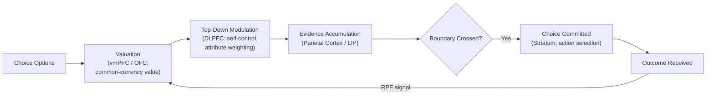

## Value-Based Decision Making

### Overview

Value-based decision making refers to the class of choices in which options must be evaluated and compared based on their subjective desirability, in contrast to perceptual decision making, where options are distinguished by objective sensory evidence (e.g., which of two dots is brighter). It encompasses the full computational sequence from representing available options, computing their subjective value, comparing values against one another, and committing to and executing a choice. This chapter item overlaps substantially with neuroeconomics but focuses specifically on the computational and neural mechanics of the valuation-comparison-choice sequence itself, including the influence of context and framing on value computation.

### The Canonical Value-Based Choice Sequence

- **Key Points**:
  - **Representation**: Identifying the relevant choice options and their defining attributes from the current environment or from memory.
  - **Valuation**: Assigning a subjective value to each option, integrating relevant attributes (magnitude, probability, delay, effort cost) into a single scalar value estimate.
  - **Comparison**: Weighing the computed values of available options against one another to determine a preference ordering.
  - **Choice/commitment**: Selecting and executing the action associated with the preferred option, often modeled as a threshold-crossing or "race" process rather than an instantaneous readout.
  - **Outcome evaluation and learning**: Comparing the obtained outcome to its predicted value, generating a prediction error signal (see reward circuitry) that updates future valuations of the chosen (and sometimes unchosen) option.

### Sequential Sampling Models of Choice

A dominant computational framework for the comparison and commitment stages treats value-based choice as an evidence-accumulation process, directly extending models originally developed for perceptual decision making.

- **Drift diffusion model (DDM)**: Proposes that noisy momentary evidence favoring each option (here, derived from relative subjective value rather than sensory evidence) accumulates over time until it crosses one of two decision boundaries, triggering the corresponding choice. Model parameters include the **drift rate** (the average rate of evidence accumulation, typically proportional to the value difference between options), the **boundary separation** (reflecting response caution — a wider boundary requires more accumulated evidence and produces slower, more accurate/deliberate choices), and a **starting point** bias parameter (reflecting a priori preference or bias toward one option before evidence accumulation begins).

$$dx = v \, dt + \sigma \, dW_t$$

where $x$ is the accumulated relative-evidence variable, $v$ is the drift rate (proportional to the value difference between the two options), $\sigma$ scales the noise magnitude, and $dW_t$ represents a Wiener process (Gaussian white noise), with choice determined by which of two boundaries $x$ first crosses and response time determined by the time elapsed until that crossing.

**Example**: When choosing between two snack items of similar subjective value (e.g., a candy bar valued at 6.2 and a bag of chips valued at 5.9 on an arbitrary internal scale), the small value difference produces a low drift rate, predicting slower, more error-prone (i.e., more frequently choosing the objectively lower-valued option on that particular trial) responses. When choosing between items of very different value (e.g., 9.0 vs. 2.0), the large value difference produces a high drift rate, predicting fast, highly consistent selection of the higher-valued item — a well-replicated empirical signature of value-based DDM predictions.

### Neural Substrates of Valuation and Comparison

- **Ventromedial prefrontal cortex (vmPFC) / orbitofrontal cortex (OFC)**: The most consistently implicated substrate for encoding a common-currency subjective value signal across diverse option types, with parametric BOLD or single-unit activity scaling with subjective value independent of the specific good or attribute being valued, supporting a proposed role in value comparison via mechanisms resembling relative value coding (activity for one option's value modulated by the value of the alternative, rather than fully independent representation).
- **Dorsolateral prefrontal cortex (DLPFC)**: Implicated in top-down modulation of valuation, particularly in self-control contexts requiring the integration of longer-term goals or attribute weighting to override a more immediately/viscerally attractive but ultimately less-preferred option (see intertemporal choice, dietary self-control studies).
- **Posterior parietal cortex and lateral intraparietal area (LIP, in primate electrophysiology)**: Implicated in accumulating and representing the evolving decision variable during the comparison/accumulation process, particularly for choices with a spatial or motor mapping to specific response actions, consistent with parietal cortex's broader role in sensorimotor integration and evidence accumulation established in the perceptual decision-making literature.
- **Striatum**: Contributes both to value representation (particularly anticipated/experienced reward value, closely tied to dopaminergic RPE input) and to the action-selection component translating a comparison outcome into a specific motor response via corticostriatal loop circuitry.

Below is a schematic of the value-based decision sequence mapped onto its principal neural substrates.

### Context Effects and Violations of Simple Value Maximization

Value-based choice frequently violates the independence-of-irrelevant-alternatives (IIA) axiom central to classical rational-choice models, instead showing systematic, context-dependent preference reversals that have motivated specific computational and neural accounts of relative (rather than absolute) value coding.

| Effect | Description |
| --- | --- |
| Attraction (decoy) effect | Adding a third option that is clearly dominated by (worse than) one existing option on all attributes increases the choice share of the dominating option, even though a rational, independent value-maximizing agent's relative preference between the original two options should be unaffected by the irrelevant, dominated addition |
| Similarity effect | Adding a third option very similar to one existing option can reduce that option's choice share (by "splitting" its support), disproportionately increasing the relative choice share of the dissimilar remaining option |
| Compromise effect | An option that is a compromise (intermediate on relevant attributes) between two extreme options tends to gain increased choice share when both extreme options are simultaneously available, relative to when compared only pairwise |

These context effects are frequently explained by **divisive normalization** or related relative-value-coding models, in which the neural representation of an option's value is normalized (divided) by the summed or pooled value of all currently available options, rather than being represented in a fixed, context-independent manner — providing a proposed neural-computational mechanism generating the behavioral IIA violations described above. [Inference: while divisive normalization models successfully capture several of these classic context effects, whether a single normalization mechanism fully accounts for the full range of documented context-dependence phenomena, or whether multiple distinct mechanisms contribute, remains an active area of computational modeling research.]

### Effort and Cost-Based Value Discounting

Beyond probability (risk) and delay (see intertemporal choice under neuroeconomics), value-based decisions also integrate **effort costs**, with subjective value discounted as a function of the physical or cognitive effort required to obtain a reward, in a manner computationally analogous to (and empirically compared against) delay and probability discounting.

- **Anterior cingulate cortex (dorsal ACC)**: Frequently implicated specifically in effort-based decision-making and effort-discounting of value, proposed to integrate the costs of effortful action against its expected benefits to guide willingness to expend effort for reward, distinguishing effort-cost integration from the more general common-currency valuation attributed to vmPFC/OFC. [Inference: the precise functional distinction between ACC's proposed effort-integration role and vmPFC/OFC's general valuation role, as opposed to a more unified or overlapping contribution, remains a subject of ongoing investigation and some debate in the literature.]

### Clinical and Applied Relevance

- **Depression and anhedonia**: Reduced willingness to expend effort for reward (increased effort discounting), alongside blunted ventral striatal and vmPFC value signals, is a frequently reported finding, consistent with motivational/anhedonic symptom profiles and motivating effort-based decision-making tasks as candidate objective behavioral markers in depression research.
- **Parkinson's disease and dopaminergic modulation**: Dopaminergic state (on/off medication) has been shown to modulate effort-based and risk-based value-based choice in patients, consistent with dopamine's broader proposed role in motivational vigor and value-comparison processes beyond its classic motor functions.
- **Aging**: Older adults show some systematic shifts in value-based decision parameters, including altered risk preferences and changes in the speed-accuracy tradeoffs captured by DDM boundary-separation parameters, though findings vary across specific decision domains and are not uniformly interpretable as simple decline versus adaptive strategic change. [Unverified: whether age-related shifts in value-based choice parameters reflect degraded valuation/comparison processes versus adaptive changes in decision strategy is not conclusively resolved across the literature.]

**Related Topics**

- Neuroeconomics fundamentals and prospect theory (see related item)
- Reward circuitry and dopaminergic reward prediction error (see related item)
- Drift diffusion model and sequential sampling models of choice
- Divisive normalization and relative value coding
- Effort-based decision-making and anterior cingulate cortex
- Context effects in preference (attraction, similarity, compromise)
- Ventromedial prefrontal cortex lesion studies and choice deficits
- Perceptual vs. value-based decision-making model comparisons