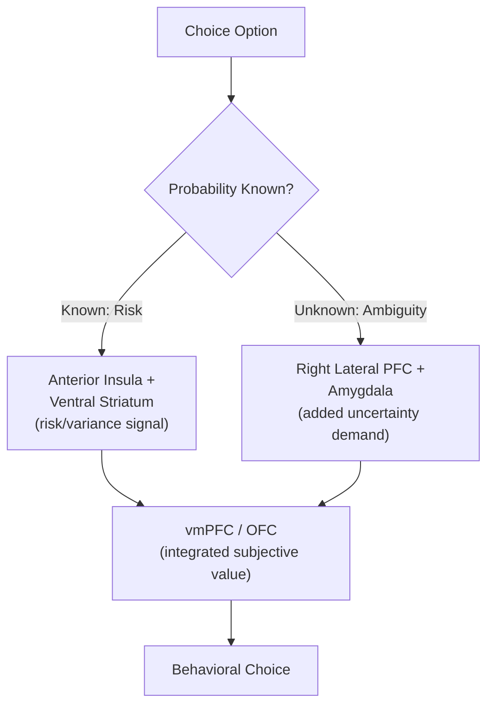

## Risk and Uncertainty Processing

### Overview

Risk and uncertainty processing encompasses the cognitive and neural mechanisms by which organisms evaluate options with probabilistic or unknown outcomes and integrate this evaluation into choice. Although often used loosely and interchangeably in everyday language, **risk** and **uncertainty** are formally distinguished in decision theory: risk refers to situations with known, well-specified outcome probabilities, while uncertainty (or ambiguity, in the behavioral economics literature) refers to situations in which outcome probabilities themselves are unknown or poorly specified. This distinction has substantial behavioral and neural support and is central to contemporary decision neuroscience.

### Formal Distinctions: Risk, Ambiguity, and Volatility

- **Key Points**:
  - **Risk**: Choice among outcomes with explicitly known probability distributions (e.g., a gamble with a stated 40% chance of winning $50), allowing expected value and variance to be precisely computed.
  - **Ambiguity**: Choice among outcomes with unknown or only partially specified probabilities (e.g., an urn with an unknown ratio of red to blue balls), such that the decision-maker must either represent a distribution over possible probabilities (a "second-order" probability distribution) or rely on a single point-estimate proxy.
  - **Volatility**: The rate at which underlying outcome probabilities or contingencies change over time in a dynamic environment, distinct from both risk and ambiguity but jointly relevant to how an agent should weight recent versus more distant evidence when updating beliefs (higher volatility favoring faster, more recency-weighted belief updating).
  - **Knightian uncertainty**: An economics-originated term (Frank Knight) for situations where probabilities cannot be meaningfully assigned at all, distinguishing pure, unquantifiable uncertainty from both risk and the more tractable, at-least-partially-quantifiable ambiguity typically studied in laboratory neuroeconomic paradigms.

### Behavioral Signatures: Risk Aversion and the Ellsberg Paradox

- **Risk aversion**: The well-documented tendency, particularly pronounced for gains, to prefer a certain outcome over a risky gamble with equal or even somewhat higher expected value, formally captured by a concave utility function in expected utility theory or by the concave gain-domain value function in prospect theory (see neuroeconomics fundamentals). Risk attitudes are not uniform across contexts: prospect theory's reflection effect predicts and behavioral data frequently confirm risk-seeking behavior in the loss domain (preferring a risky gamble over a certain loss of equal expected value), producing the classic fourfold pattern of risk attitudes when combined with probability weighting (risk-averse for high-probability gains and low-probability losses; risk-seeking for low-probability gains and high-probability losses).
- **Ellsberg paradox**: The classic empirical demonstration of ambiguity aversion, in which participants choosing between drawing from an urn with a known 50/50 ratio of red/black balls versus an urn with an unknown ratio reliably prefer the known-probability urn for betting on either color, a pattern that cannot be reconciled with any single coherent subjective probability assignment to the ambiguous urn, directly violating the subjective expected utility axioms (specifically, the independence/sure-thing principle) that treat ambiguity as reducible to ordinary risk once a subjective probability is assigned.

**Example**: Given two urns — Urn A containing exactly 50 red and 50 black balls, and Urn B containing 100 balls in an unknown red/black ratio — most participants prefer betting on red from Urn A over betting on red from Urn B, and *also* prefer betting on black from Urn A over betting on black from Urn B. Since a coherent subjective probability estimate for red in Urn B (whatever its value) would imply the complementary probability for black, at least one of these two preferences must be inconsistent with any single subjective probability under standard expected utility axioms — demonstrating that ambiguity is processed and disliked as a distinct dimension beyond simple probability estimation.

### Probability Weighting

Prospect theory further proposes that decision-makers do not weight outcomes by their objective probabilities but by a nonlinearly transformed subjective decision weight, formally captured by a probability weighting function.

$$w(p) = \frac{p^{\gamma}}{(p^{\gamma} + (1-p)^{\gamma})^{1/\gamma}}$$

This inverse-S-shaped function (with $\gamma$ typically estimated below 1 in empirical studies) captures two well-replicated behavioral phenomena: **overweighting of small probabilities** (explaining phenomena such as lottery ticket purchasing and disproportionate concern with rare, catastrophic risks) and **underweighting of moderate-to-large probabilities** (contributing to phenomena such as insufficient concern with moderately likely negative health outcomes), with the weighting function crossing the identity line (objective = subjective weighting) at a specific point often estimated near $p \approx 0.35$.

### Neural Substrates

- **Anterior insula**: One of the most consistently implicated regions for risk processing across neuroimaging studies, with activity scaling with outcome variance/risk magnitude and further engaged specifically during ambiguous (as opposed to purely risky) choice, consistent with proposed roles in interoceptive/aversive-state anticipation and general uncertainty monitoring.
- **Lateral prefrontal cortex (particularly right lateral PFC)**: Shows increased engagement specifically during ambiguous relative to risky choice in several studies, consistent with the additional computational demand of representing and reasoning about unknown or poorly-specified probability distributions rather than directly comparable to straightforward risk evaluation.
- **Amygdala**: Implicated in risk and ambiguity processing, particularly in the context of potential losses or aversive outcomes, consistent with its broader established role in threat and aversive-value processing; amygdala-damaged patients have shown reduced behavioral loss aversion and altered risk-taking patterns in several lesion studies.
- **Ventral striatum**: Encodes risk/variance-related signals alongside its core role in expected value coding, with some studies proposing distinct "risk prediction error" signals analogous to but formally distinguishable from the reward prediction error signal central to value learning (see reward circuitry).
- **Orbitofrontal cortex / vmPFC**: Contributes to integrating risk and ambiguity information into the overall subjective value computation for a given option, consistent with its broader common-currency valuation role described in neuroeconomics fundamentals.

Below is a schematic contrasting the risk and ambiguity processing pathways.

### Computational Approaches: Bayesian Belief Updating and Volatility

Beyond static risk/ambiguity attitudes toward a single choice, a substantial body of work models how agents update beliefs about outcome probabilities over time in dynamic, changing environments, most influentially using hierarchical Bayesian learning models (e.g., the Hierarchical Gaussian Filter; Mathys and colleagues) in which an agent tracks not only the current estimated probability of an outcome but also the estimated volatility (rate of change) of that probability itself, with higher estimated volatility producing faster learning rates (greater weighting of recent outcomes) in a normatively appropriate manner. Learning-rate/volatility signals in such models have been associated with locus coeruleus-noradrenergic system activity and with dorsal ACC/dorsomedial PFC function, proposed to track and signal the need for adjusted learning rates as environmental volatility changes. [Inference: while hierarchical Bayesian volatility-learning models show strong behavioral fit in multiple studies, the precise neural implementation and the degree to which noradrenergic/ACC signals directly implement rather than merely correlate with formal volatility estimates remains an active area of computational neuroscience research.]

### Clinical and Applied Relevance

- **Anxiety disorders**: Associated with heightened ambiguity aversion and altered risk-processing patterns in several studies, consistent with a proposed intolerance of uncertainty as a transdiagnostic feature contributing to anxious symptomatology, and motivating "intolerance of uncertainty" as a specific targeted construct in some cognitive-behavioral treatment frameworks. [Inference: while intolerance of uncertainty is a well-established clinical/self-report construct, its precise mapping onto the specific neuroeconomic ambiguity-processing mechanisms described above is an area of ongoing integration between the clinical and computational literatures rather than a fully established one-to-one correspondence.]
- **Substance use disorders**: Associated with altered risk-taking behavior on laboratory gambling and risk tasks in numerous studies, though findings on the specific direction and consistency of these alterations (increased risk-seeking under some conditions/substances, increased risk-aversion or impaired risk-sensitivity under others) are heterogeneous across the literature. [Unverified: risk-processing alterations across different substances and use patterns do not converge on a single consistent behavioral profile in the current literature.]
- **Amygdala lesion studies**: Rare human lesion cases (e.g., patient studies following bilateral amygdala damage) have informed understanding of amygdala contributions to loss aversion and risk-taking, with some documented cases showing reduced typical loss-averse behavior, contributing convergent lesion evidence to the neuroimaging findings described above.

**Next Steps**

- Neuroeconomics fundamentals and prospect theory in depth (see related item)
- Value-based decision making and sequential sampling models (see related item)
- Hierarchical Bayesian models of belief updating and volatility
- Anterior insula function across interoceptive and uncertainty processing
- Intolerance of uncertainty as a transdiagnostic clinical construct
- Amygdala lesion studies and loss aversion
- Probability weighting functions and lottery/insurance behavior
- Locus coeruleus-noradrenergic system and learning-rate adaptation