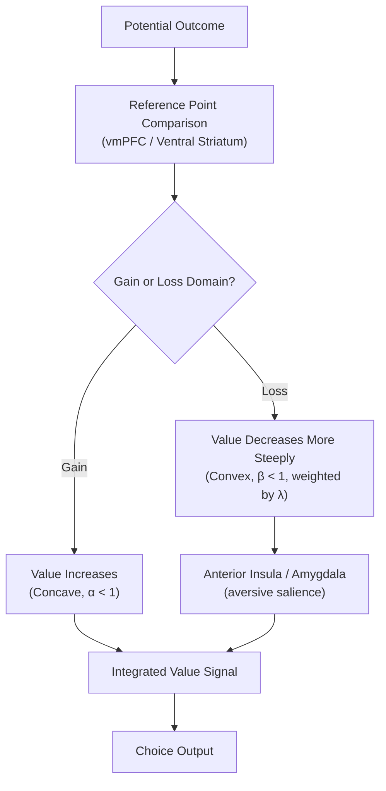

## Prospect Theory and Neural Correlates

### Overview

Prospect theory (Kahneman & Tversky, 1979) is the most influential descriptive model of decision-making under risk, developed explicitly to account for systematic, replicable human choice patterns that violate the normative predictions of expected utility theory (EUT). Rather than assuming agents evaluate outcomes in terms of final absolute wealth states, prospect theory proposes that value is computed relative to a reference point, that sensitivity to changes diminishes with distance from that reference point, and that losses are weighted more heavily than equivalent gains. A substantial neuroeconomic literature has since sought to identify the specific neural signals corresponding to each of prospect theory's core components.

### Core Components of Prospect Theory

- **Key Points**:
  - **Reference dependence**: Outcomes are evaluated as gains or losses relative to a reference point (typically the status quo or an expectation), rather than in terms of absolute final wealth, directly contradicting the EUT assumption that only final asset states matter.
  - **Loss aversion**: The subjective impact of a loss is larger in magnitude than the subjective impact of an equivalent-sized gain, formalized by a steeper value function slope in the loss domain than the gain domain.
  - **Diminishing sensitivity**: The marginal subjective impact of a given change in outcome magnitude decreases as the outcome moves further from the reference point in either direction, producing a concave value function for gains and a convex value function for losses.
  - **Probability weighting**: Objective probabilities are transformed into subjective decision weights via a nonlinear weighting function that overweights small probabilities and underweights moderate-to-large probabilities (see risk and uncertainty processing for the formal weighting function).
  - **Editing phase**: An initial, less formally specified phase in which prospects are simplified and reorganized (e.g., combining similar outcomes, discarding common components across options) prior to the evaluation phase proper, addressing certain choice anomalies not directly captured by the value/weighting functions alone.

### The Value Function

$$v(x) = \begin{cases} x^{\alpha} & \text{if } x \geq 0 \\ -\lambda(-x)^{\beta} & \text{if } x < 0 \end{cases}$$

Empirical estimates across numerous studies typically place $\alpha$ and $\beta$ (the curvature parameters for gains and losses, respectively) around 0.88, and $\lambda$ (the loss aversion coefficient) around 2.0–2.25 in Kahneman and Tversky's original estimates, though subsequent studies report a wide range depending on population, elicitation method, and stake size. [Inference: the specific numerical estimates for these parameters vary considerably across studies, populations, and measurement methods, and should be treated as approximate central tendencies from the literature rather than fixed universal constants.]

**Example**: Consider a choice between a certain gain of $50 and a 50% chance of gaining $100 (otherwise $0), both with equal expected value. Diminishing sensitivity in the gain domain ($\alpha < 1$) predicts that $v(50) > 0.5 \times v(100)$, favoring the certain $50 — the well-documented pattern of risk aversion for moderate-to-large probability gains. Now consider a choice between a certain loss of $50 and a 50% chance of losing $100 (otherwise $0). The convexity of the loss-domain value function ($\beta < 1$ applied to the loss branch) predicts the opposite pattern — risk-seeking behavior, preferring to gamble rather than accept the certain loss — illustrating the classic **reflection effect**.

### Neural Correlates of Reference Dependence

- **Ventral striatum and vmPFC**: Numerous fMRI studies demonstrate that BOLD activity in these regions tracks outcomes relative to an experimentally manipulated or endogenous reference point rather than absolute outcome magnitude — for example, an identical monetary outcome can produce differential activity depending on whether it is framed or experienced as a gain relative to a lower reference point or a loss relative to a higher one, providing direct neural evidence for reference-dependent (rather than absolute) value coding consistent with prospect theory's foundational departure from EUT.
- **Anterior insula and amygdala**: Frequently implicated in the neural response to losses specifically, with insula activity in particular scaling with the magnitude of anticipated or experienced loss, consistent with insula's broader role in aversive/interoceptive processing and its proposed contribution to the behavioral loss-aversion effect.

### Neural Correlates of Loss Aversion

A prominent line of neuroimaging research (notably Tom, Fox, Trepel, & Poldrack, 2007) sought to identify a specific neural signature of loss aversion by examining how brain activity scales with potential gains versus potential losses during gamble evaluation.

- Ventral striatum and vmPFC activity was found to increase parametrically with the magnitude of a potential gain and decrease parametrically with the magnitude of a potential loss during the evaluation of mixed gambles (offering both a possible gain and a possible loss), and the individual difference in the *slope* of this loss-related decrease relative to the gain-related increase correlated with each participant's behaviorally measured loss-aversion coefficient ($\lambda$), providing convergent behavioral-neural evidence for a shared underlying value-coding asymmetry.
- Notably, this and related studies generally did NOT find evidence for a specific, dedicated "loss" region showing purely positive activation to losses (as might be predicted by a strict "separate systems" account in which gains and losses are processed by entirely distinct neural circuits); instead, results were more consistent with a single, shared valuation system (ventral striatum/vmPFC) whose activity is simply asymmetrically sensitive to losses versus gains — supporting an integrated rather than dual-system account of gain/loss processing at the level of these core valuation regions. [Inference: while this integrated-system interpretation is well-supported by the cited studies, some subsequent research has proposed at least partial involvement of additional, more loss-specific circuitry (e.g., amygdala, anterior insula) alongside the shared valuation system, so the degree to which gain and loss processing is fully unified versus partially separable remains a matter of ongoing refinement.]

Below is a schematic of the proposed neural implementation of reference-dependent, loss-averse value coding.

### Neural Correlates of Probability Weighting

- Studies examining neural responses to varying objective probabilities have reported that activity in valuation regions (ventral striatum, vmPFC) tracks the nonlinearly transformed subjective decision weight $w(p)$ more closely than the raw objective probability $p$ itself, consistent with probability distortion occurring relatively early in the valuation process rather than being introduced only at a later choice/comparison stage.
- Parietal cortex has also been implicated in probability-related processing, though its specific contribution relative to prefrontal/striatal valuation regions in implementing probability weighting (as opposed to more general numerical/magnitude processing, see numerical cognition) is less definitively established. [Unverified: the precise neural locus and mechanism generating the specific inverse-S-shaped probability weighting function, as opposed to probability information simply being one input to a broader valuation computation, is not fully resolved.]

### Framing Effects and Prefrontal Modulation

Prospect theory's reference-dependence and reflection-effect predictions directly explain the classic **framing effect**: identical outcomes described in gain-framed versus loss-framed language (e.g., "200 of 600 people will be saved" versus "400 of 600 people will die") produce systematically different risk preferences, despite logical equivalence.

- **Amygdala**: Shows increased activity correlating with susceptibility to framing effects in some studies, consistent with a proposed role in generating an automatic, valence-based (gain/loss framing) bias on choice.
- **Anterior cingulate cortex / DLPFC**: Individuals showing greater activity in these regions during framed choices tend to show reduced behavioral susceptibility to the framing manipulation, consistent with a proposed role for executive/cognitive control in overriding the more automatic, frame-driven bias — directly paralleling the dual-process (Type 1 automatic/Type 2 controlled) framework applied elsewhere in reasoning and decision research. [Inference: as with other dual-process neural dissociations in decision research, the degree to which ACC/DLPFC activity reflects genuine active override of an automatic bias, versus a correlated but not strictly causal marker of individual differences in framing susceptibility, is not fully settled by correlational fMRI evidence alone.]

### Clinical and Applied Relevance

- **Aging**: Some studies report age-related changes in loss aversion and framing susceptibility, with mixed findings regarding whether older adults show increased or decreased loss aversion relative to younger adults, potentially reflecting changes in amygdala and prefrontal-amygdala connectivity with age. [Unverified: findings on the direction of age-related change in loss aversion are inconsistent across the literature.]
- **Anxiety and depression**: Altered loss-related neural sensitivity (e.g., amygdala hyperreactivity to losses in anxiety, blunted striatal sensitivity to gains in depression/anhedonia) has been proposed as contributing to clinically relevant risk-taking and reward-processing abnormalities, connecting prospect-theory-derived behavioral parameters to broader computational psychiatry efforts to characterize psychiatric symptoms in terms of specific, quantifiable value-processing alterations.
- **Consumer behavior and public health messaging**: Framing effects derived directly from prospect theory are widely applied in applied behavioral economics and public health communication research (e.g., gain- versus loss-framed messaging for health behaviors), representing one of the most direct real-world applications of the theory's core predictions.

**Related Topics**

- Neuroeconomics fundamentals and expected utility theory (see related item)
- Risk and uncertainty processing and probability weighting (see related item)
- Value-based decision making and the drift diffusion model (see related item)
- Reward circuitry and dopaminergic reward prediction error (see related item)
- Amygdala function in aversive and loss-related processing
- Dual-process theories and cognitive control override of automatic bias
- Framing effects in applied behavioral economics and health messaging
- Computational psychiatry and individual differences in value-processing parameters