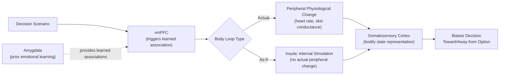

## Somatic Markers and Emotion in Decision Making

### Overview

The somatic marker hypothesis (Damasio) proposes that emotional and bodily (somatic) states play a functionally necessary, not merely incidental, role in guiding decision-making, particularly under conditions of uncertainty and complexity where purely deliberative, logical analysis is computationally intractable or insufficient. It represents a foundational departure from classical rational-choice accounts that treat emotion as a bias or contaminant to be minimized, instead proposing emotion as an adaptive, often unconscious heuristic mechanism that biases decision-making toward advantageous options prior to, or independent of, explicit conscious deliberation.

### Core Theoretical Claims

- **Key Points**:
  - **Somatic markers**: Bodily/physiological states (e.g., changes in heart rate, skin conductance, gut sensations) that become associated, through prior experience, with the anticipated positive or negative outcomes of a given decision option, functioning as an automatic, affect-laden "gut feeling" signal that biases choice before or alongside conscious deliberation.
  - **As-if body loop**: A proposed refinement in which the brain can simulate the relevant bodily state internally (via previously learned associations) without requiring the actual peripheral physiological change to occur, allowing rapid, covert somatic-marker-based biasing of decisions without the metabolic cost and slower timescale of an actual bodily response.
  - **Ventromedial prefrontal cortex (vmPFC)**: The central proposed neural substrate for triggering somatic markers, based on the convergence of lesion evidence (described below) implicating vmPFC damage in impaired real-world and laboratory decision-making despite preserved intellectual and logical reasoning capacity.
  - The hypothesis was developed substantially in response to clinical observations of patients with acquired vmPFC damage who showed profoundly impaired real-world decision-making and personal/social judgment despite entirely intact IQ, working memory, and abstract reasoning performance on standard neuropsychological tests — a striking dissociation motivating the proposal that a distinct, non-purely-logical mechanism must be compromised.

### The Iowa Gambling Task

The Iowa Gambling Task (IGT; Bechara, Damasio, Damasio, & Anderson) is the primary experimental paradigm developed to test the somatic marker hypothesis, and remains one of the most widely used laboratory measures of real-world-relevant decision-making under uncertainty in both healthy and clinical populations.

- **Task structure**: Participants repeatedly select cards from four decks (A, B, C, D), each yielding a monetary gain but occasionally also a loss, with unstated deck-level payoff structures: Decks A and B ("disadvantageous" decks) offer higher immediate gains but larger occasional losses, producing a net loss over many selections; Decks C and D ("advantageous" decks) offer smaller immediate gains but smaller occasional losses, producing a net gain over many selections. Participants are not told these contingencies in advance and must learn them through experience.
- **Healthy performance pattern**: Healthy participants typically show a shift toward the advantageous decks (C/D) over the course of the task, and critically, studies measuring skin conductance responses (SCRs) demonstrate that healthy participants develop anticipatory SCRs specifically before selecting from disadvantageous decks *even before* they can explicitly articulate which decks are worse — interpreted as direct psychophysiological evidence for a somatic marker guiding behavior in advance of explicit conscious knowledge.
- **vmPFC-damaged patient pattern**: Patients with vmPFC lesions characteristically fail to develop these anticipatory SCRs and continue selecting disadvantageous decks even after (in some cases) being able to explicitly state which decks are worse, dissociating explicit declarative knowledge of the task contingencies from the somatic-marker-guided implicit behavioral bias, and supporting the proposal that vmPFC damage specifically disrupts the somatic-marker mechanism rather than general contingency-learning capacity.

**Example**: A healthy participant several trials before consciously realizing Deck A is disadvantageous begins showing measurably elevated skin conductance in the seconds preceding a Deck A selection, and begins subtly shifting their card selections away from Deck A, all prior to being able to verbally explain why. A vmPFC-damaged patient, by contrast, may eventually be able to state "Deck A is worse than Deck C" when directly asked, yet continues to select from Deck A at above-chance rates throughout the task, illustrating the dissociation between explicit (declarative) and implicit (somatic-marker-mediated) decision guidance.

### Neural Circuitry

- **Ventromedial prefrontal cortex (vmPFC)**: The central hub proposed to integrate previously learned associations between specific decision scenarios and their emotional/somatic consequences, triggering the relevant somatic marker (or its "as-if" internal simulation) at the moment of decision, consistent with its broader established common-currency valuation role described in neuroeconomics.
- **Amygdala**: Proposed as necessary for the initial acquisition of the emotional associations that vmPFC subsequently triggers as somatic markers; amygdala-damaged patients also show IGT impairment, though the specific pattern (e.g., failure to generate SCRs even to primary reinforcers/unconditioned aversive stimuli, not just to the learned deck-associated contingencies) suggests a somewhat different underlying deficit than that seen with vmPFC damage — supporting a proposed division of labor in which amygdala contributes to initial emotional learning/association formation while vmPFC contributes to triggering and utilizing the resulting marker during subsequent decisions. [Inference: the precise, non-overlapping functional division between amygdala and vmPFC contributions to somatic marker generation versus utilization is a proposed theoretical distinction rather than a fully settled, universally replicated dissociation across all subsequent studies.]
- **Insular cortex**: Implicated in representing the interoceptive (internal bodily state) component of somatic markers, consistent with its broader established role in interoceptive awareness and the subjective experience of bodily/emotional states more generally.
- **Somatosensory cortices (including right parietal/insular regions)**: Damasio's original framework specifically implicates somatosensory-related cortex in representing the mapped bodily state itself, distinguishing the representation of the bodily signal from its triggering (vmPFC) and its initial associative learning (amygdala).

Below is a schematic of the proposed somatic marker circuit.

### Critiques and Alternative Interpretations

- **Cognitive/working-memory reinterpretation**: Some researchers (e.g., Maia & McClelland) have argued that IGT performance may be substantially explained by explicit, if imprecise, knowledge developing earlier and more gradually than originally reported, rather than requiring a strictly non-conscious somatic-marker mechanism, based on more fine-grained probing of participants' explicit knowledge during task performance. [Inference: this remains a genuinely contested methodological and theoretical critique, and the field has not reached full consensus on whether IGT performance is best explained by a dissociable non-conscious somatic mechanism, by earlier-than-previously-measured explicit knowledge, or by some combination of both.]
- **Task and construct validity concerns**: The IGT's ecological validity as a proxy for real-world decision-making, and the reliability of the specific deck-contingency structure across task versions, have been subject to methodological critique, with some studies reporting inconsistent replication of the classic deck-selection and SCR patterns across labs and populations. [Unverified: the degree to which IGT findings reliably generalize across populations, task versions, and real-world decision-making contexts remains a matter of ongoing methodological debate.]
- **Relationship to dual-process and value-based decision frameworks**: The somatic marker hypothesis is sometimes framed as complementary to, rather than fully independent from, broader value-based decision-making and dual-process (automatic/controlled) frameworks discussed elsewhere in this domain, with vmPFC's role in somatic marker generation potentially reflecting a specific instantiation of its more general common-currency valuation function under conditions of complex, uncertain, real-world-relevant choice.

### Clinical Relevance

- **Acquired sociopathy / vmPFC lesion patients**: The clinical population most centrally associated with the original development of the somatic marker hypothesis, characterized by profoundly impaired real-world personal and financial decision-making, blunted emotional responsiveness, and IGT impairment, despite preserved general intelligence — historically exemplified by cases such as Phineas Gage (see prefrontal cortex organization) and subsequent, more rigorously characterized modern patient cohorts studied by Damasio and colleagues.
- **Psychopathy**: IGT performance and related somatic-marker/emotional-learning deficits have been studied extensively in psychopathic populations, with findings generally supporting impaired emotional learning and somatic-marker-related processing, though the precise neural loci and degree of overlap with classic vmPFC-lesion-patient deficits versus distinct amygdala-centered mechanisms is debated. [Inference: the specificity and neural basis of IGT/emotional-decision-making deficits in psychopathy, as distinct from acquired vmPFC lesion patients, remains an actively investigated question with some divergent findings across studies.]
- **Substance use disorders**: IGT impairment is frequently reported in various substance use disorder populations, consistent with proposed vmPFC/OFC dysfunction contributing to impaired real-world decision-making despite preserved general cognitive ability, connecting somatic marker theory to broader addiction neuroscience frameworks involving prefrontal-striatal-limbic circuit dysfunction.

**Next Steps**

- Prefrontal cortex organization and orbitofrontal/ventromedial subdivisions (see related item)
- Value-based decision making and common-currency valuation (see related item)
- Amygdala function in emotional learning and aversive conditioning
- Interoception and insular cortex function
- Iowa Gambling Task variants and psychometric critique
- Acquired sociopathy and vmPFC lesion case studies
- Psychopathy and emotional/decision-making neuroscience
- Skin conductance response as a psychophysiological index of implicit learning