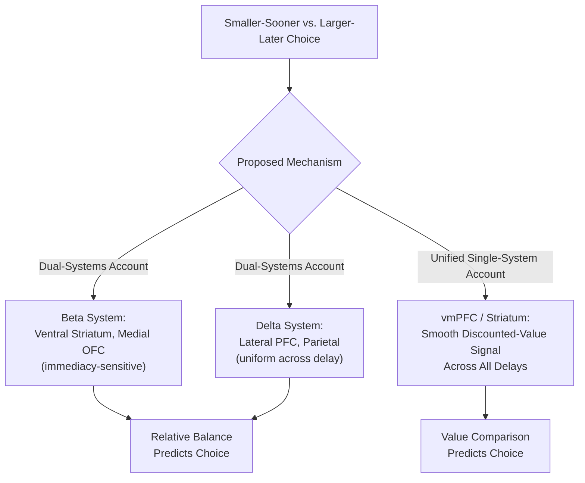

## Impulsivity, Delay Discounting, and Self-Control

### Overview

Impulsivity, delay discounting, and self-control together constitute a closely interrelated cluster of constructs concerning the regulation of behavior toward immediate versus delayed goals and rewards. **Impulsivity** is a multidimensional personality and behavioral construct broadly characterized by a predisposition toward rapid, unplanned reactions and reduced consideration of consequences. **Delay discounting** is the specific, formally quantifiable tendency to devalue future rewards as a function of their temporal distance. **Self-control** refers to the effortful, often prefrontally-mediated capacity to override immediate impulses or preferences in favor of longer-term goals. These constructs are studied both as dissociable psychometric dimensions and as an integrated neurocognitive system with substantial clinical relevance.

### Multidimensional Models of Impulsivity

- **Key Points**:
  - Impulsivity is not a unitary construct; factor-analytic and neurocognitive work consistently identifies multiple dissociable subtypes, most influentially formalized in Whiteside and Lynam's **UPPS(-P) model**: **Urgency** (tendency toward rash action under strong positive or negative emotion), **(lack of) Premeditation** (failure to think through consequences before acting), **(lack of) Perseverance** (difficulty maintaining focus on tedious or difficult tasks), and **Sensation Seeking** (preference for novel, exciting, or risky stimulation), later expanded to separate Positive and Negative Urgency.
  - **Response/motor impulsivity**: The tendency toward premature or poorly inhibited motor responses, indexed by response inhibition paradigms (stop-signal, go/no-go tasks; see inhibitory control mechanisms).
  - **Choice/reflection impulsivity**: The tendency to make decisions without adequately sampling or reflecting on available information, indexed by paradigms such as the information sampling task.
  - **Delay/temporal impulsivity**: The specific tendency to prefer smaller-sooner over larger-later rewards, indexed by delay discounting tasks (detailed below) and conceptually and empirically at least partially dissociable from motor response inhibition, despite both falling under the general "impulsivity" umbrella.

### Delay Discounting: Formal Models

Delay discounting quantifies how the subjective value of a reward decreases as a function of the delay until its receipt.

- **Exponential discounting**: The classical economic model, assuming a constant proportional discount rate per unit time:

$$V = A \cdot e^{-kD}$$

Exponential discounting implies **time-consistent** preferences: the relative preference between two delayed rewards should not change as both are shifted forward or backward in time by an equal amount, an assumption widely violated in empirical human and animal choice data.

- **Hyperbolic discounting**: The empirically better-supported alternative model:

$$V = \frac{A}{1 + kD}$$

where $A$ is the objective reward amount, $D$ is the delay, and $k$ is an individual discount-rate parameter (higher $k$ indicating steeper discounting/greater impulsivity). Hyperbolic discounting produces **preference reversals**: an agent may prefer a larger-later reward when both options are far in the future, but reverse this preference to favor a smaller-sooner reward as that sooner option becomes imminent — a well-documented behavioral pattern (e.g., procrastination, difficulty maintaining long-term commitments) that exponential discounting cannot accommodate but hyperbolic discounting predicts directly from its mathematical form.

**Example**: An individual offered $100 in one year versus $110 in one year and one week will typically prefer waiting the extra week for $110 (the small difference in delay barely affects the discounted values when both are far away). The same individual offered $100 today versus $110 in one week frequently reverses this preference, choosing the immediate $100 — despite the objective one-week gap and $10 difference being identical in both cases — illustrating the preference-reversal signature that motivated the shift from exponential to hyperbolic discounting models.

### Neural Substrates: The Dual-Systems Account

McClure, Laibson, Loewenstein, and Cohen's influential (though subsequently debated) dual-systems neuroimaging study proposed that intertemporal choice reflects the competitive interaction of two partially dissociable neural systems:

| System | Substrates | Proposed Role |
| --- | --- | --- |
| "Beta" (impulsive) system | Ventral striatum, medial OFC, posterior cingulate, amygdala (limbic/paralimbic regions) | Preferentially activated by choices involving an immediately available reward option |
| "Delta" (patient/deliberative) system | Lateral PFC, posterior parietal cortex | Engaged relatively uniformly across all choices regardless of delay, associated with deliberative, future-oriented valuation |

The original study reported that the relative balance of activity across these two systems predicted individual choices between smaller-sooner and larger-later rewards, with greater relative beta-system engagement associated with impulsive (smaller-sooner) choice. [Inference: this influential dual-systems account has faced substantial empirical challenge from subsequent studies (e.g., Kable & Glimcher) reporting more continuous, single-system value-coding patterns in vmPFC/striatum that track subjective (hyperbolically discounted) value smoothly across all delays rather than showing a qualitative limbic/lateral-PFC dissociation specifically tied to immediacy — so whether intertemporal choice genuinely requires two dissociable neural systems, versus a single unified discounted-value-comparison process (consistent with the general value-based decision-making framework), remains an actively debated question in the field.]

Below is a schematic contrasting the proposed dual-systems and unified single-system accounts.

### Self-Control as Top-Down Modulation of Valuation

A separate but related line of neuroeconomic research (notably Hare, Camerer, & Rangel) on dietary self-control decisions has provided direct evidence that self-control operates via top-down prefrontal modulation of a core valuation signal, rather than via a wholly separate override mechanism.

- In studies where participants choose among food items varying in both healthiness and tastiness, vmPFC activity tracks an integrated subjective value signal at the time of choice.
- Critically, in participants who successfully exercise dietary self-control (choosing healthy over tasty options), DLPFC activity at the time of choice correlates with the degree to which vmPFC's value signal incorporates health considerations (rather than tastiness alone), and connectivity between DLPFC and vmPFC increases during successful self-control trials — supporting a model in which self-control is implemented by DLPFC modulating *what* vmPFC represents as valuable, rather than a separate PFC region simply "vetoing" or overriding an already-computed, purely hedonic vmPFC value signal after the fact.

### Impulsivity, Delay Discounting, and Addiction

Steeper delay discounting (higher $k$) is among the most robustly replicated behavioral/cognitive markers across a wide range of substance use disorders and behavioral addictions (e.g., gambling disorder), a finding sufficiently consistent to have motivated its consideration as a candidate transdiagnostic **behavioral economic marker** and even a proposed "reinforcer pathology" framework (Bickel and colleagues) characterizing addiction partly in terms of the joint contribution of steep temporal discounting and heightened valuation of the addictive reinforcer.

- **Causal direction debate**: Steep discounting could reflect a pre-existing vulnerability trait increasing risk for substance use initiation, a consequence of chronic substance exposure on prefrontal-striatal circuitry, or a bidirectional/reciprocal relationship; longitudinal and twin/genetically-informed study designs have been used to help disentangle these possibilities, with evidence generally supporting at least a partial pre-existing trait contribution alongside potential exacerbation from continued use. [Inference: while some longitudinal and genetically-informed studies support a pre-existing vulnerability component, the relative contribution of pre-existing trait versus substance-induced neuroadaptation to observed discounting differences likely varies across substances and individuals, and a fully resolved causal account is not established.]
- **State-dependent discounting**: Discounting rates in individuals with substance use disorders are further elevated specifically for the substance of choice itself (relative to money), and can be acutely modulated by current craving/withdrawal state, consistent with the reinforcer-pathology framework's emphasis on the substance-specific, state-dependent nature of the discounting elevation rather than a purely fixed, substance-independent trait.

### Developmental and Individual-Differences Relevance

- **Adolescent risk-taking**: Delay discounting rates are elevated in adolescence relative to adulthood in most (though not fully universal) developmental studies, proposed to reflect the differential maturational timing between subcortical/limbic reward circuitry (maturing relatively early) and prefrontal regulatory circuitry (maturing later, into the mid-20s), a widely cited (though also actively debated and refined) neurodevelopmental account of heightened adolescent risk-taking and impulsivity. [Inference: while the general dual-systems/maturational-mismatch account of adolescent risk-taking is influential, its precise empirical support and the degree to which it fully explains adolescent behavior, as opposed to representing an oversimplification of more nuanced developmental and contextual factors, is a matter of ongoing debate in developmental neuroscience.]
- **ADHD**: Elevated delay discounting and multiple impulsivity subtypes are consistently reported in ADHD populations, consistent with prefrontal-striatal circuit dysfunction models of the disorder, though the specific impulsivity subtype(s) most centrally implicated (motor/response inhibition versus temporal/choice impulsivity) vary somewhat across studies and may reflect partially distinct underlying mechanisms.

**Related Topics**

- Inhibitory control mechanisms and the stop-signal paradigm (see related item)
- Neuroeconomics fundamentals and intertemporal choice (see related item)
- Reward circuitry and dopaminergic signaling in addiction (see related item)
- Value-based decision making and top-down prefrontal modulation (see related item)
- UPPS-P model of impulsivity and psychometric assessment
- Reinforcer pathology framework in addiction research
- Adolescent neurodevelopment and the maturational-mismatch hypothesis
- Behavioral economics of addiction and demand curve analysis