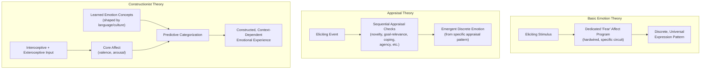

## Basic, Appraisal, and Constructionist Theories of Emotion

### Overview

Theories of emotion in affective neuroscience differ fundamentally in how they characterize the nature, number, and generative mechanism of emotional states. **Basic emotion theories** propose a small set of discrete, biologically hardwired, evolutionarily conserved emotion categories, each with a dedicated neural and physiological signature. **Appraisal theories** propose that emotions arise from the cognitive evaluation (appraisal) of a situation along specific dimensions relevant to an individual's goals and wellbeing, generating the specific emotional response as a function of that appraisal pattern. **Constructionist theories** reject the notion of dedicated, natural-kind emotion categories altogether, proposing instead that emotional experiences are constructed in the moment from more basic, domain-general psychological ingredients. These frameworks make sharply different predictions about the expected structure of emotion-related neural and behavioral data.

### Basic Emotion Theory

- **Key Points**:
  - **Core claim**: A limited set of emotions (commonly proposed: fear, anger, disgust, sadness, happiness, surprise, in Ekman's influential formulation) are evolutionarily ancient, universal across cultures, and each associated with a distinct, reliably identifiable "affect program" — a coordinated pattern of physiological, expressive (particularly facial), and behavioral output.
  - **Universality evidence**: Cross-cultural studies of facial expression recognition (notably Ekman and Friesen's work with visually isolated populations, including the Fore of Papua New Guinea) reported above-chance cross-cultural recognition of posed facial expressions corresponding to the proposed basic emotion categories, historically cited as key evidence for universal, biologically hardwired emotion categories rather than purely culturally learned display conventions.
  - **Discrete neural signature assumption**: Basic emotion theory predicts that each basic emotion should correspond to a distinct, localizable, and specific neural circuit or "natural kind" brain state — a strong and empirically testable prediction that has become a central point of contention with constructionist critiques (see below).
  - Proposed (though debated) canonical substrates include the amygdala for fear, insula for disgust, and orbitofrontal/subcortical circuitry for reward-related positive affect, though the degree to which these associations reflect genuinely dedicated, one-to-one emotion-specific circuits versus broader, less emotion-specific functional contributions is a central point of ongoing dispute.

### Appraisal Theory

- **Key Points**:
  - **Core claim**: Emotions are elicited not directly by external stimuli or events themselves, but by the individual's subjective, often rapid and automatic, cognitive appraisal of the personal significance of that stimulus/event along a structured set of evaluative dimensions.
  - **Common appraisal dimensions** (varying somewhat across specific theoretical models, e.g., Lazarus, Scherer, Smith & Ellsworth): **novelty/unexpectedness**, **valence/pleasantness**, **goal relevance and goal congruence** (does the event help or hinder current goals), **coping potential** (perceived ability to manage or influence the situation), and **agency/causal attribution** (who or what caused the event — self, other, or circumstance).
  - **Sequential vs. parallel appraisal processing**: Some models (e.g., Scherer's Component Process Model) propose appraisals unfold through a rapid, sequential series of checks, with the specific resulting pattern of appraisal outcomes across dimensions determining the discrete emotional response that emerges (e.g., an event appraised as goal-incongruent, caused by another agent, and low in coping potential might produce anger or fear depending on further dimension values).
  - Appraisal theory can accommodate both the existence of discrete, recognizable emotion categories (as emergent products of characteristic appraisal patterns) and substantial individual/cultural variation in emotional response to objectively similar events (since appraisal of the same event can vary considerably across individuals and contexts), offering a partial bridge between basic-emotion and constructionist positions.

**Example**: Two individuals cut off in traffic by another driver may experience markedly different emotions depending on their appraisal of the event: one who appraises the cause as the other driver's rude intentionality, appraises the event as goal-incongruent (delayed travel), and has low coping potential (cannot easily retaliate or resolve it) may experience anger; another who appraises the same event as an understandable mistake (low blame attribution) and quickly regains goal progress may experience only mild, transient annoyance or no strong emotion at all — illustrating how identical external events can produce divergent emotional outcomes depending on the specific pattern of cognitive appraisal.

### Constructionist Theory

- **Key Points**:
  - **Core claim** (most prominently associated with Lisa Feldman Barrett's Theory of Constructed Emotion): Discrete emotion categories (anger, fear, sadness, etc.) are not natural kinds with dedicated neural circuits, but are instead constructed, on the fly, from more basic, domain-general psychological ingredients — primarily **core affect** (a continuously fluctuating, low-dimensional state characterized by valence, pleasant-unpleasant, and arousal, activated-deactivated) combined with conceptual knowledge (learned emotion concepts, shaped substantially by language and culture) applied via a predictive processing framework to categorize and interpret the current interoceptive/affective state.
  - **Predictive processing framing**: The brain is proposed to continuously generate predictions about incoming interoceptive and exteroceptive signals based on prior experience and learned concepts; when core affect and situational context are categorized using a learned emotion concept (e.g., "fear"), the resulting experience is constructed as that specific emotion, with the same underlying core affective state potentially categorized differently (as a different discrete emotion, or as no distinct emotion at all) depending on available concepts, context, and prior learning.
  - **Critique of basic emotion neuroimaging evidence**: Constructionist researchers, notably via meta-analyses of the neuroimaging literature (e.g., Lindquist, Barrett, and colleagues), have argued that no consistent, emotion-category-specific and reliably localized neural "fingerprint" has been found for discrete basic emotions across studies — instead finding that regions like amygdala and insula are engaged across multiple different discrete emotion categories and also across many non-emotional cognitive processes (e.g., amygdala engagement in general salience/novelty detection, not fear specifically), consistent with a domain-general, constructionist rather than discrete natural-kind account.

Below is a schematic contrasting the three theoretical frameworks' proposed generative structure for a discrete emotion category.

### Neural Implications and Points of Empirical Contention

- **Amygdala**: Central to basic emotion theory's proposal as a dedicated "fear circuit," but constructionist and other critiques point to substantial evidence of amygdala engagement across positive emotions, general novelty/salience detection, and non-emotional learning and attention tasks, arguing against a fear-specific interpretation and favoring a more domain-general role potentially consistent with core-affect/salience-detection functions.
- **Anterior insula**: Proposed as central to disgust in some basic-emotion-influenced accounts, but shows substantial engagement across interoceptive awareness, pain, uncertainty/risk processing, and numerous non-disgust-related tasks, similarly complicating a strictly disgust-specific interpretation.
- **Meta-analytic neuroimaging evidence**: Large-scale quantitative meta-analyses (e.g., using multivariate pattern classification and coordinate-based meta-analysis techniques) have generally found more consistent evidence for regions and patterns associated with core affect dimensions (valence, arousal) and domain-general processes (salience detection, interoceptive prediction) than for spatially localized, emotion-category-specific "fingerprints," providing some of the most direct empirical support cited by constructionist theorists, though basic-emotion-theory proponents have contested specific methodological choices in these meta-analyses (e.g., reverse inference concerns, the coarseness of standard fMRI spatial resolution for detecting genuinely distributed but still discrete neural patterns). [Inference: this remains one of the most actively and directly contested empirical debates in affective neuroscience, with proponents of basic emotion, appraisal, and constructionist positions each offering competing interpretations of substantially the same underlying body of neuroimaging evidence.]

### Facial Expression Evidence: A Focal Point of Debate

The universality of facial expression recognition, long treated as a cornerstone of basic emotion theory, has been substantially reexamined and contested in subsequent research.

- Cross-cultural recognition studies using **forced-choice** response formats (participants must select from a short list of provided emotion labels) tend to show higher agreement than studies using **free-labeling** formats (participants generate their own descriptive label), suggesting that some of the classic universal-recognition findings may partly reflect constraints of the forced-choice methodology (biasing responses toward the expected small set of categories) rather than purely reflecting universal, unprompted categorical perception.
- Constructionist researchers argue this methodological sensitivity supports the view that discrete emotion categorization of facial expressions is substantially shaped by available conceptual/linguistic categories (consistent with the predictive, concept-driven categorization central to constructionist theory) rather than reflecting the readout of a hardwired, category-specific perceptual mechanism. [Unverified: the degree to which the original cross-cultural universality findings are artifactual (methodology-driven) versus reflecting a genuine, if perhaps less absolute than originally claimed, universal component remains an actively contested empirical question.]

### Integrative and Hybrid Positions

Several contemporary researchers propose hybrid or integrative frameworks rather than treating these three theoretical families as fully mutually exclusive — for example, proposing that some minimal, evolutionarily conserved affective/motivational circuits (broadly consistent with a weaker version of basic emotion theory) provide core-affect-like inputs that are then further shaped, categorized, and differentiated into culturally and conceptually inflected discrete emotional experiences through appraisal-like and constructionist-like processes. [Inference: such integrative positions are an active area of theoretical development rather than a fully settled consensus framework, and researchers continue to disagree on the degree to which any dedicated, discrete-category-specific circuitry exists beneath the more domain-general and constructed processes emphasized by appraisal and constructionist accounts.]

### Clinical and Applied Relevance

- **Emotion regulation research**: The choice of underlying theoretical framework has direct implications for intervention design — appraisal theory directly motivates cognitive reappraisal-based interventions (targeting the appraisal process itself to alter downstream emotional response), a well-established and empirically supported emotion regulation strategy in both basic research and clinical (e.g., cognitive-behavioral therapy) contexts.
- **Alexithymia and interoception**: Constructionist theory's emphasis on interoceptive prediction and conceptual categorization has motivated research connecting alexithymia (difficulty identifying and describing one's own emotions) to altered interoceptive processing and impoverished emotion-concept granularity, offering a distinct theoretical lens on this clinically relevant construct compared to basic-emotion-theory framings. [Inference: the specific mechanistic account linking alexithymia to interoceptive prediction deficits, as proposed within the constructionist framework, is one influential but not universally adopted theoretical interpretation among several competing accounts of alexithymia's underlying basis.]

**Next Steps**

- Amygdala function in fear, salience, and general emotional processing
- Cognitive reappraisal and emotion regulation strategies
- Core affect, interoception, and the predictive processing framework
- Facial expression recognition methodology and cross-cultural research
- Alexithymia and interoceptive prediction accounts
- James-Lange and Cannon-Bard historical theories of emotion
- Anterior insula function across disgust, interoception, and salience
- Emotion concept acquisition and the role of language