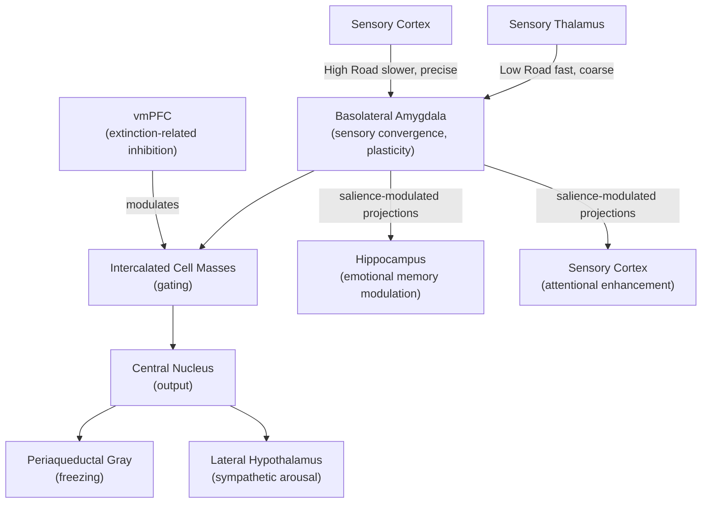

## Amygdala Function in Emotional Processing

### Overview

The amygdala is a bilateral, almond-shaped collection of nuclei situated in the medial temporal lobe, anterior to the hippocampus. It is the most extensively studied subcortical structure in affective neuroscience, historically characterized as a dedicated "fear center" but increasingly understood, based on a substantial body of subsequent research, as contributing more broadly to salience detection, associative emotional learning, and the modulation of memory, attention, and physiological arousal across both negative and positive affective contexts.

### Anatomical Organization

- **Key Points**:
  - **Basolateral complex (BLA)**: Comprising the lateral, basal, and accessory basal nuclei, functioning as the primary sensory input hub of the amygdala, receiving highly processed sensory information from all modalities via cortical and thalamic afferents, and serving as the principal site of associative plasticity underlying fear/threat conditioning.
  - **Central nucleus (CeA)**: The primary output nucleus of the amygdala, projecting to hypothalamic and brainstem structures that generate the specific physiological and behavioral components of the fear/defensive response (e.g., periaqueductal gray for freezing, lateral hypothalamus for sympathetic activation, parabrachial nucleus for respiratory changes).
  - **Intercalated cell masses (ITCs)**: GABAergic interneuron clusters positioned between the BLA and CeA, implicated in gating the flow of information from BLA to CeA and playing a specific proposed role in fear extinction by inhibiting CeA output following extinction learning.
  - **Cortical and medial nuclei**: Involved primarily in olfactory processing and connections to the hypothalamus relevant to social and reproductive behaviors, phylogenetically older and less centrally implicated in the fear/threat learning circuitry that dominates the contemporary human amygdala literature.

### The Dual Sensory Input Pathway to Fear Conditioning

A foundational and highly influential model of amygdala function in fear processing (developed substantially through LeDoux and colleagues' work on auditory fear conditioning in rodents) proposes two parallel routes by which threat-relevant sensory information reaches the amygdala:

- **"Low road" (thalamo-amygdala pathway)**: A fast, coarse, subcortical route directly from sensory thalamus to the lateral amygdala, bypassing sensory cortex entirely, enabling very rapid (though imprecise/low-resolution) threat detection and defensive response initiation.
- **"High road" (thalamo-cortico-amygdala pathway)**: A slower but more precise route via sensory cortex, providing more fully processed, higher-resolution sensory information to the amygdala, allowing for more accurate discrimination and appropriate modulation of the response, including potential override or refinement of a "low road"-initiated response.

This dual-pathway architecture is proposed to explain the adaptive value of a "better safe than sorry" rapid threat-response system (the low road) that can trigger defensive responses before full, accurate identification of the stimulus, subsequently refined or corrected by slower, more accurate cortical processing (the high road). [Inference: while foundational in rodent auditory fear conditioning research, the degree to which an anatomically and functionally equivalent low-road/high-road distinction operates identically across all sensory modalities and in humans specifically remains an area of ongoing extension and some debate.]

### Pavlovian Fear Conditioning: The Canonical Amygdala Learning Paradigm

Fear conditioning is the most extensively characterized associative learning paradigm involving the amygdala, providing a well-established model system linking cellular plasticity mechanisms to behavior.

- **Basic paradigm**: A neutral conditioned stimulus (CS, e.g., a tone) is repeatedly paired with an aversive unconditioned stimulus (US, e.g., a mild shock), such that the CS alone comes to elicit a conditioned fear response (e.g., freezing in rodents, increased skin conductance in humans).
- **Synaptic plasticity mechanism**: CS and US information converge onto overlapping populations of lateral amygdala neurons; repeated pairing induces long-term potentiation (LTP) at CS-responsive synapses, strengthening the CS's capacity to activate the fear-response-generating circuit via BLA-to-CeA projections, a well-characterized example of Hebbian, NMDA-receptor-dependent synaptic plasticity directly underlying associative fear learning.
- **Fear extinction**: Repeated presentation of the CS without the US produces a reduction in the conditioned fear response, but this extinction is now understood as predominantly reflecting **new inhibitory learning** (a new CS-no-US association actively suppressing the original fear memory) rather than erasure of the original fear association, supported by extensive evidence of fear-response renewal (context-dependent reappearance of extinguished fear) and reinstatement (reappearance following a subsequent aversive experience) phenomena. Ventromedial PFC and the intercalated cell masses are implicated in mediating this extinction-based inhibition of amygdala output.

**Example**: A rodent that has learned to freeze in response to a tone previously paired with shock will show reduced freezing after repeated tone-alone extinction trials. However, if tested in the original conditioning context rather than the extinction context, freezing to the tone frequently returns (renewal), and a single subsequent unsignaled shock can restore strong tone-elicited freezing even after successful extinction (reinstatement) — both findings supporting the "new inhibitory learning" rather than "erasure" account of extinction.

### Beyond Fear: Salience, Novelty, and Positive Valence

Contemporary human neuroimaging and comparative research has substantially broadened the classic "fear center" characterization of amygdala function.

- **General salience/novelty detection**: Amygdala activation is reliably observed not only to fear-relevant or aversive stimuli but to novel, ambiguous, unpredictable, and even neutral or positively-valenced highly salient stimuli, motivating proposals that amygdala functions more generally as a relevance/salience detector rather than a fear-specific module, consistent with constructionist critiques of strict basic-emotion-category localization (see related item).
- **Positive valence and appetitive processing**: Amygdala activity is also reliably observed during appetitive/reward-related learning and processing (e.g., in reward-related Pavlovian conditioning and in encoding the emotional/motivational salience of positive stimuli), with some evidence for at least partially distinct or overlapping subpopulations of amygdala neurons preferentially responsive to positive versus negative valence, though the degree of anatomical separability of valence-specific amygdala subpopulations in humans remains incompletely characterized. [Inference: while valence-specific amygdala subpopulations have been reported in some rodent optogenetic and electrophysiological studies, the extent to which comparably clean valence-specific dissociations exist and are functionally significant in the human amygdala is less firmly established.]
- **Ambiguity and uncertainty**: Amygdala engagement during processing of ambiguous facial expressions and during ambiguity/uncertainty-related decision-making (see risk and uncertainty processing) further supports a broader role in flagging motivationally significant or uncertain stimuli requiring further evaluation, beyond a narrowly fear-specific interpretation.

Below is a schematic of amygdala input/output circuitry integrating both the classic fear-conditioning pathway and the broader salience-processing role.

### Modulation of Memory and Attention

- **Emotional memory enhancement**: The amygdala is centrally implicated in the well-documented phenomenon of enhanced memory consolidation for emotionally arousing events, via BLA modulation of hippocampal and cortical consolidation processes, mediated substantially by stress-hormone (glucocorticoid, noradrenergic) signaling within the amygdala following an emotionally arousing experience — a mechanism supported by extensive pharmacological studies showing that post-training amygdala manipulation (e.g., beta-adrenergic blockade) can selectively impair the memory-enhancing effect of emotional arousal without impairing memory for neutral material.
- **Attentional prioritization**: Amygdala activation to threat-relevant or salient stimuli is associated with enhanced sensory cortical processing of that stimulus (via amygdala-to-sensory-cortex feedback projections) and can capture attention relatively automatically, contributing to well-documented phenomena such as more rapid visual search detection of threat-related stimuli.

### Human Lesion Evidence

Rare human cases of bilateral amygdala damage (e.g., from Urbach-Wiethe disease, a genetic condition causing selective bilateral amygdala calcification) have provided important, if limited-sample, convergent evidence for amygdala's role in human emotional processing.

- Documented patients have shown selective impairment in recognizing fear from facial expressions (though not uniformly impaired recognition of all basic emotions), reduced physiological fear responses to normally fear-inducing stimuli, and altered risk-taking and loss-aversion behavior in decision-making tasks, alongside relatively intact general intellectual functioning — providing a clinically striking, if rare, convergent line of evidence for a specific amygdala contribution to fear-related processing (though consistent with the broader salience-based reinterpretation, some documented patients also show broader alterations extending beyond fear specifically, such as altered social space preferences and reduced ability to gauge trustworthiness from faces). [Inference: given the rarity of selective bilateral human amygdala lesions, conclusions from this literature rest on a small number of well-characterized cases, and the generalizability of findings across the full range of amygdala functions remains constrained by this limited sample size.]

### Clinical Relevance

- **Anxiety disorders and PTSD**: Amygdala hyperreactivity to threat-related and, in some studies, more general salient stimuli is among the most consistently replicated neuroimaging findings across anxiety disorders and PTSD, alongside evidence of reduced top-down regulatory input from vmPFC, consistent with an amygdala-vmPFC circuit dysregulation model of pathological anxiety and impaired fear extinction.
- **Exposure-based therapy**: Cognitive-behavioral exposure therapy for anxiety disorders and PTSD is widely understood, within this framework, as leveraging fear extinction mechanisms (repeated CS presentation without the feared US/outcome) to build new inhibitory vmPFC-amygdala learning, directly connecting basic fear-conditioning neuroscience to established clinical intervention mechanisms.
- **Depression**: Some studies report amygdala hyperreactivity to negative emotional stimuli and altered amygdala response to positive stimuli in depression, consistent with broader mood-congruent processing biases, though findings are less uniformly consistent than the anxiety/PTSD threat-hyperreactivity literature. [Unverified: amygdala reactivity findings in depression show greater heterogeneity across studies compared to the more consistently replicated anxiety/PTSD findings.]

**Related Topics**

- Basic, appraisal, and constructionist theories of emotion (see related item)
- Fear extinction and exposure-based therapy mechanisms
- Somatic markers and vmPFC-amygdala interaction in decision-making (see related item)
- Risk and uncertainty processing and amygdala contributions (see related item)
- Emotional memory consolidation and glucocorticoid/noradrenergic modulation
- PTSD neurocircuitry models
- Urbach-Wiethe disease and human amygdala lesion studies
- Salience network and domain-general relevance detection