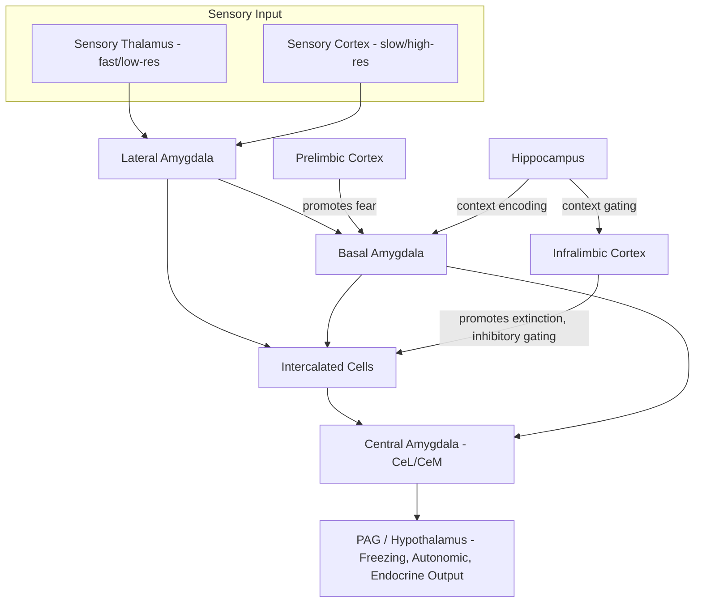

## Fear Conditioning and Extinction Circuits

### Overview

Fear conditioning is a form of Pavlovian (classical) associative learning in which a neutral conditioned stimulus (CS, e.g., a tone) is paired with an aversive unconditioned stimulus (US, e.g., a footshock), such that the CS comes to elicit a conditioned fear response (CR, e.g., freezing, autonomic arousal). Extinction is the subsequent process by which repeated presentation of the CS without the US leads to a reduction in the CR. Extinction is not erasure of the original CS-US memory; it is new inhibitory learning that competes with and suppresses the original association. This model system has become the dominant framework for studying the neural circuitry of associative emotional memory because the circuits involved are anatomically well-defined and experimentally tractable across species.

### Behavioral Paradigm

**Key Points**

- Acquisition: CS (tone/light) paired with US (mild footshock) over several trials; CR (freezing in rodents) increases across trials.
- Consolidation: the CS-US memory stabilizes over hours, requiring protein synthesis and structural/synaptic changes.
- Extinction training: repeated CS-alone presentations; freezing to the CS progressively declines within and across sessions.
- Extinction retrieval/recall: tested in a subsequent session to assess whether the reduction in fear persists.
- Renewal, reinstatement, and spontaneous recovery are classic phenomena demonstrating that extinction leaves the original fear memory intact rather than destroying it.

**Example**

A rat receives five tone-shock pairings (Day 1). On Day 2, the tone is presented 20 times without shock in a different context; freezing declines from ~70% to ~15% across the session (extinction learning). On Day 3, the tone is tested in the original conditioning context; freezing partially returns (renewal), showing the extinction memory is context-dependent rather than a deletion of the fear trace.

### Core Neuroanatomy

#### The Amygdala Complex

The amygdala is the central hub of fear circuitry, comprising several functionally distinct nuclei:

- **Lateral amygdala (LA)**: primary sensory input site. Auditory and somatosensory (CS and US) information converges here via thalamic and cortical afferents. Synaptic plasticity at LA synapses (particularly thalamo-LA and cortico-LA synapses) is considered the primary locus of CS-US associative plasticity.
- **Basal amygdala (BA)** (sometimes termed basolateral, BLA, together with LA): receives processed input from LA and hippocampus/context-encoding regions; projects to central amygdala and is heavily implicated in extinction-related plasticity, including "extinction neurons" that become active specifically during successful extinction retrieval.
- **Central amygdala (CeA)**: the primary output nucleus, divided into lateral (CeL) and medial (CeM) subdivisions. CeM projects to brainstem and hypothalamic effector regions that produce the behavioral and autonomic fear response (freezing via projections to periaqueductal gray, heart rate/blood pressure via hypothalamus, and stress hormone release via the paraventricular nucleus).
- **Intercalated cell masses (ITCs)**: clusters of GABAergic inhibitory neurons situated between the BLA and CeA. They gate the flow of information from BLA to CeM and are critical for both fear expression and extinction, since different ITC clusters are engaged depending on whether fear or extinction memory is dominant.

#### Prefrontal Cortex

- **Prelimbic cortex (PL)** (rodent) / dorsal anterior cingulate-adjacent regions (primate homolog debated): promotes fear expression. PL projects to BA and drives CeM output during high-fear states.
- **Infralimbic cortex (IL)** (rodent) / ventromedial prefrontal cortex (vmPFC, primate/human homolog): promotes extinction and inhibits fear expression. IL projects to ITCs and BA, strengthening inhibitory gating of amygdala output after extinction learning. Reduced IL/vmPFC activity or plasticity is strongly associated with impaired extinction retention, a hallmark of anxiety disorders and PTSD.

#### Hippocampus

- Encodes contextual information, allowing fear responses to be context-specific.
- Critical for context-dependent renewal of extinguished fear (ABA, ABC, AAB renewal paradigms) and for disambiguating whether the "safe" (extinction) context or "dangerous" (conditioning) context is currently active.
- Ventral hippocampus projects directly to BA and mPFC, integrating contextual and emotional information.

#### Other Structures

- **Periaqueductal gray (PAG)**: downstream effector for freezing behavior (ventrolateral PAG) and active defensive responses (dorsolateral/dorsomedial PAG).
- **Bed nucleus of the stria terminalis (BNST)**: mediates sustained, diffuse anxiety-like states as opposed to phasic, cue-specific fear; receives CeA output and has reciprocal connections with hypothalamus.
- **Thalamus (auditory/sensory relay nuclei, e.g., medial geniculate nucleus)**: provides fast, low-resolution CS information directly to LA (the "low road"), in parallel with slower, high-resolution cortical input (the "high road").

### Circuit Diagram (svg_diagram)

<svg xmlns="http://www.w3.org/2000/svg" viewBox="0 0 900 620" font-family="Helvetica, Arial, sans-serif">
<text x="450" y="30" text-anchor="middle" font-size="20" font-weight="bold" fill="#1a1a1a">Fear Conditioning and Extinction Circuit (svg_diagram)</text>

<rect x="30" y="70" width="150" height="50" rx="8" fill="#dce8f7" stroke="#3b6ea5" stroke-width="1.5" />
<text x="105" y="100" text-anchor="middle" font-size="13">Sensory Thalamus</text>
<rect x="30" y="150" width="150" height="50" rx="8" fill="#dce8f7" stroke="#3b6ea5" stroke-width="1.5" />
<text x="105" y="180" text-anchor="middle" font-size="13">Sensory Cortex</text>

<rect x="260" y="110" width="150" height="50" rx="8" fill="#f7e3c4" stroke="#b5822c" stroke-width="1.5" />
<text x="335" y="140" text-anchor="middle" font-size="13">Lateral Amygdala (LA)</text>

<rect x="260" y="220" width="150" height="50" rx="8" fill="#f7e3c4" stroke="#b5822c" stroke-width="1.5" />
<text x="335" y="250" text-anchor="middle" font-size="13">Basal Amygdala (BA)</text>

<rect x="480" y="165" width="130" height="50" rx="8" fill="#e3d7f5" stroke="#6b3fa0" stroke-width="1.5" />
<text x="545" y="190" text-anchor="middle" font-size="12">Intercalated Cells</text>
<text x="545" y="205" text-anchor="middle" font-size="12">(ITC)</text>

<rect x="670" y="165" width="150" height="60" rx="8" fill="#f5cccc" stroke="#a03030" stroke-width="1.5" />
<text x="745" y="190" text-anchor="middle" font-size="13">Central Amygdala</text>
<text x="745" y="206" text-anchor="middle" font-size="12">(CeL / CeM)</text>

<rect x="670" y="270" width="150" height="70" rx="8" fill="#d9f2d9" stroke="#3a7d3a" stroke-width="1.5" />
<text x="745" y="295" text-anchor="middle" font-size="12">PAG / Hypothalamus</text>
<text x="745" y="312" text-anchor="middle" font-size="12">Freezing, Autonomic,</text>
<text x="745" y="327" text-anchor="middle" font-size="12">Endocrine Response</text>

<rect x="260" y="380" width="150" height="55" rx="8" fill="#fde2e2" stroke="#c0504d" stroke-width="1.5" />
<text x="335" y="405" text-anchor="middle" font-size="13">Prelimbic Cortex (PL)</text>
<text x="335" y="422" text-anchor="middle" font-size="11">promotes fear expression</text>

<rect x="260" y="460" width="150" height="55" rx="8" fill="#e2f0d9" stroke="#5a8f3c" stroke-width="1.5" />
<text x="335" y="485" text-anchor="middle" font-size="13">Infralimbic Cortex (IL)</text>
<text x="335" y="502" text-anchor="middle" font-size="11">promotes extinction</text>

<rect x="30" y="460" width="160" height="55" rx="8" fill="#dbe9f2" stroke="#2f6f8f" stroke-width="1.5" />
<text x="110" y="485" text-anchor="middle" font-size="12">Hippocampus</text>
<text x="110" y="502" text-anchor="middle" font-size="11">(context encoding)</text>

<line x1="180" y1="95" x2="260" y2="130" stroke="#444" stroke-width="1.5" marker-end="url(#arrow)" />
<line x1="180" y1="175" x2="260" y2="145" stroke="#444" stroke-width="1.5" marker-end="url(#arrow)" />
<line x1="335" y1="160" x2="335" y2="220" stroke="#444" stroke-width="1.5" marker-end="url(#arrow)" />
<line x1="410" y1="135" x2="480" y2="180" stroke="#444" stroke-width="1.5" marker-end="url(#arrow)" />
<line x1="410" y1="245" x2="480" y2="200" stroke="#444" stroke-width="1.5" marker-end="url(#arrow)" />
<line x1="610" y1="190" x2="670" y2="190" stroke="#444" stroke-width="1.5" marker-end="url(#arrow)" />
<line x1="745" y1="225" x2="745" y2="270" stroke="#444" stroke-width="1.5" marker-end="url(#arrow)" />
<line x1="335" y1="380" x2="335" y2="272" stroke="#c0504d" stroke-width="1.5" marker-end="url(#arrow)" />
<line x1="335" y1="460" x2="480" y2="230" stroke="#5a8f3c" stroke-width="1.5" stroke-dasharray="5,3" marker-end="url(#arrow)" />
<line x1="190" y1="480" x2="260" y2="470" stroke="#2f6f8f" stroke-width="1.5" marker-end="url(#arrow)" />
<line x1="110" y1="460" x2="260" y2="250" stroke="#2f6f8f" stroke-width="1.5" stroke-dasharray="5,3" marker-end="url(#arrow)" />

<text x="450" y="570" font-size="12" fill="#555">Solid arrows: excitatory relay. Dashed green: IL → ITC inhibitory-recruiting pathway (extinction).</text>

<text x="450" y="588" font-size="12" fill="#555">Dashed blue: hippocampal contextual input to BA (context-gated fear/extinction).</text>

</svg>

### Cellular and Molecular Mechanisms of Acquisition

#### Synaptic Plasticity in the Lateral Amygdala

Fear conditioning induces long-term potentiation (LTP)-like changes at thalamic and cortical inputs onto LA pyramidal neurons. Key mechanistic features:

- **NMDA receptor-dependent plasticity**: Coincident CS (presynaptic) and US-driven depolarization (postsynaptic) activates NMDA receptors, permitting $Ca^{2+}$ influx that triggers downstream signaling cascades.
- **AMPA receptor trafficking**: Calcium/calmodulin-dependent protein kinase II (CaMKII) activation drives insertion of GluA1-containing AMPA receptors into the postsynaptic membrane, increasing synaptic strength — the same core mechanism underlying LTP in the hippocampus.
- **Presynaptic contribution**: Evidence also supports presynaptic changes in neurotransmitter release probability contributing to the potentiated CS-evoked response in LA.
- **Protein synthesis-dependent consolidation**: Within the first few hours after conditioning, de novo protein synthesis and gene transcription (including immediate early genes such as *c-fos*, *Arc*, and *zif268*) are required to convert short-term synaptic changes into a stable long-term memory trace.
- **Cellular allocation/eligibility**: Neurons with transiently elevated CREB (cAMP response element-binding protein) activity at the time of training are preferentially recruited into the fear memory trace ("neuronal allocation" hypothesis), and their subsequent silencing or ablation can selectively erase the specific fear memory.

$$\Delta w_{ij} \propto \left[Ca^{2+}\right]_{post} \cdot f(\text{CaMKII activation})$$

This simplified relationship captures the dependency of synaptic weight change ($\Delta w_{ij}$) between presynaptic CS input $i$ and postsynaptic LA neuron $j$ on postsynaptic calcium influx during paired CS-US trials. [Inference: this is a schematic simplification for pedagogical purposes, not a formal model published in this exact form.]

### Cellular and Molecular Mechanisms of Extinction

Extinction is frequently mischaracterized as passive forgetting. Decades of lesion, pharmacological, and optogenetic work instead support an active new-learning model:

- **New inhibitory memory**: Extinction training establishes a new CS-"no US" association that is stored partly in IL and partly via strengthened IL-driven recruitment of ITCs, which inhibit CeM output.
- **NMDA receptor dependence**: Similar to acquisition, extinction learning requires NMDA receptor activation, notably in the BLA and IL; NMDA receptor partial agonists (e.g., D-cycloserine) administered around extinction sessions have been used experimentally and clinically to facilitate extinction learning.
- **"Extinction neurons"**: A subpopulation of BA neurons increases firing specifically during extinction retrieval and projects to ventral hippocampus/other targets promoting fear suppression, distinct from LA/BA "fear neurons" that fire during conditioned fear expression.
- **ITC gating**: The specific ITC cluster engaged shifts with the balance of fear versus extinction memory; IL preferentially drives the ITC population that inhibits CeM, dampening output.
- **Context-dependence**: Because extinction learning is encoded partly via hippocampal-mPFC-amygdala interactions, the extinguished response is context-bound, explaining renewal and spontaneous recovery.

### Renewal, Reinstatement, and Spontaneous Recovery

**Key Points**

- **Renewal**: Extinguished fear returns when the CS is presented outside the extinction context (commonly tested as ABA, ABC, or AAB designs, where A = conditioning context, B = extinction context, C = novel context).
- **Reinstatement**: An unsignaled US presentation after extinction can restore fear to the CS even in the extinction context, implicating noradrenergic and BNST-mediated stress-sensitization mechanisms.
- **Spontaneous recovery**: Fear to the CS can partially return simply with the passage of time after extinction, without any explicit re-exposure to the US.
- These phenomena collectively demonstrate that extinction produces new, context-gated inhibitory learning layered atop an intact original fear memory trace, rather than unlearning or erasure.

### Species and Translational Considerations

- Rodent (rat, mouse) auditory and contextual fear conditioning paradigms are the dominant experimental model due to precise circuit-level manipulability (optogenetics, chemogenetics, in vivo electrophysiology, fiber photometry).
- Human fMRI studies broadly parallel rodent findings: amygdala BOLD activation scales with CS-US contingency during acquisition; vmPFC (proposed IL homolog) activation correlates with extinction recall; hippocampal activity tracks context-dependent renewal. [Inference: cross-species homology between rodent IL/PL and primate vmPFC/dACC is functionally supported but anatomically debated in the literature.]
- Clinical relevance: **Post-traumatic stress disorder (PTSD)** is associated with amygdala hyperreactivity, reduced vmPFC volume/activity, and impaired extinction retention. **Exposure therapy**, a first-line behavioral treatment for phobias, PTSD, and anxiety disorders, is mechanistically an applied form of extinction training, and its efficacy is thought to depend on engaging the same IL/vmPFC-BLA-ITC circuitry.
- Pharmacological extinction enhancers studied in human trials (e.g., D-cycloserine as an adjunct to exposure therapy) derive directly from the rodent NMDA receptor mechanism described above. [Unverified: clinical trial results for extinction-enhancing adjuncts have been mixed across studies and are sensitive to timing and dosing parameters.]

### Circuit Summary Diagram

### Key Experimental Techniques

- **Lesion/inactivation studies**: muscimol or lidocaine infusion into LA, BA, IL, or PL to establish necessity for acquisition/extinction.
- **Optogenetics**: channelrhodopsin/halorhodopsin targeting of LA, BA "fear" vs "extinction" neuron ensembles, or IL-ITC projections, to establish causal sufficiency and timing.
- **In vivo electrophysiology and fiber photometry**: single-unit and population-level recording of amygdala and mPFC activity during acquisition, extinction, and retrieval.
- **Engram labeling (e.g., TRAP, Fos-CreER systems)**: tagging and reactivating/silencing specific neuronal ensembles active during conditioning to test memory trace specificity.
- **Human fMRI/psychophysiology**: skin conductance response (SCR) as a CR proxy, paired with amygdala/vmPFC BOLD signal.

### Conclusion

Fear conditioning and extinction circuits represent one of the best-characterized systems-level models of associative emotional learning in neuroscience. Acquisition depends on convergent CS-US plasticity in the lateral amygdala, propagated through basal amygdala and intercalated cell gating to central amygdala output nuclei that drive behavioral, autonomic, and endocrine fear responses. Extinction is a distinct, active learning process substantially dependent on infralimbic cortex-driven recruitment of inhibitory intercalated cells, layered on top of — rather than replacing — the original fear memory, which explains renewal, reinstatement, and spontaneous recovery phenomena. This circuit framework directly informs the neurobiological understanding of anxiety disorders and PTSD and provides the mechanistic rationale for exposure-based therapies and pharmacological extinction enhancers.

**Related Topics**

- Contextual fear conditioning and the hippocampal-amygdala-mPFC circuit
- Neuroendocrine stress response: HPA axis and amygdala-hypothalamic pathways
- Reconsolidation and memory updating (propranolol/reconsolidation blockade paradigms)
- BNST and sustained anxiety versus phasic fear circuits
- Engram cell biology and memory allocation (CREB, Fos-based tagging)
- Optogenetic dissection of amygdala microcircuits
- Neurobiology of PTSD and translational extinction-based therapeutics
- Safety signal learning and its neural substrates