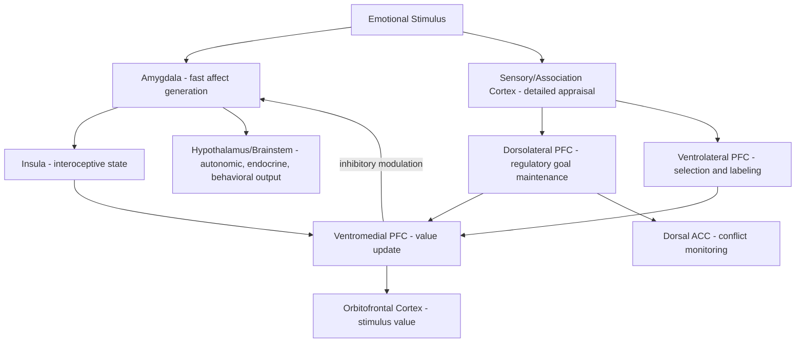

## Emotion Regulation Neural Mechanisms

### Overview

Emotion regulation refers to the set of processes by which individuals influence which emotions they have, when they have them, and how these emotions are experienced or expressed. Neuroscientifically, this is implemented through top-down modulation of subcortical affect-generating structures (principally the amygdala) by prefrontal and cingulate control regions, alongside bottom-up interactions with brainstem, hypothalamic, and interoceptive systems. Emotion regulation is not a unitary process but a family of dissociable strategies (reappraisal, suppression, distraction, acceptance) implemented by overlapping but distinguishable circuits. Dysregulation of these circuits is a transdiagnostic feature across mood, anxiety, and stress-related psychiatric disorders.

### The Process Model of Emotion Regulation

**Key Points**

- The dominant theoretical framework (Gross's process model) organizes regulation strategies by when in the emotion-generative process they act.
- **Situation selection**: choosing to approach or avoid an emotionally relevant situation before it occurs.
- **Situation modification**: altering an ongoing situation to change its emotional impact.
- **Attentional deployment**: directing attention toward or away from emotional features (e.g., distraction).
- **Cognitive change (reappraisal)**: reinterpreting the meaning of a stimulus or situation to alter its emotional impact — the most extensively studied strategy in neuroimaging work.
- **Response modulation (suppression)**: directly inhibiting the behavioral/expressive output of an already-generated emotion.
- Strategies deployed earlier in the process (antecedent-focused, e.g., reappraisal) are generally associated with better long-term affective and physiological outcomes than later, response-focused strategies (e.g., suppression).

### Core Neuroanatomy of Regulatory Control

#### Prefrontal Regulatory Regions

- **Dorsolateral prefrontal cortex (dlPFC)**: implements effortful, deliberate cognitive control; involved in generating and maintaining reappraisal strategies, working memory for regulatory goals, and selecting among competing interpretations.
- **Ventrolateral prefrontal cortex (vlPFC)**: contributes to selecting relevant emotional information, response inhibition, and labeling of affective states; connects with vmPFC to indirectly influence amygdala output.
- **Ventromedial prefrontal cortex (vmPFC)**: directly and indirectly inhibits amygdala reactivity; functionally analogous to the rodent infralimbic cortex in the fear extinction circuit; critical for using learned value/safety information to down-regulate affective responses.
- **Dorsal anterior cingulate cortex (dACC)**: monitors emotional conflict and regulatory demand, signaling when additional cognitive control needs to be recruited (error/conflict detection extended into the affective domain).
- **Orbitofrontal cortex (OFC)**: encodes the changing value/meaning of stimuli, supporting reappraisal by updating the affective significance assigned to a stimulus.

#### Subcortical Targets

- **Amygdala**: the primary target of prefrontal regulatory control; successful reappraisal and extinction-based regulation reduce amygdala BOLD activity and its coupling with autonomic output pathways.
- **Insula**: encodes interoceptive and subjective affective states; involved in the felt experience of emotion and its modulation, particularly for disgust and bodily-state-linked emotions.
- **Hippocampus**: contributes contextual information that supports contextually appropriate regulation (e.g., recognizing when a threat cue is safe in the current context).
- **Ventral striatum/nucleus accumbens**: involved in regulation of reward-related and appetitive emotional responses, relevant to craving regulation and positive emotion up-regulation.

### The Prefrontal-Amygdala Regulatory Circuit

**Example**

During a cognitive reappraisal task, a participant views a distressing image (e.g., an injury scene) and is instructed to reinterpret it as a staged film scene. Compared to simply viewing the image, reappraisal is associated with increased activation in dlPFC, vlPFC, and vmPFC, coupled with decreased amygdala activation. Functional connectivity analyses typically show increased negative coupling between vmPFC and amygdala during successful reappraisal trials, consistent with a top-down inhibitory mechanism.

The general circuit logic:

1. Sensory/contextual input reaches both amygdala (fast, coarse) and cortical appraisal regions (slower, detailed).
2. Regulatory goal (e.g., "reinterpret this stimulus") is represented and maintained in dlPFC/vlPFC working memory.
3. dlPFC/vlPFC recruit vmPFC and OFC to compute an updated appraisal or value signal.
4. vmPFC projects to amygdala (directly, and indirectly via intercalated-cell-like inhibitory gating mechanisms conserved from the extinction circuit) to dampen amygdala output.
5. Reduced amygdala output attenuates downstream autonomic, endocrine, and behavioral fear/threat responses via hypothalamic and brainstem pathways.

### Circuit Diagram (svg_diagram)

<svg xmlns="http://www.w3.org/2000/svg" viewBox="0 0 900 520" font-family="Helvetica, Arial, sans-serif">
<text x="450" y="30" text-anchor="middle" font-size="20" font-weight="bold" fill="#1a1a1a">Prefrontal–Amygdala Emotion Regulation Circuit (svg_diagram)</text>
<rect x="40" y="80" width="180" height="55" rx="8" fill="#dce8f7" stroke="#3b6ea5" stroke-width="1.5" />
<text x="130" y="105" text-anchor="middle" font-size="13">Dorsolateral PFC</text>
<text x="130" y="121" text-anchor="middle" font-size="11">(regulatory goal maintenance)</text>
<rect x="40" y="170" width="180" height="55" rx="8" fill="#dce8f7" stroke="#3b6ea5" stroke-width="1.5" />
<text x="130" y="195" text-anchor="middle" font-size="13">Ventrolateral PFC</text>
<text x="130" y="211" text-anchor="middle" font-size="11">(selection, labeling)</text>
<rect x="290" y="130" width="180" height="55" rx="8" fill="#e2f0d9" stroke="#5a8f3c" stroke-width="1.5" />
<text x="380" y="155" text-anchor="middle" font-size="13">Ventromedial PFC</text>
<text x="380" y="171" text-anchor="middle" font-size="11">(value update, inhibition)</text>
<rect x="290" y="220" width="180" height="55" rx="8" fill="#f7ead1" stroke="#b5822c" stroke-width="1.5" />
<text x="380" y="245" text-anchor="middle" font-size="13">Orbitofrontal Cortex</text>
<text x="380" y="261" text-anchor="middle" font-size="11">(stimulus value/meaning)</text>
<rect x="540" y="130" width="150" height="55" rx="8" fill="#f7ead1" stroke="#b5822c" stroke-width="1.5" />
<text x="615" y="155" text-anchor="middle" font-size="13">Dorsal ACC</text>
<text x="615" y="171" text-anchor="middle" font-size="11">(conflict monitoring)</text>
<rect x="720" y="170" width="150" height="55" rx="8" fill="#f5cccc" stroke="#a03030" stroke-width="1.5" />
<text x="795" y="195" text-anchor="middle" font-size="13">Amygdala</text>
<text x="795" y="211" text-anchor="middle" font-size="11">(affect generation)</text>
<rect x="720" y="270" width="150" height="70" rx="8" fill="#d9f2d9" stroke="#3a7d3a" stroke-width="1.5" />
<text x="795" y="295" text-anchor="middle" font-size="12">Hypothalamus / Brainstem</text>
<text x="795" y="312" text-anchor="middle" font-size="12">Autonomic, endocrine,</text>
<text x="795" y="327" text-anchor="middle" font-size="12">behavioral output</text>
<rect x="540" y="270" width="150" height="55" rx="8" fill="#e3d7f5" stroke="#6b3fa0" stroke-width="1.5" />
<text x="615" y="295" text-anchor="middle" font-size="13">Insula</text>
<text x="615" y="311" text-anchor="middle" font-size="11">(interoceptive state)</text>
<line x1="220" y1="107" x2="290" y2="150" stroke="#444" stroke-width="1.5" marker-end="url(#arrow2)" />
<line x1="220" y1="197" x2="290" y2="170" stroke="#444" stroke-width="1.5" marker-end="url(#arrow2)" />
<line x1="380" y1="185" x2="380" y2="220" stroke="#444" stroke-width="1.5" marker-end="url(#arrow2)" />
<line x1="470" y1="155" x2="540" y2="155" stroke="#444" stroke-width="1.5" marker-end="url(#arrow2)" />
<line x1="470" y1="155" x2="720" y2="185" stroke="#5a8f3c" stroke-width="2" stroke-dasharray="6,3" marker-end="url(#arrow2)" />
<text x="600" y="130" font-size="11" fill="#5a8f3c">inhibitory modulation</text>
<line x1="795" y1="225" x2="795" y2="270" stroke="#444" stroke-width="1.5" marker-end="url(#arrow2)" />
<line x1="720" y1="200" x2="690" y2="285" stroke="#6b3fa0" stroke-width="1.5" marker-end="url(#arrow2)" />
<line x1="615" y1="270" x2="615" y2="185" stroke="#6b3fa0" stroke-width="1.5" marker-end="url(#arrow2)" />

<text x="450" y="480" font-size="12" fill="#555">Green dashed arrow: primary top-down inhibitory pathway (vmPFC → amygdala) engaged during reappraisal.</text>

<text x="450" y="498" font-size="12" fill="#555">Purple arrows: amygdala–insula interoceptive feedback loop shaping subjective affective experience.</text>

</svg>

### Reappraisal vs. Suppression: Divergent Circuit Signatures

| Feature | Reappraisal (antecedent-focused) | Suppression (response-focused) |
| --- | --- | --- |
| Timing in emotion process | Early (before full response generation) | Late (after response is generated) |
| Primary PFC regions | dlPFC, vlPFC, vmPFC | dlPFC, right-lateralized frontal regions |
| Amygdala effect | Decreased activation | Activation often persists or increases |
| Subjective affect | Typically reduced | Reduced expression, but subjective distress often unchanged or increased |
| Physiological/autonomic cost | Lower sympathetic activation | Higher sympathetic activation (increased cardiovascular load) |
| Long-term association | Better psychological well-being outcomes | Associated with poorer well-being, social costs |

[Inference: the suppression-associated increase in amygdala activity and physiological cost is a consistent pattern across the literature but exact effect sizes vary considerably by study design and task.]

### Neurochemical and Neuroendocrine Modulation

- **Cortisol (HPA axis)**: acute cortisol elevation can impair prefrontal-dependent regulation while enhancing amygdala-dependent consolidation of emotional memory, creating a feed-forward loop under chronic stress that degrades top-down control.
- **Noradrenergic system (locus coeruleus)**: modulates the gain of amygdala responsivity and prefrontal engagement; excessive noradrenergic tone (as in acute stress) is associated with a shift from "reflective" prefrontal control toward "reflexive" amygdala-driven responding.
- **Serotonergic system**: modulates amygdala reactivity and prefrontal-amygdala connectivity; a widely studied polymorphism in the serotonin transporter gene promoter region (5-HTTLPR) has been associated with individual differences in amygdala reactivity and prefrontal coupling, though replication across large samples has been inconsistent. [Unverified: candidate gene x amygdala reactivity findings, including 5-HTTLPR, have faced significant replication challenges in more recent, better-powered studies.]
- **Oxytocin**: implicated in modulating amygdala reactivity to social-emotional stimuli, with context-dependent (anxiolytic or anxiogenic) effects.
- **Endocannabinoid system**: contributes to stress-buffering and facilitates extinction-like reduction of amygdala reactivity, mechanistically linked to the fear extinction circuitry.

### Developmental and Individual Difference Considerations

**Key Points**

- Prefrontal cortex (particularly dlPFC) matures relatively late in development (into the mid-20s), while amygdala reactivity is present and robust much earlier, producing a developmental window (notably adolescence) characterized by heightened emotional reactivity relative to regulatory capacity.
- Individual differences in resting-state and task-based prefrontal-amygdala connectivity correlate with trait anxiety, neuroticism, and resilience.
- Early-life adversity and chronic stress are associated with structural and functional changes including amygdala hyperreactivity, reduced vmPFC volume, and weakened prefrontal-amygdala connectivity, mirroring findings in fear extinction deficits.

### Clinical Relevance

- **Major depressive disorder**: associated with reduced dlPFC engagement during reappraisal and impaired down-regulation of amygdala activity to negative stimuli, alongside a bias toward negative self-referential processing (linked to default mode network-amygdala interactions).
- **Anxiety disorders**: characterized by amygdala hyperreactivity and reduced vmPFC-amygdala inhibitory coupling, closely paralleling deficits described in fear extinction circuits.
- **Borderline personality disorder**: associated with heightened amygdala reactivity and reduced prefrontal regulatory engagement, contributing to affective instability.
- **Cognitive-behavioral therapy (CBT)** and related interventions are theorized to work partly by strengthening prefrontal regulatory control over amygdala reactivity, and some neuroimaging studies show normalization of prefrontal-amygdala connectivity following successful treatment. [Inference: this is a widely cited mechanistic hypothesis in the clinical neuroscience literature rather than a single definitively established causal pathway.]
- **Mindfulness-based interventions** are associated with changes in insula and prefrontal engagement, proposed to shift regulation toward acceptance-based (rather than suppression- or avoidance-based) strategies.

### Circuit Summary Diagram

### Key Experimental Techniques

- **Task-based fMRI reappraisal paradigms**: standardized designs (e.g., viewing and reappraising negative IAPS images) comparing "look" vs "reappraise" conditions.
- **Psychophysiological measures**: skin conductance response, heart rate variability, and startle eyeblink as autonomic indices of regulatory success.
- **Functional/effective connectivity analyses**: psychophysiological interaction (PPI) and dynamic causal modeling (DCM) to characterize directional prefrontal-amygdala coupling.
- **Pharmacological challenge studies**: cortisol or propranolol administration to probe stress-hormone and noradrenergic effects on regulation.
- **Real-time fMRI neurofeedback**: emerging approach training individuals to volitionally modulate amygdala or prefrontal activity.

### Conclusion

Emotion regulation is implemented by a distributed but well-characterized network in which lateral and medial prefrontal regions exert top-down control over amygdala-driven affect generation, modulated by insular interoceptive signals and neuroendocrine/neurochemical state. Distinct regulatory strategies engage overlapping but dissociable circuit configurations, with antecedent-focused strategies such as reappraisal generally producing more favorable neural and physiological outcomes than response-focused strategies such as suppression. This circuitry shares deep mechanistic continuity with fear extinction pathways (vmPFC-amygdala-intercalated cell gating), and its disruption is a common thread across mood and anxiety disorders, providing a neurobiological rationale for both pharmacological and psychotherapeutic interventions.

**Related Topics**

- Cognitive reappraisal vs. expressive suppression: comparative neuroimaging findings
- Default mode network and rumination in depression
- HPA axis dysregulation and chronic stress effects on prefrontal-amygdala circuits
- Adolescent brain development and the maturational mismatch model
- Mindfulness-based neural mechanisms of acceptance-based regulation
- Real-time fMRI and EEG neurofeedback for affective self-regulation
- Interoception and the insula's role in emotional awareness
- Fear conditioning and extinction circuits (foundational circuit overlap)