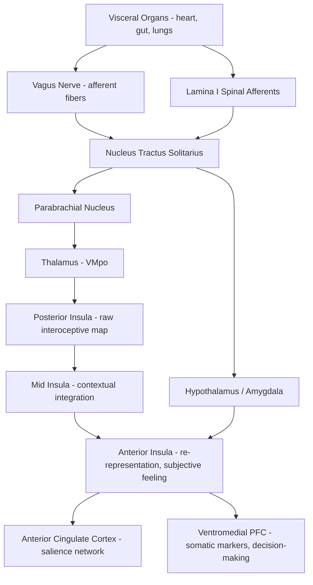

## Interoception and the Body Brain Connection

### Overview

Interoception is the sense of the physiological condition of the body — signals arising from internal organs, tissues, and homeostatic systems (heart rate, respiration, gut activity, temperature, pain, hunger, thirst) that are transmitted to and represented in the central nervous system. Interoception is increasingly understood not merely as a peripheral sensory channel but as a core substrate of emotional experience, self-awareness, and homeostatic/allostatic regulation. Contemporary models (notably Craig's and Critchley's work) position the insular cortex as the primary cortical hub where interoceptive signals are integrated into a hierarchical representation that underlies subjective feeling states.

### Peripheral Pathways: How Bodily Signals Reach the Brain

**Key Points**

- **Vagus nerve (cranial nerve X)**: the principal conduit for visceral afferent information from the heart, lungs, and gastrointestinal tract; approximately 80% of vagal fibers are afferent (sensory), carrying information toward the brain rather than motor commands away from it.
- **Spinothalamic and spinoreticular tracts**: carry interoceptive information related to pain, temperature, itch, and visceral sensation from the body via lamina I spinal projection neurons.
- **Nucleus tractus solitarius (NTS)**: the primary brainstem relay for vagal and glossopharyngeal visceral afferents; serves as the first central integration point for cardiovascular, respiratory, and gastrointestinal signals.
- **Parabrachial nucleus (PBN)**: receives NTS output and relays it onward to thalamus, hypothalamus, and amygdala, forming a key node in ascending interoceptive processing.
- **Thalamus (ventromedial posterior nucleus, VMpo, in primates)**: relays lamina I spinothalamic interoceptive signals to the posterior insula, in a pathway anatomically distinct from classical somatosensory (discriminative touch) thalamic relays.

### Central Integration: The Insular Cortex Hierarchy

Interoceptive processing in the insula follows a posterior-to-anterior gradient of increasing integration and abstraction:

- **Posterior insula**: receives the primary, relatively unprocessed interoceptive afferents (a near one-to-one physiological map of bodily state).
- **Mid-insula**: begins to integrate interoceptive signals with contextual and homeostatic information.
- **Anterior insula**: represents a highly integrated, re-represented model of bodily state, proposed by Craig to underlie the subjective "feeling" of emotional and bodily states; heavily interconnected with anterior cingulate cortex (ACC), amygdala, and orbitofrontal cortex.
- This hierarchical model is often summarized as generating successive "re-representations" of bodily state, culminating in the anterior insula's role as a substrate for interoceptive awareness and subjective emotional feeling (Craig's "sentient self" hypothesis).

### Interoception and Emotion: Theoretical Frameworks

**Key Points**

- **James-Lange theory (historical origin)**: proposed that the subjective experience of emotion follows from the perception of bodily changes rather than preceding them — "we feel sorry because we cry" rather than the reverse.
- **Somatic marker hypothesis (Damasio)**: proposes that bodily/emotional signals ("somatic markers"), represented via insula and ventromedial prefrontal cortex, guide decision-making by biasing choices toward options associated with favorable predicted bodily states.
- **Two-factor theory (Schachter-Singer)**: emotional experience results from the combination of physiological arousal and cognitive appraisal/labeling of that arousal, situating interoception as necessary but not sufficient for discrete emotional experience.
- **Predictive processing / active inference models**: frame interoception as inference — the brain generates top-down predictions about expected bodily states and continuously updates a generative model based on prediction errors from ascending interoceptive afferents; emotional feeling is proposed to emerge from this ongoing predictive interoceptive inference process.

$$\varepsilon_{int} = s_{int} - \hat{s}_{int}$$

Where $s_{int}$ represents actual afferent interoceptive signal, $\hat{s}_{int}$ represents the brain's top-down prediction of that signal, and $\varepsilon_{int}$ is the interoceptive prediction error that drives updating of the internal generative model — the core computational unit in predictive-processing accounts of interoception. [Inference: this notation is a simplified pedagogical illustration of the general predictive coding framework as applied to interoception, not a verbatim equation from a specific primary source.]

### Circuit Diagram (svg_diagram)

<svg xmlns="http://www.w3.org/2000/svg" viewBox="0 0 900 560" font-family="Helvetica, Arial, sans-serif">
<text x="450" y="30" text-anchor="middle" font-size="20" font-weight="bold" fill="#1a1a1a">Interoceptive Ascending Pathway (svg_diagram)</text>
<rect x="40" y="80" width="170" height="55" rx="8" fill="#d9f2d9" stroke="#3a7d3a" stroke-width="1.5" />
<text x="125" y="105" text-anchor="middle" font-size="13">Visceral Organs</text>
<text x="125" y="121" text-anchor="middle" font-size="11">(heart, gut, lungs)</text>
<rect x="40" y="170" width="170" height="55" rx="8" fill="#dce8f7" stroke="#3b6ea5" stroke-width="1.5" />
<text x="125" y="195" text-anchor="middle" font-size="13">Vagus Nerve (CN X)</text>
<text x="125" y="211" text-anchor="middle" font-size="11">~80% afferent fibers</text>
<rect x="40" y="260" width="170" height="55" rx="8" fill="#dce8f7" stroke="#3b6ea5" stroke-width="1.5" />
<text x="125" y="285" text-anchor="middle" font-size="13">Lamina I Spinal Neurons</text>
<text x="125" y="301" text-anchor="middle" font-size="11">(pain, temp, visceral)</text>
<rect x="290" y="170" width="170" height="55" rx="8" fill="#f7ead1" stroke="#b5822c" stroke-width="1.5" />
<text x="375" y="195" text-anchor="middle" font-size="13">Nucleus Tractus</text>
<text x="375" y="211" text-anchor="middle" font-size="13">Solitarius (NTS)</text>
<rect x="290" y="260" width="170" height="55" rx="8" fill="#f5cccc" stroke="#a03030" stroke-width="1.5" />
<text x="375" y="285" text-anchor="middle" font-size="13">Parabrachial Nucleus</text>
<rect x="540" y="215" width="170" height="55" rx="8" fill="#e3d7f5" stroke="#6b3fa0" stroke-width="1.5" />
<text x="625" y="240" text-anchor="middle" font-size="13">Thalamus (VMpo)</text>
<rect x="540" y="60" width="170" height="55" rx="8" fill="#f5cccc" stroke="#a03030" stroke-width="1.5" />
<text x="625" y="85" text-anchor="middle" font-size="13">Hypothalamus / Amygdala</text>
<rect x="770" y="150" width="110" height="60" rx="8" fill="#c9e4f7" stroke="#2f6f8f" stroke-width="1.5" />
<text x="825" y="175" text-anchor="middle" font-size="12">Posterior</text>
<text x="825" y="191" text-anchor="middle" font-size="12">Insula</text>
<rect x="770" y="230" width="110" height="60" rx="8" fill="#c9e4f7" stroke="#2f6f8f" stroke-width="1.5" />
<text x="825" y="255" text-anchor="middle" font-size="12">Mid</text>
<text x="825" y="271" text-anchor="middle" font-size="12">Insula</text>
<rect x="770" y="310" width="110" height="60" rx="8" fill="#c9e4f7" stroke="#2f6f8f" stroke-width="1.5" />
<text x="825" y="335" text-anchor="middle" font-size="12">Anterior</text>
<text x="825" y="351" text-anchor="middle" font-size="12">Insula</text>
<line x1="125" y1="135" x2="125" y2="170" stroke="#444" stroke-width="1.5" marker-end="url(#arrow3)" />
<line x1="210" y1="197" x2="290" y2="197" stroke="#444" stroke-width="1.5" marker-end="url(#arrow3)" />
<line x1="210" y1="287" x2="290" y2="287" stroke="#444" stroke-width="1.5" marker-end="url(#arrow3)" />
<line x1="375" y1="225" x2="375" y2="260" stroke="#444" stroke-width="1.5" marker-end="url(#arrow3)" />
<line x1="460" y1="230" x2="540" y2="235" stroke="#444" stroke-width="1.5" marker-end="url(#arrow3)" />
<line x1="460" y1="280" x2="540" y2="250" stroke="#444" stroke-width="1.5" marker-end="url(#arrow3)" />
<line x1="375" y1="170" x2="600" y2="115" stroke="#444" stroke-width="1.5" marker-end="url(#arrow3)" />
<line x1="710" y1="240" x2="770" y2="200" stroke="#444" stroke-width="1.5" marker-end="url(#arrow3)" />
<line x1="825" y1="210" x2="825" y2="230" stroke="#2f6f8f" stroke-width="2" marker-end="url(#arrow3)" />
<line x1="825" y1="290" x2="825" y2="310" stroke="#2f6f8f" stroke-width="2" marker-end="url(#arrow3)" />

<text x="450" y="470" font-size="12" fill="#555">Posterior→mid→anterior insula gradient reflects progressive integration/re-representation</text>

<text x="450" y="488" font-size="12" fill="#555">of interoceptive signal, culminating in subjective feeling states (Craig, 2002/2009).</text>

</svg>

### Measurement of Interoceptive Ability

**Key Points**

- **Interoceptive accuracy**: objective performance on tasks measuring correspondence between actual and perceived bodily states, most classically the heartbeat counting/tracking task and heartbeat discrimination task.
- **Interoceptive sensibility**: subjective, self-reported beliefs about one's own interoceptive ability, typically assessed via questionnaires (e.g., the Multidimensional Assessment of Interoceptive Awareness, MAIA).
- **Interoceptive awareness/metacognitive sensitivity**: the correspondence between confidence in interoceptive judgments and actual accuracy, capturing metacognitive insight into one's own bodily perception.
- Garfinkel and colleagues' three-dimensional framework distinguishing these constructs has become the standard in the field, since accuracy, sensibility, and awareness dissociate and independently predict different clinical and behavioral outcomes.

**Example**

In the heartbeat counting task, a participant silently counts perceived heartbeats over a fixed interval without palpating a pulse, and their count is compared against an ECG-recorded actual heartbeat count to derive an interoceptive accuracy score. A participant might report high confidence (sensibility) in their counting ability while showing poor accuracy relative to the ECG trace — indicating low interoceptive awareness (a mismatch between confidence and performance).

### Interoception, Homeostasis, and Allostasis

- **Homeostasis**: active regulation of internal physiological variables (temperature, blood glucose, pH, blood pressure) within a viable range, coordinated substantially via hypothalamic and brainstem circuits informed by interoceptive afferents.
- **Allostasis**: anticipatory regulation — the brain predicts future physiological demands and adjusts bodily states in advance, rather than purely reactively correcting deviations after they occur; this framework positions the brain as fundamentally an organ for predictive bodily regulation rather than simply a passive information processor.
- **Allostatic load**: cumulative physiological wear resulting from chronic or repeated activation of stress-response systems, linked to dysregulated interoceptive predictive processing over time.
- The insula, ACC, and ventromedial prefrontal cortex form a network implicated in generating and updating allostatic predictions, integrating interoceptive prediction error signals into ongoing behavioral and physiological regulation.

### Interoception in Psychopathology

**Key Points**

- **Panic disorder**: associated with heightened interoceptive sensitivity to cardiorespiratory signals and catastrophic misinterpretation of benign bodily sensations (e.g., interpreting a normal heartbeat increase as a heart attack), with altered insular and amygdala reactivity to interoceptive cues.
- **Anxiety disorders broadly**: often associated with either heightened interoceptive accuracy/attention to threat-relevant bodily signals or dysregulated interoceptive prediction error processing.
- **Depression**: some evidence links blunted interoceptive accuracy and altered insular activity to anhedonia and reduced emotional granularity, though findings are mixed across studies. [Unverified: the direction and consistency of interoceptive accuracy deficits in depression varies considerably across the empirical literature and measurement methods used.]
- **Eating disorders**: interoceptive dysfunction (particularly disrupted hunger/satiety and body-state signaling, and reduced insular integration) is a well-replicated transdiagnostic feature.
- **Alexithymia** (difficulty identifying and describing one's own emotions): strongly linked to impaired interoceptive processing and reduced anterior insula engagement, supporting the broader model that emotional awareness depends substantially on accurate interoceptive representation.
- **Autism spectrum conditions**: atypical interoceptive processing has been proposed as contributing to both emotional regulation difficulties and altered social-affective processing, though this remains an active and debated area of research. [Inference: the interoceptive account of autism is one of several competing/complementary theoretical frameworks in the field, not a fully settled consensus model.]

### The Insula-ACC Salience Network

The anterior insula does not operate in isolation but as a core hub, together with the dorsal anterior cingulate cortex, of the **salience network** — a large-scale brain network responsible for detecting and prioritizing behaviorally relevant internal (interoceptive) and external (exteroceptive) stimuli, and for coordinating switching between the default mode network (internally oriented cognition) and the central executive network (externally oriented, task-focused cognition). This positions interoceptive signaling from the insula as a driver of broader attentional and cognitive resource allocation, not merely a channel for bodily awareness.

### Circuit Summary Diagram

### Key Experimental Techniques

- **Heartbeat counting and discrimination tasks**: standard behavioral measures of interoceptive accuracy.
- **Cardiac/respiratory-gated fMRI paradigms**: presenting stimuli time-locked to cardiac or respiratory phase to probe how interoceptive state modulates perception and emotion.
- **Heart rate variability (HRV) analysis**: used as a peripheral index of autonomic-central (particularly vagal-prefrontal) coupling, often interpreted through the polyvagal and neurovisceral integration frameworks.
- **Vagus nerve stimulation (VNS)**: both a research tool for probing vagal-brain pathways and a clinical intervention for depression and epilepsy.
- **Pharmacological/physiological manipulation**: isoproterenol infusion (inducing cardiac sensations) or CO2 inhalation challenges to probe interoceptive-emotional coupling, particularly in panic disorder research.

### Conclusion

Interoception constitutes the neural infrastructure by which bodily physiological states are sensed, represented, and integrated into emotional experience, decision-making, and homeostatic/allostatic regulation. Ascending pathways via the vagus nerve and spinal lamina I afferents converge on the NTS and parabrachial nucleus before reaching a hierarchically organized insular cortex, where progressively integrated representations of bodily state culminate in the anterior insula's proposed role as a substrate of subjective feeling. This body-brain axis is central to major theoretical models of emotion, is measurable via dissociable accuracy, sensibility, and awareness constructs, and shows robust, often transdiagnostic disruption across panic disorder, eating disorders, alexithymia, and other affective and psychiatric conditions.

**Related Topics**

- The vagus nerve and vagal tone: polyvagal theory and neurovisceral integration model
- Predictive processing and active inference accounts of brain function
- Salience network dynamics and switching between default mode and executive control networks
- Somatic marker hypothesis and ventromedial prefrontal cortex in decision-making
- Alexithymia and emotional granularity
- Interoceptive dysfunction in eating disorders and panic disorder
- Heart rate variability as a biomarker of autonomic-central coupling
- Emotion regulation neural mechanisms (functional overlap with insula/vmPFC circuitry)