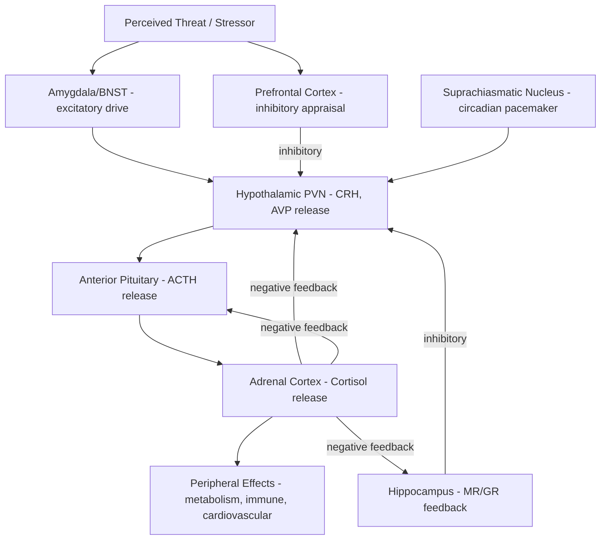

## Stress Physiology and the HPA Axis

### Overview

The hypothalamic-pituitary-adrenal (HPA) axis is the principal neuroendocrine system mediating the physiological stress response, coordinating the release of glucocorticoid hormones (cortisol in humans, corticosterone in rodents) in response to perceived physical or psychological threat. The HPA axis operates alongside the faster-acting sympathetic-adrenal-medullary (SAM) system to orchestrate a coordinated mobilization of energy resources and adaptive behavioral/physiological changes. While acute HPA activation is adaptive, chronic or dysregulated activation is strongly implicated in the pathophysiology of depression, anxiety disorders, PTSD, and numerous stress-related somatic conditions.

### Core Anatomy and Hormonal Cascade

**Key Points**

- **Paraventricular nucleus (PVN) of the hypothalamus**: the apex of the HPA axis; parvocellular neurons synthesize and release corticotropin-releasing hormone (CRH) and, to a lesser extent, arginine vasopressin (AVP) into the hypophyseal portal system.
- **Anterior pituitary gland**: CRH (potentiated by AVP) binds CRH type 1 receptors on corticotroph cells, stimulating synthesis and release of adrenocorticotropic hormone (ACTH) into systemic circulation.
- **Adrenal cortex (zona fasciculata)**: ACTH binds melanocortin type 2 receptors on adrenocortical cells, stimulating synthesis and release of glucocorticoids (cortisol in humans and most primates; corticosterone in rodents).
- **Negative feedback**: circulating cortisol binds glucocorticoid receptors (GR) and mineralocorticoid receptors (MR) in the hypothalamus, pituitary, and hippocampus, suppressing further CRH and ACTH release — a classic closed-loop endocrine feedback system essential for terminating the stress response.

$$\text{PVN (CRH, AVP)} \rightarrow \text{Anterior Pituitary (ACTH)} \rightarrow \text{Adrenal Cortex (Cortisol)}$$

### Circuit Diagram (svg_diagram)

<svg xmlns="http://www.w3.org/2000/svg" viewBox="0 0 900 620" font-family="Helvetica, Arial, sans-serif">
<text x="450" y="30" text-anchor="middle" font-size="20" font-weight="bold" fill="#1a1a1a">HPA Axis Cascade and Feedback (svg_diagram)</text>
<rect x="370" y="70" width="180" height="60" rx="8" fill="#f7ead1" stroke="#b5822c" stroke-width="1.5" />
<text x="460" y="95" text-anchor="middle" font-size="13">Hypothalamus (PVN)</text>
<text x="460" y="112" text-anchor="middle" font-size="11">releases CRH, AVP</text>
<rect x="370" y="180" width="180" height="60" rx="8" fill="#dce8f7" stroke="#3b6ea5" stroke-width="1.5" />
<text x="460" y="205" text-anchor="middle" font-size="13">Anterior Pituitary</text>
<text x="460" y="222" text-anchor="middle" font-size="11">releases ACTH</text>
<rect x="370" y="290" width="180" height="60" rx="8" fill="#f5cccc" stroke="#a03030" stroke-width="1.5" />
<text x="460" y="315" text-anchor="middle" font-size="13">Adrenal Cortex</text>
<text x="460" y="332" text-anchor="middle" font-size="11">releases Cortisol</text>
<rect x="640" y="290" width="200" height="90" rx="8" fill="#d9f2d9" stroke="#3a7d3a" stroke-width="1.5" />
<text x="740" y="315" text-anchor="middle" font-size="12">Peripheral Effects:</text>
<text x="740" y="332" text-anchor="middle" font-size="11">Gluconeogenesis, immune</text>
<text x="740" y="348" text-anchor="middle" font-size="11">modulation, cardiovascular</text>
<text x="740" y="364" text-anchor="middle" font-size="11">and metabolic shifts</text>
<rect x="60" y="180" width="200" height="60" rx="8" fill="#e3d7f5" stroke="#6b3fa0" stroke-width="1.5" />
<text x="160" y="205" text-anchor="middle" font-size="13">Hippocampus</text>
<text x="160" y="222" text-anchor="middle" font-size="11">high GR density</text>
<rect x="60" y="290" width="200" height="60" rx="8" fill="#e3d7f5" stroke="#6b3fa0" stroke-width="1.5" />
<text x="160" y="315" text-anchor="middle" font-size="13">Amygdala</text>
<text x="160" y="332" text-anchor="middle" font-size="11">enhances CRH drive</text>
<line x1="460" y1="130" x2="460" y2="180" stroke="#444" stroke-width="1.5" marker-end="url(#arrow4)" />
<line x1="460" y1="240" x2="460" y2="290" stroke="#444" stroke-width="1.5" marker-end="url(#arrow4)" />
<line x1="550" y1="320" x2="640" y2="325" stroke="#444" stroke-width="1.5" marker-end="url(#arrow4)" />
<line x1="550" y1="330" x2="260" y2="215" stroke="#a03030" stroke-width="1.5" stroke-dasharray="4,3" marker-end="url(#arrowInhib)" />
<line x1="160" y1="180" x2="400" y2="100" stroke="#a03030" stroke-width="1.5" stroke-dasharray="4,3" marker-end="url(#arrowInhib)" />
<line x1="260" y1="320" x2="370" y2="105" stroke="#5a8f3c" stroke-width="1.5" marker-end="url(#arrow4)" />

<text x="450" y="440" font-size="12" fill="#555">Red dashed lines: inhibitory negative feedback (cortisol → hippocampus, hypothalamus, pituitary)</text>

<text x="450" y="458" font-size="12" fill="#555">Green line: amygdala excitatory drive onto PVN, promoting CRH release under threat</text>

</svg>

### The Two-System Stress Response: HPA vs. SAM

| Feature | SAM System (fast) | HPA Axis (slow) |
| --- | --- | --- |
| Onset | Seconds | Minutes (peaks ~20-30 min post-stressor) |
| Primary mediator | Epinephrine, norepinephrine (adrenal medulla) | Cortisol (adrenal cortex) |
| Neural origin | Sympathetic preganglionic neurons, locus coeruleus | Hypothalamic PVN |
| Primary function | Immediate "fight-or-flight" mobilization | Sustained energy mobilization, metabolic and immune adjustment |
| Duration of effect | Brief (seconds to minutes) | Prolonged (tens of minutes to hours) |
| Termination | Rapid reuptake/degradation of catecholamines | Glucocorticoid negative feedback |

The two systems operate largely in parallel and interact substantially: catecholamine signaling from the locus coeruleus-norepinephrine system also modulates PVN activity, and cortisol in turn modulates catecholamine synthesis and central noradrenergic responsivity.

### Central Regulation: Limbic Modulation of the HPA Axis

**Key Points**

- **Amygdala** (particularly the central and medial nuclei, and BNST): provides excitatory drive to the PVN, promoting CRH release in response to perceived threat, and is a key node linking psychological/emotional appraisal of stress to the neuroendocrine cascade.
- **Hippocampus**: expresses a particularly high density of both glucocorticoid (GR) and mineralocorticoid (MR) receptors, and provides tonic inhibitory input to the HPA axis, contributing importantly to negative feedback termination; hippocampal dysfunction (as seen with chronic stress-induced atrophy) can impair HPA feedback, promoting further dysregulation in a feed-forward manner.
- **Prefrontal cortex (particularly medial and ventromedial regions)**: generally exerts inhibitory influence over HPA axis reactivity, similar to its inhibitory role over amygdala output in fear and emotion regulation circuits; prefrontal dysfunction is associated with exaggerated and poorly terminated cortisol responses.
- **Bed nucleus of the stria terminalis (BNST)**: mediates sustained, less stimulus-bound anxiety-related HPA activation, complementing the amygdala's role in more phasic, cue-specific threat responses.

### Glucocorticoid Receptor Types and Their Functional Significance

- **Mineralocorticoid receptors (MR)**: high affinity for cortisol, largely occupied even at basal/circadian trough cortisol levels; concentrated in hippocampus; implicated in appraisal processes and the initial, proactive phase of the stress response.
- **Glucocorticoid receptors (GR)**: lower affinity, substantially occupied only during stress-induced cortisol elevations or at the circadian peak; widely distributed including hypothalamus, pituitary, hippocampus, and prefrontal cortex; primarily implicated in negative feedback, response termination, and memory consolidation of stressful events.
- The balance of MR:GR activation (the "MR/GR balance hypothesis") is proposed to be important for adaptive stress responding, with imbalance implicated in stress-related psychopathology. [Inference: the MR/GR balance hypothesis is an influential theoretical framework in the field, and while broadly supported it remains an active area of refinement rather than a fully closed empirical question.]

### Circadian Regulation of Cortisol

**Example**

Cortisol secretion follows a robust circadian rhythm independent of acute stress, driven by the suprachiasmatic nucleus (SCN). Levels typically peak shortly after waking (the cortisol awakening response, CAR) and decline progressively across the day to a nadir around midnight. A person waking at 7:00 AM would typically show a cortisol rise of 50-75% within 30-45 minutes of waking, followed by gradual decline through the afternoon and evening. This circadian baseline is distinct from, but interacts with, acute stress-induced cortisol elevations, and disruption of the circadian rhythm itself (e.g., via shift work or sleep disruption) is independently associated with adverse metabolic and psychological outcomes.

### Acute vs. Chronic Stress Effects

**Key Points**

- **Acute stress (adaptive)**: transient cortisol elevation mobilizes glucose via hepatic gluconeogenesis, temporarily suppresses non-essential processes (reproduction, growth, some immune functions), enhances cardiovascular tone, and facilitates consolidation of stress-relevant memories — an evolutionarily conserved, generally adaptive response.
- **Chronic stress (maladaptive)**: sustained HPA activation is associated with:
  - Hippocampal dendritic atrophy and impaired neurogenesis, particularly in the dentate gyrus, potentially degrading negative feedback capacity over time.
  - Amygdala dendritic hypertrophy, potentially enhancing threat sensitivity and CRH drive.
  - Prefrontal cortical dendritic atrophy, potentially impairing top-down regulatory control.
  - Immune dysregulation, including glucocorticoid receptor resistance in immune cells, contributing to a chronic low-grade pro-inflammatory state.
  - Metabolic consequences including visceral fat accumulation, insulin resistance, and increased cardiovascular risk.
- **Allostatic load**: the cumulative physiological cost of chronic or repeated stress-system activation, encompassing HPA, SAM, immune, and metabolic dysregulation collectively, used as a framework for understanding stress-related disease risk across systems.

### HPA Axis Dysregulation in Psychopathology

- **Major depressive disorder**: a substantial subset of patients show HPA hyperactivity, including elevated basal cortisol, blunted circadian rhythm, and impaired dexamethasone suppression (failure of the negative feedback system to appropriately suppress cortisol following exogenous glucocorticoid administration, the basis of the dexamethasone suppression test, DST).
- **PTSD**: findings are more heterogeneous than in depression; many studies report lower basal cortisol and enhanced negative feedback sensitivity (enhanced dexamethasone suppression), a pattern distinct from the hypercortisolism typically seen in depression, though results vary by study population and trauma type. [Unverified: cortisol findings in PTSD show substantial heterogeneity across studies, and the direction of dysregulation is not fully consistent in the literature.]
- **Chronic fatigue syndrome and some stress-related somatic conditions**: associated in some studies with hypocortisolism, proposed to reflect a distinct pattern of HPA adaptation to prolonged stress exposure. [Inference: the hypocortisolism model for chronic fatigue syndrome remains debated and is not universally replicated.]
- **Cushing's syndrome** (pathological hypercortisolism, often from a pituitary or adrenal tumor) provides a clinical model for the cognitive and mood effects of chronic excess glucocorticoid exposure, including memory impairment, depression, and hippocampal volume reduction.
- **Addison's disease** (primary adrenal insufficiency, hypocortisolism) illustrates the converse: fatigue, hypotension, and impaired stress responsiveness due to insufficient glucocorticoid production.

### Circuit Summary Diagram

### Key Experimental and Clinical Assessment Techniques

- **Salivary, plasma, and hair cortisol assays**: salivary cortisol captures acute/circadian dynamics (including the cortisol awakening response); hair cortisol provides a retrospective, integrated measure of cortisol exposure over preceding months.
- **Dexamethasone suppression test (DST)**: assesses negative feedback sensitivity by measuring cortisol suppression following administration of a synthetic glucocorticoid.
- **Trier Social Stress Test (TSST)**: a standardized laboratory psychosocial stress induction protocol (public speaking plus mental arithmetic under evaluative pressure) widely used to reliably activate the HPA axis for experimental study.
- **CRH stimulation test**: exogenous CRH administration to assess pituitary ACTH responsivity independent of hypothalamic input.
- **Animal models**: chronic restraint stress, social defeat stress, and early-life maternal separation paradigms used to study the developmental and long-term effects of HPA dysregulation.

### Conclusion

The HPA axis is the central neuroendocrine system translating psychological and physical stress into a coordinated hormonal cascade—CRH, ACTH, and cortisol—that mobilizes metabolic resources and modulates immune and cardiovascular function. Its activity is shaped by an interacting network of limbic structures, with the amygdala providing excitatory drive and the hippocampus and prefrontal cortex providing inhibitory regulation, operating through a well-characterized negative feedback loop mediated by mineralocorticoid and glucocorticoid receptors. While acute activation is adaptive, chronic or dysregulated HPA activity produces measurable structural and functional changes across limbic and cortical regions and is a central mechanism implicated in depression, PTSD, and broader allostatic load-related disease risk, making the HPA axis one of the most clinically significant systems in affective neuroscience.

**Related Topics**

- Allostatic load and the biological embedding of chronic stress
- Fear conditioning and extinction circuits (amygdala-PVN interaction)
- Emotion regulation neural mechanisms (prefrontal inhibitory control parallels)
- Early-life adversity and programming of the HPA axis
- Sleep, circadian rhythms, and cortisol regulation
- Neuroinflammation and glucocorticoid receptor resistance
- Cushing's syndrome and Addison's disease as clinical models of HPA dysfunction
- Psychoneuroimmunology and stress-immune interactions