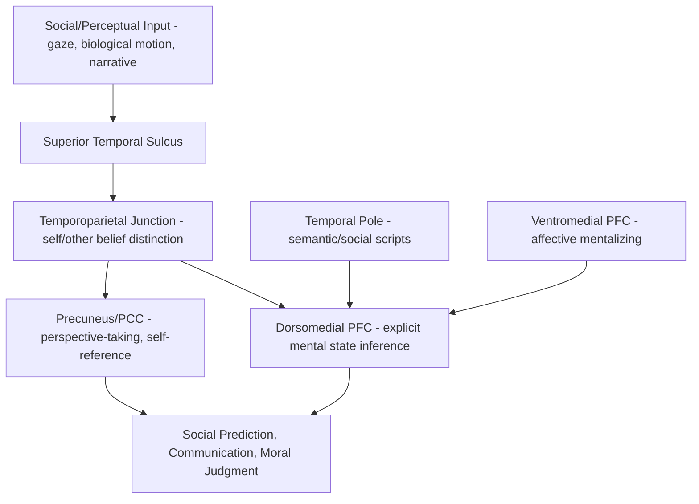

## Theory of Mind and the Mentalizing Network

### Overview

Theory of mind (ToM), also termed mentalizing, is the cognitive capacity to attribute mental states — beliefs, desires, intentions, emotions, knowledge — to oneself and others, and to understand that others' mental states may differ from one's own and from objective reality. This capacity underlies social prediction, communication (including pragmatic language use and irony comprehension), moral judgment, and cooperative and competitive social behavior. Neuroscientifically, ToM is supported by a distributed, highly reproducible set of cortical regions collectively termed the "mentalizing network" or "social brain network," which is functionally and anatomically distinguishable from networks supporting related but dissociable processes such as emotion recognition and empathy.

### Behavioral and Developmental Markers

**Key Points**

- **False-belief task (Sally-Anne task)**: the classic developmental benchmark; requires understanding that another agent can hold a belief that is false relative to reality. Typically passed by neurotypical children around age 4, marking a key developmental milestone in explicit ToM.
- **Implicit ToM**: preverbal and infant studies using violation-of-expectation and anticipatory looking paradigms suggest sensitivity to others' false beliefs emerges much earlier (in some studies, well before age 2), suggesting a developmental dissociation between implicit/automatic and explicit/verbal ToM.
- **Second-order ToM**: understanding what one person believes about another person's mental state ("A thinks that B believes..."), developing later in childhood (typically 6-7 years) and continuing to refine into adolescence.
- **Faux pas tasks**: assess the more socially nuanced ability to recognize when a statement is inadvertently inappropriate given another's unknown mental state, often used to detect subtle ToM deficits in adults and clinical populations.

**Example**

In the classic Sally-Anne false-belief task, a child watches Sally place a marble in a basket and leave the room; while she is away, Anne moves the marble to a box. The child is asked, "Where will Sally look for her marble?" A child who has developed explicit false-belief understanding correctly answers "the basket" (Sally's belief location), while a younger child (typically under 4) often incorrectly answers "the box" (the marble's actual, but not Sally's believed, location), reflecting an inability to represent a belief that diverges from reality.

### Core Neuroanatomy of the Mentalizing Network

- **Temporoparietal junction (TPJ)**, bilateral but often right-lateralized: among the most consistently activated and functionally specific regions for ToM across neuroimaging studies; particularly implicated in reasoning about others' beliefs as distinct from one's own, and in redirecting attention to socially relevant information.
- **Medial prefrontal cortex (mPFC)**, particularly dorsomedial (dmPFC): involved broadly in representing mental states, self-other distinction, and trait/person judgments; often dissociated along a rostral-caudal and dorsal-ventral axis for different mentalizing subprocesses (e.g., dmPFC for more effortful, explicit inference; more ventral regions for automatic/affective mentalizing).
- **Precuneus / posterior cingulate cortex (PCC)**: implicated in perspective-taking, self-referential processing, and integrating mentalizing computations with autobiographical memory.
- **Superior temporal sulcus (STS)**: processes biological motion, gaze direction, and other social-perceptual cues that provide input to higher-order mentalizing computations; considered part of the broader "social brain" but more perceptually oriented than TPJ/mPFC.
- **Temporal poles**: implicated in retrieving semantic and autobiographical/social-script knowledge used to contextualize mental state inferences about specific individuals or situations.

### Circuit Diagram (svg_diagram)

<svg xmlns="http://www.w3.org/2000/svg" viewBox="0 0 900 560" font-family="Helvetica, Arial, sans-serif">
<text x="450" y="30" text-anchor="middle" font-size="20" font-weight="bold" fill="#1a1a1a">Mentalizing Network Regions (svg_diagram)</text>
<ellipse cx="450" cy="300" rx="340" ry="230" fill="#f5f7fa" stroke="#999" stroke-width="1" stroke-dasharray="4,3" />
<text x="450" y="80" text-anchor="middle" font-size="12" fill="#777">approximate lateral/medial cortical schematic</text>
<rect x="120" y="120" width="170" height="60" rx="8" fill="#dce8f7" stroke="#3b6ea5" stroke-width="1.5" />
<text x="205" y="145" text-anchor="middle" font-size="13">Temporoparietal</text>
<text x="205" y="161" text-anchor="middle" font-size="13">Junction (TPJ)</text>
<rect x="120" y="220" width="170" height="60" rx="8" fill="#f7ead1" stroke="#b5822c" stroke-width="1.5" />
<text x="205" y="245" text-anchor="middle" font-size="13">Superior Temporal</text>
<text x="205" y="261" text-anchor="middle" font-size="13">Sulcus (STS)</text>
<rect x="120" y="320" width="170" height="60" rx="8" fill="#f5cccc" stroke="#a03030" stroke-width="1.5" />
<text x="205" y="345" text-anchor="middle" font-size="13">Temporal Pole</text>
<text x="205" y="361" text-anchor="middle" font-size="11">semantic/social scripts</text>
<rect x="610" y="120" width="170" height="60" rx="8" fill="#e2f0d9" stroke="#5a8f3c" stroke-width="1.5" />
<text x="695" y="145" text-anchor="middle" font-size="13">Dorsomedial PFC</text>
<text x="695" y="161" text-anchor="middle" font-size="11">explicit mental-state inference</text>
<rect x="610" y="220" width="170" height="60" rx="8" fill="#e2f0d9" stroke="#5a8f3c" stroke-width="1.5" />
<text x="695" y="245" text-anchor="middle" font-size="13">Ventromedial PFC</text>
<text x="695" y="261" text-anchor="middle" font-size="11">automatic/affective mentalizing</text>
<rect x="360" y="420" width="180" height="60" rx="8" fill="#e3d7f5" stroke="#6b3fa0" stroke-width="1.5" />
<text x="450" y="445" text-anchor="middle" font-size="13">Precuneus / PCC</text>
<text x="450" y="461" text-anchor="middle" font-size="11">perspective-taking, self-reference</text>
<line x1="290" y1="150" x2="610" y2="150" stroke="#666" stroke-width="1.5" marker-end="url(#arrow5)" />
<line x1="290" y1="250" x2="610" y2="250" stroke="#666" stroke-width="1.5" marker-end="url(#arrow5)" />
<line x1="205" y1="180" x2="205" y2="220" stroke="#666" stroke-width="1.5" marker-end="url(#arrow5)" />
<line x1="205" y1="280" x2="205" y2="320" stroke="#666" stroke-width="1.5" marker-end="url(#arrow5)" />
<line x1="290" y1="350" x2="450" y2="420" stroke="#666" stroke-width="1.5" marker-end="url(#arrow5)" />
<line x1="610" y1="250" x2="470" y2="420" stroke="#666" stroke-width="1.5" marker-end="url(#arrow5)" />
<line x1="205" y1="180" x2="420" y2="440" stroke="#666" stroke-width="1.5" stroke-dasharray="5,3" marker-end="url(#arrow5)" />

<text x="450" y="510" font-size="12" fill="#555">TPJ and STS provide perceptual/attentional input; dmPFC/vmPFC compute mental-state inference;</text>

<text x="450" y="528" font-size="12" fill="#555">precuneus/PCC integrates perspective-taking with self-referential and autobiographical processing.</text>

</svg>

### Theoretical Models of Mentalizing

**Key Points**

- **Theory-theory**: proposes ToM operates via an implicit, folk-psychological causal theory of mental states, applied inferentially to predict and explain others' behavior.
- **Simulation theory**: proposes that mentalizing involves simulating another's mental state by using one's own cognitive/affective systems "offline" — putting oneself in another's shoes computationally, rather than applying abstract theoretical rules.
- **Two-systems account (Apperly and Butterfill)**: proposes a dissociation between an early-developing, fast, efficient, but limited implicit ToM system, and a later-developing, flexible, but cognitively effortful explicit ToM system, potentially relying on at least partially distinct neural substrates.
- Modern consensus increasingly views theory-theory and simulation-based accounts as complementary rather than mutually exclusive, with different mentalizing subcomponents (e.g., affective vs. cognitive ToM) potentially relying differentially on each mechanism.

### Cognitive vs. Affective Theory of Mind

| Dimension | Cognitive ToM | Affective ToM |
| --- | --- | --- |
| Content | Beliefs, intentions, knowledge states | Emotions, feelings of others |
| Example task | False-belief tasks, strange stories | Reading the Mind in the Eyes Test |
| Key regions | dmPFC, TPJ (belief-focused activity) | vmPFC, orbitofrontal cortex, amygdala involvement |
| Developmental trajectory | Later-maturing, more effortful | Some components present earlier, more automatic |
| Clinical dissociation | Selectively impaired in some conditions | Selectively impaired in others (dissociable deficits reported) |

[Inference: while this cognitive/affective ToM distinction and its neural dissociation is well-supported in the literature, the degree of independence between the two systems, and the precise regional specificity, continues to be refined by ongoing research.]

### Mentalizing Network vs. Mirror Neuron System: A Key Distinction

**Key Points**

- The mentalizing network (TPJ, mPFC, precuneus, STS) is distinct from the **mirror neuron system** (premotor cortex, inferior parietal lobule), which is implicated in action understanding via direct sensorimotor resonance/simulation.
- Mentalizing is generally considered necessary for representing abstract, non-observable mental states such as beliefs and intentions that cannot be directly perceived or simulated motorically, whereas the mirror system is more directly tied to understanding observable motor actions and their immediate goals.
- Some theoretical accounts propose these systems interact and complement one another for full social understanding, while others emphasize their relative independence, particularly since patients and neuroimaging dissociations show that impairment in one system does not necessarily predict impairment in the other. [Inference: the degree and nature of interaction between the mirror neuron and mentalizing systems remains a genuinely contested area in social neuroscience.]

### Mentalizing and the Default Mode Network

A striking and well-replicated finding is the substantial anatomical overlap between the mentalizing network and the **default mode network (DMN)** — the network typically active during rest and internally directed cognition (mind-wandering, autobiographical memory, future simulation) and suppressed during externally focused attention-demanding tasks. This overlap has led to proposals that self-referential and social-cognitive processing share a common computational substrate, with the DMN potentially serving a general function of constructing and simulating mental scenarios — whether about the self (past/future), or about other minds (mentalizing) — using a shared machinery.

### Clinical and Developmental Relevance

**Key Points**

- **Autism spectrum conditions**: ToM impairment has historically been one of the most prominent proposed cognitive accounts (the "mindblindness" hypothesis), with numerous studies showing atypical activation and connectivity in TPJ and mPFC during mentalizing tasks, although ToM difficulties are not universal across the autism spectrum and the theory does not account for all autism-related social and non-social features. [Inference: the mindblindness/ToM-deficit account remains influential but is now generally regarded as one contributing factor among several, rather than a complete explanatory model of autism.]
- **Schizophrenia**: ToM deficits are well-documented, particularly in the context of paranoid ideation and social cognitive impairment, with altered mPFC and TPJ activation reported during mentalizing tasks.
- **Frontotemporal dementia (particularly behavioral variant)**: associated with prominent mentalizing and social cognitive deficits, consistent with the disease's characteristic atrophy of medial prefrontal and anterior temporal regions.
- **Psychopathy and antisocial personality features**: interestingly, cognitive ToM (understanding what others believe/intend) is often relatively preserved or even superior, while affective ToM/empathic responding is frequently impaired, illustrating the clinical utility of the cognitive/affective ToM dissociation.
- **Normal aging**: some decline in ToM task performance is commonly reported, though findings on the specificity and neural basis of age-related ToM change are mixed. [Unverified: age-related ToM decline findings vary in magnitude and specificity across studies and task types.]

### Circuit Summary Diagram

### Key Experimental Techniques

- **Verbal ToM batteries**: false-belief tasks, Strange Stories test, Faux Pas test, Reading the Mind in the Eyes Test (RMET) for affective ToM.
- **Naturalistic/narrative fMRI paradigms**: presenting stories or animated interactions (e.g., the Heider-Simmel animations of interacting geometric shapes) that spontaneously elicit mentalizing without explicit instruction.
- **Interactive economic games**: trust games, ultimatum games, and iterated prisoner's dilemma paradigms used to probe mentalizing in socially strategic contexts.
- **Lesion and neurodegenerative patient studies**: localizing necessary substrates by studying ToM performance following focal TPJ, mPFC, or broader frontotemporal damage.
- **Developmental neuroimaging**: longitudinal fMRI tracking maturation of mentalizing network connectivity across childhood and adolescence.

### Conclusion

Theory of mind is supported by a robust, reproducible mentalizing network comprising the temporoparietal junction, medial prefrontal cortex, precuneus/posterior cingulate cortex, and superior temporal sulcus, which together enable the attribution and representation of others' beliefs, intentions, and emotions. This network is dissociable from — though anatomically overlapping with — the default mode network, and from the more perceptually/motorically grounded mirror neuron system, reflecting the abstract, non-directly-observable nature of mental state representation. The dissociation between cognitive and affective ToM, and between implicit and explicit mentalizing systems, has proven clinically important, with selective disruptions of these components implicated across autism, schizophrenia, frontotemporal dementia, and psychopathy, underscoring theory of mind's centrality to social cognition and its disorders.

**Related Topics**

- Default mode network function and self-referential processing
- Mirror neuron system and action understanding
- Empathy: cognitive vs. affective components and neural substrates
- Autism spectrum conditions and the social brain
- Moral judgment and neural decision-making circuits
- Emotion regulation neural mechanisms (vmPFC functional overlap)
- Social cognition deficits in schizophrenia and frontotemporal dementia
- Development of the mentalizing network across childhood and adolescence