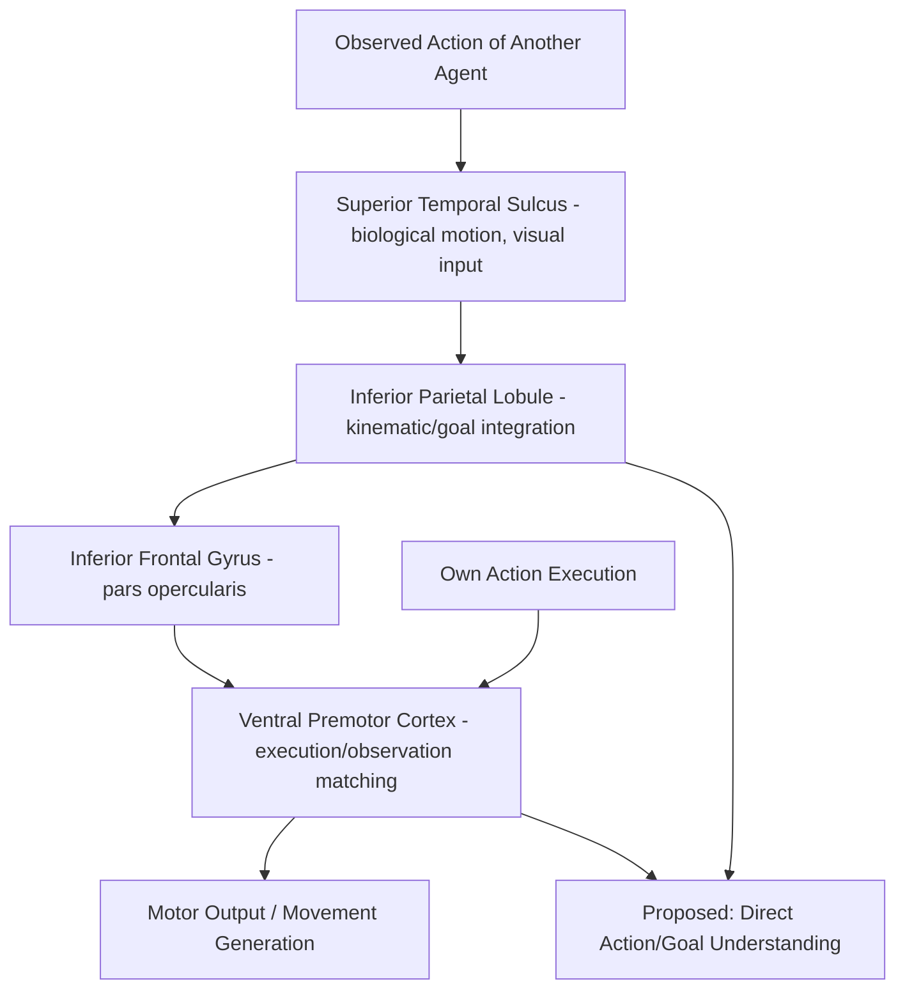

## Mirror Neuron System and Action Understanding

### Overview

Mirror neurons are a class of neurons that fire both when an individual performs a specific goal-directed action and when the individual observes another agent performing that same or a similar action. First identified via single-cell recordings in macaque area F5 (ventral premotor cortex), this discovery introduced the concept of a neural mechanism that directly maps observed action onto the observer's own motor repertoire, without necessarily requiring explicit inferential or symbolic mediation. In humans, an analogous "mirror neuron system" (MNS) is proposed based on convergent fMRI, EEG/MEG, and TMS evidence, though the degree to which human findings constitute true single-cell mirror properties (as directly demonstrated in monkeys) versus population-level mirroring effects remains an important methodological caveat.

### Discovery and Original Evidence

**Key Points**

- Mirror neurons were first reported by Giacomo Rizzolatti and colleagues in the early-to-mid 1990s in macaque ventral premotor cortex (area F5), initially identified somewhat serendipitously during single-unit recordings of grasping-related neurons.
- The defining property: a given neuron discharges both during the monkey's own execution of a specific manual action (e.g., precision grip) and during passive observation of an experimenter performing the same or a similar action.
- Subsequent work identified a second key region, the inferior parietal lobule (IPL, particularly area PFG), containing neurons with similar execution-observation matching properties, anatomically and functionally connected to F5.
- Mirror neurons in monkeys show a degree of action specificity (firing more strongly for grasping than for other actions) and, in some subpopulations, respond even when the terminal part of an action is hidden from view but its outcome can be inferred (logically-related mirror neurons), suggesting representation of action goals rather than purely low-level visual motion features.

### Core Neuroanatomy: The Human Mirror Neuron System

- **Inferior frontal gyrus (IFG), pars opercularis**: proposed human homolog of macaque area F5; consistently activated during both action execution and observation across neuroimaging studies, and considered a core hub of the human MNS.
- **Inferior parietal lobule (IPL) / anterior intraparietal sulcus (aIPS)**: proposed human homolog of macaque PFG; integrates visual and somatosensory information relevant to action goals and kinematics.
- **Superior temporal sulcus (STS)**: while not itself considered to contain mirror neurons in the strict execution-observation sense (it is a purely visual, non-motor region), STS provides critical visual input about biological motion to the frontoparietal mirror circuit and is typically included as part of the broader "action observation network" (AON).
- Together, IFG, IPL, and STS constitute the core **action observation network**, functionally connected and consistently co-activated during both action execution and observation tasks in human neuroimaging.

### Circuit Diagram (svg_diagram)

<svg xmlns="http://www.w3.org/2000/svg" viewBox="0 0 900 520" font-family="Helvetica, Arial, sans-serif">
<text x="450" y="30" text-anchor="middle" font-size="20" font-weight="bold" fill="#1a1a1a">Human Action Observation Network (svg_diagram)</text>
<rect x="60" y="120" width="190" height="60" rx="8" fill="#dce8f7" stroke="#3b6ea5" stroke-width="1.5" />
<text x="155" y="145" text-anchor="middle" font-size="13">Superior Temporal</text>
<text x="155" y="161" text-anchor="middle" font-size="13">Sulcus (STS)</text>
<text x="155" y="175" text-anchor="middle" font-size="10">(visual, non-motor)</text>
<rect x="340" y="120" width="220" height="60" rx="8" fill="#f7ead1" stroke="#b5822c" stroke-width="1.5" />
<text x="450" y="145" text-anchor="middle" font-size="13">Inferior Parietal Lobule</text>
<text x="450" y="161" text-anchor="middle" font-size="13">(IPL / aIPS)</text>
<rect x="640" y="120" width="200" height="60" rx="8" fill="#f5cccc" stroke="#a03030" stroke-width="1.5" />
<text x="740" y="145" text-anchor="middle" font-size="13">Inferior Frontal Gyrus</text>
<text x="740" y="161" text-anchor="middle" font-size="13">(IFG, pars opercularis)</text>
<rect x="340" y="260" width="220" height="70" rx="8" fill="#e2f0d9" stroke="#5a8f3c" stroke-width="1.5" />
<text x="450" y="285" text-anchor="middle" font-size="13">Ventral Premotor Cortex</text>
<text x="450" y="302" text-anchor="middle" font-size="12">(homolog of macaque F5)</text>
<text x="450" y="318" text-anchor="middle" font-size="10">motor execution/observation match</text>
<rect x="640" y="260" width="200" height="70" rx="8" fill="#e3d7f5" stroke="#6b3fa0" stroke-width="1.5" />
<text x="740" y="285" text-anchor="middle" font-size="13">Motor/Premotor</text>
<text x="740" y="302" text-anchor="middle" font-size="13">Execution Output</text>
<text x="740" y="318" text-anchor="middle" font-size="10">actual movement generation</text>
<line x1="250" y1="150" x2="340" y2="150" stroke="#444" stroke-width="1.5" marker-end="url(#arrow6)" />
<line x1="560" y1="150" x2="640" y2="150" stroke="#444" stroke-width="1.5" marker-end="url(#arrow6)" />
<line x1="740" y1="180" x2="740" y2="260" stroke="#444" stroke-width="1.5" marker-end="url(#arrow6)" />
<line x1="450" y1="180" x2="450" y2="260" stroke="#444" stroke-width="1.5" marker-end="url(#arrow6)" />
<line x1="560" y1="295" x2="640" y2="295" stroke="#444" stroke-width="1.5" marker-end="url(#arrow6)" />

<text x="450" y="410" font-size="12" fill="#555">STS provides visual biological-motion input to frontoparietal circuit (IPL–IFG/premotor).</text>

<text x="450" y="428" font-size="12" fill="#555">This circuit is engaged both during observation of others' actions and during own action execution/planning.</text>

</svg>

### Proposed Functions

**Key Points**

- **Action understanding**: the original and most influential proposal — mirror neurons enable understanding of observed actions "from the inside," by mapping the visual representation of another's action onto the observer's own motor repertoire, potentially bypassing purely inferential/cognitive routes to action comprehension.
- **Imitation and motor learning**: mirroring mechanisms have been proposed to support imitative learning by providing a direct sensorimotor link between observed and to-be-produced actions.
- **Intention understanding**: some studies suggest mirror system activity distinguishes not just the observed motor act but the broader intention behind it (e.g., grasping a cup to drink versus to clear the table), based on contextual cues.
- **Empathy and emotional resonance**: extended (and more contested) proposals link mirror mechanisms to embodied simulation of others' emotional and sensory states, particularly via connections to insula and limbic structures, contributing to affective empathy.
- **Language evolution**: Rizzolatti and Arbib's proposal that the mirror system, given its overlap with Broca's area (IFG), may have provided an evolutionary substrate bridging manual gesture and vocal communication — a historically influential but still debated theory.

### Human Neuroimaging and Neurophysiological Evidence

**Example**

In a typical fMRI action-observation paradigm, participants alternately perform a grasping action with their own hand and watch a video of another person performing the same grasping action. Regions showing overlapping activation across both conditions — canonically IFG (pars opercularis) and IPL — are interpreted as candidate human mirror regions. Complementary EEG studies commonly use suppression of the mu rhythm (8-13 Hz oscillatory activity over sensorimotor cortex) during action observation as an indirect electrophysiological index of mirror system engagement, since mu suppression normally occurs during actual movement and its presence during mere observation is taken as evidence of a similar sensorimotor engagement.

**Key Points**

- Human evidence for mirror properties comes predominantly from indirect measures: fMRI adaptation/overlap studies, TMS-induced motor-evoked potential (MEP) modulation during action observation, and EEG mu/MEG rhythm suppression — rather than direct single-neuron recordings, which are rarely feasible in humans.
- A landmark exception: intracranial recordings in a small number of neurosurgical patients (Mukamel et al., 2010) reported neurons in human medial frontal and medial temporal cortex with mirror-like execution-observation properties, providing rare direct single-cell evidence in humans, though from atypical (epilepsy-implanted) recording sites rather than the classically proposed IFG/IPL regions.
- TMS studies show that observing an action increases the amplitude of motor-evoked potentials recorded from muscles homologous to those the observed actor is using, consistent with automatic motor resonance/facilitation during observation.

### Critical Debates and Limitations

**Key Points**

- **Correlation vs. causal necessity**: much human MNS evidence is correlational (co-activation during execution and observation); demonstrating that mirror activity is causally necessary for action understanding (rather than an epiphenomenal byproduct) has proven more difficult, and some studies using TMS-induced disruption of IFG/IPL show only partial or task-dependent impairment of action understanding.
- **Associative account (Hickok's critique)**: an influential counter-proposal argues that mirror neuron responses can be explained as a product of ordinary associative learning between sensory and motor representations (via correlated experience of performing and observing the same actions), rather than reflecting a specialized, evolutionarily dedicated "understanding" mechanism. This account challenges strong claims that mirror neurons are necessary or sufficient for action or intention understanding.
- **Overgeneralization concerns**: mirror neuron findings have at times been extended in popular science and some academic literature to explain a very broad range of phenomena (autism, language evolution, empathy, aesthetics) with a degree of speculative overreach that exceeds the direct empirical evidence, a pattern noted critically within the field itself.
- **Broken mirror theory of autism**: an early and influential hypothesis proposed that autism spectrum conditions result from dysfunction of the mirror neuron system, predicting deficits in imitation, action understanding, and empathy; subsequent meta-analytic and neuroimaging evidence has been mixed and largely fails to support a generalized "broken mirror" account as a primary or sufficient explanation for autism. [Unverified: the broken mirror theory of autism is now considered by much of the field to be not well supported as a unifying account, though this remains a topic of ongoing empirical and theoretical discussion.]

### Distinction from the Mentalizing Network

| Feature | Mirror Neuron System | Mentalizing Network |
| --- | --- | --- |
| Core regions | IFG, IPL, (STS as visual input) | TPJ, mPFC, precuneus/PCC |
| Content represented | Observable motor actions and their immediate goals | Abstract, non-observable mental states (beliefs, intentions, emotions) |
| Proposed mechanism | Direct sensorimotor resonance/simulation | Inferential/representational computation |
| Best suited for | Understanding "what" and immediate "why" of a concrete action | Understanding beliefs that may diverge from reality or from one's own perspective |
| Developmental origin | Present in some form very early (infant imitation research) | Explicit forms mature later (~age 4+ for false belief) |

These two systems are not mutually exclusive and are proposed by some researchers to interact and complement one another for full social-cognitive processing of others' behavior, though the nature of their interaction is an active research area rather than a settled matter.

### Circuit Summary Diagram

### Key Experimental Techniques

- **Single-unit electrophysiology (macaque)**: the original and still gold-standard method for directly demonstrating mirror properties at the individual neuron level.
- **fMRI action-observation/execution overlap paradigms**: identifying human regions co-activated during first-person action and third-person observation.
- **TMS motor-evoked potential (MEP) studies**: indexing corticospinal excitability changes during action observation as a marker of motor resonance.
- **EEG/MEG mu and beta rhythm suppression**: indirect oscillatory marker of sensorimotor engagement during observation.
- **Intracranial/single-unit recording in humans**: rare but direct evidence, typically obtained opportunistically in neurosurgical patients.
- **Imitation and apraxia studies in brain-damaged patients**: examining the necessity of candidate mirror regions for imitative and action-understanding behavior.

### Conclusion

The mirror neuron system represents one of the most influential — and most contested — discoveries in social and cognitive neuroscience, describing a neural mechanism by which observed actions are mapped onto the observer's own motor representations via a core frontoparietal circuit (inferior frontal gyrus, inferior parietal lobule) supported by visual input from the superior temporal sulcus. While originally proposed as a direct substrate for action and intention understanding, imitation, and even empathy and language evolution, subsequent critical work has tempered strong claims of necessity and specialized "understanding" function, favoring more measured associative and complementary accounts. The system remains anatomically and functionally distinct from the mentalizing network, with the two systems proposed to address different aspects of social cognition — concrete observable action versus abstract non-observable mental states — and their precise interaction continues to be an active area of investigation.

**Related Topics**

- Theory of mind and the mentalizing network (complementary social-cognitive system)
- Motor cortex organization and action planning
- Empathy: cognitive vs. affective components and neural substrates
- Imitation learning and developmental motor cognition
- Broca's area and the evolution of language
- Apraxia and disorders of action representation
- Autism spectrum conditions and social brain hypotheses
- Embodied cognition and simulation theories of social understanding