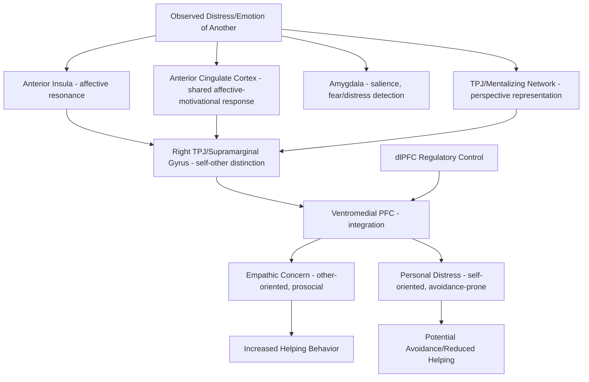

## Empathy and Its Neural Substrates

### Overview

Empathy is the capacity to understand and share the affective states of others, typically decomposed into dissociable component processes rather than treated as a single unitary construct. Contemporary neuroscientific models distinguish at minimum between **affective empathy** (vicariously sharing or resonating with another's emotional state) and **cognitive empathy** (understanding and representing another's perspective or emotional state without necessarily feeling it oneself), with a further distinction often drawn for **empathic concern/compassion** (a motivational, other-oriented response to another's distress, oriented toward helping). These components are supported by partially overlapping but dissociable neural systems, and the distinctions have proven clinically consequential across a range of neurological and psychiatric conditions.

### Componential Models of Empathy

**Key Points**

- **Affective empathy (emotional contagion/resonance)**: the vicarious sharing of another's emotional state, often relying on rapid, relatively automatic simulation-like mechanisms; closely associated with anterior insula and anterior cingulate cortex activity, particularly for shared pain and disgust.
- **Cognitive empathy (perspective-taking)**: the more deliberative representation of another's mental/emotional state, overlapping substantially with theory-of-mind/mentalizing processes and recruiting the mentalizing network (TPJ, mPFC, precuneus).
- **Empathic concern/compassion**: a motivational, prosocial orientation toward alleviating another's distress, distinguished from personal distress (a self-oriented aversive reaction to witnessing suffering that can, paradoxically, reduce helping behavior via avoidance).
- **Personal distress**: a self-focused, aversive arousal response to another's suffering, associated with amygdala and anterior insula activation, but conceptually and behaviorally distinct from other-oriented empathic concern; on some models, unregulated personal distress can impair rather than promote prosocial responding.
- Decety and colleagues' influential multidimensional framework treats empathy as involving affective sharing, self-other awareness/distinction, mental flexibility for perspective-taking, and emotion regulation — a decomposition intended to capture both convergence and dissociation across empathy's component processes.

### Core Neuroanatomy

#### Shared/Affective Empathy Substrates

- **Anterior insula (AI)**: consistently activated both when experiencing one's own pain/disgust and when observing or imagining another's pain/disgust — a canonical example of the "shared representation" or simulation model of empathy, in which observing another's state partially recruits the same neural machinery engaged when experiencing that state oneself.
- **Anterior cingulate cortex (ACC), particularly dorsal/mid-ACC**: similarly shows shared activation for first-hand and vicarious pain, and is implicated in the affective-motivational dimension of pain processing that generalizes to empathic pain.
- **Amygdala**: contributes to rapid emotional resonance and salience detection when witnessing others' emotional expressions, particularly fear and distress cues.
- Together, AI and ACC constitute the core of what is often termed the **pain matrix** or shared/simulation network for empathy, extending the classical first-person pain-processing network to third-person, vicarious contexts.

#### Cognitive Empathy Substrates

- Substantial overlap with the mentalizing network: **temporoparietal junction (TPJ)**, **medial prefrontal cortex (mPFC)**, and **precuneus/posterior cingulate cortex**, supporting the more deliberative, representational aspect of understanding another's perspective and emotional state.
- **Ventromedial prefrontal cortex (vmPFC)**: implicated in integrating cognitive and affective components of empathic responding, and in value-based computations relevant to prosocial decision-making informed by empathic understanding.

#### Regulatory and Distinguishing Substrates

- **Right supramarginal gyrus / TPJ region**: implicated in overcoming egocentric bias, i.e., correctly attributing an emotional state to another person rather than projecting one's own current emotional state onto them — a self-other distinction mechanism critical for accurate (rather than merely resonant) empathy.
- **Prefrontal regulatory regions (dlPFC, vmPFC)**: modulate the intensity of affective sharing, supporting the transition from potentially overwhelming personal distress toward regulated, other-oriented empathic concern.

### Circuit Diagram (svg_diagram)

<svg xmlns="http://www.w3.org/2000/svg" viewBox="0 0 900 560" font-family="Helvetica, Arial, sans-serif">
<text x="450" y="30" text-anchor="middle" font-size="20" font-weight="bold" fill="#1a1a1a">Empathy: Affective and Cognitive Substrates (svg_diagram)</text>
<rect x="40" y="90" width="220" height="100" rx="10" fill="#f5cccc" stroke="#a03030" stroke-width="1.5" />
<text x="150" y="115" text-anchor="middle" font-size="14" font-weight="bold">Affective/Shared System</text>
<text x="150" y="135" text-anchor="middle" font-size="12">Anterior Insula</text>
<text x="150" y="152" text-anchor="middle" font-size="12">Anterior Cingulate Cortex</text>
<text x="150" y="169" text-anchor="middle" font-size="12">Amygdala</text>
<rect x="640" y="90" width="220" height="100" rx="10" fill="#dce8f7" stroke="#3b6ea5" stroke-width="1.5" />
<text x="750" y="115" text-anchor="middle" font-size="14" font-weight="bold">Cognitive/Mentalizing System</text>
<text x="750" y="135" text-anchor="middle" font-size="12">Temporoparietal Junction</text>
<text x="750" y="152" text-anchor="middle" font-size="12">Medial Prefrontal Cortex</text>
<text x="750" y="169" text-anchor="middle" font-size="12">Precuneus/PCC</text>
<rect x="340" y="240" width="220" height="70" rx="10" fill="#e2f0d9" stroke="#5a8f3c" stroke-width="1.5" />
<text x="450" y="265" text-anchor="middle" font-size="13">Ventromedial PFC</text>
<text x="450" y="282" text-anchor="middle" font-size="11">integration, prosocial value</text>
<text x="450" y="298" text-anchor="middle" font-size="11">computation</text>
<rect x="150" y="360" width="240" height="70" rx="10" fill="#f7ead1" stroke="#b5822c" stroke-width="1.5" />
<text x="270" y="385" text-anchor="middle" font-size="13">Right TPJ / Supramarginal Gyrus</text>
<text x="270" y="402" text-anchor="middle" font-size="11">self-other distinction,</text>
<text x="270" y="418" text-anchor="middle" font-size="11">overcoming egocentric bias</text>
<rect x="510" y="360" width="240" height="70" rx="10" fill="#e3d7f5" stroke="#6b3fa0" stroke-width="1.5" />
<text x="630" y="385" text-anchor="middle" font-size="13">dlPFC Regulatory Control</text>
<text x="630" y="402" text-anchor="middle" font-size="11">personal distress → regulated</text>
<text x="630" y="418" text-anchor="middle" font-size="11">empathic concern</text>
<rect x="330" y="470" width="240" height="55" rx="10" fill="#d9f2d9" stroke="#3a7d3a" stroke-width="1.5" />
<text x="450" y="493" text-anchor="middle" font-size="13">Empathic Concern /</text>
<text x="450" y="509" text-anchor="middle" font-size="13">Prosocial Behavior</text>
<line x1="260" y1="160" x2="340" y2="260" stroke="#444" stroke-width="1.5" marker-end="url(#arrow7)" />
<line x1="640" y1="160" x2="560" y2="260" stroke="#444" stroke-width="1.5" marker-end="url(#arrow7)" />
<line x1="270" y1="360" x2="270" y2="200" stroke="#444" stroke-width="1.5" stroke-dasharray="4,3" marker-end="url(#arrow7)" />
<line x1="630" y1="360" x2="150" y2="200" stroke="#444" stroke-width="1.5" stroke-dasharray="4,3" marker-end="url(#arrow7)" />
<line x1="270" y1="430" x2="400" y2="470" stroke="#444" stroke-width="1.5" marker-end="url(#arrow7)" />
<line x1="630" y1="430" x2="500" y2="470" stroke="#444" stroke-width="1.5" marker-end="url(#arrow7)" />
<line x1="450" y1="310" x2="450" y2="470" stroke="#444" stroke-width="1.5" marker-end="url(#arrow7)" />

<text x="450" y="545" font-size="12" fill="#555">Affective and cognitive systems converge on vmPFC; TPJ and dlPFC regulate and disambiguate</text>

</svg>

### Empathy vs. Personal Distress: A Critical Behavioral Dissociation

| Feature | Empathic Concern/Compassion | Personal Distress |
| --- | --- | --- |
| Orientation | Other-focused | Self-focused |
| Subjective experience | Warmth, concern for the other | Aversive arousal, discomfort |
| Behavioral consequence | Increased helping/prosocial behavior | Can decrease helping (motivated avoidance) |
| Associated regions | vmPFC, ventral striatum (reward-related), regulated ACC/insula | Amygdala, unregulated anterior insula/ACC activation |
| Regulatory involvement | Higher prefrontal regulatory engagement | Lower regulatory engagement, more reactive |

[Inference: while this dissociation between empathic concern and personal distress is well-established behaviorally (particularly from Batson's and Eisenberg's developmental/social psychology work), the precise neural boundary between the two states is not always sharply distinguishable across individual neuroimaging studies.]

### Empathy for Pain: A Model System

**Example**

In a classic empathy-for-pain paradigm, participants either receive a mildly painful electrical stimulus themselves or watch a loved one (visible via a mirror or video) receive the same stimulus. Both conditions activate overlapping regions of the anterior insula and dorsal ACC — the affective-motivational components of pain processing — while sensory-discriminative regions (e.g., primary somatosensory cortex) are typically activated only during first-hand pain, not observed pain. This dissociation supports the interpretation that empathy for pain involves shared representation of the affective significance of pain, without literally reproducing its sensory qualities.

**Key Points**

- Empathy for pain is one of the most extensively replicated paradigms in social neuroscience, providing strong evidence for the shared-representation/simulation model of at least the affective component of empathy.
- Empathic pain responses are modulated by social-contextual factors including perceived fairness of the target's prior behavior, in-group/out-group membership, and perceived similarity to the observer — findings that have informed research on intergroup empathy bias.
- Intergroup studies have repeatedly found reduced empathic neural responses (e.g., diminished anterior insula/ACC activation) to the pain of out-group compared to in-group members, a finding with implications for understanding prejudice and intergroup conflict. [Inference: the magnitude and consistency of this in-group empathy bias varies across specific group manipulations and populations studied.]

### Developmental Trajectory

**Key Points**

- Rudimentary emotional contagion (e.g., reactive crying to another infant's distress) is present from very early infancy, considered a developmental precursor to full empathic capacity rather than mature empathy itself.
- Self-other distinction, necessary for empathy rather than mere emotional contagion, develops progressively through toddlerhood, paralleling broader self-awareness milestones (e.g., mirror self-recognition around 18-24 months).
- Cognitive empathy/perspective-taking components show a developmental trajectory that parallels theory of mind development, with more sophisticated other-oriented empathic responding continuing to mature into adolescence alongside prefrontal cortical development.

### Clinical and Individual Difference Relevance

**Key Points**

- **Psychopathy**: characteristically associated with impaired affective empathy (particularly reduced responsiveness to others' distress/fear cues, linked to amygdala hyporeactivity) alongside relatively preserved or even enhanced cognitive empathy/perspective-taking, allowing manipulative exploitation of accurately understood — but not emotionally shared — mental states.
- **Autism spectrum conditions**: evidence suggests a more complex and heterogeneous pattern than a simple "empathy deficit," with some research indicating relatively preserved affective resonance/personal distress responses alongside difficulties in the cognitive/perspective-taking components of empathy — the reverse general pattern from psychopathy. [Inference: the specific empathy profile in autism remains actively debated and likely varies considerably across individuals on the spectrum.]
- **Alexithymia**: difficulty identifying and describing one's own emotions is associated with reduced empathic accuracy, supporting models in which accurate empathy for others partly depends on accurate interoceptive/emotional self-representation.
- **Narcissistic personality features**: some studies link reduced empathic concern (though not necessarily reduced cognitive empathy) to narcissistic traits, though findings are mixed across measurement approaches.
- **Burnout and compassion fatigue** (e.g., in healthcare workers): proposed to arise partly from chronic, insufficiently regulated personal distress responses to others' suffering, motivating training approaches (e.g., compassion-focused training) aimed at shifting responses toward regulated empathic concern rather than avoidant personal distress.

### Empathy Training and Plasticity

Compassion-focused meditation training programs have been studied using neuroimaging, with some evidence that such training shifts patterns of neural response to others' suffering — for instance, increased activation in reward-related regions (ventral striatum) and reduced markers of personal distress — alongside self-reported increases in prosocial motivation and behavior. [Unverified: effect sizes and neural specificity of compassion-training studies vary considerably, and this remains an active area of methodological development within contemplative neuroscience.]

### Circuit Summary Diagram

### Key Experimental Techniques

- **Empathy-for-pain fMRI paradigms**: comparing first-hand versus observed/vicarious pain to identify shared neural representations.
- **Interpersonal Reactivity Index (IRI) and related self-report measures**: standard psychometric instruments distinguishing perspective-taking, empathic concern, personal distress, and fantasy subscales.
- **Intergroup empathy bias paradigms**: manipulating in-group/out-group status of pain targets to probe social modulation of empathic neural responses.
- **Compassion/loving-kindness meditation training studies**: longitudinal neuroimaging comparing trained versus untrained individuals or pre/post training designs.
- **Lesion studies (e.g., ventromedial prefrontal damage)**: examining selective impairments in empathic/prosocial decision-making following focal brain damage.

### Conclusion

Empathy is best understood not as a single process but as a set of dissociable components — affective resonance, cognitive perspective-taking, self-other distinction, and regulated empathic concern versus unregulated personal distress — supported by partially overlapping neural systems including anterior insula and ACC (shared affective representation), the mentalizing network (cognitive perspective-taking), and prefrontal regulatory regions that determine whether witnessing another's suffering translates into effective prosocial action or self-protective avoidance. This componential framework has substantial clinical utility, explaining otherwise puzzling dissociations such as the psychopathy/autism contrast in affective versus cognitive empathy profiles, and continues to inform both basic social neuroscience and applied compassion-training interventions.

**Related Topics**

- Theory of mind and the mentalizing network (cognitive empathy overlap)
- Mirror neuron system and action understanding (proposed affective resonance mechanisms)
- Psychopathy and antisocial personality: neural correlates
- Autism spectrum conditions and social-affective processing
- Interoception and the body-brain connection (self-representation basis for empathic accuracy)
- Intergroup bias and the social neuroscience of prejudice
- Compassion-focused interventions and contemplative neuroscience
- Prosocial decision-making and value-based choice in vmPFC