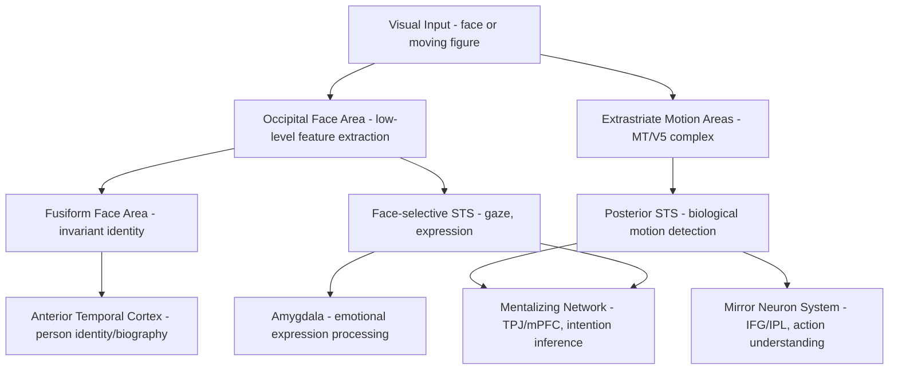

## Face and Biological Motion Perception

### Overview

Face perception and biological motion perception are foundational visual social-cognitive processes that extract socially relevant information — identity, emotional expression, gaze direction, and the presence and actions of other living agents — from visual input. Both domains are supported by specialized, category-selective regions within the ventral and lateral visual processing streams that show a degree of functional specificity beyond what would be predicted from general object recognition mechanisms, and both provide critical perceptual input to higher-order social-cognitive systems including the mentalizing network and mirror neuron system.

### Face Perception: Core Neuroanatomy

**Key Points**

- **Fusiform face area (FFA)**: a region of the fusiform gyrus (ventral temporal cortex) showing robust category selectivity for faces over other object categories across a large body of fMRI literature; widely considered the core hub for face identity processing.
- **Occipital face area (OFA)**: located in the inferior occipital gyrus, thought to process lower-level facial features (a "part-based" analysis of face components such as eyes, nose, mouth) and to feed forward into both FFA and STS-based face processing.
- **Superior temporal sulcus (STS), face-selective subregions**: processes changeable, dynamic facial features — eye gaze, expression, and lip movement — distinct from FFA's proposed role in more stable identity information.
- **Fusiform body area (FBA) and extrastriate body area (EBA)**: adjacent, functionally related regions showing category selectivity for bodies rather than faces specifically, often studied alongside face-processing regions given their shared role in person perception.

### The Distributed Model of Face Processing (Haxby Model)

**Key Points**

- Haxby and colleagues' influential model divides face processing into a **core system** and an **extended system**.
- **Core system**: OFA (early visual feature analysis), FFA (invariant identity/structural information), and STS (changeable, dynamic social information such as expression and gaze) — the three regions most consistently implicated across the face-processing literature.
- **Extended system**: additional regions recruited depending on task demands, including amygdala (emotional expression processing), intraparietal sulcus (spatial attention to gaze/face location), anterior temporal regions (person identity/biographical knowledge), and prefrontal regions (person knowledge, theory of mind related to the perceived face).
- This model explicitly separates the perception of invariant facial identity (FFA-mediated) from the perception of changeable facial signals used in social communication (STS-mediated), a distinction with substantial empirical support from neuropsychological dissociations (e.g., some prosopagnosic patients retain expression recognition despite impaired identity recognition, and vice versa).

### Circuit Diagram (svg_diagram)

<svg xmlns="http://www.w3.org/2000/svg" viewBox="0 0 900 560" font-family="Helvetica, Arial, sans-serif">
<text x="450" y="30" text-anchor="middle" font-size="20" font-weight="bold" fill="#1a1a1a">Distributed Face Processing Model (svg_diagram)</text>
<rect x="340" y="80" width="220" height="55" rx="8" fill="#dce8f7" stroke="#3b6ea5" stroke-width="1.5" />
<text x="450" y="105" text-anchor="middle" font-size="13">Occipital Face Area (OFA)</text>
<text x="450" y="121" text-anchor="middle" font-size="11">low-level feature analysis</text>
<rect x="120" y="200" width="220" height="70" rx="8" fill="#f7ead1" stroke="#b5822c" stroke-width="1.5" />
<text x="230" y="225" text-anchor="middle" font-size="13">Fusiform Face Area (FFA)</text>
<text x="230" y="242" text-anchor="middle" font-size="11">invariant identity /</text>
<text x="230" y="258" text-anchor="middle" font-size="11">structural information</text>
<rect x="560" y="200" width="220" height="70" rx="8" fill="#f5cccc" stroke="#a03030" stroke-width="1.5" />
<text x="670" y="225" text-anchor="middle" font-size="13">Superior Temporal Sulcus</text>
<text x="670" y="242" text-anchor="middle" font-size="11">changeable features:</text>
<text x="670" y="258" text-anchor="middle" font-size="11">gaze, expression, motion</text>
<rect x="60" y="340" width="180" height="60" rx="8" fill="#e2f0d9" stroke="#5a8f3c" stroke-width="1.5" />
<text x="150" y="365" text-anchor="middle" font-size="12">Anterior Temporal</text>
<text x="150" y="381" text-anchor="middle" font-size="11">person identity/biography</text>
<rect x="260" y="340" width="180" height="60" rx="8" fill="#e2f0d9" stroke="#5a8f3c" stroke-width="1.5" />
<text x="350" y="365" text-anchor="middle" font-size="12">Prefrontal Cortex</text>
<text x="350" y="381" text-anchor="middle" font-size="11">person knowledge, ToM</text>
<rect x="460" y="340" width="180" height="60" rx="8" fill="#e3d7f5" stroke="#6b3fa0" stroke-width="1.5" />
<text x="550" y="365" text-anchor="middle" font-size="12">Amygdala</text>
<text x="550" y="381" text-anchor="middle" font-size="11">emotional expression</text>
<rect x="660" y="340" width="180" height="60" rx="8" fill="#e3d7f5" stroke="#6b3fa0" stroke-width="1.5" />
<text x="750" y="365" text-anchor="middle" font-size="12">Intraparietal Sulcus</text>
<text x="750" y="381" text-anchor="middle" font-size="11">spatial attn. to gaze</text>
<line x1="400" y1="135" x2="260" y2="200" stroke="#444" stroke-width="1.5" marker-end="url(#arrow8)" />
<line x1="500" y1="135" x2="650" y2="200" stroke="#444" stroke-width="1.5" marker-end="url(#arrow8)" />
<line x1="200" y1="270" x2="150" y2="340" stroke="#444" stroke-width="1.5" marker-end="url(#arrow8)" />
<line x1="260" y1="270" x2="330" y2="340" stroke="#444" stroke-width="1.5" marker-end="url(#arrow8)" />
<line x1="620" y1="270" x2="560" y2="340" stroke="#444" stroke-width="1.5" marker-end="url(#arrow8)" />
<line x1="700" y1="270" x2="740" y2="340" stroke="#444" stroke-width="1.5" marker-end="url(#arrow8)" />

<text x="450" y="460" font-size="12" fill="#555">Core system (OFA/FFA/STS) feeds an extended system recruited by task demands</text>

<text x="450" y="478" font-size="12" fill="#555">(identity/biography, expression, gaze-based attention, person-related theory of mind).</text>

</svg>

### Biological Motion Perception

**Key Points**

- **Biological motion** refers to the movement patterns characteristic of living organisms, classically studied using **point-light displays** (Johansson, 1973), in which only a small number of light points attached to the major joints of a moving person are visible, with all other visual form information removed.
- Humans (including infants) reliably and rapidly perceive coherent human movement, action identity, gender, emotional state, and even intention from point-light displays alone, demonstrating that the visual system extracts biological motion via a specialized mechanism largely independent of full-form/shape information.
- **Posterior superior temporal sulcus (pSTS)**: the most consistently implicated region for biological motion processing across neuroimaging and lesion studies, responding selectively to point-light biological motion compared to scrambled/non-biological motion controls.
- pSTS biological motion processing is proposed to provide critical perceptual input to both the mirror neuron system (linking observed movement to motor representations) and the mentalizing network (supporting inference about the intentions and mental states underlying observed movement).

**Example**

In a typical point-light walker paradigm, a participant views a display of approximately 12-15 moving dots representing the major joints of a walking human figure, embedded within a field of randomly moving "noise" dots of similar number and velocity. Despite the sparse, abstract nature of the stimulus, participants reliably and rapidly detect the presence and even the facing direction of the walker, and neuroimaging during this task reliably shows selective pSTS activation compared to scrambled or reversed-motion control conditions that preserve low-level motion energy but disrupt biological coherence.

### Comparison: Face vs. Biological Motion Processing Streams

| Feature | Face Processing | Biological Motion Processing |
| --- | --- | --- |
| Primary selective region | Fusiform Face Area (FFA) | Posterior Superior Temporal Sulcus (pSTS) |
| Information type | Largely static form/identity (FFA) plus dynamic (STS) | Inherently dynamic, kinematic |
| Classic stimulus paradigm | Static face images, morphed identities | Point-light displays (Johansson figures) |
| Key dissociation | Identity (FFA) vs. expression/gaze (STS) | Biological vs. scrambled/non-biological motion |
| Downstream systems | Amygdala (emotion), mentalizing network (person knowledge) | Mirror neuron system (action), mentalizing network (intention) |
| Developmental onset | Face preference present from birth/very early infancy | Biological motion sensitivity present in early infancy |

### Developmental Considerations

**Key Points**

- Newborn infants show a preference for face-like visual configurations within hours of birth, suggesting an innate or very rapidly acquired predisposition toward face detection, though the sophistication of face processing (particularly identity discrimination and expertise) develops substantially over the first years and continues refining into adolescence.
- Infants as young as a few months old show discrimination and preferential attention to point-light biological motion displays over scrambled controls, indicating an early-developing, likely partially innate sensitivity to biological motion cues.
- The "other-race effect" (reduced discrimination ability for faces of races the observer has less perceptual experience with) illustrates that face processing, despite early precursors, is substantially shaped by perceptual experience/expertise during development — a finding with implications for the balance between innate specialization and experience-dependent tuning in face processing.

### Clinical and Neuropsychological Relevance

**Key Points**

- **Prosopagnosia** ("face blindness"): a selective impairment in face identity recognition, occurring in both acquired form (typically following bilateral or right-lateralized fusiform/occipitotemporal damage) and developmental form (present from early life without identifiable brain injury); patients often retain the ability to perceive facial expression and other object categories, illustrating the domain specificity of the impairment.
- **Autism spectrum conditions**: some studies report reduced FFA activation during face processing and reduced sensitivity to biological motion (including reduced preferential attention to point-light displays), proposed to contribute to broader social-perceptual and social-cognitive difficulties, though findings on the specificity and consistency of these effects are mixed across the literature. [Unverified: face and biological motion processing atypicalities in autism show considerable heterogeneity across studies and may not generalize uniformly across the spectrum.]
- **Capgras syndrome**: a delusional misidentification syndrome in which patients believe a familiar person has been replaced by an impostor; proposed by some models to reflect a disconnection between intact overt face identity recognition (FFA-mediated) and disrupted covert autonomic/affective familiarity signals normally linked to face recognition (potentially involving disrupted connections between face-processing regions and limbic/autonomic structures). [Inference: the specific disconnection account of Capgras syndrome is an influential model but remains one of several proposed explanatory frameworks rather than definitively established mechanism.]
- **Schizophrenia**: some studies report reduced FFA and amygdala responsivity during face-emotion processing tasks, potentially contributing to social cognitive deficits characteristic of the disorder.

### Circuit Summary Diagram

### Key Experimental Techniques

- **Face localizer fMRI paradigms**: contrasting faces versus objects/scrambled images to functionally identify FFA, OFA, and face-selective STS on an individual-participant basis.
- **Point-light display paradigms**: the standard method for isolating biological motion perception from static form cues, with scrambled or spatially/temporally reversed displays as controls.
- **Adaptation/repetition suppression paradigms**: used to probe identity- and view-invariance properties of face-selective regions.
- **Lesion-mapping studies in prosopagnosia**: identifying necessary substrates for face identity recognition via naturally occurring brain damage.
- **Single-unit recording (non-human primate face patches)**: providing detailed, cellular-level characterization of face-selective processing homologous to human FFA/OFA regions.

### Conclusion

Face and biological motion perception rely on specialized, category-selective regions within the ventral and lateral temporal visual streams — principally the fusiform face area, occipital face area, and face-selective superior temporal sulcus for faces, and the posterior superior temporal sulcus for biological motion — that extract socially critical identity, expression, gaze, and movement information from visual input with a degree of functional specificity well beyond general object recognition. These perceptual systems, particularly pSTS, serve as essential upstream input to higher-order social-cognitive networks including the mirror neuron system and the mentalizing network, and their selective disruption produces striking, informative neuropsychological syndromes such as prosopagnosia, underscoring both the domain specificity and the clinical significance of these visual social-perceptual mechanisms.

**Related Topics**

- Mirror neuron system and action understanding (pSTS as shared perceptual input)
- Theory of mind and the mentalizing network (STS/pSTS contribution to intention inference)
- Prosopagnosia and neuropsychological face-processing disorders
- Emotion recognition from facial expression and the amygdala
- Visual object recognition and the ventral visual stream
- Autism spectrum conditions and atypical social-perceptual processing
- Development of face expertise and the other-race effect
- Gaze perception and joint attention mechanisms