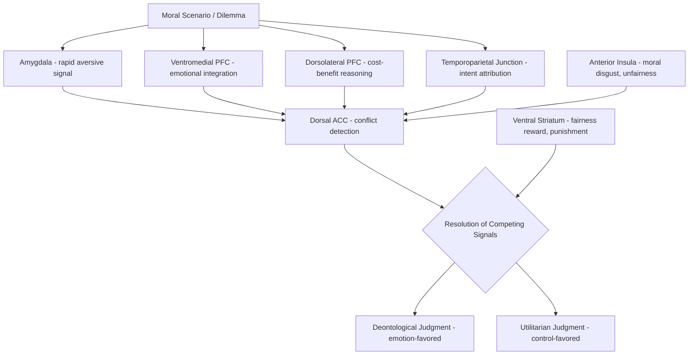

## Moral Cognition and Judgment

### Overview

Moral cognition encompasses the psychological and neural processes underlying the evaluation of actions, intentions, and outcomes as right or wrong, fair or unfair, and the subsequent generation of moral judgments, emotions, and behavior. Contemporary moral neuroscience has moved substantially away from purely rationalist accounts (in which moral judgment is the product of deliberate reasoning) toward integrative dual-process and social-intuitionist models that emphasize the interaction of fast, automatic affective/intuitive responses with slower, deliberate cognitive control processes. This field draws heavily on and extends the emotion regulation, theory of mind, and empathy circuitry already established elsewhere in affective and social neuroscience.

### Theoretical Frameworks

**Key Points**

- **Rationalist models (e.g., Kohlberg)**: historically dominant developmental account proposing that moral judgment progresses through stages of increasingly sophisticated conscious moral reasoning, with judgment following from deliberate application of moral principles.
- **Social intuitionist model (Haidt)**: proposes that moral judgments are typically the product of rapid, automatic affective intuitions, with conscious moral reasoning often functioning post-hoc to justify an already-formed gut-level judgment rather than to generate it.
- **Dual-process model (Greene)**: proposes that moral judgment, particularly in dilemmas pitting utilitarian outcomes against deontological constraints, reflects competition between fast, automatic emotional responses (favoring deontological judgments, e.g., "don't harm") and slower, effortful cognitive control processes (capable of overriding emotional responses to favor utilitarian/cost-benefit judgments).
- **Moral foundations theory (Haidt and Graham)**: proposes several largely innate, culturally elaborated psychological foundations underlying moral judgment (commonly cited: care/harm, fairness/cheating, loyalty/betrayal, authority/subversion, sanctity/degradation), intended to explain both moral universals and cross-cultural/political variation in moral emphasis.
- These frameworks are not fully mutually exclusive; contemporary work increasingly treats moral judgment as arising from a dynamic interplay of intuitive/affective and deliberative/control processes rather than favoring one mechanism exclusively.

### Core Neuroanatomy of Moral Cognition

- **Ventromedial prefrontal cortex (vmPFC)**: critical for integrating emotional/social information into moral judgment; patients with vmPFC damage show a characteristic pattern of increased utilitarian judgments in emotionally salient "personal" moral dilemmas, attributed to a reduced automatic emotional aversion to directly causing harm.
- **Amygdala**: contributes rapid affective/aversive signaling relevant to harm-based moral judgments, particularly for emotionally salient moral violations.
- **Dorsolateral prefrontal cortex (dlPFC)**: implicated in the effortful cognitive control processes proposed by dual-process models to support utilitarian, cost-benefit-based override of automatic emotional/deontological responses.
- **Anterior cingulate cortex (dACC)**: implicated in detecting conflict between competing moral considerations (e.g., emotional aversion to harm versus cost-benefit reasoning favoring a harmful action for a greater good).
- **Temporoparietal junction (TPJ)**: critical for incorporating information about an agent's intent (as opposed to outcome alone) into moral judgment, reflecting substantial overlap with the mentalizing network — moral judgment of an action depends heavily on inferred intent, not just consequence.
- **Anterior insula**: contributes affective/visceral signals relevant to moral disgust and violations perceived as impure or degrading, consistent with moral foundations theory's sanctity/purity dimension.
- **Ventral striatum**: implicated in reward-related processing of fairness, cooperation, and the satisfaction associated with punishing perceived moral violations (e.g., altruistic punishment).

### Circuit Diagram (svg_diagram)

<svg xmlns="http://www.w3.org/2000/svg" viewBox="0 0 900 560" font-family="Helvetica, Arial, sans-serif">
<text x="450" y="30" text-anchor="middle" font-size="20" font-weight="bold" fill="#1a1a1a">Dual-Process Model of Moral Judgment (svg_diagram)</text>
<rect x="60" y="90" width="240" height="100" rx="10" fill="#f5cccc" stroke="#a03030" stroke-width="1.5" />
<text x="180" y="115" text-anchor="middle" font-size="14" font-weight="bold">Automatic/Affective System</text>
<text x="180" y="135" text-anchor="middle" font-size="12">Amygdala</text>
<text x="180" y="152" text-anchor="middle" font-size="12">Ventromedial PFC</text>
<text x="180" y="169" text-anchor="middle" font-size="12">Anterior Insula</text>
<rect x="600" y="90" width="240" height="100" rx="10" fill="#dce8f7" stroke="#3b6ea5" stroke-width="1.5" />
<text x="720" y="115" text-anchor="middle" font-size="14" font-weight="bold">Deliberate/Control System</text>
<text x="720" y="135" text-anchor="middle" font-size="12">Dorsolateral PFC</text>
<text x="720" y="152" text-anchor="middle" font-size="12">Cost-benefit reasoning</text>
<text x="720" y="169" text-anchor="middle" font-size="12">Utilitarian computation</text>
<rect x="340" y="240" width="220" height="70" rx="10" fill="#f7ead1" stroke="#b5822c" stroke-width="1.5" />
<text x="450" y="265" text-anchor="middle" font-size="13">Dorsal Anterior Cingulate</text>
<text x="450" y="282" text-anchor="middle" font-size="11">conflict detection between</text>
<text x="450" y="298" text-anchor="middle" font-size="11">competing responses</text>
<rect x="150" y="360" width="240" height="70" rx="10" fill="#e2f0d9" stroke="#5a8f3c" stroke-width="1.5" />
<text x="270" y="385" text-anchor="middle" font-size="13">Temporoparietal Junction</text>
<text x="270" y="402" text-anchor="middle" font-size="11">intent attribution</text>
<text x="270" y="418" text-anchor="middle" font-size="11">(mentalizing input)</text>
<rect x="510" y="360" width="240" height="70" rx="10" fill="#e3d7f5" stroke="#6b3fa0" stroke-width="1.5" />
<text x="630" y="385" text-anchor="middle" font-size="13">Ventral Striatum</text>
<text x="630" y="402" text-anchor="middle" font-size="11">fairness reward,</text>
<text x="630" y="418" text-anchor="middle" font-size="11">altruistic punishment</text>
<rect x="330" y="470" width="240" height="55" rx="10" fill="#d9f2d9" stroke="#3a7d3a" stroke-width="1.5" />
<text x="450" y="493" text-anchor="middle" font-size="13">Moral Judgment</text>
<text x="450" y="509" text-anchor="middle" font-size="13">(Deontological or Utilitarian)</text>
<line x1="220" y1="190" x2="380" y2="240" stroke="#444" stroke-width="1.5" marker-end="url(#arrow9)" />
<line x1="680" y1="190" x2="520" y2="240" stroke="#444" stroke-width="1.5" marker-end="url(#arrow9)" />
<line x1="270" y1="360" x2="270" y2="200" stroke="#444" stroke-width="1.5" stroke-dasharray="4,3" marker-end="url(#arrow9)" />
<line x1="630" y1="360" x2="630" y2="200" stroke="#444" stroke-width="1.5" stroke-dasharray="4,3" marker-end="url(#arrow9)" />
<line x1="270" y1="430" x2="400" y2="470" stroke="#444" stroke-width="1.5" marker-end="url(#arrow9)" />
<line x1="630" y1="430" x2="500" y2="470" stroke="#444" stroke-width="1.5" marker-end="url(#arrow9)" />
<line x1="450" y1="310" x2="450" y2="470" stroke="#444" stroke-width="1.5" marker-end="url(#arrow9)" />

<text x="450" y="545" font-size="12" fill="#555">dACC detects conflict between affective and deliberative signals; TPJ contributes intent information</text>

</svg>

### Classic Experimental Paradigms

**Example**

The **trolley problem** and its variants are the most extensively used tools in moral neuroscience. In the classic (impersonal) version, a runaway trolley will kill five people unless a bystander pulls a lever to divert it onto a track where it will kill one person instead; most respondents judge pulling the lever as morally acceptable. In the **footbridge (personal)** variant, the only way to stop the trolley is to physically push a large stranger off a footbridge onto the tracks, killing him to save the five; despite the equivalent five-versus-one outcome logic, most respondents judge this act as morally impermissible. Greene and colleagues' neuroimaging work found that the personal (footbridge-type) dilemma, involving direct, "up-close-and-personal" physical harm, evokes greater activation in emotion-related regions (including vmPFC and amygdala) and takes longer to process when a utilitarian judgment is ultimately made, compared to impersonal dilemmas — interpreted as evidence for the dual-process, emotion-versus-control competition model.

**Key Points**

- **Trolley/footbridge dilemmas**: distinguish personal (direct physical contact, emotionally salient) from impersonal (indirect, mechanically mediated) harm scenarios.
- **Ultimatum game**: a proposer offers a division of a sum of money to a responder, who can accept (both receive the proposed split) or reject (both receive nothing); responders frequently reject unfair offers even at direct cost to themselves, a finding widely interpreted as reflecting an emotionally-driven aversion to unfairness rather than purely rational self-interest, and associated with anterior insula activation during rejection of unfair offers.
- **Public goods and trust games**: used to study cooperation, punishment of free-riders, and the reward-related neural correlates of enforcing fairness norms.
- **Moral dumbfounding paradigms**: presenting harmless-but-taboo scenarios (e.g., consensual acts widely viewed as morally wrong despite no identifiable victim) to probe cases where moral judgment persists despite an inability to articulate a coherent harm-based justification, used as evidence for intuition-driven (rather than reasoning-driven) moral judgment.

### The Role of Intent: Outcome vs. Intention in Moral Judgment

**Key Points**

- Moral judgment of an action is heavily modulated by inferred intent, not merely outcome — an accidental harm is typically judged far less morally wrong than an identical harm caused intentionally, a distinction requiring accurate mentalizing about the agent's mental state.
- TPJ activity specifically tracks this intent-based moral computation; TPJ disruption (e.g., via TMS) has been shown in experimental studies to shift moral judgments toward greater reliance on outcome information and reduced weighting of intent, directly implicating the mentalizing network's causal contribution to moral cognition.
- This outcome-versus-intent distinction develops over childhood, with younger children relying more heavily on outcome severity and only gradually incorporating intent information as mentalizing capacities mature — paralleling the broader developmental trajectory of theory of mind.

### Neuropsychological and Clinical Evidence

**Key Points**

- **Ventromedial prefrontal cortex lesion patients**: a frequently cited and influential body of work (including both adult-onset and early-onset vmPFC damage cases) shows abnormally increased endorsement of utilitarian, harm-causing choices specifically in emotionally salient personal moral dilemmas, alongside generally intact abstract moral reasoning — supporting the dual-process model's claim that vmPFC-mediated emotional aversion normally constrains utilitarian override in these scenarios.
- **Psychopathy**: associated with atypical moral judgment patterns, including in some studies a reduced moral/conventional distinction (i.e., reduced differentiation between rule-based conventional violations and genuinely harm-based moral violations) and reduced amygdala-mediated aversive responding to others' distress, consistent with the broader affective empathy deficits characteristic of the condition.
- **Frontotemporal dementia (particularly behavioral variant)**: patients often show striking real-world moral and social behavioral deterioration (e.g., theft, inappropriate social conduct) consistent with degeneration of vmPFC and related regions, though performance on abstract hypothetical moral dilemma tasks is sometimes relatively preserved — a dissociation suggesting that abstract moral reasoning and real-world moral behavior may depend on at least partially distinct mechanisms. [Inference: this laboratory-task versus real-world-behavior dissociation is an important and replicated pattern but its precise mechanistic explanation remains an active research question.]

### Cultural and Individual Variation

**Key Points**

- Moral foundations theory has been used to characterize systematic differences in the relative weighting of different moral foundations across political orientations and cultures — for instance, some research finds that politically liberal respondents in Western samples weight care/harm and fairness foundations more heavily relative to loyalty, authority, and sanctity, while politically conservative respondents tend to weight all five foundations more evenly. [Unverified: specific patterns of moral foundation weighting across political and cultural groups vary across studies, samples, and measurement instruments, and generalizability across all cultural contexts is not fully established.]
- Cross-cultural neuroimaging work on moral cognition remains comparatively limited, and most core findings (e.g., trolley problem responses, vmPFC lesion effects) derive predominantly from Western, educated populations, representing an important limitation on the generalizability of current models. [Inference: this WEIRD-sample limitation is a widely acknowledged methodological caveat across social and moral neuroscience broadly, not specific to any single study.]

### Circuit Summary Diagram

### Key Experimental Techniques

- **Moral dilemma fMRI paradigms**: trolley problem variants and matched personal/impersonal dilemma sets to dissociate affective and control contributions.
- **Economic game paradigms (ultimatum, dictator, trust, public goods games)**: quantifying fairness-related judgment and cooperative/punitive behavior with associated neural correlates.
- **TMS/neuromodulation studies**: causally testing the necessity of specific regions (e.g., TPJ, dlPFC) for particular moral judgment computations.
- **Lesion studies (vmPFC, frontotemporal dementia)**: examining necessary neural substrates via naturally occurring focal damage.
- **Reaction-time and physiological measures**: response latency and autonomic arousal (skin conductance) as indices of emotional engagement during moral judgment tasks.

### Conclusion

Moral cognition arises from the dynamic interaction of fast, automatic affective processes (mediated by amygdala, vmPFC, and anterior insula) and slower, deliberate cognitive control processes (mediated by dlPFC), with conflict between these systems detected and managed via dorsal anterior cingulate cortex, and with intent attribution — computed substantially via the temporoparietal junction and broader mentalizing network — critically shaping how outcomes are morally evaluated. This dual-process framework, informed heavily by trolley-problem neuroimaging, vmPFC lesion studies, and economic game paradigms, has substantially reframed moral judgment away from a purely rationalist account toward an integrative model in which intuition, emotion, and deliberate reasoning jointly and often competitively determine moral outcomes, with direct clinical relevance for understanding psychopathy and frontotemporal dementia-related moral and social behavioral change.

**Related Topics**

- Theory of mind and the mentalizing network (intent attribution in moral judgment)
- Empathy and its neural substrates (affective foundation of harm-based moral judgment)
- Emotion regulation neural mechanisms (dlPFC-vmPFC competition parallels)
- Psychopathy and antisocial personality: neural correlates
- Economic decision-making and behavioral game theory
- Cultural and political psychology of moral foundations
- Frontotemporal dementia and social-behavioral neurodegeneration
- Free will, responsibility, and neurolaw